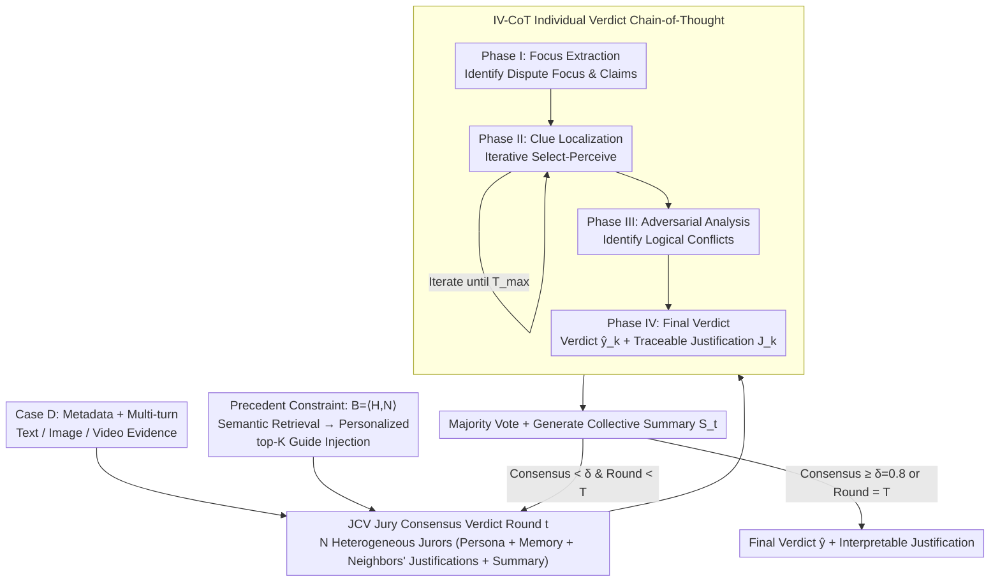

# CyberJurors: A Multi-Agent Simulation Task for E-Commerce Disputes Verdict

**Conference**: ICML 2026  
**arXiv**: [2605.28369](https://arxiv.org/abs/2605.28369)  
**Code**: https://github.com/YanhuiS/CyberJurors  
**Area**: Multi-Agent / Legal & E-commerce AI / Multimodal Reasoning  
**Keywords**: E-commerce dispute verdict, Crowdsourced Jury, Multi-agent simulation, IV-CoT, Precedent constraint  

## TL;DR
The authors formalize the real-world crowdsourced jury verdict task of e-commerce platforms as EDV (E-commerce Dispute Verdicts) and construct the first multimodal benchmark VerdictBench containing 6,000 cases with ground truth from 17 jurors (text/image/video/multi-turn). They propose CyberJurors, which employs a four-phase Individual Verdict Chain-of-Thought (IV-CoT) for fine-grained evidence localization by single jurors and a Jury Consensus Verdict (JCV) mechanism that introduces historical precedents inspired by Stare Decisis to reach collective consensus. On VerdictBench, CyberJurors achieves Acc improvements of +9.48%, +9.38%, and +6.19% over the strongest LLMs, MLLMs, and court simulators, respectively.

## Background & Motivation
**Background**: To efficiently process massive transaction disputes, e-commerce platforms have introduced a "crowdsourced jury" mechanism where 17 volunteer jurors vote on the winner based on multi-turn multimodal evidence (chat logs, images, videos) submitted by buyers and sellers. The bottleneck for scaling this mechanism is the several days typically required to recruit 17 jurors. Recently, multi-agent systems (e.g., ChatEval, AgentCourt) have demonstrated potential in legal judgment tasks.

**Limitations of Prior Work**: Directly migrating multi-agent court simulations from the legal domain to e-commerce dispute verdicts is infeasible due to two reasons:

**Key Challenge**: (1) Evidence in e-commerce disputes is **redundant, multi-turn, and cross-modal** (alternating between questioning, rebuttal, and clarification), where critical clues are often buried in large amounts of noise. Existing methods are limited to text-only reasoning or passive one-shot MLLM input, failing to capture fine-grained visual cues (e.g., a blinking 2% battery indicator in a video). This leads to an unintuitive phenomenon: MLLMs actually underperform text-only LLMs on EDV. (2) Unlike formal courts that rely on rigid laws, e-commerce verdicts depend on **flexible, platform-specific transaction conventions** without clear guidance, exposing inherent biases in generative models and undermining fairness and interpretability.

**Goal**: (a) Propose the EDV task and provide a multimodal benchmark for rigorous evaluation; (b) Design a multi-agent system that simultaneously addresses "fine-grained evidence localization" and "collective consensus + fair adjudication."

**Key Insight**: The authors draw inspiration from the "Stare Decisis" principle in common law, where historical precedents provide normative references for current cases. They also transform traditional one-shot MLLM reasoning into an iterative, active "select-perceive" evidence sampling process.

**Core Idea**: Use IV-CoT to decompose single-juror reasoning into four phases: "Focus Extraction → Active Evidence Selection & Perception → Adversarial Analysis → Final Verdict." Use JCV to inject precedent constraints during multi-round voting, ensuring that the 17-juror simulation is both accurate and aligned with real voting distributions.

## Method

### Overall Architecture
**Dataset VerdictBench**: Contains 6,000 cases across five categories (Appliances, Apparel, Food, Digital, Others), preserving transaction metadata, multi-turn multimodal evidence, and ground truth from 17 jurors. Each case averages 14 images and 0.9 videos; the seller win rate is 62.6% (due to familiarity with fulfillment rules). The data is stratified into train/val/test sets by category $\times$ difficulty (based on the 17-vote margin) in a 3:1:2 ratio.

**Model CyberJurors**: Modeled as a directed social network $\boldsymbol{G}=\langle\boldsymbol{A},\boldsymbol{E}\rangle$, where $\boldsymbol{A}=\{a_1,...,a_N\}$ represents $N$ heterogeneous jurors, and $e_{k,j}\in\boldsymbol{E}$ denotes $a_k$ following $a_j$. Given case $\boldsymbol{D}=\{d,\bm{e}_1^b,\bm{e}_1^s,...\}$, JCV simulates $T$ rounds of discussion: in each round, jurors receive the Collective Verdict Summary from the previous round and a Verdict Precedent Base to generate Individual Verdicts $\hat y_{k,t}$ and justifications $J_{k,t}$ via IV-CoT; a final majority vote determines the verdict.

### Key Designs

**1. Individual Verdict Chain-of-Thought (IV-CoT): Multi-phase Reasoning with Active Selection-Perception**

In ultra-long contexts, "passive one-shot perception" by MLLMs fails to locate critical visual clues buried in redundant evidence. IV-CoT decomposes juror reasoning into four steps to actively "fish" for clues. Phase I (Focus Extraction) $\boldsymbol{O}_{\text{I}}:\{F,F^b,F^s\}=\mathcal{F}_{\text{extract}}(d,\bm{T}^b,\bm{T}^s)$ identifies the dispute focus and claims. Phase II (Clue Localization) is the core innovation, replacing one-shot understanding with "Select-Perceive" iterations—in each step, it first selects the most relevant evidence segment $\bm{e}^b_{*,t}=\mathcal{F}_{\text{select}}(\boldsymbol{O}_{\text{I}},\bm{T}^b-\bm{T}^b_{select})$ and then performs fine-grained perception $\{K_t^b,A_t^b\}=\mathcal{F}_{\text{perceive}}(\boldsymbol{O}_{\text{I}},\bm{e}^b_{*,t},\boldsymbol{O}_{t-1}^b)$ on that specific segment. This cycle repeats for $T_{max}$ rounds independently for both parties. Phase III (Adversarial Analysis) identifies logical conflicts, and Phase IV (Final Verdict) provides the judgment and traceable reasons.

**2. Jury Consensus Verdict (JCV): Mitigating Biases through Social Simulation**

A single LLM tends to exhibit biases (e.g., systematic bias toward sellers) when rigid laws are absent. JCV models the verdict as a multi-round discussion on a social network $\boldsymbol{G}$. Each juror $a_k=\{\boldsymbol{P}_k,\boldsymbol{M}_k\}$ consists of a persona $\boldsymbol{P}_k$ and memory $\boldsymbol{M}_k$. The decision in round $t$ depends on the case, persona, memory, neighbors' previous justifications $\boldsymbol{R}_{k,t}$, and the global collective summary $\boldsymbol{S}_t$: $\hat y_{k,t},J_{k,t}=\mathcal{F}_{\text{judge}}(\boldsymbol{D},\boldsymbol{P}_k,\boldsymbol{M}_k,\boldsymbol{R}_{k,t},\boldsymbol{S}_t)$. Majority voting $\hat y=\mathbb{I}(\hat y^s>\hat y^b)$ determines the result.

**3. Verdict Precedent: Injecting Stare Decisis into Agent Memory**

To address the lack of rigid laws, the authors construct a Precedent Base $\boldsymbol{B}=\langle\boldsymbol{H},\boldsymbol{N}\rangle$ ($\boldsymbol{H}$ for historical cases, $\boldsymbol{N}$ for explicit guidelines). For a new case, semantic retrieval $\boldsymbol{H}_{\text{guide}},\boldsymbol{N}_{\text{guide}}=\mathcal{F}_{\text{retrieve}}(\boldsymbol{D},\boldsymbol{B})$ finds relevant precedents. These are then personalized as $\boldsymbol{M}_k=\{\text{Rank}(\Phi(\boldsymbol{P}_k,\boldsymbol{N}_j))\le K\}$, injecting the top-$K$ guidelines most compatible with a juror's persona into their memory. This mimics natural differences in juror focus while ensuring overall normative consistency.

### Loss & Training
This is a zero-shot inference framework using Gemini-2.5-Flash-Lite-Nothinking as the backbone. Parameters: $T_{max}=3$ (IV-CoT cycles), $T=3$ (JCV rounds), $K=3$ (precedents per juror), early-stop threshold $\delta=0.8$. Videos are uniformly sampled at 30 frames. $\boldsymbol{G}$ is initialized following established social simulation practices.

## Key Experimental Results

### Main Results
Performance comparison on the VerdictBench test set against five categories of baselines:

| Category | Method | Acc ↑ | Weig. F1 ↑ | Macro F1 ↑ | MAE ↓ | RMSE ↓ | Token ↓ |
|------|------|-------|-----------|-----------|-------|-------|---------|
| Closed LLM | GPT-5.2-Chat | 0.6344 | 0.6309 | 0.6340 | - | - | 158k |
| Closed LLM | DeepSeek-V3 | 0.6080 | 0.6042 | 0.6075 | - | - | 114k |
| Open LLM | Dolphin3.0-R1-24B | 0.4929 | 0.4568 | 0.4790 | - | - | 145k |
| Closed MLLM | Gemini-3-Pro | 0.6354 | 0.6378 | 0.6351 | - | - | 4.37M |
| Closed MLLM | Claude-Opus-4.5 | 0.5910 | 0.5901 | 0.5910 | - | - | 2.70M |
| Closed MLLM | GPT-5.2 | 0.4833 | 0.4907 | 0.4798 | - | - | 1.63M |
| Open MLLM | Qwen3-VL-235B | 0.4843 | 0.4748 | 0.4825 | - | - | 2.99M |
| Court Sim | ChatEval | 0.6589 | 0.6645 | 0.6525 | - | - | 0.92M |
| Court Sim | AgentCourt | 0.6673 | 0.6644 | 0.6383 | - | - | 75.28M |
| **Ours** | **CyberJurors** | **0.7292** | **0.7258** | **0.7037** | **4.7312** | **6.3724** | 62.33M |

CyberJurors outperforms the second-best (AgentCourt) by 6.19% in Acc. It is the only model providing MAE/RMSE aligned with the real 17-vote distribution. An unintuitive finding is that average MLLM Acc (52.98%) < text-only LLM Acc (55.78%), highlighting the failure of passive MLLM perception in long contexts.

### Ablation Study
Evaluation of CyberJurors modules on the validation set:

| Configuration | Acc ↑ | Weig. F1 ↑ | Macro F1 ↑ | Gain |
|------|-------|-----------|-----------|------|
| Baseline | 0.5416 | 0.5433 | 0.5385 | - |
| + Rules | 0.5876 | 0.5887 | 0.5875 | +4.60% |
| + SR-CoT | 0.6406 | 0.6416 | 0.6810 | +5.30% |
| + IV-CoT | 0.6734 | 0.6788 | 0.6757 | +3.28% |
| + Jury | 0.7018 | 0.7043 | 0.6868 | +2.84% |
| + Precedent | **0.7252** | 0.7196 | 0.6980 | +2.34% |

### Key Findings
- The "Select-Perceive" iteration provides a 3.28% Acc boost over single-step selection, proving that **active multi-round sampling** is superior to one-shot input for redundant multimodal evidence.
- Both jury simulation (+2.84%) and precedents (+2.34%) provide substantial gains, showing that collective consensus and normative memory constraints are complementary.
- Token consumption (62.33M) is higher than single LLMs but lower than AgentCourt (75M). CyberJurors achieves higher accuracy with fewer tokens through task-specific redesign.

## Highlights & Insights
- **Practical Value**: EDV directly addresses real-world e-commerce operations. The "17-vote ground truth" provides both labels and difficulty levels, allowing benchmarks to evaluate both accuracy and social consensus alignment.
- **Active vs. Passive MLLM**: In settings with long contexts and redundant multimodal evidence, simply using MLLMs is insufficient. Active retrieval/iterative perception is necessary to unlock visual encoder value.
- **Stare Decisis for Agent Alignment**: Injecting precedents as memory rather than hard constraints introduces a novel alignment mechanism ("precedent → personalized guidance") applicable to content moderation and compliance.

## Limitations & Future Work
- **Backbone Dependency**: The effectiveness of JCV heterogeneity across different backbones has not been verified.
- **Label Imbalance**: The 62.6% seller win rate might pass biases to CyberJurors; fairness metrics split by winner direction are missing.
- **Retrieval Quality**: Juror memory $\boldsymbol{M}_k$ depends on retrieval quality; handling rare categories or cold starts requires further discussion.
- **Video Sampling**: Standard uniform sampling at 30 frames might miss crucial frames in event-based evidence; event-aware sampling is a potential future work.

## Related Work & Insights
- **vs. ChatEval / AgentCourt**: While previous works focus on general debate or legal court simulation with text-heavy inputs, this work tackles e-commerce multimodal multi-turn scenarios with active sampling and personalized precedents.
- **vs. End-to-End MLLM**: CyberJurors provides a template for decomposing "long input" into "goal-driven local perception," which is essential for long multimodal document understanding.
- **vs. standard CoT**: IV-CoT explicitly decouples "evidence selection" and "perception" into a distinct stage, which is more effective than simply increasing reasoning tokens when evidence choice is the bottleneck.

## Rating
- Novelty: ⭐⭐⭐⭐ (Formalizing EDV, 17-vote benchmark, and precedent-based agent memory).
- Experimental Thoroughness: ⭐⭐⭐⭐ (14 baselines, detailed ablation, but lacks multiple backbones).
- Writing Quality: ⭐⭐⭐⭐ (Clear motivation and solid formal definitions).
- Value: ⭐⭐⭐⭐⭐ (Practical for both academic benchmarks and industrial auxiliary systems).

<!-- RELATED:START -->

## Related Papers

- [\[CVPR 2026\] Hierarchical Attacks for Multi-Modal Multi-Agent Reasoning](../../CVPR2026/multimodal_vlm/hierarchical_attacks_for_multi-modal_multi-agent_reasoning.md)
- [\[ACL 2026\] AFMRL: Attribute-Enhanced Fine-Grained Multi-Modal Representation Learning in E-commerce](../../ACL2026/multimodal_vlm/afmrl_attribute-enhanced_fine-grained_multi-modal_representation_learning_in_e-c.md)
- [\[CVPR 2026\] VS-Bench: Evaluating VLMs for Strategic Abilities in Multi-Agent Environments](../../CVPR2026/multimodal_vlm/vs_bench_evaluating_vlms_for_strategic_abilities_in_multi_agent_environments.md)
- [\[ACL 2026\] From Heads to Neurons: Causal Attribution and Steering in Multi-Task Vision-Language Models](../../ACL2026/multimodal_vlm/from_heads_to_neurons_causal_attribution_and_steering_in_multi-task_vision-langu.md)
- [\[ACL 2026\] MONETA: Multimodal Industry Classification through Geographic Information with Multi Agent Systems](../../ACL2026/multimodal_vlm/moneta_multimodal_industry_classification_through_geographic_information_with_mu.md)

<!-- RELATED:END -->
