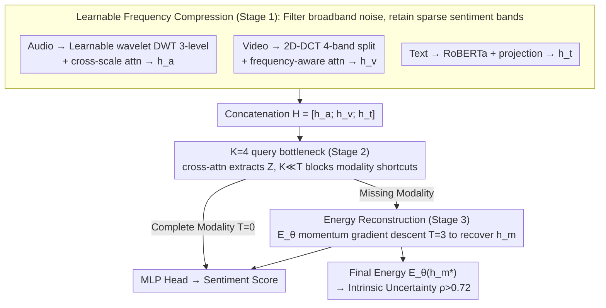

# DCER: Robust Multimodal Fusion via Dual-Stage Compression and Energy-Based Reconstruction

**Conference**: ICML 2026  
**arXiv**: [2602.04904](https://arxiv.org/abs/2602.04904)  
**Code**: To be open-sourced on GitHub (promised in paper)  
**Area**: Multimodal Fusion / Multimodal Sentiment Analysis  
**Keywords**: Dual-stage compression, Frequency domain transform, Bottleneck token, Energy-based model, Missing modalities

## TL;DR
DCER establishes "intra-modal frequency domain compression + cross-modal bottleneck tokens" as a unified robust fusion pipeline. It utilizes a learned energy function for gradient-descent reconstruction of missing modalities, while treating the final energy value as an intrinsic uncertainty measure, achieving new SOTA results on MOSI/MOSEI/SIMS.

## Background & Motivation

**Background**: Current mainstream Multimodal Sentiment Analysis (MSA) solutions, such as cross-modal attention (MulT), tensor fusion, and MAG-BERT, follow a "separate encoding then concatenate/cross-attention" scheme, achieving high scores under complete modality scenarios.

**Limitations of Prior Work**: (a) These schemes allow the model to learn "independent bypass channels for each modality"—the entire prediction collapses when a modality is absent; (b) The majority of dimensions in raw audio/video are noise; without an explicit compression mechanism, models struggle to capture the frequency bands where sentiment actually resides; (c) Existing missing-modality evaluations use zero-padding, which models can exploit as a hidden token, **overestimating** robustness by 15–51% (measured by the authors).

**Key Challenge**: The tension between "high performance on complete data" and "robustness during modality loss"—the former encourages learning independent modality pathways, while the latter requires forcing all modalities to share a bottleneck.

**Goal**: (1) Simultaneously address noise robustness and missing-modality robustness; (2) Provide intrinsic uncertainty; (3) Propose a stricter evaluation protocol (noise-masking instead of zero-masking).

**Key Insight**: Information Bottleneck principle + frequency domain priors. Sentiment signals are sparse in the frequency domain (prosody in low-frequency audio, facial expressions in low-spatial video), whereas noise is typically uniformly distributed across frequencies. Frequency domain transformation naturally performs lossy compression. Layering this with "a small number of learnable query tokens as a cross-modal fixed-capacity bottleneck" forces all modality information to be compressed, prohibiting modality shortcuts.

**Core Idea**: Compression is used as a unified language—integrating intra-modal (frequency), cross-modal (query bottleneck), and missing reconstruction (energy function). The final energy value provides "free" uncertainty.

## Method

### Overall Architecture
The pipeline consists of three stages: **Stage 1 (Intra-modal Frequency Compression)**: Audio uses learnable wavelets (DWT, 3 levels) for multi-scale time-frequency compression; Video uses 2D DCT to segment 4 frequency bands with frequency-aware attention; Text uses RoBERTa + projection (text is already discretely compressed). **Stage 2 (Cross-modal Bottleneck)**: Three modalities are concatenated as $H=[h_a;h_v;h_t]$, and $K=4$ learnable queries $Q$ extract $Z=\mathrm{softmax}(QH^\top/\sqrt D)H \in \mathbb R^{K\times D}$ via cross-attention. Since $K\ll T_a+T_v+T_t$, a strong capacity constraint is formed. **Stage 3 (Energy Reconstruction)**: When modalities are missing, the energy function $E_\theta(h_m;Z)$ is used to recover $h_m^*$ via $T=3$ steps of momentum gradient descent, where $E_\theta(h_m^*)$ acts as uncertainty. Finally, an MLP prediction head outputs the sentiment score.

### Key Designs

**1. Learnable Frequency Compression (Stage 1): Filtering broadband noise before fusion**

Most dimensions in raw audio/video are noise. Fixed BatchNorm/LayerNorm cannot "filter by frequency band," making it difficult for models to capture specific emotional frequencies. The authors leverage frequency domain priors—sentiment signals are sparse in frequency (low-frequency prosody, low-spatial facial movement), while noise is uniform. Thus, frequency transformation is a natural lossy compression. Specifically, audio uses DWT with Daubechies-4 initialization to obtain multi-scale coefficients $\{c_L,d_L,\ldots,d_1\}$, fused via cross-scale attention into $h_a$. Video uses 2D-DCT with 4 learnable frequency bands and frequency-aware attention for $h_v$. Text uses RoBERTa + projection. Learnable decomposition parameters maintain orthogonal sparsity priors while allowing task-adaptive band selection. Removing frequency compression increases MAE by 3.7% in complete scenarios and 12.3% in extreme missing scenarios.

**2. K=4 query tokens as a fixed-capacity bottleneck (Stage 2): Blocking modality shortcuts**

High performance on complete data often encourages models to learn independent bypass channels $\hat y = f_a(h_a)+f_v(h_v)+f_t(h_t)$, causing predictions to fail when a modality is missing. Inspired by Perceiver, DCER implements a fixed-capacity bottleneck: concatenated modalities $H=[h_a;h_v;h_t]$ are queried by $K=4$ learnable tokens via cross-attention to produce $Z=\mathrm{softmax}(QH^\top/\sqrt D)H \in \mathbb R^{K\times D}$. Since $K\ll T_a+T_v+T_t$, predictions must rely on $Z$, physically blocking independent channel shortcuts. The architecture uses 6 layers of fusion transformers (bottleneck←modalities cross-attn, bottleneck self-attn, FFN + residual). $K=4$ is identified as the "sweet spot" ($K=2$ loses information, $K=8$ lacks a bottleneck). This modality-agnostic aggregation ensures the $K$ tokens can continue downstream inference even if one modality is lost.

**3. Energy Function + Gradient Reconstruction + Intrinsic Uncertainty (Stage 3): Reconstruction as "Descent"**

Traditional VAE/GAN reconstruction is unstable in high dimensions, and explicit IB optimization is difficult to train. DCER uses an energy function $E_\theta(h_m;Z)=f_\theta(h_m - \mathrm{CrossAttn}(h_m, Z)) + \lambda_E g_\theta(h_m)$ ($f_\theta,g_\theta$ are learned MLPs). For missing modalities, $h_m$ is initialized from $\mu_\theta(Z,h_\mathrm{obs})+\epsilon$ followed by $T=3$ steps of momentum gradient descent $h_m^{(t)}\leftarrow h_m^{(t-1)} - (\rho v^{(t-1)}+\eta\nabla E_\theta)$, pulling the missing modality into the learned low-energy basin. For complete modalities, $T=0$. This approach provides a "free" uncertainty measure: the correlation between final energy $E_\theta(h_m^*)$ and prediction error is $\rho>0.72$, allowing it to serve as a rejection threshold for risk-sensitive predictions without the need for MC dropout or ensembles.

### Loss & Training
Total loss: $\mathcal L = \mathcal L_\mathrm{pred} + \alpha\mathcal L_\mathrm{recon} + \beta\mathcal L_\mathrm{energy} + \gamma\mathcal L_\mathrm{joint}$, where $\alpha=0.1, \beta=0.01, \gamma=0.05$. $\mathcal L_\mathrm{joint}=\|Z_\mathrm{full}-Z_\mathrm{recon}\|^2$ ensures consistency between bottlenecks calculated from real vs. reconstructed modalities. Optimizer: AdamW, lr=1e-5, batch 32, 40 epochs, averaged over 5 seeds.

## Key Experimental Results

### Main Results

| Dataset | Metric | DCER | Sub-optimal | Gain |
|---|---|---|---|---|
| CMU-MOSI | MAE↓ | **0.669** | 0.710 (MMA) | -5.8% |
| CMU-MOSI | Corr↑ | **0.823** | 0.796 (EMT) | +3.4% |
| CMU-MOSI | Acc-7↑ | **51.6%** | 48.1% (MSAmba) | +7.3% |
| CMU-MOSEI | MAE↓ | **0.498** | 0.514 (MSAmba) | -3.1% |
| CMU-MOSEI | Acc-7↑ | **55.0%** | 53.6% (EMT) | +2.6% |
| CMU-MOSEI | F1↑ | **84.9** | 83.9 (MSAmba) | +1.2% |
| CH-SIMS | Acc-5↑ | **55.5%** | 45.2% (MTFN) | +22.8% |
| CH-SIMS | F1↑ | **81.7** | 79.7 (MMA) | +2.5% |

### Ablation Study

| Configuration | MOSI MAE↓ | MOSI Acc-7↑ |
|---|---|---|
| Full DCER ($K=4$, freq on, $T=3$ for missing) | 0.669 | 51.6 |
| w/o Freq Compression (Linear projection) | 0.694 | -3.7% (Full) / -12.3% (Extreme Missing) |
| $K=2$ tokens | Significant info loss | Decrease |
| $K=8$ tokens | Overfitting (no bottleneck) | Decrease |
| $T=0$ (No energy iteration) | Significant drop in missing scenarios | $T=3$ is sweet spot |
| zero-mask vs noise-mask | Zero-mask overestimates by 15–51% | Highlights protocol issues |

### Key Findings
- Robustness exhibits a **U-shape**: Multimodal fusion is strongest with complete modalities and also strongest with severe loss (>50%)—in the middle range, it matches unimodal performance because modality shortcuts can still "deceive" the model, whereas extreme loss forces the use of truly learned cross-modal compressed representations.
- The correlation between energy values and error ($\rho>0.72$) allows $E_\theta$ to be used directly as a rejection threshold for risk-sensitive tasks.
- The +22.8% Acc-5 gain on CH-SIMS is a substantial fine-grained improvement, indicating the cross-modal bottleneck maximizes discriminative power for "ambiguous emotions."

## Highlights & Insights
- Unified Language of Compression: Intra-modal (frequency), cross-modal (bottleneck), and missing reconstruction (energy function) are all framed under the "capacity-limited channel" principle.
- Intrinsic Uncertainty: Energy values replace the complexity of MC dropout or ensembles, with $\rho>0.72$ being sufficient for engineering applications.
- Correcting Zero-mask Evaluation: Previous SOTA results in missing-rate performance may have been "inflated" by 15–51% because models treat zero as a signal for missingness. The advocacy for noise-mask evaluation is a valuable contribution to the community.

## Limitations & Future Work
- Frequency selection relies on manual priors (Audio→Wavelet, Video→DCT, Text→RoBERTa); lacks an automated mechanism for new modalities (e.g., IMU).
- The energy function is relatively simple (two MLPs) and is not aligned with mainstream EBM training like SGLD or Contrastive Divergence, potentially falling into local minima during extreme modality loss.
- Validation is limited to sentiment analysis; tasks requiring multi-step reasoning or long contexts (e.g., VideoQA) have not been tested.
- The "$\rho>0.72$ correlation" is not yet a calibrated uncertainty and has not been compared with conformal prediction or Platt scaling.

## Related Work & Insights
- **vs MulT (Tsai et al. 2019)**: MulT uses direct cross-modal attention without compression; DCER adds bottlenecks before/after cross-attn to prevent collapse during modality loss.
- **vs Perceiver (Jaegle et al. 2021)**: Both use learnable queries as bottlenecks, but Perceiver lacks intra-modal frequency compression and missing modality handling.
- **vs EMT (Sun et al. 2023)**: EMT uses deterministic dual-level feature reconstruction; DCER uses energy gradient descent to output uncertainty.
- **vs VAE/GAN Reconstruction**: EBM bypasses the difficulty of unstable high-dimensional generators by learning only energy, where energy directly represents uncertainty.

## Rating
- Novelty: ⭐⭐⭐⭐ While frequency and bottlenecks are not new, the integration of EBM for missing modalities and uncertainty is a unique combination.
- Experimental Thoroughness: ⭐⭐⭐⭐ Three major datasets, 8 baselines, systematic ablations, and discussion of missingness protocols, though lacks VideoQA.
- Writing Quality: ⭐⭐⭐⭐ Figure 1 explains the entire narrative clearly; equation usage is balanced.
- Value: ⭐⭐⭐⭐ High practical value for industrial multimodal systems—providing both SOTA performance and free uncertainty while addressing evaluation flaws.

<!-- RELATED:START -->

## Related Papers

- [\[CVPR 2026\] ReCoFuse: Ultra-Robust Image Fusion via Restorative Multi-Modal Diffusion Reciprocal Coupling](../../CVPR2026/multimodal_vlm/recofuse_ultra-robust_image_fusion_via_restorative_multi-modal_diffusion_recipro.md)
- [\[CVPR 2026\] EagleNet: Energy-Aware Fine-Grained Relationship Learning Network for Text-Video Retrieval](../../CVPR2026/multimodal_vlm/eaglenet_energy-aware_fine-grained_relationship_learning_network_for_text-video_.md)
- [\[ICML 2026\] Self-Captioning Multimodal Interaction Tuning: Amplifying Exploitable Redundancies for Robust Vision Language Models](self-captioning_multimodal_interaction_tuning_amplifying_exploitable_redundancie.md)
- [\[NeurIPS 2025\] Breaking the Compression Ceiling: Data-Free Pipeline for Ultra-Efficient Delta Compression](../../NeurIPS2025/multimodal_vlm/breaking_the_compression_ceiling_data-free_pipeline_for_ultra-efficient_delta_co.md)
- [\[CVPR 2026\] Conflict-Aware Adaptive Cross-Reconstruction for Multimodal Sentiment Analysis](../../CVPR2026/multimodal_vlm/conflict-aware_adaptive_cross-reconstruction_for_multimodal_sentiment_analysis.md)

<!-- RELATED:END -->
