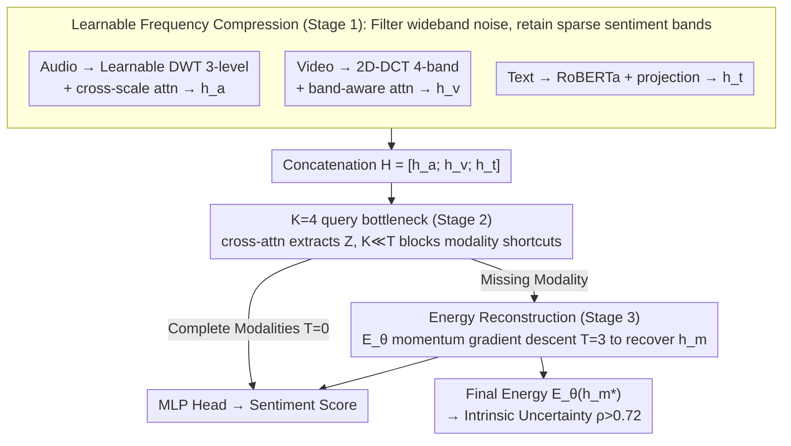

# DCER: Robust Multimodal Fusion via Dual-Stage Compression and Energy-Based Reconstruction

**Conference**: ICML 2026  
**arXiv**: [2602.04904](https://arxiv.org/abs/2602.04904)  
**Code**: To be open-sourced on GitHub (promised in paper)  
**Area**: Multimodal Fusion / Multimodal Sentiment Analysis  
**Keywords**: Dual-Stage Compression, Frequency Domain Transformation, bottleneck token, Energy-Based Model, missing modality

## TL;DR
DCER establishes "intra-modal frequency domain compression + cross-modal bottleneck tokens" as a unified robust fusion pipeline. It employs a learned energy function to perform gradient-descent-based reconstruction for missing modalities, while treating the final energy value as intrinsic uncertainty, achieving new SOTA results on MOSI/MOSEI/SIMS.

## Background & Motivation

**Background**: Current Multimodal Sentiment Analysis (MSA) is dominated by schemes like cross-modal attention (MulT), tensor fusion, and MAG-BERT, which follow a "separate encoding then concat/cross-attention" approach. These achieve high scores under complete modality scenarios.

**Limitations of Prior Work**: (a) Prior schemes allow models to learn "independent modality pathways"—consequently, the entire prediction collapses when a modality is absent. (b) Most dimensions in raw audio/video are noise; without explicit compression mechanisms, models struggle to capture the specific frequency bands where sentiment resides. (c) Current missing-modality evaluations use zero-padding, which models can exploit as a hidden token, leading to an **overestimation** of robustness by 15–51% (as empirically tested by the authors).

**Key Challenge**: There is a conflict between "high performance on complete data" and "robustness when modalities are missing"—the former encourages learning independent modality pathways, while the latter requires forcing all modalities to share a bottleneck.

**Goal**: (1) Simultaneously address noise robustness and missing-modality robustness; (2) Provide intrinsic uncertainty markers; (3) Propose a stricter evaluation protocol (noise-masking instead of zero-masking).

**Key Insight**: Information Bottleneck principle + frequency domain priors. Sentiment signals are sparse in the frequency domain (low-frequency prosody in audio, low spatial frequency in facial video), whereas noise is typically uniformly distributed across the spectrum. Frequency domain transformation naturally acts as lossy compression. Layering this with a "small number of learnable query tokens as a fixed-capacity cross-modal bottleneck" forces all modality information to be compressed, prohibiting modality shortcuts.

**Core Idea**: Use "compression" as the unified language—threading through intra-modal (frequency domain), cross-modal (query bottleneck), and missing reconstruction (energy function), with the final energy value providing "free" uncertainty metrics.

## Method

### Overall Architecture
The pipeline consists of three stages: **Stage 1 (Intra-modal Frequency Compression)**: Audio uses learnable wavelets (DWT, 3 levels) for multi-scale time-frequency compression; Video uses 2D DCT to segment 4 frequency bands with band-aware attention; Text uses RoBERTa + projection (text is already a discrete symbolized compression). **Stage 2 (Cross-modal Bottleneck)**: The three modalities are concatenated as $H=[h_a;h_v;h_t]$. $K=4$ learnable queries $Q$ extract $Z=\mathrm{softmax}(QH^\top/\sqrt D)H \in \mathbb R^{K\times D}$ through cross-attention. Since $K\ll T_a+T_v+T_t$, a strong capacity constraint is formed. **Stage 3 (Energy Reconstruction)**: When a modality is missing, a learned energy function $E_\theta(h_m;Z)$ is used to recover $h_m^*$ via $T=3$ steps of momentum gradient descent. The final energy $E_\theta(h_m^*)$ serves as uncertainty. Finally, an MLP prediction head outputs the sentiment score.

### Key Designs

**1. Learnable Frequency Compression (Stage 1): Filtering wideband noise before fusion to retain sparse emotional bands.**

Most dimensions in raw audio/video are noise. Fixed BatchNorm/LayerNorm cannot "filter by frequency," making it difficult for models to pinpoint where emotional signals lie. The authors leverage frequency domain priors: sentiment signals are sparse (low prosody for audio, low spatial frequency for video), while noise is uniform. Thus, frequency transformation acts as inherent lossy compression. Specifically, audio uses learnable wavelets initialized with Daubechies-4 for 3-level DWT to obtain multi-scale coefficients $\{c_L,d_L,\ldots,d_1\}$, which are fused into $h_a$ via cross-scale attention. Video uses 2D-DCT to cut 4 frequency bands with learnable boundaries, followed by frequency-aware attention to get $h_v$. Text is naturally compressed via RoBERTa. Learnable decomposition parameters maintain orthogonal sparse priors while allowing task-adaptive band selection—removing frequency compression increases MAE by 3.7% in complete scenarios and 12.3% in extreme missing scenarios.

**2. K=4 Query tokens as fixed-capacity cross-modal bottleneck (Stage 2): Blocking modality shortcuts.**

High performance on complete data often induces models to learn independent modality bypass channels $\hat y = f_a(h_a)+f_v(h_v)+f_t(h_t)$, causing predictions to fail when a modality is missing. DCER counters this by using a fixed-capacity bottleneck inspired by Perceiver: concatenating modalities $H=[h_a;h_v;h_t]$ and letting $K=4$ learnable queries extract $Z=\mathrm{softmax}(QH^\top/\sqrt D)H \in \mathbb R^{K\times D}$ via cross-attention. Because $K\ll T_a+T_v+T_t$, a physical bottleneck is created, forcing predictions to rely solely on $Z$ and blocking shortcut summations. The fusion utilizes 6 layers of fusion transformers. $K=4$ is the sweet spot for compression versus expressiveness ($K=2$ causes info loss; $K=8$ lacks a sufficient bottleneck). This modality-agnostic aggregation ensures that even if a modality is missing, $K$ tokens can still participate in downstream inference.

**3. Energy Function + Gradient Reconstruction + Intrinsic Uncertainty (Stage 3): Turning "reconstruction" into a descent process with built-in confidence.**

Traditional VAE/GAN reconstructions are unstable in high dimensions, and explicit IB optimization is hard to train. DCER employs an energy function $E_\theta(h_m;Z)=f_\theta(h_m - \mathrm{CrossAttn}(h_m, Z)) + \lambda_E g_\theta(h_m)$ (where $f_\theta, g_\theta$ are learned MLPs). For missing modalities, reconstruction starts from $\mu_\theta(Z,h_\mathrm{obs})+\epsilon$ followed by $T=3$ steps of momentum gradient descent $h_m^{(t)}\leftarrow h_m^{(t-1)} - (\rho v^{(t-1)}+\eta\nabla E_\theta)$, pulling the missing modality into a learned low-energy basin. This approach is stable and provides "free" uncertainty—the final energy $E_\theta(h_m^*)$ correlates with prediction error at $\rho>0.72$, allowing it to serve as a rejection threshold for risk-sensitive predictions without needing MC dropout or ensembles.

### Loss & Training
Total loss: $\mathcal L = \mathcal L_\mathrm{pred} + \alpha\mathcal L_\mathrm{recon} + \beta\mathcal L_\mathrm{energy} + \gamma\mathcal L_\mathrm{joint}$, with hyper-parameters $\alpha=0.1,\beta=0.01,\gamma=0.05$. $\mathcal L_\mathrm{joint}=\|Z_\mathrm{full}-Z_\mathrm{recon}\|^2$ ensures consistency between bottlenecks calculated from real vs. reconstructed modalities. Optimizer: AdamW, lr=1e-5, batch 32, 40 epochs, averaged over 5 seeds.

## Key Experimental Results

### Main Results

| Dataset | Metric | Ours (DCER) | Prev. SOTA | Gain |
|---|---|---|---|---|
| CMU-MOSI | MAE↓ | **0.669** | 0.710 (MMA) | -5.8% |
| CMU-MOSI | Corr↑ | **0.823** | 0.796 (EMT) | +3.4% |
| CMU-MOSI | Acc-7↑ | **51.6%** | 48.1% (MSAmba) | +7.3% |
| CMU-MOSEI | MAE↓ | **0.498** | 0.514 (MSAmba) | -3.1% |
| CMU-MOSEI | Acc-7↑ | **55.0%** | 53.6% (EMT) | +2.6% |
| CMU-MOSEI | F1↑ | **84.9** | 83.9 (MSAmba) | +1.2% |
| CH-SIMS | Acc-5↑ | **55.5%** | 45.2% (MTFN) | +22.8% |
| CH-SIMS | F1↑ | **81.7** | 79.7 (MMA) | +2.5% |

### Ablation Study

| Configuration | MOSI MAE↓ | MOSI Acc-7↑ |
|---|---|---|
| Full DCER ($K=4$, freq on, $T=3$ for missing) | 0.669 | 51.6 |
| w/o Frequency Compression (linear projection) | 0.694 | -3.7% (Full) / -12.3% (Extreme Missing) |
| $K=2$ tokens | Significant info loss | Decrease |
| $K=8$ tokens | Overfitting (no bottleneck) | Decrease |
| $T=0$ (no energy iteration) | Significant drop in missing scenarios | $T=3$ is sweet spot |
| zero-mask vs noise-mask eval | zero-mask overestimates by 15–51% | Highlights protocol issues |

### Key Findings
- Robustness follows a **U-shape**: Multimodal fusion is strongest at 0% missing rate and also robust at heavy missing rates (>50%). In between, it matches unimodal performance because intermediate missing rates allow modality shortcuts that "deceive" the model, whereas extreme missing forces the use of truly learned cross-modal compressed representations.
- The correlation between energy and prediction error is $\rho>0.72$, providing "free" uncertainty. $E_\theta$ can be used directly as a rejection threshold.
- The +22.8% Acc-5 gain on CH-SIMS is a massive fine-grained improvement, indicating the cross-modal bottleneck maximizes discriminative power for ambiguous emotions.

## Highlights & Insights
- "Compression" as a unified language: Intra-modal (frequency), cross-modal (bottleneck), and reconstruction (energy) are all unified under the "capacity-limited channel" principle—a rare and cohesive narrative.
- Energy as intrinsic uncertainty: Eliminates the complexity of MC dropout or ensembles; $\rho>0.72$ is sufficient for engineering applications.
- Correcting the zero-mask evaluation flaw: Previous SOTA results in missing-rate performance may have derived 15–51% of their performance from the model treating "zero" as a signal indicating absence. Switching to noise-mask evaluation is a valuable contribution to the community.

## Limitations & Future Work
- Frequency selection relies on manual priors (audio→Wavelet, video→DCT, text→RoBERTa): Lacks an automated mechanism for new modalities like IMU or physiological signals.
- The energy function is relatively simple (two MLPs) and not aligned with mainstream EBM training like SGLD or Contrastive Divergence; it may hit local minima when multiple modalities are missing.
- Validation is limited to sentiment analysis; tasks requiring multi-step reasoning or long contexts (e.g., VideoQA) were not tested.
- The "$\rho>0.72$ correlation" is not yet a calibrated uncertainty and has not been compared with conformal prediction or Platt scaling.

## Related Work & Insights
- **vs MulT (Tsai et al. 2019)**: MulT uses direct cross-modal attention without compression; DCER adds bottlenecks around cross-attention, preventing collapse during modality loss.
- **vs Perceiver (Jaegle et al. 2021)**: Both use learnable queries as bottlenecks, but Perceiver lacks intra-modal frequency compression and missing modality handling.
- **vs EMT (Sun et al. 2023)**: EMT uses deterministic decoders for feature reconstruction; DCER uses energy gradient descent and outputs uncertainty.
- **vs VAE/GAN-based reconstruction**: These are unstable in high dimensions. EBM bypasses explicit generator learning by "only learning energy," and the energy value directly yields uncertainty.

## Rating
- Novelty: ⭐⭐⭐⭐ Frequency and bottlenecks aren't new individually, but grafting EBM onto multimodal missing scenarios to provide uncertainty is a novel combination.
- Experimental Thoroughness: ⭐⭐⭐⭐ Covers major datasets, 8 baselines, systematic ablations, and discussion of evaluation protocols, though lacks VideoQA.
- Writing Quality: ⭐⭐⭐⭐ Figure 1 explains the narrative very clearly; formula density is appropriate.
- Value: ⭐⭐⭐⭐ High utility for industrial multimodal systems—provides both SOTA performance and free uncertainty, while exposing evaluation flaws.

<!-- RELATED:START -->

## Related Papers

- [\[CVPR 2026\] DUET-VLM: Dual Stage Unified Efficient Token Reduction for VLM Training and Inference](../../CVPR2026/multimodal_vlm/duet-vlm_dual_stage_unified_efficient_token_reduction_for_vlm_training_and_infer.md)
- [\[ICML 2026\] Breaking Dual Bottlenecks: Evolving Unified Multimodal Models into Self-Adaptive Interleaved Visual Reasoners](breaking_dual_bottlenecks_evolving_unified_multimodal_models_into_self-adaptive_.md)
- [\[CVPR 2026\] Unbiased Dynamic Multimodal Fusion](../../CVPR2026/multimodal_vlm/unbiased_dynamic_multimodal_fusion.md)
- [\[ICML 2026\] Self-Captioning Multimodal Interaction Tuning: Amplifying Exploitable Redundancies for Robust Vision Language Models](self-captioning_multimodal_interaction_tuning_amplifying_exploitable_redundancie.md)
- [\[CVPR 2026\] EagleNet: Energy-Aware Fine-Grained Relationship Learning Network for Text-Video Retrieval](../../CVPR2026/multimodal_vlm/eaglenet_energy-aware_fine-grained_relationship_learning_network_for_text-video_.md)

<!-- RELATED:END -->
