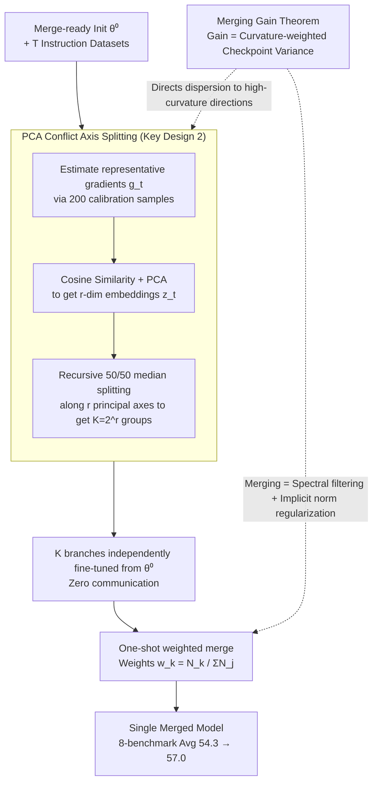

# Decentralized Instruction Tuning: Conflict-Aware Splitting and Weight Merging

**Conference**: ICML2026  
**arXiv**: [2606.01717](https://arxiv.org/abs/2606.01717)  
**Code**: https://github.com/naver-ai/merit  
**Area**: Multimodal VLM / Model Merging / Distributed Training  
**Keywords**: Instruction tuning, Weight merging, Gradient conflict, PCA splitting, Multimodal alignment  

## TL;DR
The authors develop a local quadratic theory for weight merging starting from "merge-ready flat basins": merging gain equals curvature-weighted checkpoint variance. Splitting along the principal directions of gradient conflict via PCA maximizes this gain. Based on this, the MERIT pipeline is proposed: PCA-based splitting by dataset conflict, independent fine-tuning with zero communication, and final one-shot token-weighted averaging. It improves the 8-benchmark average of Qwen2.5-VL-3B from 54.3 to 57.0 on 136 Vision-FLAN tasks.

## Background & Motivation

**Background**: The capabilities of modern (M)LLMs are primarily injected through large-scale instruction tuning. Datasets like Vision-FLAN, TÜLU, and FLAN often contain hundreds of tasks and millions of samples. The standard practice is centralized joint training, mixing all tasks and running on tightly coupled GPU clusters.

**Limitations of Prior Work**: This "joint" paradigm is hindered by two bottlenecks—(1) **Optimization**: Heterogeneous tasks conflict on shared parameters, where gradient interference leads to negative transfer and "stiff" dynamics, forcing smaller learning rates; classic multi-task corrections (GradNorm / PCGrad / CAGrad) are computationally infeasible at the scale of 100+ tasks and billions of parameters. (2) **System**: Joint training relies on frequent synchronization like all-reduce, requiring GPUs to be within a high-bandwidth cluster, making geographically distributed pools, heterogeneous clusters, or preemptible cloud instances unusable.

**Key Challenge**: These two issues are strongly coupled—higher data heterogeneity requires finer-grained synchronization to hedge against conflicts, yet synchronization is the system bottleneck. Without it, training reverts to crude proportional mixing, leaving conflicts unmitigated.

**Goal**: Can the "mixed training" problem be transformed from online (gradient alignment) to offline (parameter space averaging)? By splitting tasks by conflict, training them independently, and merging them once at the end, one could resolve conflicts without requiring synchronization.

**Key Insight**: The authors note that works like model soup and Model Stock suggest that as long as fine-tuning starts from the same flat basin, the average of multiple independently trained checkpoints often outperforms any single one. This "merge-ready" property is common in post-training (e.g., SFT from an instruction-tuned MLLM). If the type of splitting that maximizes merging gain can be theoretically defined, it can be upgraded from an empirical trick to a scheduling algorithm.

**Core Idea**: Under a local quadratic approximation of merge-ready initialization, the weight averaging gain $\mathcal{G}_{\mathrm{var}}=\tfrac{1}{2}\sum_\ell \lambda_\ell \mathrm{Var}_w(u_\ell^\top \delta_i)$ is proven to be the **curvature-weighted checkpoint variance**—the most is gained by dispersing updates in high-curvature directions. Furthermore, splitting into $K=2^r$ groups along the top-$r$ principal axes of dataset gradients via PCA is the approximately optimal allocation to maximize this gain, followed by one-shot token-weighted merging.

## Method

### Overall Architecture

MERIT reshapes instruction tuning from "centralized" to "distributed + one-shot merge." The pipeline starts from a merge-ready initialization $\theta^{(0)}$ and consists of 5 steps: (1) For $T$ datasets, estimate a representative gradient $g_t$ using 200 small calibration samples; (2) Construct a cosine similarity matrix $C_{ij}=\langle\tilde g_i,\tilde g_j\rangle$ and perform PCA to obtain $r$-dimensional conflict embeddings $z_t$; (3) Recursively perform sample-balanced 50/50 median splitting along the $r$ principal axes to produce $K=2^r$ groups; (4) Fine-tune each group independently from $\theta^{(0)}$ with **zero communication**, allowing dispersion across geographically isolated GPUs or spot instances; (5) Perform one-shot weighted averaging into $\bar\theta$ using token budgets $w_k=N_k/\sum N_j$. This process replaces "training-time synchronization costs" with "one-off pre-training gradient estimation + one-off post-training parameter averaging."

### Key Designs

**1. Merging Gain Theorem in Flat Basins: Quantifying the "Profit" of Weight Averaging**

Prior explanations for model soup were largely empirical "flat minima" arguments. This paper formalizes it: applying a quadratic approximation to the loss at shared initialization $\theta^{(0)}$ as $L(\theta)\approx L(\theta^\star)+\tfrac{1}{2}(\theta-\theta^\star)^\top H(\theta-\theta^\star)$ (where $H\succeq 0$ is the local Hessian), and letting $\delta_i=\theta_i-\theta^\star$ be the displacement for $K$ checkpoints with weights $w_i\ge 0$ summing to 1, the merging gain is:

$$\mathcal{G}_{\mathrm{var}}:=\sum_i w_i L(\theta_i)-L(\bar\theta_w)=\tfrac{1}{2}\sum_\ell \lambda_\ell \mathrm{Var}_w(u_\ell^\top \delta_i)\ge 0,$$

where $\lambda_\ell, u_\ell$ are eigenpairs of $H$. This indicates that merging never performs worse (non-negative gain) and the gain is primarily derived from "checkpoint variance projected onto high-curvature directions." Thus, the objective is to actively inject dispersion into high-curvature directions, leading directly to the optimality of PCA splitting.

**2. PCA Splitting along Dataset Gradient Conflict Axes: Offline $\arg\max\mathcal{G}_{\mathrm{var}}$**

Random splitting or K-means do not directly maximize merging gain, while per-step gradient alignment like PCGrad requires synchronization. MERIT uses a first-order approximation $\delta_k\approx -\eta\bar g_k$ at $\theta^{(0)}$. For the two-group case, the gain simplifies to $\mathcal{G}_{\mathrm{var}}=\tfrac{\eta^2}{8}(\bar g_1-\bar g_2)^\top H(\bar g_1-\bar g_2)$. Since $g_t=-H\Delta_t$, the gain is dominated by $H^3$-weighted dataset interactions. PCA finds the directions of "high curvature + high divergence." Practically, cosine PCA on normalized gradients (scale-invariant) is used to obtain top-$r$ embeddings $z_t\in\mathbb{R}^r$, followed by recursive 50/50 median splitting per axis to ensure sample-balanced groups. Proposition 3.2 proves this is the optimal balanced partition for an analytical case ($T=4, d=2$), and it is shown to be superior to random splitting in expectation as spectral gaps $\lambda_1/\lambda_2$ increase. This offline step costs only $O(T^2)$.

**3. Token-Weighted One-shot Merging + Implicit Norm Regularization**

After independent training, MERIT merges via $\bar\theta=\sum_{k=1}^K w_k \theta_k$, with weights $w_k=N_k/\sum_j N_j$ based on token budgets, maintaining parity with joint training ($ \sum_k N_k=\sum_t n_t $). This provides two benefits: (1) Implicit regularization: By norm convexity $\|\bar\theta_w-\theta^{(0)}\|^2\le\sum_i w_i\|\theta_i-\theta^{(0)}\|^2$, the merged model is closer to init than any branch, equivalent to a distance regularizer in the PAC-Bayes sense. This explains why the merged model generalizes better despite higher training loss. (2) Spectral filtering: In PCA principal directions, $U^\top(\bar\theta_w-\theta^\star)\approx 0$, effectively zeroing displacement errors in high-curvature directions. This reduces the effective condition number $\kappa_{\mathrm{eff}}$, allowing larger learning rates that would destabilize joint baselines.

### Loss & Training

Each branch shares the same backbone, trainable parameters, LR schedule, and token budget $n_t$; they only differ in the data subset seen. $\theta^{(0)}$ is the instruction-tuned Qwen2.5-VL for multimodal experiments and a pretrained LLM for text-only experiments. Merge-ready properties are verified by four diagnostics: (a) zero loss barriers on linear interpolation paths; (b) distance from $\theta^{(0)}$ for merged models is 2.4–2.9× smaller than joint; (c) higher training loss (+0.49 to +1.27) for merged models but superior held-out performance; (d) lower sensitivity to isotropic Gaussian perturbations.

## Key Experimental Results

### Main Results

Controlled experiments using Qwen2.5-VL-3B on Vision-FLAN (136 tasks). Average of 8 benchmarks:

| Method | SeedBench | MMBench | LLaVA-W | MMVet | TextVQA | AI2D | MathVista | MMMU | Avg. |
|------|-----------|---------|---------|-------|---------|------|-----------|------|------|
| Base 3B | 66.8 | 79.7 | 53.2 | 34.0 | 61.2 | 63.8 | 29.6 | 41.2 | 53.7 |
| Joint training (1 ep) | 69.2 | 80.5 | 41.9 | 36.4 | 68.0 | 62.6 | 34.2 | 41.9 | 54.3 |
| Joint training (2 ep) | 70.0 | 81.4 | 42.8 | 37.6 | 63.4 | 62.5 | 36.5 | 43.0 | 54.7 |
| Random (4 groups) | 70.4 | 81.0 | 40.6 | 34.7 | 70.4 | 63.1 | 34.0 | 40.8 | 54.4 |
| Uniform soup (4 runs) | 70.2 | 81.1 | 41.8 | 36.3 | 68.4 | 63.4 | 35.9 | 42.2 | 54.9 |
| MERIT-1D (K=2) | 71.0 | 80.0 | 43.1 | 35.0 | 72.4 | 62.1 | 36.5 | 41.4 | 55.2 |
| MERIT-2D (K=4) | 70.8 | 78.4 | 47.4 | 36.6 | 74.1 | 61.5 | 36.0 | 40.7 | 55.7 |
| **MERIT-3D (K=8)** | 70.5 | 80.1 | **52.0** | **37.7** | **75.2** | 62.5 | 35.4 | 42.7 | **57.0** |

MERIT improves as the dimension $r$ (and thus $K$) increases, raising the joint baseline from 54.3 to 57.0 (+2.7). Significant gains are seen in LLaVA-W (+10.1) and TextVQA (+7.2), confirming that conflict resolution successfully suppresses negative transfer found in joint training.

### Ablation Study

Merge-readiness diagnostics for Qwen2.5-VL-3B / MERIT-2D / K=4 branches:

| Epoch | Joint Displ. | Merged Displ. | Ratio | Joint train loss | Merged train loss | Gap |
|-------|-----------|-------------|------|------------------|--------------------|-----|
| 0.5 | 13.73 | 5.65 | 2.43× | 0.709 | 1.198 | +0.489 |
| 1.0 | 19.73 | 7.50 | 2.63× | 0.560 | 1.172 | +0.611 |
| 2.0 | 28.15 | 10.11 | 2.78× | 0.370 | 1.167 | +0.797 |
| 6.0 | 34.61 | 11.87 | 2.92× | 0.064 | 1.330 | +1.266 |

### Key Findings

- **Conflict-aware splitting is strictly better than random**: In $K=2$ comparisons, conflict-induced split (54.9) vs random split (54.6) vs joint (54.3) shows PCA axes correctly identify "where to split."
- **Uniform soup helps but lacks MERIT's performance**: Multi-seed averaging (Uniform soup) reaches 55.4, but MERIT-3D achieves 57.0 with the same budget, proving that optimized splitting is more valuable than simple redundancy.
- **Inverse relationship between norm and generalization**: Merged models consistently have higher training loss but better generalization and remain closer to $\theta^{(0)}$, consistent with PAC-Bayes explanations.
- **Scaling to 1.6M samples / 176 sources / 7B**: MERIT-2D improves joint FFT from 54.9 to 55.4 on a large mixture. It also holds for text-only FLAN tasks.
- **Negligible preprocessing cost**: Gradient estimation using 200 samples and 20% parameter sampling correlates highly (>0.98) with full gradients.

## Highlights & Insights

- **Transforming Model Soup into an Algorithmic Target**: Instead of merging "after the fact," MERIT reverses the process—using PCA axes to dictate splitting before training. This "design-for-merging" approach is transferable to LoRA merges or replay buffer splitting in continual learning.
- **Engineering value of zero communication**: Branches can run in isolation across different cloud regions, GPU generations, or spot instances. Once $\theta^{(0)}$ is distributed, the SFT process requires no inter-node communication, enabling large-scale instruction tuning for organizations with fragmented resources.
- **PCA splitting as a dataset-level interpretability tool**: The $z_t\in\mathbb{R}^r$ embeddings provide coordinates in the "conflict space," which is useful for dataset curation—determining task interference based on theory rather than manual categorization.

## Limitations & Future Work

- The theory relies on the "merge-ready flat basin" assumption. While verified for Qwen2.5-VL, it does not hold for from-scratch pretraining. MERIT is a post-training specific method.
- The $K=2^r$ geometric structure is somewhat rigid; actual conflict structures might be simplex-like (e.g., three mutually opposing datasets), which recursive bisection may not perfectly capture.
- The equivalence of Cosine PCA and raw-gradient PCA depends on "gradient-norm concentration," which might introduce bias for tasks with extremely unbalanced gradient magnitudes (e.g., long-tail OCR).
- Experiments were primarily on Qwen and Vision-FLAN; transferability to LLaMA/Gemma or LoRA/adapter specific merges is left for future work.

## Related Work & Insights

- **vs Model Soup / Model Stock (Wortsman et al. 2022, Jang et al. 2024)**: These works merge checkpoints from different seeds on the same data to reduce variance. MERIT merges checkpoints from different subsets, actively creating beneficial dispersion via conflict-aware splitting.
- **vs PCGrad / GradNorm / CAGrad**: These perform online gradient surgery, which is impractical for 100+ tasks and billions of parameters. MERIT moves conflict handling to a one-time pre-training step, drastically reducing engineering costs.
- **vs FedAvg / Local SGD / One-shot FL**: In Federated Learning, data split is fixed by ownership. MERIT treats "how to split" as an optimizable variable, utilizing the centralized data visibility to its advantage.
- **vs Data Mixture Ratio Tuning (Longpre et al. 2023, Laurençon et al. 2024)**: Mixture ratios are adjusted within the joint loss framework. MERIT introduces "splitting" as a supplementary primitive that can be used alongside ratio tuning.

## Rating
- Novelty: ⭐⭐⭐⭐⭐ Formalizing merging gain as curvature-weighted variance and deriving PCA splitting is a major step in merging theory. The zero-communication SFT paradigm is highly practical.
- Experimental Thoroughness: ⭐⭐⭐⭐⭐ Covers 3B / 7B, Vision-FLAN / 1.6M mixtures, multi-seed, text-only, and deep merge-readiness diagnostics.
- Writing Quality: ⭐⭐⭐⭐⭐ Clear mapping between theory and algorithm; each theorem is backed by empirical verification.
- Value: ⭐⭐⭐⭐⭐ A ready-to-use solution for multimodal instruction tuning for teams with distributed or heterogeneous hardware resources.

<!-- RELATED:START -->

## Related Papers

- [\[CVPR 2026\] Streaming Video Instruction Tuning (Streamo)](../../CVPR2026/multimodal_vlm/streaming_video_instruction_tuning.md)
- [\[ICML 2026\] WeatherSyn: An Instruction Tuning MLLM For Weather Forecasting Report Generation](weathersyn_an_instruction_tuning_mllm_for_weather_forecasting_report_generation.md)
- [\[ICML 2026\] SAME: Stabilized Mixture-of-Experts for Multimodal Continual Instruction Tuning](same_stabilized_mixture-of-experts_for_multimodal_continual_instruction_tuning.md)
- [\[CVPR 2026\] CC-VQA: Conflict- and Correlation-Aware Method for Mitigating Knowledge Conflict in Knowledge-Based Visual Question Answering](../../CVPR2026/multimodal_vlm/cc-vqa_conflict-_and_correlation-aware_method_for_mitigating_knowledge_conflict_.md)
- [\[NeurIPS 2025\] Visual Instruction Bottleneck Tuning](../../NeurIPS2025/multimodal_vlm/visual_instruction_bottleneck_tuning.md)

<!-- RELATED:END -->
