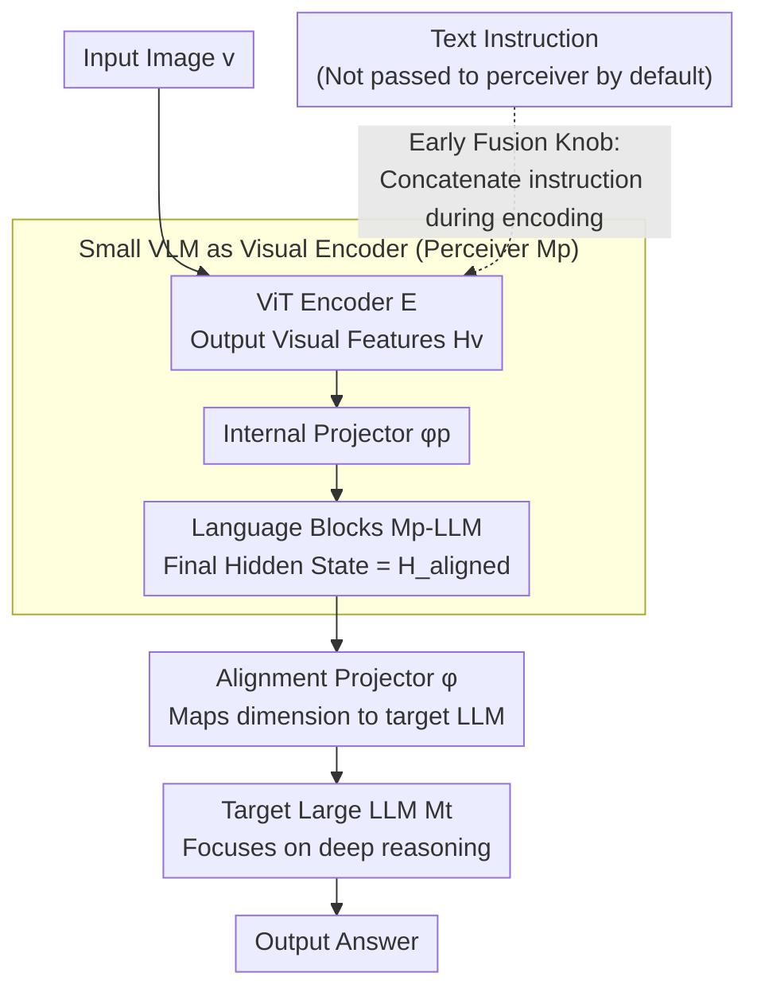

# Deep Pre-Alignment for VLMs

**Conference**: ICML 2026  
**arXiv**: [2605.15300](https://arxiv.org/abs/2605.15300)  
**Code**: To be confirmed (Paper notes "DPA Code and Model" will be public)  
**Area**: Multimodal VLM  
**Keywords**: Visual Encoder, Modality Alignment, Perception Model, Catastrophic Forgetting, VLM Architecture

## TL;DR
The authors replace the standard "ViT + lightweight projector" visual module in VLMs with a small VLM (perceiver). This allows the depth-intensive task of modality alignment to be completed upstream within the small VLM, ensuring the downstream large LLM does not waste its initial layer depth on alignment. Results show a +1.9 point improvement for a 4B model across 8 multimodal benchmarks and +3.0 points for a 32B model, while reducing language capability forgetting by 32.9% with only a 2–6% drop in inference throughput.

## Background & Motivation

**Background**: Current mainstream VLMs (LLaVA, Qwen-VL, InternVL, MiniCPM-o, etc.) mostly follow the same paradigm: a pre-trained ViT (e.g., CLIP) passes visual features through a linear or MLP projector into the input embedding space of a large LLM, relying on the LLM itself to handle cross-modal alignment.

**Limitations of Prior Work**: Recent representation analysis (MIR metrics from Huang et al. 2025, neuron circuit analysis from Nikankin et al. 2025) consistently indicates that visual features from ViT still exhibit significant modality gaps with the text space in the shallow layers of the LLM. The first few layers of the LLM are forced to repurpose a large number of parameters for "shallow modality alignment," displacing the capacity originally intended for deep understanding and complex reasoning. This displacement also triggers a common VLM issue—catastrophic forgetting of text capabilities (e.g., a 4B baseline's MATH-500 score plummeted from 84.8 to 36.4).

**Key Challenge**: Shallow layers represent the LLM's most valuable "universal semantic entry." Forcing them to dual-task as alignment modules essentially trades depth for architectural simplicity. Solving this requires either modifying training objectives (data mixing), which only treats the symptoms, or modifying the architecture to complete deep alignment before visual features reach the LLM.

**Goal**: Increase the "depth" of the visual encoder without altering the training objective or the LLM backbone, ensuring alignment tasks are handled on the visual side so the downstream LLM receives visual features already near the text space.

**Key Insight**: The authors noted that a complete small VLM has already learned "how to push visual tokens toward the text space" on large-scale image-text data. Its internal language blocks serve as natural "alignment depth." By treating this small VLM as the visual encoder for a larger LLM, alignment becomes an internal behavior of the perceiver.

**Core Idea**: Replace the ViT encoder with a small VLM (e.g., a Qwen3-0.6B-based perceiver). This decouples "modality alignment" and "deep reasoning" at the architectural level: the upstream small VLM handles alignment, while the downstream large LLM focuses on reasoning.

## Method

### Overall Architecture
The DPA architecture connects three parts: a small perception VLM $M_p$ (containing a ViT $\mathcal{E}$, internal projector $\phi_p$, and internal LLM blocks $M_p^{\text{LLM}}$), an alignment projector $\phi$, and a target large LLM $M_t$. While the standard VLM data flow is $v \xrightarrow{\mathcal{E}} \mathbf{H}_v \xrightarrow{\phi} \mathbf{H}_v' \to M_t$, DPA modifies it to $v \xrightarrow{\mathcal{E}} \mathbf{H}_v \xrightarrow{\phi_p} \mathbf{H}_v' \xrightarrow{M_p^{\text{LLM}}, \phi} \mathbf{H}_{\text{aligned}} \to M_t$. Visual tokens traverse the internal language blocks of the perceiver before entering $M_t$, ensuring the features delivered to the large LLM are already in a state of "text-space proximity."

### Key Designs

**1. Using a Small VLM as a Visual Encoder: Offloading depth-intensive alignment to the perceiver.**
The bottleneck lies in ViT features having a significant modality gap in shallow LLM layers. DPA offloads this "alignment depth" to a small VLM. Specifically, the final language block hidden state of the perceiver $M_p$ (a Qwen3-0.6B based model in the paper) is used as $\mathbf{H}_{\text{aligned}}$. These states are processed by causal attention, mapping them into a space compatible with text embeddings. A projector $\phi$ then maps the perceiver's dimension (1024 for 0.6B) to the target LLM's dimension (e.g., 2048 for 4B). Its superiority over ViT stems from the "language block structure": ViT learns shallow alignment, whereas language blocks output geometries naturally isomorphic to the target LLM. Ablations confirm that keeping the ViT without language blocks only gains +0.7, while the full perceiver gains +3.4.

**2. Plug-and-Play Two-Stage Training: Architecture-driven gains without changing objectives.**
To ensure gains stem from architecture rather than training tricks, the authors intentionally avoid auxiliary losses, reusing the LLaVA pipeline. Stage 1 trains only $\phi$ using 558K image-text pairs to align perceiver dimensions. Stage 2 performs end-to-end fine-tuning of the DPA (perceiver + projector + target LLM) using 1M high-quality visual instruction data. For 32B models, LoRA is used for 3 epochs. Keeping the perceiver trainable in Stage 2 is critical; freezing it drops performance from 53.0 to 52.1, though it still outperforms the baseline. This design allows DPA to be stacked onto any existing VLM pipeline as a modular upgrade.

**3. Instruction-Agnostic Default vs. Early Fusion Knob: Balancing generality and peak performance.**
Whether the perceiver should see text instructions during encoding is a trade-off. The default configuration keeps the perceiver instruction-agnostic to ensure stable representations for multi-turn dialogues. An optional "w/ instruction context" variant concatenates instructions during encoding, acting as a semantic filter. While early fusion increases the overall average from 53.0 to 55.2 and text scores from 52.6 to 59.0, it binds visual representations to a single-turn query, failing in multi-turn scenarios. This ablation also explains how DPA mitigates text forgetting—the perceiver acts as a filter for interfering visual features, reducing the perturbation to the target LLM's language capabilities.

### Loss & Training
The study follows the LLaVA-NeXT two-stage recipe: Stage 1 utilizes a learning rate of 1e-3, batch size 512, for 2 epochs; Stage 2 utilize a learning rate of 1e-5, batch size 256, for 2 epochs. 32B models use LoRA over 3 epochs. All stages use standard language modeling loss without contrastive or alignment-specific auxiliary losses.

## Key Experimental Results

### Main Results
DPA consistently outperforms baselines across 4B/32B scales and Qwen3/LLaMA-3.2 families. The following table summarizes average scores across 11 benchmarks (Multi. Avg is the mean of 8 multimodal benchmarks, All Avg is the mean of all 11):

| Configuration | General | Reasoning | Perception | Text | Multi. Avg | All Avg |
|---|---|---|---|---|---|---|
| LLaVA-NeXT-LLaMA-3.2-3B | 40.8 | 27.4 | 60.5 | 21.0 | 40.7 | 35.3 |
| DPA-LLaMA-3.2-3B | 44.8 | 29.8 | 64.3 | 25.1 | 44.1 | 38.9 |
| Δ | +4.0 | +2.4 | +3.8 | +4.1 | +3.4 | +3.6 |
| LLaVA-NeXT-Qwen3-4B | 51.1 | 40.1 | 68.3 | 45.1 | 51.2 | 49.6 |
| DPA-Qwen3-4B | 52.5 | 41.0 | 72.4 | 52.6 | 53.1 | 53.0 |
| Δ | +1.4 | +0.9 | +4.1 | +7.5 | +1.9 | +3.4 |
| LLaVA-NeXT-Qwen3-32B | 57.6 | 48.3 | 73.4 | 53.1 | 58.1 | 56.7 |
| DPA-Qwen3-32B | 60.9 | 50.1 | 77.9 | 58.1 | 61.1 | 60.3 |
| Δ | +3.3 | +1.8 | +4.5 | +5.0 | +3.0 | +3.6 |

The multimodal average gain expands from +1.9 at 4B to +3.0 at 32B, showing positive scalability. On text tasks, the 4B MATH-500 score improved from 36.4 to 54.2 (+17.8), and text capability forgetting was reduced by 32.9% (4B) / 21.6% (32B).

### Ablation Study
Comparison of different perceiver designs under the 4B Qwen3 configuration reveals that "language blocks" and "language pre-training" are necessary:

| Configuration | General | Reasoning | Perception | Text | Avg |
|---|---|---|---|---|---|
| LLaVA-NeXT-Qwen3-4B (baseline) | 51.1 | 40.1 | 68.3 | 45.1 | 49.6 |
| w/ large MLP (MLP replacing perceiver) | 26.2 | 29.7 | 29.2 | 49.8 | 34.1 |
| DPA-Qwen3-4B | 52.5 | 41.0 | 72.4 | 52.6 | 53.0 |
| w/o perceiver LM blocks (ViT only) | 51.7 | 40.3 | 69.5 | 46.1 | 50.3 |
| w/o perceiver LM pre-training (Random init) | 30.4 | 32.6 | 32.2 | 57.5 | 38.7 |
| w/ instruction context (Early fusion) | 53.8 | 41.8 | 71.8 | 59.0 | 55.2 |
| w/ perceiver frozen (Frozen Stage 2) | 51.7 | 39.9 | 67.4 | 54.4 | 52.1 |
| w/ untrained perceiver (Untrained) | 53.1 | 40.2 | 69.5 | 55.1 | 53.1 |

### Key Findings
- **Architecture is the Core Gain**: An untrained perceiver still yields +3.5 points higher than the baseline, indicating that DPA's gains come from "increased depth + language block structure" rather than simply transferring the strengths of a strong perceiver. 
- **Language Pre-training Weights are Essential**: Replacing lang-blocks with random initialization causes the average score to plummet from 53.0 to 38.7. Both "LLM structure" and "language pre-training weights" are required.
- **DPA Mitigates Catastrophic Forgetting**: For the 4B configuration, text scores rose from 45.1 to 52.6 (+7.5), with MATH-500 increasing by +17.8. MIR indicators prove DPA visual features are geometrically closer to the text space, reducing "destructive adaptation."
- **Negligible Inference Cost**: At 32B, throughput remains at 98% of the baseline (57.8 → 56.4 tokens/s). Training FLOPs only increase by 2% since the perceiver strictly contributes to the pre-fill stage.
- **Early Fusion as a Performance-Versatility Knob**: Passing instructions to the perceiver adds +2.2 points, but is avoided by default to preserve multi-turn dialogue capabilities.

## Highlights & Insights
- **Small VLM as encoder is a logical paradigm shift**: While the idea may seem intuitive, the systematic ablation proves success depends on pre-trained language blocks, not just visual capability. This reframes the module boundary from "high-semantic visual alignment" to "alignment via language structures."
- **Geometric Isomorphism Evidence**: Inter-layer similarity matrices show DPA visual spaces develop a "block-diagonal" subspace structure consistent with text spaces. This structural similarity is a better metric for alignment quality than mere distance.
- **Clarifying Architecture vs. Data**: Previously, text forgetting was mitigated via data mixing. DPA solves it through architectural modification, demonstrating that architecture still has significant unexplored optimization potential.
- **Transferable Design**: The "lightweight projector to perceiver" transition can be generalized to other modalities (audio, video) to resolve modality gaps via modality-internal LM blocks.

## Limitations & Future Work
- **Training Cost Overhead**: While inference cost is low, 4B training FLOPs increased by 14%. The paper does not analyze the threshold for the "minimum viable perceiver scale."
- **Lack of Quantitative Data on Multi-turn Failure**: The claim that early fusion damages multi-turn capabilities lacks specific data from multi-turn VQA or dialogue benchmarks.
- **MIR Scalability**: MIR analysis requires consistent dimensions, so evaluations were conducted between the perceiver and Qwen3-0.6B rather than directly with the 32B target LLM.
- **Missing Combined Data/Architecture Baselines**: DPA lacks "DPA + optimized data Mixing" vs "Baseline + optimized data mixing" experiments to quantify synergistic gains.
- **Task Coverage**: The study focuses on understanding and reasoning, leaving gains in dense prediction tasks like grounding or segmentation unexplored.

## Related Work & Insights
- **vs. Data Mixing (DeepSeek-VL / InternVL)**: These models use text-multimodal weighting; DPA fundamentally reduces "destructive adaptation" through architecture and is orthogonal to data strategies.
- **vs. Multi-encoder Fusion (Cambrian / Eagle)**: Those works use multiple ViTs (DINO + SAM) in parallel; DPA use a single perceiver but increases its alignment depth.
- **vs. LLaVA / Qwen-VL**: DPA upgrades the "1-layer MLP" to a "small VLM," extending the LLaVA paradigm while remaining compatible with existing pipelines.
- **vs. Auxiliary Losses (MaskCLIP / SEA)**: Unlike works adding auxiliary supervision to ViT, DPA relies entirely on architecture, avoiding potential loss design conflicts.

## Rating
- **Novelty**: ⭐⭐⭐⭐ Using a small VLM as an encoder is systematically justified through the "language block + pre-training" insight and geometric analysis.
- **Experimental Thoroughness**: ⭐⭐⭐⭐⭐ Covers multiple scales, families, and 11 benchmarks with extensive ablations on freezing, pre-training, and early fusion.
- **Writing Quality**: ⭐⭐⭐⭐ Clear structure with a research-question-driven narrative, though some geometric diagrams require more detailed explanations.
- **Value**: ⭐⭐⭐⭐⭐ Provides evidence for architectural upgrades in VLM visual encoders, offering a plug-in upgrade path for industry and researchers.

<!-- RELATED:START -->

## Related Papers

- [\[CVPR 2026\] PowerCLIP: Powerset Alignment for Contrastive Pre-Training](../../CVPR2026/multimodal_vlm/powerclip_powerset_alignment_for_contrastive_pre-training.md)
- [\[ICML 2026\] Injecting Distributional Awareness into MLLMs via Reinforcement Learning for Deep Imbalanced Regression](injecting_distributional_awareness_into_mllms_via_reinforcement_learning_for_dee.md)
- [\[CVPR 2025\] Post-pre-training for Modality Alignment in Vision-Language Foundation Models](../../CVPR2025/multimodal_vlm/post-pre-training_for_modality_alignment_in_vision-language_foundation_models.md)
- [\[ACL 2026\] A Survey of Deep Learning for Geometry Problem Solving](../../ACL2026/multimodal_vlm/a_survey_of_deep_learning_for_geometry_problem_solving.md)
- [\[CVPR 2026\] Towards Dynamic Modality Alignment in Multimodal Continual Learning](../../CVPR2026/multimodal_vlm/towards_dynamic_modality_alignment_in_multimodal_continual_learning.md)

<!-- RELATED:END -->
