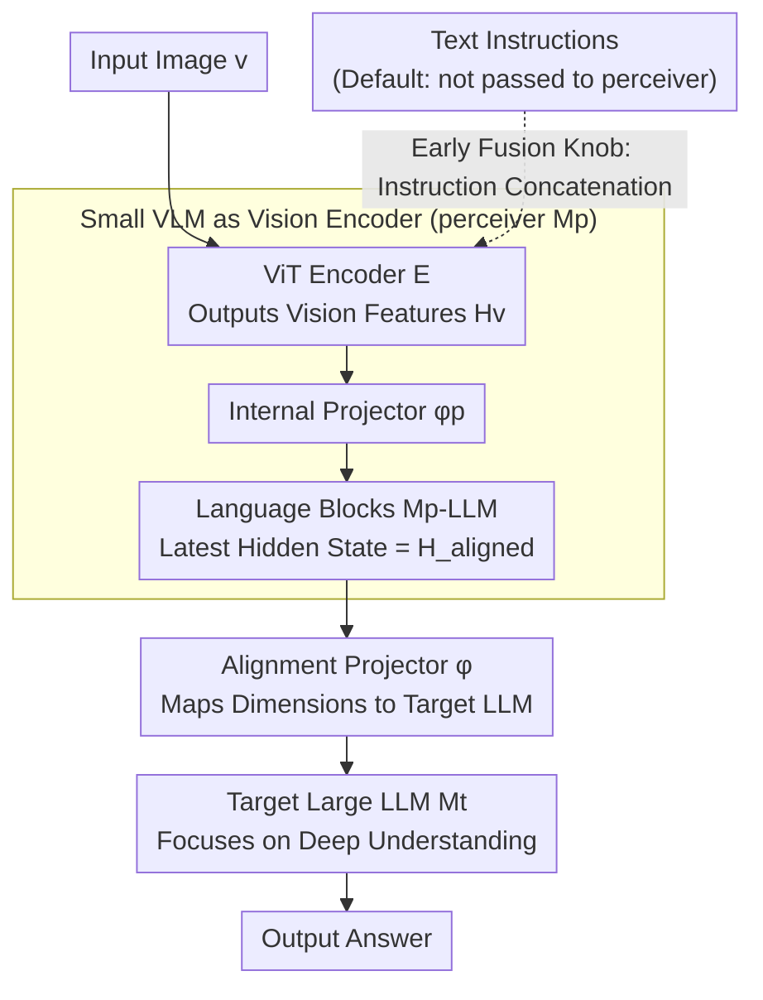

# Deep Pre-Alignment for VLMs

**Conference**: ICML 2026  
**arXiv**: [2605.15300](https://arxiv.org/abs/2605.15300)  
**Code**: To be confirmed (Paper notes "DPA Code and Model" will be released)  
**Area**: Multimodal VLM  
**Keywords**: Vision Encoder, Modality Alignment, Perception Model, Catastrophic Forgetting, VLM Architecture

## TL;DR
The authors replace the standard "ViT + lightweight projector" visual encoding module in VLMs with a small VLM (perceiver). This allows the intensive modality alignment to be completed within the upstream small VLM, preventing the downstream large LLM from wasting depth on alignment in its shallow layers. This approach improves performance by +1.9 points on a 4B model and +3.0 points on a 32B model across 8 multimodal benchmarks, reduces language capability forgetting by 32.9%, and maintains inference throughput with only a 2–6% decrease.

## Background & Motivation

**Background**: Most current mainstream VLMs (LLaVA, Qwen-VL, InternVL, MiniCPM-o, etc.) follow the same paradigm: a pre-trained ViT (such as CLIP) feeds visual features into the input embedding space of a large LLM via a linear or MLP projector, relying on the LLM itself to handle cross-modal alignment.

**Limitations of Prior Work**: Recent representation analyses (the MIR metric from Huang et al. 2025, neuron circuit analysis from Nikankin et al. 2025) consistently point out that visual features output by ViT still exhibit significant modality gaps with the text space in the shallow layers of the LLM. The first few layers of the LLM are forced to misappropriate a large number of parameters for "shallow modality alignment," occupying capacity that should be used for deep understanding and complex reasoning. This "occupation" also triggers a common VLM ailment—catastrophic forgetting of language capabilities (e.g., the 4B baseline plummeted from 84.8 to 36.4 on MATH-500).

**Key Challenge**: Shallow layers are the LLMs' most precious "universal semantic entry" layers. Making them perform modality alignment essentially trades wasted depth for architectural simplicity. To solve this, one must either modify training objectives (data mixing), which only treats the symptoms, or modify the architecture to complete deep alignment before visual features enter the LLM.

**Goal**: To add "depth" to the vision encoder without changing the training objectives or the LLM backbone—handling the heavy lifting of alignment on the vision side so that the downstream LLM only receives visual features already close to the text space.

**Key Insight**: The authors observed that a complete small VLM has already learned "how to push vision tokens toward the text space" during large-scale image-text pre-training—its internal language blocks are natural "alignment depth." By treating this small VLM as the vision encoder for the large LLM, alignment becomes an internal behavior of the perceiver.

**Core Idea**: Replace the ViT encoder entirely with a small VLM (e.g., a Qwen3-0.6B-based perceiver) to decouple "modality alignment" and "deep reasoning" at the architectural level—the upstream small VLM handles alignment, while the downstream large LLM focuses on reasoning.

## Method

### Overall Architecture
The DPA architecture consists of three parts in series: a small perception VLM $M_p$ (containing a ViT $\mathcal{E}$, internal projector $\phi_p$, and internal LLM blocks $M_p^{\text{LLM}}$), an alignment projector $\phi$, and a target large LLM $M_t$. While standard VLM data flow is $v \xrightarrow{\mathcal{E}} \mathbf{H}_v \xrightarrow{\phi} \mathbf{H}_v' \to M_t$, DPA modifies this to $v \xrightarrow{\mathcal{E}} \mathbf{H}_v \xrightarrow{\phi_p} \mathbf{H}_v' \xrightarrow{M_p^{\text{LLM}}, \phi} \mathbf{H}_{\text{aligned}} \to M_t$. Visual tokens pass through the perceiver's internal language blocks before entering $M_t$, ensuring the features delivered to the large LLM are already "near neighbors" in the text space.

### Key Designs

**1. Using a Small VLM as a Vision Encoder: Handling Alignment Overhead within the Perceiver**

The pain point is that ViT features still have a significant modality gap in the shallow layers of the LLM. DPA's solution is to outsource that "alignment depth" to a small VLM. Specifically, it uses the hidden state of the last language block of perceiver $M_p$ (a small VLM trained with Qwen3-0.6B and a corresponding ViT) as $\mathbf{H}_{\text{aligned}}$. This hidden state has been refined by the causal attention of the pre-trained language blocks and geometrically resides in a space compatible with text embeddings. A projector $\phi$ then maps the $M_p^{\text{LLM}}$ dimensions (1024 for 0.6B) to the target LLM (2048 for 4B, 5120 for 32B). Its superiority over ViT lies not in visual capability but in its "language block structure": CLIP ViT learns shallow image-text similarity alignment, whereas language blocks, after large-scale causal LM pre-training, naturally output geometries isomorphic to the target LLM. Ablations support this: keeping only the ViT without language blocks yielded only a +0.7 gain, while the full perceiver achieved +3.4.

**2. Pluggable Two-Stage Training: Architecture-Driven Gains**

To substantiate that performance improvements stem from the architecture rather than training tricks, the authors intentionally avoid auxiliary losses or special strategies, completely reusing the classic LLaVA pipeline. Stage 1 uses 558K image-text captions to train only $\phi$, aligning perceiver output dimensions to the target LLM. Stage 2 uses 1M high-quality visual instruction data for end-to-end fine-tuning of the entire DPA (perceiver + projector + target LLM), with LoRA used for the 32B model over 3 epochs to manage compute. The perceiver remains trainable in Stage 2—freezing it drops performance from 53.0 to 52.1, which still outperforms the baseline. This "replace encoder only" design allows DPA to be overlaid onto any existing VLM pipeline.

**3. Instruction-Agnostic Default vs. Early Fusion Knob: Balancing Generality and Peak Performance**

Whether the perceiver should see text instructions during encoding is a real trade-off. The default configuration keeps the perceiver "blind" to instructions, outputting instruction-agnostic visual features to ensure stable representations across multi-turn dialogues and intent shifts. An optional "w/ instruction context" variant concatenates instructions during the perceiver's encoding stage, acting as an early-fusion semantic filter that filters out irrelevant visual information based on the query. Ablations show early fusion can pull the overall average from 53.0 up to 55.2 (and the text score from 52.6 to 59.0), but at the cost of binding visual representations to a single query.

### Loss & Training
The authors strictly follow the LLaVA-NeXT two-stage recipe: Stage 1 utilizes a learning rate of 1e-3, batch size 512, for 2 epochs; Stage 2 utilize a learning rate of 1e-5, batch size 256, for 2 epochs; and for 32B models, LoRA + 3 epochs. All stages use the standard language modeling loss without contrastive learning or auxiliary alignment losses.

## Key Experimental Results

### Main Results
DPA consistently outperformed the control baselines (LLaVA-NeXT reproductions) across two scales (4B / 32B) and two LLM families (Qwen3 / LLaMA-3.2). The table below summarizes the average scores across 11 benchmarks:

| Configuration | General | Reasoning | Perception | Text | Multi. Avg | All Avg |
|---|---|---|---|---|---|---|
| LLaVA-NeXT-LLaMA-3.2-3B | 40.8 | 27.4 | 60.5 | 21.0 | 40.7 | 35.3 |
| DPA-LLaMA-3.2-3B | 44.8 | 29.8 | 64.3 | 25.1 | 44.1 | 38.9 |
| Δ | +4.0 | +2.4 | +3.8 | +4.1 | +3.4 | +3.6 |
| LLaVA-NeXT-Qwen3-4B | 51.1 | 40.1 | 68.3 | 45.1 | 51.2 | 49.6 |
| DPA-Qwen3-4B | 52.5 | 41.0 | 72.4 | 52.6 | 53.1 | 53.0 |
| Δ | +1.4 | +0.9 | +4.1 | +7.5 | +1.9 | +3.4 |
| LLaVA-NeXT-Qwen3-32B | 57.6 | 48.3 | 73.4 | 53.1 | 58.1 | 56.7 |
| DPA-Qwen3-32B | 60.9 | 50.1 | 77.9 | 58.1 | 61.1 | 60.3 |
| Δ | +3.3 | +1.8 | +4.5 | +5.0 | +3.0 | +3.6 |

Observation across scales: The average multimodal gain expanded from +1.9 at 4B to +3.0 at 32B, showing positive scalability. On text tasks, the 4B MATH-500 score increased from 36.4 to 54.2 (+17.8 points), with the relative reduction in language capability forgetting reaching 32.9% (4B) and 21.6% (32B).

### Ablation Study
A comparison of different perceiver designs under the 4B Qwen3 configuration reveals that "language blocks" and "language pre-training" are necessary conditions:

| Configuration | General | Reasoning | Perception | Text | Avg |
|---|---|---|---|---|---|
| LLaVA-NeXT-Qwen3-4B (baseline) | 51.1 | 40.1 | 68.3 | 45.1 | 49.6 |
| w/ large MLP (Large MLP instead of perceiver) | 26.2 | 29.7 | 29.2 | 49.8 | 34.1 |
| DPA-Qwen3-4B | 52.5 | 41.0 | 72.4 | 52.6 | 53.0 |
| w/o perceiver LM blocks (ViT only) | 51.7 | 40.3 | 69.5 | 46.1 | 50.3 |
| w/o perceiver LM pre-training (Randomly initialized) | 30.4 | 32.6 | 32.2 | 57.5 | 38.7 |
| w/ instruction context (Early fusion) | 53.8 | 41.8 | 71.8 | 59.0 | 55.2 |
| w/ perceiver frozen (Frozen perceiver in Stage 2) | 51.7 | 39.9 | 67.4 | 54.4 | 52.1 |
| w/ untrained perceiver (Totally untrained perceiver) | 53.1 | 40.2 | 69.5 | 55.1 | 53.1 |

### Key Findings
- **Architecture is the Core Benefit**: An untrained perceiver (where projector and $\phi$ are randomly initialized) still outperformed the baseline by +3.5 points, indicating that DPA's gains come primarily from the "added depth + language block structure" rather than the transfer of a strong perceiver's capabilities.
- **Pre-trained Language Block Weights are Essential**: Replacing language blocks with random initialization caused the overall score to plummet from 53.0 to 38.7. An "equivalent parameter large MLP" only achieved 34.1. This shows that the LLM structure and language pre-trained weights are both indispensable.
- **DPA Mitigates Catastrophic Forgetting**: Text average scores for the 4B configuration rose from 45.1 to 52.6 (+7.5). The authors used the MIR metric to prove DPA visual features are geometrically closer to the text space, significantly reducing "destructive adaptation."
- **Negligible Inference Cost**: In the 32B configuration, throughput remained at 98% of the baseline (56.4 vs 57.8 tokens/s). Training FLOPs only increased by 2% because the perceiver only contributes cost during the pre-fill stage and does not participate in generation.
- **Early Fusion is an Optional Performance-Generality Toggle**: Passing instructions to the perceiver can add another 2.2 points, but the authors argue this binds visual features to a single-turn query.

## Highlights & Insights
- **Using a small VLM as a vision encoder is simple yet potent**: This idea is intuitive, but this paper provides a systematic ablation—proving the perceiver works because of its pre-trained language blocks, not just its visual strength.
- **Quantifiable Geometric Isomorphism Evidence**: Inter-layer similarity matrices show that DPA visual space develops a "block-diagonal" subspace structure consistent with text space, unlike the baseline's blurred space.
- **Clarifying the Architecture vs. Data Relationship**: Previous methods for mitigating VLM text forgetting relied on data mixing. This work solves the same problem through architectural modification and demonstrates it is orthogonal to data strategies.
- **Transferable Design Trick**: Expanding a "lightweight projector" into a "perceiver with language blocks" can be generalized to other modalities (audio, video) wherever a modality gap exists.

## Limitations & Future Work
- **Training Costs Still Increase**: While inference only adds 2%, 4B training FLOPs increased by 14% ($1.27 \to 1.45 \times 10^{18}$); the paper does not analyze the critical point for "minimum viable perceiver scale."
- **Lack of Quantitative Multi-turn Verification for Early Fusion**: The claim that early fusion hurts multi-turn dialogue capabilities lacks specific data from multi-turn VQA or dialogue benchmarks.
- **Limitations of MIR Analysis**: MIR requires identical space dimensions, so the analysis was limited to the relationship between the perceiver and Qwen3-0.6B, without direct display of the relationship between the perceiver and the 32B target LLM.
- **Task Coverage Focused on Understanding**: The study does not cover grounding, segmentation, or VLM agent tasks; it is unclear if DPA provides similar gains in dense prediction scenarios.

## Related Work & Insights
- **vs. Data Mixing (DeepSeek-VL / InternVL)**: While they rely on dynamic weighting of text vs. multimodal data to mitigate forgetting, this work fundamentally reduces "destructive adaptation" via architecture.
- **vs. Multi-Encoder Fusion (Cambrian / Eagle)**: Those works use multiple ViTs in parallel for comprehensive visual representation; DPA takes the opposite approach—using one perceiver but increasing its alignment depth.
- **vs. LLaVA / Qwen-VL Series**: DPA upgrades the LLaVA paradigm's projector from a 1-layer MLP to a small VLM, making it an architectural extension that is fully compatible with existing pipelines.

## Rating
- Novelty: ⭐⭐⭐⭐ While the idea of using a small VLM as an encoder is not entirely original, the systematic ablation clarifying the roles of "language block structure" and "pre-trained weights" is insightful.
- Experimental Thoroughness: ⭐⭐⭐⭐⭐ Covers multiple scales, families, and 11 benchmarks; includes crucial ablations on scale, freezing, and pre-training.
- Writing Quality: ⭐⭐⭐⭐ Clear structure with five research questions; however, some formula layouts provide minor friction.
- Value: ⭐⭐⭐⭐⭐ Provides clear evidence that VLM vision encoders have room for structural upgrades, offering direct utility for upgrading existing models.

<!-- RELATED:START -->

## Related Papers

- [\[ICML 2026\] Gated Relational Alignment via Confidence-based Distillation for Efficient VLMs](gated_relational_alignment_via_confidence-based_distillation_for_efficient_vlms.md)
- [\[CVPR 2026\] PowerCLIP: Powerset Alignment for Contrastive Pre-Training](../../CVPR2026/multimodal_vlm/powerclip_powerset_alignment_for_contrastive_pre-training.md)
- [\[ICML 2026\] Injecting Distributional Awareness into MLLMs via Reinforcement Learning for Deep Imbalanced Regression](injecting_distributional_awareness_into_mllms_via_reinforcement_learning_for_dee.md)
- [\[CVPR 2025\] Post-pre-training for Modality Alignment in Vision-Language Foundation Models](../../CVPR2025/multimodal_vlm/post-pre-training_for_modality_alignment_in_vision-language_foundation_models.md)
- [\[CVPR 2026\] Towards Dynamic Modality Alignment in Multimodal Continual Learning](../../CVPR2026/multimodal_vlm/towards_dynamic_modality_alignment_in_multimodal_continual_learning.md)

<!-- RELATED:END -->
