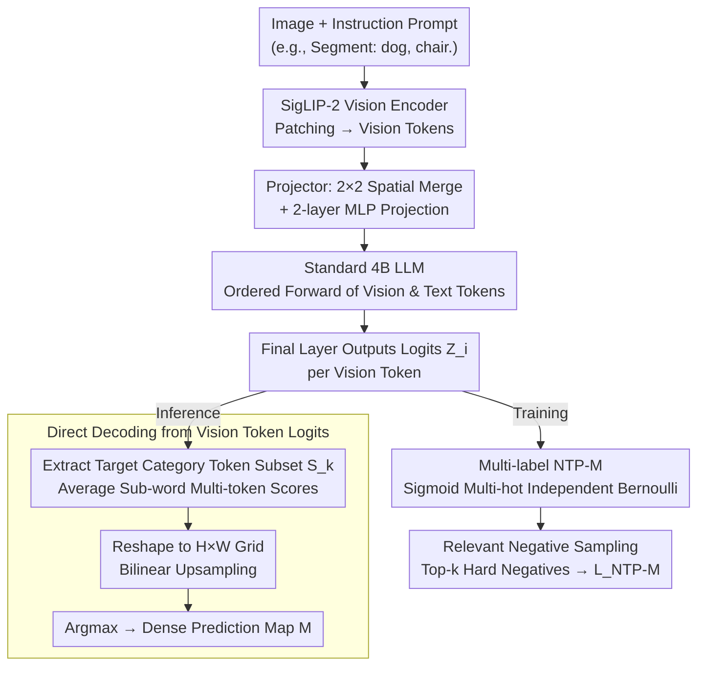

# DenseMLLM: Standard Multimodal LLMs for Dense Prediction

**Conference**: ICML 2026  
**arXiv**: [2602.14134](https://arxiv.org/abs/2602.14134)  
**Code**: https://github.com/Eli-YiLi/DenseMLLM (Available)  
**Area**: Multimodal VLM  
**Keywords**: Dense Prediction, Multimodal LLM, Vision Token Supervision, Multi-label NTP, Unified Architecture

## TL;DR
The authors incorporate dense prediction tasks—such as semantic segmentation, depth estimation, and referring expression segmentation—directly into a standard 4B MLLM (ViT + Projector + LLM) without any task-specific decoders. By introducing "Multi-label Next Token Prediction" (NTP-M) supervision for vision tokens, the model achieves 54.2 mIoU on ADE20K, 87.6 $\delta_1$ on DDAD, and 80.7 cIoU on RefCOCO val, while maintaining general VL performance comparable to Qwen3-VL-4B.

## Background & Motivation

**Background**: Current mainstream MLLMs utilize the "ViT + Projector + LLM" triumvirate to uniformly handle tasks like VQA, OCR, and grounding. However, when encountering dense prediction tasks requiring pixel-level output (e.g., semantic segmentation, depth estimation), almost all existing solutions attach task-specific decoders—such as the SAM mask decoder in GLaMM/UniPixel, mask retrieval embeddings in UFO, or Deformable-DETR heads in VisionLLM.

**Limitations of Prior Work**: These add-on designs fragment the architecture, requiring new modules for every new task, which contradicts the MLLM philosophy of "unifying all tasks via a single next-token interface." The few attempts at pure text output (e.g., point-wise sampling in DepthLM or polygon coordinates in VisionLLM) suffer from either massive inference overhead or suboptimal precision.

**Key Challenge**: The training objective of standard MLLMs applies NTP loss only to text tokens, leaving vision tokens indirectly supervised via global image-text alignment. Consequently, vision tokens in the final layer do not carry fine-grained pixel semantics. To perform dense prediction without an external decoder, one must directly supervise the output probabilities of vision tokens.

**Goal**: To enable a completely standard MLLM—without architectural changes, additional heads, or retrieval mechanisms—to directly decode pixel-level segmentation and depth maps from vision token logits using argmax.

**Key Insight**: The authors observe a fundamental difference: a vision token corresponds to an image patch that may simultaneously contain multiple semantic labels (e.g., "dog / chair / background / depth bin 20"); in contrast, a text token always corresponds to a single vocabulary ID. Thus, single-label softmax NTP is inherently unsuitable for vision tokens.

**Core Idea**: Extend NTP from "single-label softmax" to "multi-label sigmoid (independent Bernoulli distributions) + relevant negative sampling." This allows standard LLM vision token logits to simultaneously handle classification and localization. During inference, dense maps are generated by simply performing argmax over the target category vocabulary.

## Method

### Overall Architecture
DenseMLLM consists of three standard components: SigLIP-2 (siglip2-so400m-patch16-naflex) as the vision encoder, a $2\times 2$ spatial-merge + two-layer MLP as the projector, and a standard 4B-parameter transformer LLM. Input images are partitioned into patches and encoded into a sequence of vision tokens. Prompts (e.g., "Segment: dog, chair.") are tokenized and processed alongside vision tokens by the LLM. The final layer of the LLM outputs a vocabulary-dimensional logit vector $Z_i \in \mathbb{R}^{|V|}$ for each vision token. These logits serve two purposes: direct argmax decoding for dense prediction during inference (bypassing any mask decoder) and NTP-M multi-label supervision during training to compress fine-grained pixel semantics into the vision token logits.

### Key Designs

**1. Direct Decoding from Vision Token Logits: Treating Final Layer Visual Logits as a Classification Map**

While standard MLLMs attach decoders for dense prediction, the authors argue that after multiple transformer layers, vision tokens already integrate global context and instruction information. They skip the mask decoder entirely. For semantic segmentation, the model first outputs the set of existing classes $\{k\}$ via NTP. It then extracts subsets of token IDs $S_k$ corresponding to these classes from the logits $Z_i \in \mathbb{R}^{|V|}$ of each vision token. The sub-word scores are averaged as $\hat Z_k = \frac{1}{|S_k|} \sum_{v \in S_k} Z_v$. The resulting $\hat Z$ is reshaped into an $H \times W$ patch grid and bilinearly upsampled to the original resolution to obtain the prediction map $M = A(I(R(\hat Z)))$. Depth estimation follows the same argmax process by discretizing depth into 1,000 bins, each represented by a `<custom k>` vocabulary ID. This allows a single forward pass to generate a dense depth map—achieving 87.6 $\delta_1$ on DDAD—whereas DepthLM requires separate inference for every sampled point.

**2. Multi-label Next Token Prediction (NTP-M): Enabling Multi-target Supervision for a Single Vision Token**

To directly supervise vision tokens, the authors address the labels' overlapping nature: a single vision token/patch might contain "dog," "chair," and specific depth bins simultaneously. NTP-M replaces softmax with multi-label sigmoid. It constructs multi-hot vectors $y_{i,v} \in \{0, 1\}$, where labels for object categories, depth bins, or background relative to the $i$-th vision token's spatial position are set to 1. The joint probability is modeled using independent Bernoulli distributions: $p(Y|X_v, X_{\text{instruct}}) = \prod_{i,v} \sigma(Z_{i,v})^{y_{i,v}}(1 - \sigma(Z_{i,v}))^{1 - y_{i,v}}$. Prompts $X_{\text{instruct}}$ control which segments of the vocabulary are activated for different tasks. This sigmoid approach allows semantic co-existence and remains fully compatible with the standard text token NTP framework without adding new loss branches.

**3. Relevant Negative Sampling: Selecting Hard Negatives in Vocabulary Space**

The MLLM vocabulary contains hundreds of thousands of tokens, leading to an extreme imbalance where positive samples for a vision token are scarce compared to overwhelming negatives. Traditional OHEM selects hard examples in spatial dimensions; here, the imbalance is in the vocabulary dimension. The authors select "relevant negatives": for each vision token, given the positive set $P_i$ and negative candidate set $C_i$, the top-$k$ negatives with the highest predicted probabilities $p_{i,v} = \sigma(Z_{i,v})$ are selected as $N_i^{\text{relev}}$. The final loss averages positive and negative terms independently:

$$L_{\text{NTP-M}} = \sum_i \Big[ -\frac{1}{|P_i|} \sum_{v \in P_i} \log p_{i,v} - \frac{1}{k} \sum_{v \in N_i^{\text{relev}}} \log(1 - p_{i,v}) \Big]$$

This design is critical: ablation shows that moving from pure BCE $\to$ independent mean $\to$ relevant negative sampling improves ADE20K mIoU from 16.7 $\to$ 32.7 $\to$ 51.2, accounting for approximately 70% of the total gain.

### Loss & Training
Four-stage training strategy: Stage I: Multimodal foundational pre-training (mixed language and vision, adding vision codebook supervision); Stage II: Annealing stage, high-quality fine-tuning for dense prediction tasks mixed with VQA/OCR to maintain generality; Stage III: SFT with context window expansion from 16K to 32K; Stage IV: DAPO-style RL, introducing class-label IoU rewards for segmentation, removing the KL penalty and using FP16 to ensure convergence.

## Key Experimental Results

### Main Results
DenseMLLM-4B uses a single standard architecture to handle three major dense prediction tasks, remaining competitive with methods using task-specific decoders:

| Dataset / Task | Metric | DenseMLLM-4B | Prev. SOTA | Note |
|---|---|---|---|---|
| ADE20K Segmentation | mIoU | 54.2 | VisionLLM-v2 52.3 (w/ Deform-DETR) | No decoder |
| Cityscapes Segmentation | mIoU | 70.4 | X-Decoder 81.7 (Expert Model) | General model |
| NYUv2 Depth | $\delta_1$ | 90.4 | DepthLM 86.8 (Point-wise Sampling) | Single forward |
| DDAD Depth | $\delta_1$ | 87.6 | DepthLM 74.7 | Single forward |
| RefCOCO val | cIoU | 80.7 | UniPixel 80.5 (w/ SAM) / UFO 80.0 | No decoder |
| RefCOCO+ val | cIoU | 76.2 | UniPixel 74.3 | No decoder |

Regarding general VL capabilities, DenseMLLM-4B performs on par with or slightly better than Qwen3-VL-4B across 15 benchmarks (e.g., MMStar 71.1 vs 69.8), proving that dense prediction capabilities do not sacrifice general performance.

### Ablation Study
Ablation on ADE20K mIoU demonstrates the dominance of NTP-M and relevant negative sampling:

| Config | BCE | Indiv. Mean | Rel. Sampling | Data Scale | RL | ADE20K mIoU |
|---|---|---|---|---|---|---|
| Base (BCE) | ✓ |  |  |  |  | 16.7 |
| + Indiv. Mean | ✓ | ✓ |  |  |  | 32.7 |
| + Rel. Sampling | ✓ | ✓ | ✓ |  |  | 51.2 |
| + Data Scaling | ✓ | ✓ | ✓ | ✓ |  | 52.3 |
| + RL (Stage IV)| ✓ | ✓ | ✓ | ✓ | ✓ | 54.2 |

### Key Findings
- The combination of "Independent Mean + Relevant Negative Sampling" is the primary driver of performance, increasing mIoU from 16.7 to 51.2 (+34.5), while data scaling and RL provide marginal gains of 1.1–1.9.
- A standard MLLM without task-specific decoders can outperform models like UniPixel (80.7 vs 80.5 cIoU on RefCOCO), indicating that vision tokens already possess sufficient fine-grained information if given the correct supervisory signals.
- Depth estimation via a single forward pass is significantly more efficient and accurate than DepthLM's point-wise regression (+12.9 $\delta_1$ on DDAD).

## Highlights & Insights
- **Extending NTP from 1D text to 2D vision**: The authors address a neglected fact—vision tokens are inherently multi-label. This insight leads to NTP-M, allowing standard MLLMs to perform dense prediction without specialized decoders.
- **Relevant Negative Sampling in Vocabulary Space**: While traditional OHEM operates in the spatial dimension, picking "relevant negatives" in the vocabulary space solves the density imbalance of large-scale MLLM vocabularies, increasing training efficiency by an order of magnitude.
- **Unified Training Interface**: NTP-M simply replaces softmax with sigmoid plus selective averaging, making it compatible with existing LLM training frameworks.

## Limitations & Future Work
- The paper does not fully address instance or panoptic segmentation. How NTP-M handles multiple instances of the same class remains an open question.
- Depth estimation relies on discrete bins (`<custom 0>` to `<custom 999>`), limiting resolution to vocabulary size.
- The four-stage training and RL process is complex and computationally expensive to reproduce.
- The choice of $k$ in relevant negative sampling and whether it should vary by task warrants further investigation.

## Related Work & Insights
- **vs. GLaMM / UniPixel**: These models rely on external SAM-based decoders; Ours achieves similar or better results on RefCOCO without them, proving decoders are not strictly necessary.
- **vs. UFO**: UFO uses mask retrieval, adding external complexity; Ours takes a cleaner "vision token as pixel map" route.
- **vs. DepthLM**: DepthLM requires $N$ inferences for $N$ points; Ours provides a dense map in one pass with higher accuracy.
- **vs. VisionLLM**: VisionLLM uses polygon coordinates, limited by coordinate precision; Ours offers pixel-level logits with higher accuracy ceilings.

## Rating
- **Novelty**: ⭐⭐⭐⭐⭐ First to truly extend NTP to the multi-label vision token scenario with a unified interface that actually works.
- **Experimental Thoroughness**: ⭐⭐⭐⭐ Covers 3 dense tasks and 15 general benchmarks; however, lacks instance/panoptic segmentation and testing on larger model scales.
- **Writing Quality**: ⭐⭐⭐⭐ Clear logical flow from motivation to ablation; excellent visualizations, though some formulas are slightly verbose.
- **Value**: ⭐⭐⭐⭐⭐ Provides proof-of-concept that standard MLLMs do not need decoders for dense prediction, a significant step for unified multimodal architectures.

<!-- RELATED:START -->

## Related Papers

- [\[CVPR 2026\] Efficient Document Parsing via Parallel Token Prediction](../../CVPR2026/multimodal_vlm/efficient_document_parsing_via_parallel_token_prediction.md)
- [\[CVPR 2026\] Reconstructing CLIP for Open-Vocabulary Dense Perception](../../CVPR2026/multimodal_vlm/reconstructing_clip_for_open-vocabulary_dense_perception.md)
- [\[CVPR 2026\] MVP: Multiple View Prediction Improves GUI Grounding](../../CVPR2026/multimodal_vlm/mvp_multiple_view_prediction_improves_gui_grounding.md)
- [\[ICML 2026\] Seeing is Understanding: Unlocking Causal Attention into Modality-Mutual Attention for Multimodal LLMs](seeing_is_understanding_unlocking_causal_attention_into_modality-mutual_attentio.md)
- [\[CVPR 2026\] VGent: Visual Grounding via Modular Design for Disentangling Reasoning and Prediction](../../CVPR2026/multimodal_vlm/vgent_visual_grounding_via_modular_design_for_disentangling_reasoning_and_predic.md)

<!-- RELATED:END -->
