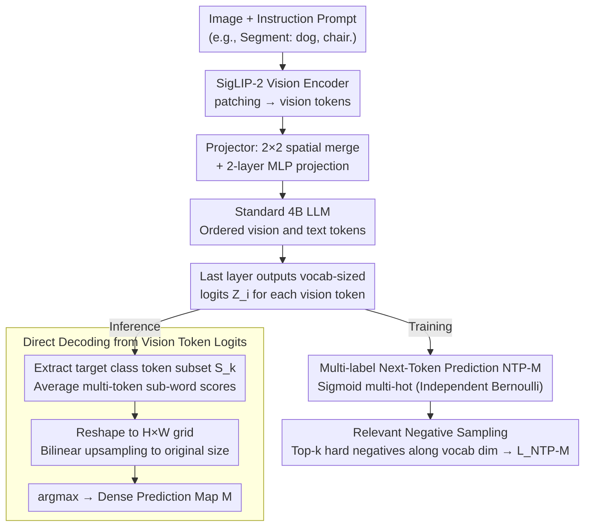

# DenseMLLM: Standard Multimodal LLMs for Dense Prediction

**Conference**: ICML 2026  
**arXiv**: [2602.14134](https://arxiv.org/abs/2602.14134)  
**Code**: https://github.com/Eli-YiLi/DenseMLLM (Available)  
**Area**: Multimodal VLM  
**Keywords**: Dense Prediction, Multimodal LLM, Vision Token Supervision, Multi-label NTP, Unified Architecture

## TL;DR
The authors integrate dense prediction tasks—such as semantic segmentation, depth estimation, and referring expression segmentation—directly into a standard 4B MLLM (ViT + Projector + LLM) without any task-specific decoders. By introducing "Multi-label Next-Token Prediction" (NTP-M) supervision for vision tokens, the model achieves 54.2 mIoU on ADE20K, 87.6 $\delta_1$ on DDAD, and 80.7 cIoU on RefCOCO val, while maintaining general VL performance comparable to Qwen3-VL-4B.

## Background & Motivation

**Background**: Current mainstream MLLMs use the "ViT + Projector + LLM" triumvirate to uniformly handle tasks like VQA, OCR, and grounding. However, when faced with dense prediction tasks requiring pixel-level outputs (semantic segmentation, depth estimation, etc.), almost all solutions attach task-specific decoders to the LLM—GLaMM/UniPixel connects to a SAM mask decoder, UFO introduces mask retrieval embeddings, and VisionLLM utilizes a Deformable-DETR head.

**Limitations of Prior Work**: These add-on designs fragment the architecture, requiring new modules for every new task, which contradicts the MLLM philosophy of "unifying all tasks with a single next-token interface." A few attempts at pure text output (e.g., DepthLM's point-wise sampling or VisionLLM's polygon coordinates) suffer from either immense inference costs or poor precision.

**Key Challenge**: The standard MLLM training objective only calculates NTP loss on text tokens; vision tokens are supervised only indirectly through global image-text alignment. Consequently, vision tokens in the final layer do not carry fine-grained pixel semantics. To perform dense prediction without adding a decoder, one must directly supervise the output probabilities of the vision tokens.

**Goal**: To enable a completely standard MLLM (no architectural changes, no extra heads, no retrieval) to directly perform argmax on vision token logits to generate pixel-level segmentation maps and depth maps.

**Key Insight**: The authors observe a fundamental difference between vision and text tokens: a single vision token corresponds to an image patch that may simultaneously contain multiple semantic labels (e.g., "dog / chair / background / depth bin 20 / depth bin 50"), whereas a text token always corresponds to a single vocabulary ID. Thus, single-label softmax NTP is inherently unsuitable for vision tokens.

**Core Idea**: Extend NTP from "single-label softmax" to "multi-label sigmoid (independent Bernoulli distributions) + relevant negative sampling." This allows standard LLM vision token logits to simultaneously handle classification and localization. During inference, pixel-level prediction is achieved via a simple argmax over the target category vocabulary.

## Method

### Overall Architecture
DenseMLLM consists of three standard components: SigLIP-2 (siglip2-so400m-patch16-naflex) as the vision encoder, a $2\times 2$ spatial-merge + two-layer MLP as the projector, and a standard 4B parameter transformer LLM. Input images are partitioned into patches and encoded as vision token sequences; prompts (e.g., "Segment: dog, chair.") are tokenized and fed into the LLM alongside the vision tokens. The final layer of the LLM outputs a vocabulary-dimensional logit vector $Z_i \in \mathbb{R}^{|V|}$ for each vision token. These logits serve two purposes: during inference, dense prediction maps are decoded directly via argmax on the target category vocabulary (skipping any mask decoder); during training, NTP-M multi-label supervision effectively compresses fine-grained pixel semantics into the vision token logits.

### Key Designs

**1. Direct Decoding from Vision Token Logits: Treating the Final Layer Visual Logits as a Classification Map**

Standard MLLMs rely on external decoders for dense prediction. The authors argue that since vision tokens processed by multiple LLM transformer layers already incorporate global context and instruction information, they are already in the semantic space; they only lack an interface to expose it. By skipping the mask decoder, for semantic segmentation, the model first uses NTP text output to identify the set of categories $\{k\}$ present in the image. It then extracts subsets of token IDs $S_k$ corresponding to these categories from each vision token's logit $Z_i \in \mathbb{R}^{|V|}$. Sub-word scores are averaged as $\hat Z_k = \frac{1}{|S_k|} \sum_{v \in S_k} Z_v$. This $\hat Z$ is reshaped back to an $H \times W$ patch grid and bilinearly upsampled to the original resolution to obtain the prediction map $M = A(I(R(\hat Z)))$. Depth estimation follows the same argmax workflow by discretizing depth ranges into 1–1000 bins (using `<custom k>` vocabulary IDs). This allows a single forward pass to generate a full-image dense depth map—achieving 87.6 $\delta_1$ on DDAD with a 4B model, whereas DepthLM requires separate inference for every sampled point.

**2. Multi-label Next-Token Prediction (NTP-M): Enabling One Vision Token to Contribute to Multiple Supervision Targets**

To supervise vision tokens directly, one must address a fundamental difference: a vision token corresponds to a patch containing multiple semantics (e.g., "dog", "chair", "depth bin 20"), whereas a text token corresponds to exactly one vocabulary ID. The mutual exclusivity of single-label softmax conflicts with the nature of vision tokens. NTP-M replaces softmax with multi-label sigmoid: it constructs multi-hot vectors $y_{i,v} \in \{0, 1\}$, where labels for object categories, depth bins, and foreground/background associated with the spatial position of the $i$-th vision token are set to 1. Joint probability is modeled as independent Bernoulli: $p(Y|X_v, X_{\text{instruct}}) = \prod_{i,v} \sigma(Z_{i,v})^{y_{i,v}}(1 - \sigma(Z_{i,v}))^{1 - y_{i,v}}$. Task prompts control which segment of the vocabulary is activated. Sigmoid allows co-existing semantics and remains fully compatible with the existing NTP framework for text tokens without adding separate loss branches.

**3. Relevant Negative Sampling: Selecting Hard Negatives Along the Vocabulary Dimension to Resolve Extreme Imbalance**

MLLM vocabularies contain hundreds of thousands of entries. For each vision token, positive samples are scarce while negatives are overwhelming, causing standard BCE to be diluted by irrelevant negatives. While traditional OHEM selects hard examples in the spatial dimension, the imbalance here occurs in the vocabulary dimension. Thus, "relevant negatives" are selected along the vocabulary dimension: for each vision token, given the positive set $P_i = \{v \mid y_{i,v} = 1\}$ and negative candidate set $C_i = \{v \mid y_{i,v} = 0\}$, the top-$k$ negatives with the highest predicted probabilities $p_{i,v} = \sigma(Z_{i,v})$ form the set $N_i^{\text{relev}}$. The final loss averages positives and negatives independently:

$$L_{\text{NTP-M}}=\sum_i\Big[-\frac{1}{|P_i|}\sum_{v\in P_i}\log p_{i,v}-\frac{1}{k}\sum_{v\in N_i^{\text{relev}}}\log(1-p_{i,v})\Big]$$

This step is the linchpin of the method. Ablations show that transitioning from pure BCE $\to$ Independent Mean $\to$ Relevant Negative Sampling improves ADE20K mIoU from 16.7 $\to$ 32.7 $\to$ 51.2, accounting for approximately 70% of the total gain.

### Loss & Training
Four-stage training pipeline: Stage I: Multimodal foundation pre-training (mixed vision and language training with vision codebook supervision); Stage II: Annealing stage, high-quality fine-tuning for dense prediction tasks mixed with VQA/OCR for generality; Stage III: Supervised Fine-Tuning (SFT) extending the context window from 16K to 32K; Stage IV: RL using a DAPO-style approach, introducing class-label IoU rewards for segmentation, removing the KL penalty, and using FP16 to ensure convergence.

## Key Experimental Results

### Main Results
DenseMLLM-4B uses a standard architecture to handle three major dense prediction tasks simultaneously, remaining competitive against methods with task-specific decoders:

| Dataset / Task | Metric | DenseMLLM-4B (Ours) | Prev. SOTA | Note |
|---|---|---|---|---|
| ADE20K Semantic Seg. | mIoU | 54.2 | VisionLLM-v2 52.3 (with Deform-DETR) | No decoder |
| Cityscapes Semantic Seg. | mIoU | 70.4 | X-Decoder 81.7 (Expert model) | General model |
| NYUv2 Depth | $\delta_1$ | 90.4 | DepthLM 86.8 (Multiple point-wise inferences) | Single inference |
| DDAD Depth | $\delta_1$ | 87.6 | DepthLM 74.7 | Single inference |
| RefCOCO val | cIoU | 80.7 | UniPixel 80.5 (with SAM) / UFO 80.0 (retrieval) | No decoder |
| RefCOCO+ val | cIoU | 76.2 | UniPixel 74.3 | No decoder |

Regarding general VL capabilities, DenseMLLM-4B is on par with or slightly outperforms Qwen3-VL-4B and InternVL-3.5-4B across 15 benchmarks including MMB, MMStar, MME, AI2D, and OCRBench (e.g., MMStar 71.1 vs 69.8, MME 2384 vs 2309), proving that adding dense prediction does not sacrifice general performance.

### Ablation Study
Ablation on ADE20K mIoU demonstrates that NTP-M and Relevant Negative Sampling provide the most significant contributions:

| Config | BCE | Indiv. Mean | Rel. Sampling | Data Scale | RL | ADE20K mIoU |
|---|---|---|---|---|---|---|
| Base (BCE) | ✓ |  |  |  |  | 16.7 |
| + Indiv. Mean | ✓ | ✓ |  |  |  | 32.7 |
| + Rel. Sampling | ✓ | ✓ | ✓ |  |  | 51.2 |
| + Data Scaling | ✓ | ✓ | ✓ | ✓ |  | 52.3 |
| + RL (Stage IV) | ✓ | ✓ | ✓ | ✓ | ✓ | 54.2 |
| + Single-dataset FT | ✓ | ✓ | ✓ | ✓ | ✓ | 55.2 |

### Key Findings
- The combination of "Independent positive/negative averaging + Relevant negative sampling" is critical: it raises the mIoU from 16.7 with pure BCE to 51.2, a jump of 34.5 points. Subsequent data scaling and RL provide marginal gains of only 1.1–1.9 points.
- A standard MLLM without task-specific decoders can outperform decoders like SAM-based UniPixel (RefCOCO val 80.7 vs 80.5) by relying on vision token logits. This indicates vision tokens contain sufficient fine-grained information; the key is providing the correct supervisory signals.
- Depth estimation requires only a single forward pass to obtain full dense depth. This is much more efficient than DepthLM's multiple point-wise inferences and results in a 12.9 $\delta_1$ point advantage on DDAD, suggesting that token-level multi-label supervision is superior to prompt-level point-wise regression.

## Highlights & Insights
- **Expanding NTP from 1D Text to 2D Vision**: The authors highlight an overlooked fact—vision tokens and text tokens differ in semantic structure, with the former being inherently multi-label. This insight led to NTP-M, allowing standard MLLMs to drop task-specific decoders for the first time. This insight is transferable to any token-grid output task, such as spatio-temporal video tokens or 3D voxel tokens.
- **Relevant Negative Sampling in Vocab Dimension**: While traditional OHEM identifies hard cases in the spatial dimension, the sparsity in MLLMs occurs in the vocabulary dimension. Selecting relevant negatives along this dimension increases training efficiency by an order of magnitude (16.7 $\to$ 51.2 mIoU). This trick is directly applicable to "large vocabulary + multi-label" scenarios.
- **Unified Training Interface**: NTP-M simply replaces softmax with sigmoid + selective averaging, allowing all LLM training frameworks to integrate it with zero modifications. The subsequent RL stage using class-label IoU as a reward also fits seamlessly with DAPO, making the pipeline highly engineering-friendly.

## Limitations & Future Work
- The paper does not fully discuss instance or panoptic segmentation—RefCOCO is single-instance; multi-instance scenarios (e.g., "segment all people") are not evaluated quantitatively. How NTP-M distinguishes between different instances of the same class remains an open question.
- Depth estimation relies on discrete bins (`<custom 0>`–`<custom 999>`), limiting resolution by the vocabulary size. Continuous regression (directly outputting metric depth) would require a new interface design.
- The 4-stage training process involving RL with FP16 and no KL penalty has high reproduction costs. There is no comprehensive comparison between pure SFT and SOTA (only a -1.9 point observation on ADE20K).
- Further ablation is needed on how to choose $k$ for relevant negative sampling and whether it should vary by task (e.g., segmentation vs. depth).

## Related Work & Insights
- **vs. GLaMM / UniPixel**: These models use SAM-based decoders for referring segmentation. This work matches or exceeds their performance on RefCOCO without any decoder, proving "add-ons" are not strictly necessary.
- **vs. UFO**: UFO uses mask retrieval embeddings as a non-decoder route but still requires an extra retrieval process. This work takes a more radical "vision token as pixel map" approach with a simpler architecture.
- **vs. DepthLM**: DepthLM requires $N$ inferences to query depth point-by-point. This method produces a full dense map in one pass and yields better results (12.9 points higher $\delta_1$ on DDAD), showing token-grid supervision is superior.
- **vs. VisionLLM**: VisionLLM outputs polygon coordinates, which are limited by coordinate precision (74.5 cIoU on RefCOCO). This work uses vision token logits for pixel-level output, offering a higher precision ceiling.

## Rating
- **Novelty**: ⭐⭐⭐⭐⭐ First to truly extend NTP to the multi-label vision token scenario with relevant negative sampling, providing a clean unified interface for dense prediction.
- **Experimental Thoroughness**: ⭐⭐⭐⭐ Covers 3 major dense tasks and 15 general VL benchmarks with clear ablations, but lacks instance/panoptic segmentation and validation on larger model scales.
- **Writing Quality**: ⭐⭐⭐⭐ Strong logical chain from observation to method. Visualizations like the PCA and histograms are intuitive, though some formulas are verbose.
- **Value**: ⭐⭐⭐⭐⭐ Provides proof-of-concept that standard MLLMs can perform dense prediction without decoders, significantly advancing the unified multimodal architecture direction.

<!-- RELATED:START -->

## Related Papers

- [\[CVPR 2026\] MeteorPred: A Meteorological Multimodal Large Model and Dataset for Severe Weather Event Prediction](../../CVPR2026/multimodal_vlm/meteorpred_a_meteorological_multimodal_large_model_and_dataset_for_severe_weathe.md)
- [\[CVPR 2026\] MVP: Multiple View Prediction Improves GUI Grounding](../../CVPR2026/multimodal_vlm/mvp_multiple_view_prediction_improves_gui_grounding.md)
- [\[ICML 2026\] Seeing is Understanding: Unlocking Causal Attention into Modality-Mutual Attention for Multimodal LLMs](seeing_is_understanding_unlocking_causal_attention_into_modality-mutual_attentio.md)
- [\[CVPR 2026\] VisualOverload: Probing Visual Understanding of VLMs in Really Dense Scenes](../../CVPR2026/multimodal_vlm/visualoverload_probing_visual_understanding_of_vlms_in_really_dense_scenes.md)
- [\[ICML 2026\] V-LynX: Token Interface Alignment for VideoX LLMs](v-lynx_token_interface_alignment_for_videox_llms.md)

<!-- RELATED:END -->
