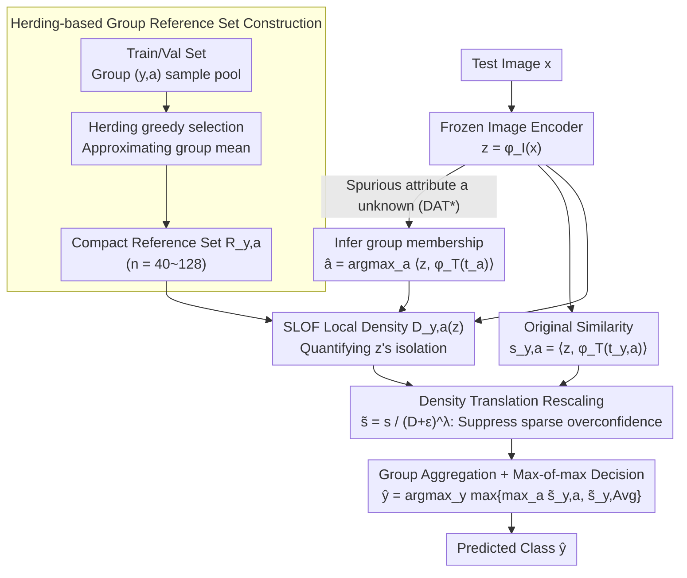

# Density-Aware Translation of Spurious Correlations in Zero-Shot VLMs

**Conference**: ICML 2026  
**arXiv**: [2606.01710](https://arxiv.org/abs/2606.01710)  
**Code**: https://github.com/AfsanehEB/DAT  
**Area**: Multimodal VLM  
**Keywords**: Zero-shot classification, Spurious correlations, CLIP anisotropy, Local density, Group robustness  

## TL;DR
The authors observe that CLIP embeddings exhibit an anisotropic ellipsoidal distribution on the hypersphere, where spurious samples cluster near the mean. They propose DAT: estimating a local density $D_{y,a}(z)$ using a reference set for each (class, spurious attribute) group, and rescaling the original cosine similarity via $\tilde s_{y,a}(x)=s_{y,a}(x)/(D_{y,a}(z)+\varepsilon)^{\lambda}$ based on whether a sample resides in the core of the group. This significantly improves worst-group accuracy without fine-tuning, text-side modifications, or test-time spurious attribute labels.

## Background & Motivation

**Background**: Zero-shot classification using VLMs like CLIP/ALIGN has become a multimodal baseline, but remains sensitive to spurious correlations (predicting based on common but semantically irrelevant contextual cues). A classic example is the Waterbirds dataset, where "waterbird + water background" is a frequent combination, leading the model to treat "water" as a criterion for "waterbird" and fail on "waterbird + land background". Existing mitigation strategies fall into three categories: (i) fine-tuning/adapters (require labels, destroy zero-shot nature), (ii) text-side prompt editing or projection (rely on domain experts or LLMs, prone to cross-modal alignment drift), and (iii) multimodal embedding adjustments (e.g., TIE shifts image embeddings along text directions but requires training data to calibrate scale).

**Limitations of Prior Work**: Existing methods either sacrifice the zero-shot property (i), rely on unstable prompt engineering/LLM inference (ii), or require dataset-specific calibration (iii). More importantly, they do not directly address the geometric roots of why CLIP is deceived by spurious correlations.

**Key Challenge**: CLIP embeddings are not isotropically distributed on the unit sphere. Works such as Levi & Gilboa (2025) show that frequent concepts converge toward the modality mean with higher conformity, while rare but semantically critical concepts are pushed to the sparse periphery. This implies that when using pure cosine similarity, a "correct class but rare" sample may score lower than an "incorrect class but common" sample—the scores themselves are contaminated by geometric bias.

**Goal**: (i) Provide a correction to similarity scoring that perceives "local geometric density" under strict zero-shot constraints (frozen encoder, no tuning, no test-time spurious labels); (ii) Provide a theoretical explanation of why this aligns with Bayes' optimal rules.

**Key Insight**: Instead of changing the model or the text, one should change the "scoring function itself." If the embedding space is ellipsoidal, similarity should be adjusted based on how "typical" a sample is within its group—preserving scores for typical samples while suppressing scores for sparse outliers.

**Core Idea**: Estimate local density using a small reference set for each group and divide the cosine similarity by $(D_{y,a}(z)+\varepsilon)^\lambda$. In the logit space, this is equivalent to subtracting $\lambda \log D$, which compensates for the quadratic terms missing from cosine similarity in the log-likelihood of a Kent anisotropic distribution.

## Method

### Overall Architecture
The DAT pipeline is built entirely on a frozen VLM: first, a compact reference set $R_{y,a}$ is constructed for each $(y,a)$ group using the training/validation set. During inference, the local density $D_{y,a}(z)$ of a test image $z=\phi_I(x)$ relative to each group's reference set is computed. The original cosine similarity is rescaled by this density and aggregated for the final prediction. When the spurious attribute $a$ is unavailable, DAT$^*$ first infers $\hat a=\arg\max_a \langle \phi_I(x), \phi_T(t_a)\rangle$ to determine group membership.

### Key Designs

**1. Herding-based Group Reference Set Construction: Selecting exemplars representing the central geometry**

To estimate how sparse a test sample is relative to its group, a local neighborhood representing the group core is required. For each $(y,a)$ group, DAT selects points from its pool $\{x_{y,a}^{(h)}\}_{h=1}^{N_{y,a}}$ using deterministic feature-space herding (Rebuffi et al., 2017). Points are greedily chosen such that the mean of the selected set continuously approaches the group mean, resulting in a compact reference set $R_{y,a}=\{z_{y,a}^{(h)}\}_{h=1}^{n}$ (sizes: Waterbirds $n=56$, CelebA $n=128$, COVID-19 $n=40$, FMoW $n=50$).

Herding is preferred over random sampling because frequent/spurious samples naturally lie near the group mean. Herding naturally captures these "common patterns," providing a benchmark for the density of common regions. The reference set is used only for non-parametric geometric estimation, preserving the zero-shot property.

**2. SLOF Local Density and Density Translation Rescaling: Suppressing overconfidence in sparse regions**

Pure cosine scoring has a blind spot: a "misaligned but common" spurious sample and a "correct but rare" sample may have similar scores. DAT quantifies the isolation of test sample $z$ using simplified LOF (SLOF, Schubert et al., 2014):

$$D_{y,a}(z)=\frac{1}{k}\sum_{z_o\in \text{NN}_k(z)} \frac{k\text{-dist}(z)}{k\text{-dist}(z_o)}$$

Larger $D$ indicates higher isolation. The original similarity is rescaled: $\tilde s_{y,a}(x)=s_{y,a}(x)/(D_{y,a}(z)+\varepsilon)^\lambda$, where $\lambda>0$ controls the correction strength ($k=10$, $k=30$ for FMoW; $\lambda=10$ for Waterbirds/COVID-19/FMoW, $\lambda=1$ for CelebA).

This works because spurious samples typically fall in the dense regions of their own group but in the sparse periphery of mismatched groups. Rescaling by $D$ significantly suppresses mismatched scores while relatively elevating scores in the correct direction.

**3. Group Aggregation + Alignment with Kent Distribution: Theoretical justification**

To integrate group scores into class predictions, DAT defines a class-marginal $\tilde s_{y,\text{Avg}}(x)=\frac{1}{M+1}(\sum_a \tilde s_{y,a}(x)+s_y(x))$ and uses a max-of-max decision $\hat y=\arg\max_y \max\{\max_a \tilde s_{y,a}(x), \tilde s_{y,\text{Avg}}(x)\}$.

Theoretically, the Kent (Fisher-Bingham) distribution models group density with log-density:

$$\log p(z)=\kappa\gamma_1^\top z + \beta[(\gamma_2^\top z)^2-(\gamma_3^\top z)^2]-\log c_d(\kappa,\beta)$$

Cosine similarity only corresponds to the linear axial term $\kappa\gamma_1^\top z$ and ignores the quadratic anisotropy $\beta[\cdot]$. By treating $-\log D$ as a proxy for log-density (Assumption 3.2), the DAT margin $m_{y,a}(z)=\tau w_{y,a}^\top z + \alpha\lambda \log p_{y,a}(z)+r_{y,a}(z)$ aligns the $\arg\max$ with Bayes' optimal ranking under equal priors.

### Loss & Training
The method is entirely zero-shot, with no training steps or VLM parameter modifications. The only "parameters" are the reference set size $n$, neighborhood size $k$, and scaling factor $\lambda$, which are set once per dataset.

## Key Experimental Results

### Main Results
Evaluated on four spurious correlation benchmarks (Waterbirds, CelebA, COVID-19, FMoW) across multiple VLMs. Metrics: Worst-group accuracy (WG), Average accuracy (Avg), and Gap = Avg − WG.

| Backbone | Method | WG↑ | Avg↑ | Gap↓ |
|----------|------|-----|------|------|
| ViT-B/32 | Zero-shot (ZS) | 41.37 | 68.48 | 27.11 |
| ViT-B/32 | Orth-Cali | 54.99 | 69.19 | 14.20 |
| ViT-B/32 | TIE | 71.35 | 79.82 | 8.47 |
| ViT-B/32 | **DAT** | **75.08** | **80.36** | **5.28** |
| ViT-L/14 | ZS | 31.93 | 83.72 | 51.79 |
| ViT-L/14 | TIE | 78.82 | 84.12 | 5.30 |
| ViT-L/14 | **DAT** | **83.33** | **89.57** | **6.42** |
| ResNet-50 | ZS | 35.36 | 80.64 | 45.28 |
| ResNet-50 | TIE | 52.96 | 83.62 | 30.66 |
| ResNet-50 | **DAT** | **75.08** | 83.83 | **8.75** |

On CelebA with ViT-L/14, DAT achieves WG=84.94 (vs TIE 84.60). On ResNet-50, DAT reaches WG=80.79, exceeding TIE by 5.47.

### Ablation Study
Ablations focus on DAT* vs DAT, the scaling factor $\lambda$, neighborhood $k$, and reference set source.

| Configuration | Key Observation | Interpretation |
|------|---------|------|
| DAT* (No spurious labels) | WG=79.75 on Waterbirds ViT-L/14 | Predicted group membership via $\hat{a}$ is effective |
| Small $\lambda$ (≈0) | Degenerates to ZS | Density correction is essential |
| Large $\lambda$ | Over-suppresses sparse classes | $\lambda$ controls bias-variance trade-off |
| Various estimators (SLOF/LOF/kNN) | SLOF is most stable | Defaulted to SLOF for simplicity and robustness |

### Key Findings
- DAT consistently improves worst-group accuracy across all datasets and backbones, most notably on ResNet-50, which has flatter embeddings (WG +39.72 vs ZS on Waterbirds).
- Unlike many debiasing methods that sacrifice Avg for WG, DAT often improves both via geometric rescaling.
- DAT is more efficient than TIE; it requires no training data for scale calibration and works with 50–128 reference samples.

## Highlights & Insights
- **Diagnosis-Correction Loop**: The authors visualize geometric mismatch using Tangent-space Mahalanobis Distance and apply a symmetric correction signal via SLOF.
- **Upgrading Cosine to Log-likelihood Proxy**: $\tilde s = s/D^\lambda$ compensates for missing anisotropic terms in the Kent model, providing a template for geometry-aware corrections in any anisotropic embedding space.
- **Strict Zero-Shot Constraint**: No requirement for test-time labels, LLMs, or parameter updates, making it deployment-friendly.

## Limitations & Future Work
- Requires a representative reference set for each group; herding may fail if a specific group is extremely scarce (long-tail scenarios).
- $\lambda$ and $k$ remain dataset-level hyperparameters with no "zero-prior" automatic setting strategy yet.
- Theoretical guarantees depend on the Kent distribution assumption; large-scale validation of this assumption across general VLM embeddings is limited.

## Related Work & Insights
- **vs TIE / TIE\* (Lu et al., 2025)**: TIE shifts embeddings along text directions; DAT modifies only the scoring function. DAT outperforms TIE on most backbones, especially ResNet-50.
- **vs Orth-Cali / Ideal Words / Perception CLIP**: These methods use text-side projections or prompt expansions; DAT is orthogonal as it performs image-side geometric correction.
- **vs ROBOSHOT**: ROBOSHOT relies on LLMs to extract spurious directions; DAT is more stable as it avoids LLM dependency.

## Rating
- Novelty: ⭐⭐⭐⭐ Correcting cosine scoring with local density is elegant and theoretically grounded.
- Experimental Thoroughness: ⭐⭐⭐⭐ 4 datasets × 6 VLM variants covering diverse domains.
- Writing Quality: ⭐⭐⭐⭐ Clear progression from motivation to theory and experiments.
- Value: ⭐⭐⭐⭐ Practical, zero-shot, and easy to apply to any frozen VLM.

<!-- RELATED:START -->

## Related Papers

- [\[ICLR 2026\] Label-Free Mitigation of Spurious Correlations in VLMs using Sparse Autoencoders](../../ICLR2026/multimodal_vlm/label-free_mitigation_of_spurious_correlations_in_vlms_using_sparse_autoencoders.md)
- [\[ICLR 2026\] CARPRT: Class-Aware Zero-Shot Prompt Reweighting for Vision-Language Model](../../ICLR2026/multimodal_vlm/carprt_class-aware_zero-shot_prompt_reweighting_for_vision-language_model.md)
- [\[ICML 2025\] The Devil Is in the Details: Tackling Unimodal Spurious Correlations for Generalizable Multimodal Reward Models](../../ICML2025/multimodal_vlm/the_devil_is_in_the_details_tackling_unimodal_spurious_correlations_for_generali.md)
- [\[CVPR 2026\] Explaining CLIP Zero-shot Predictions Through Concepts](../../CVPR2026/multimodal_vlm/explaining_clip_zero-shot_predictions_through_concepts.md)
- [\[ICML 2026\] Deep Pre-Alignment for VLMs](deep_pre-alignment_for_vlms.md)

<!-- RELATED:END -->
