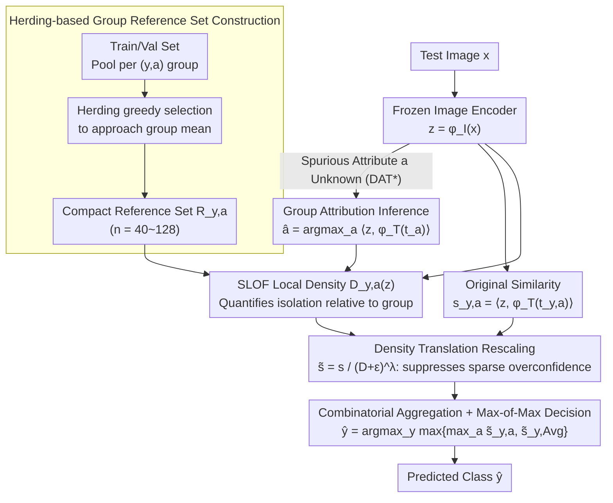

# Density-Aware Translation of Spurious Correlations in Zero-Shot VLMs

**Conference**: ICML 2026  
**arXiv**: [2606.01710](https://arxiv.org/abs/2606.01710)  
**Code**: https://github.com/AfsanehEB/DAT  
**Area**: Multimodal VLM  
**Keywords**: Zero-shot classification, spurious correlations, CLIP anisotropy, local density, group robustness  

## TL;DR
The authors observe that CLIP embeddings exhibit an anisotropic ellipsoidal distribution on the hypersphere, where spurious samples cluster near the mean. They propose DAT: using a reference set for each (class, spurious attribute) group to estimate a local density $D_{y,a}(z)$, then rescaling the original cosine similarity as $\tilde s_{y,a}(x)=s_{y,a}(x)/(D_{y,a}(z)+\varepsilon)^{\lambda}$ based on whether a sample resides in the core of that group. This significantly improves worst-group accuracy without fine-tuning, text-side modifications, or requiring spurious attribute labels at test time.

## Background & Motivation

**Background**: Zero-shot classification using VLMs like CLIP/ALIGN has become a multimodal baseline, but these models are highly sensitive to spurious correlations (relying on common but irrelevant contextual cues). A classic example is the Waterbirds dataset, where "waterbird + water background" is a frequent combination, causing the model to use "water" as a predictor for "waterbird" and fail on "waterbird + land background." Existing mitigation strategies fall into three categories: (i) fine-tuning/adapters (requires labels, breaks zero-shot nature), (ii) text-side prompt editing or projection (depends on domain experts or LLMs, prone to cross-modal alignment drift), and (iii) multimodal embedding adjustments (e.g., TIE shifts image embeddings along the text direction but requires training data to calibrate the scale).

**Limitations of Prior Work**: Existing methods either sacrifice the zero-shot property (i), rely on unstable prompt engineering/LLM inference (ii), or require dataset-specific calibration (iii). More importantly, none directly address the geometric root of why CLIP is deceived by spurious correlations.

**Key Challenge**: CLIP embeddings are not isotropically distributed on the unit sphere. Works like Levi & Gilboa (2025) show that frequent concepts converge toward the modality mean with higher conformity, while rare but semantically crucial concepts are pushed to the sparse periphery. This means when using pure cosine similarity, a sample that is "correctly classed but rare" may score lower than one that is "incorrectly classed but common"—the scores themselves are contaminated by geometric bias.

**Goal**: (i) Under the strict constraint of zero-shot (frozen encoder, no parameter tuning, no spurious labels at test time), introduce an adjustment to similarity scores that is aware of "local geometric density"; (ii) provide a theoretical explanation of how this aligns with the Bayes optimal rule.

**Key Insight**: Instead of modifying the model or the text, modify the "scoring function itself." If the embedding space is ellipsoidal, similarity should be adjusted based on how "typical" a sample is within its group—typical samples retain their scores, while scores of sparse outliers are suppressed.

**Core Idea**: Use a small reference set for each group to estimate local density and divide each group’s cosine similarity by $(D_{y,a}(z)+\varepsilon)^\lambda$. In the logit space, this is equivalent to subtracting $\lambda \log D$, which supplements the quadratic terms missing from the cosine similarity in the log-likelihood of a Kent anisotropic distribution.

## Method

### Overall Architecture
The DAT pipeline is built entirely on frozen VLMs: first, a compact reference set $R_{y,a}$ is constructed for each $(y,a)$ group using the training/validation set; during inference, for a test image $z=\phi_I(x)$, its local density $D_{y,a}(z)$ relative to each group’s reference set is computed. The original cosine similarity is rescaled by this density and aggregated for final prediction. When the spurious attribute $a$ is unavailable, DAT$^*$ infers it via $\hat a=\arg\max_a \langle \phi_I(x), \phi_T(t_a)\rangle$.

### Key Designs

**1. Herding-based group reference set construction: Selecting exemplars representing the central geometry**

To estimate how sparse a test sample is relative to its group, a local neighborhood representing the group core is needed. For each $(y,a)$ group, DAT uses deterministic feature-space herding (Rebuffi et al., 2017) to greedily select points from the pool $\{x_{y,a}^{(h)}\}_{h=1}^{N_{y,a}}$ such that the mean of the selected set approaches the group mean. This results in compact reference sets $R_{y,a}=\{z_{y,a}^{(h)}\}_{h=1}^{n}$ (e.g., $n=56$ for Waterbirds, $n=128$ for CelebA). Herding is preferred over random sampling because frequent/spurious samples naturally cluster near the group mean; thus, herding captures "common patterns," providing a baseline for density estimation while maintaining zero-shot integrity.

**2. SLOF local density and Density Translation rescaling: Suppressing overconfidence in sparse regions**

Pure cosine scoring has a blind spot: a spurious sample that matches the wrong text but is "common" may score higher than a "rare" sample with the correct text. DAT quantifies isolation using simplified LOF (SLOF, Schubert et al., 2014):

$$D_{y,a}(z)=\frac{1}{k}\sum_{z_o\in \text{NN}_k(z)} \frac{k\text{-dist}(z)}{k\text{-dist}(z_o)}$$

Larger $D$ indicates greater isolation. The original similarity is rescaled: $\tilde s_{y,a}(x)=s_{y,a}(x)/(D_{y,a}(z)+\varepsilon)^\lambda$, where $\lambda>0$ controls the correction strength. Since spurious samples typically fall in the dense region of their own group but the sparse periphery of mismatched groups, dividing by $D$ significantly lowers scores in mismatched directions.

**3. Combinatorial aggregation + Theoretical alignment under Kent distribution**

When integrating group scores, DAT defines a class-marginal $\tilde s_{y,\text{Avg}}(x)=\frac{1}{M+1}(\sum_a \tilde s_{y,a}(x)+s_y(x))$ and uses a max-of-max decision: $\hat y=\arg\max_y \max\{\max_a \tilde s_{y,a}(x), \tilde s_{y,\text{Avg}}(x)\}$. 

Theoretically, modeling group density using the Kent (Fisher-Bingham) distribution shows its log-density is:

$$\log p(z)=\kappa\gamma_1^\top z + \beta[(\gamma_2^\top z)^2-(\gamma_3^\top z)^2]-\log c_d(\kappa,\beta)$$

Cosine similarity only corresponds to the linear axial term $\kappa\gamma_1^\top z$, ignoring the quadratic anisotropy term $\beta[\cdot]$. By treating $-\log D$ as a proxy for log-density (Assumption 3.2), DAT's margin $m_{y,a}(z)$ approximates the Bayes optimal ranking under ellipsoidal embeddings.

### Loss & Training
The entire process is zero-shot, with no training steps or modification of VLM parameters. The only "parameters" are reference set size $n$, neighborhood size $k$, and scaling $\lambda$, which are set once per dataset.

## Key Experimental Results

### Main Results
Evaluation on four benchmarks (Waterbirds, CelebA, COVID-19, FMoW) across multiple VLMs (CLIP ViT-B/32, ViT-L/14, ResNet-50, etc.). Metrics: Worst-group accuracy (WG), Average accuracy (Avg), and Gap (Avg − WG).

| Backbone | Method | WG↑ | Avg↑ | Gap↓ |
|----------|------|-----|------|------|
| ViT-B/32 | Zero-shot (ZS) | 41.37 | 68.48 | 27.11 |
| ViT-B/32 | Orth-Cali | 54.99 | 69.19 | 14.20 |
| ViT-B/32 | TIE | 71.35 | 79.82 | 8.47 |
| ViT-B/32 | **DAT** | **75.08** | **80.36** | **5.28** |
| ViT-L/14 | ZS | 31.93 | 83.72 | 51.79 |
| ViT-L/14 | TIE | 78.82 | 84.12 | 5.30 |
| ViT-L/14 | **DAT** | **83.33** | **89.57** | **6.42** |
| ResNet-50 | ZS | 35.36 | 80.64 | 45.28 |
| ResNet-50 | TIE | 52.96 | 83.62 | 30.66 |
| ResNet-50 | **DAT** | **75.08** | 83.83 | **8.75** |

### Ablation Study
- **DAT* (No spurious labels)**: On Waterbirds (ViT-L/14), WG=79.75, still outperforming TIE using inferred group attribution.
- **$\lambda$ Sensitivity**: $\lambda \approx 0$ degrades to ZS; excessive $\lambda$ over-suppresses sparse classes.
- **Reference Set Source**: Using the validation set for CelebA yielded better results than the training set due to lower distribution skew.

### Key Findings
- DAT provides stable WG gains across all datasets and backbones, most notably on ResNet-50 where embeddings are "flatter" (WG +39.72 over ZS on Waterbirds).
- Unlike many debiasing methods that sacrifice Avg for WG, DAT often improves both via geometric rescaling.
- DAT is more efficient than TIE, requiring no training data to calibrate scales and only 50–128 samples for the reference set.

## Highlights & Insights
- **Diagnostic $\to$ Correction Loop**: The method identifies "geometric mismatch caused by spurious correlations" via Tangent-space Mahalanobis Distance and provides a symmetric correction signal via SLOF.
- **Upgrading Cosine to Log-likelihood Proxy**: $\tilde s = s/D^\lambda$ effectively compensates for the missing anisotropic terms in cosine similarity, providing a template for any anisotropic embedding space.
- **Strict Zero-Shot Constraint**: No test-time spurious labels, no LLMs, and no parameter updates make it ideal for deployment (e.g., API-based models).

## Limitations & Future Work
- DAT requires representative reference sets; herding may fail if specific groups are extremely scarce (e.g., long-tail data).
- Hyperparameters $\lambda$ and $k$ currently require dataset-level tuning; an automated "zero-prior" setting strategy is missing.
- Theoretical guarantees rely on Kent distribution assumptions which may not hold globally across all VLM embedding distributions.

## Related Work & Insights
- **vs TIE / TIE\* (Lu et al., 2025)**: While TIE shifts embeddings, DAT modifies the scoring function and provides a Bayes alignment explanation. DAT significantly outperforms TIE on ResNet-50 backbones.
- **vs Text-side Methods (Orth-Cali, Perception CLIP)**: These rely on linguistic priors; DAT is orthogonal and focuses on image-side geometric correction.
- **vs ROBOSHOT**: ROBOSHOT relies on LLMs to extract spurious directions; DAT is more stable as it avoids LLM inference quality dependencies.

## Rating
- Novelty: ⭐⭐⭐⭐ Rescaling cosine scores using local density with Kent distribution alignment is a distinct contribution.
- Experimental Thoroughness: ⭐⭐⭐⭐ Tested across 4 datasets and 6 VLM variants.
- Writing Quality: ⭐⭐⭐⭐ Clear progression from geometric motivation to theory and experiments.
- Value: ⭐⭐⭐⭐ Practical, zero-shot, and training-free approach for frozen VLMs.

<!-- RELATED:START -->

## Related Papers

- [\[ICML 2025\] The Devil Is in the Details: Tackling Unimodal Spurious Correlations for Generalizable Multimodal Reward Models](../../ICML2025/multimodal_vlm/the_devil_is_in_the_details_tackling_unimodal_spurious_correlations_for_generali.md)
- [\[CVPR 2025\] Locality-Aware Zero-Shot Human-Object Interaction Detection](../../CVPR2025/multimodal_vlm/locality-aware_zero-shot_human-object_interaction_detection.md)
- [\[CVPR 2026\] SOTA: Self-adaptive Optimal Transport for Zero-Shot Classification with Multiple Foundation Models](../../CVPR2026/multimodal_vlm/sota_self-adaptive_optimal_transport_for_zero-shot_classification_with_multiple_.md)
- [\[AAAI 2026\] Plug-and-Play Clarifier: A Zero-Shot Multimodal Framework for Egocentric Intent Disambiguation](../../AAAI2026/multimodal_vlm/plug-and-play_clarifier_a_zero-shot_multimodal_framework_for_egocentric_intent_d.md)
- [\[CVPR 2026\] FlowComposer: Composable Flows for Compositional Zero-Shot Learning](../../CVPR2026/multimodal_vlm/flowcomposer_composable_flows_for_compositional_zeroshot_learning.md)

<!-- RELATED:END -->
