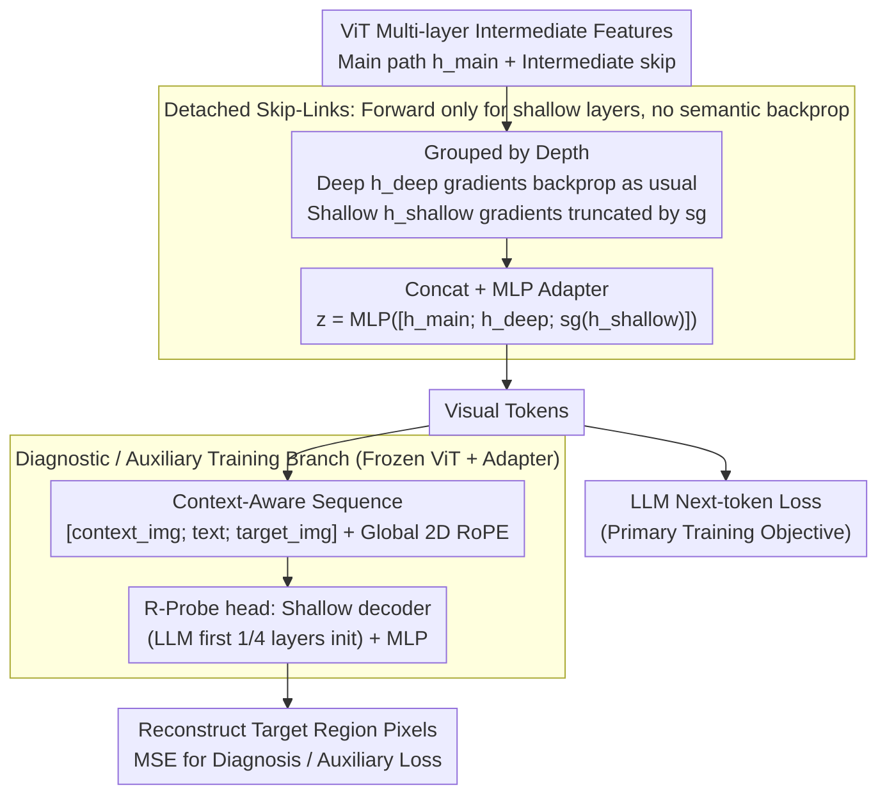

# Detached Skip-Links and $R$-Probe: Decoupling Feature Aggregation from Gradient Propagation for MLLM OCR

**Conference**: ICML 2026  
**arXiv**: [2603.20020](https://arxiv.org/abs/2603.20020)  
**Code**: None  
**Area**: Multimodal VLM  
**Keywords**: MLLM OCR, Multi-layer Feature Fusion, Stop-gradient, Reconstruction Probe, Training Stability  

## TL;DR
Addressing OCR scenarios in MLLMs, the authors apply stop-gradient (Detached Skip-Links) to shallow skip branches within a multi-layer ViT→LLM fusion architecture. Simultaneously, they propose $R$-Probe, a reconstruction probe initialized with the "first 1/4 layers of the LLM," to diagnose whether visual tokens effectively deliver fine-grained information to the language model.

## Background & Motivation

**Background**: Current MLLMs demonstrate strong performance in high-level semantic dialogues but significantly lag in "low-level perception" tasks such as OCR, dense text recognition, and small object grounding. Existing works typically view ViT (especially those trained via CLIP-style contrastive learning) as a bottleneck and propose two paths: adding auxiliary supervision like reconstruction loss (Fini et al., Tschannen et al.) or utilizing multi-layer fusion to feed shallow features containing geometric/pixel information into the LLM (DenseConnector, DeepStack, ML, etc.).

**Limitations of Prior Work**: While multi-layer fusion is intuitive for the "forward" pass—shallow features indeed contain stroke-level details essential for OCR—the authors find that naive fusion poses risks in the "backward" pass. Semantic gradients from the LLM next-token loss propagate directly to shallow ViT blocks via skip branches, disrupting attention maps originally encoding low-level structures. This leads to training instability, slow convergence, and destruction of pre-trained spatial priors.

**Key Challenge**: Shallow features are valuable during "forward propagation" (compensating for local details lost in deeper layers), but their optimization direction conflicts with the deep LLM's semantic goals during "backward propagation." Forcing shallow layers to update according to semantic loss is equivalent to using the wrong optimizer for layers originally specialized in low-level patterns.

**Goal**: (i) Eliminate gradient interference while retaining the benefits of multi-layer fusion; (ii) Provide a diagnostic tool to directly determine "whether visual tokens actually deliver details to the LLM," rather than relying solely on downstream benchmarks.

**Key Insight**: Treat "feature aggregation" and "gradient propagation" as decouplable processes—the former proceeds via concatenation in the forward pass, while the latter is controlled independently through stop-gradient.

**Core Idea**: Sever the gradients of shallow skip branches using $\text{sg}(\cdot)$ (stop-gradient), allowing shallow layers to contribute forward features without receiving backpropagation. Additionally, use a lightweight decoder initialized from the first few layers of the LLM to reconstruct image pixels as a diagnostic signal for "information arrival at the LLM."

## Method

### Overall Architecture
The overall architecture follows a standard ViT→Adapter→LLM multimodal structure, with two primary modifications at the ViT end: (1) Applying stop-gradient to the "shallow skip group" before multi-layer features enter the adapter; (2) Attaching a Transformer decoder + MLP initialized with the first 1/4 layers of the LLM during diagnostic/optional auxiliary training phases to reconstruct pixels from visual tokens. Training consists of two stages: adapter pre-training (freezing ViT and LLM) → FFT/SFT (full model fine-tuning).

### Key Designs

**1. Detached Skip-Links: Shallow layers contribute forward features without receiving semantic backprop**

Multi-layer fusion is correct for the forward pass—shallow features carry stroke-level details needed for OCR. However, in the backward pass, semantic gradients from the LLM next-token loss propagate to shallow ViT blocks via skip branches, scattering attention maps that encode low-level structures. This results in unstable training and destroyed spatial priors. The author's solution decouples "feature aggregation" from "gradient propagation." After selecting intermediate blocks, they are grouped by depth into $\mathbf{h}_{\text{shallow}}$ (e.g., blocks 6, 12) and $\mathbf{h}_{\text{deep}}$ (e.g., blocks 18, 23). The adapter input is formulated as $\mathbf{z}=\text{MLP}([\mathbf{h}_{\text{main}};\mathbf{h}_{\text{deep}};\text{sg}(\mathbf{h}_{\text{shallow}})])$. Shallow layers are concatenated normally in the forward pass but truncated by $\text{sg}(\cdot)$ in the backward pass. Theoretically, the second moment of the full estimator gradient is $\mathbb{E}[\|\mathbf{g}_{\text{full}}\|^2]=\|\mathbf{m}+\mathbf{s}\|^2+\text{tr}(\Sigma_m+\Sigma_s+\Sigma_{ms}+\Sigma_{ms}^\top)$. They prove that in early training, the skip path is variance-dominated ($\text{tr}(\Sigma_s)\ge c\cdot\text{tr}(\Sigma_m)$, $c\gg 1$) and nearly orthogonal to the main path ($\cos(\mathbf{g}^{\text{main}},\mathbf{g}^{\text{skip}})\approx 0$) with weak mean contribution. Thus, removing skip gradients improves the effective Signal-to-Noise Ratio (SNR) $\eta(\mathbf{g})=\|\mathbb{E}[\mathbf{g}]\|^2/\mathbb{E}[\|\mathbf{g}\|^2]$. Visualizing the [CLS] attention of the 4th block confirms that full gradient backprop scatters structured attention, while detachment preserves pre-trained spatial consistency. This mechanism introduces no learnable parameters.

**2. $R$-Probe: Reconstruction probe initialized with LLM layers to measure "visual token delivery"**

Traditional benchmarks conflate "visual encoding failure" with "linguistic reasoning failure." $R$-Probe freezes the ViT and adapter, attaching a shallow Transformer decoder + MLP to reconstruct pixels from visual tokens. Crucially, this decoder is initialized with the weights of the first 1/4 layers of the target LLM (e.g., LLaMA-3.1-8B), limiting capacity while ensuring its "way of seeing the world" aligns with the LLM. Successful reconstruction implies that visual tokens both contain information and reside within a subspace easily consumed by the LLM. It checks pixel-level recoverability rather than abstract separability (as in linear probes), effectively sharing inductive biases between the "evaluator" and the "consumer." Experiments show sensitivity to feature quality (the detached configuration reaches MSE < 0.75 in 1689 steps vs 2158), and reconstruction error ranking aligns with downstream OCR rankings, serving as an efficient diagnostic tool without requiring full SFT.

**3. Context-Aware Reconstruction Sequences: Simulating real OCR reasoning**

Pure unconditional reconstruction is equivalent to training an autoencoder, which obscures the question of whether visual information is usable by the LLM. The authors switch to conditional reconstruction—reconstructing a specific text-containing crop within a larger image based on a prompt. Images are tiled into $448\times 448$ regions, and $14\times 14$ ViT patches are compressed into visual tokens via $2\times 2$ pooling. The input sequence is $\mathcal{S}=[\mathbf{E}_{\text{context\_img}},\mathbf{E}_{\text{text}},\mathbf{E}_{\text{target\_img}}]$ with global 2D RoPE to preserve spatial relationships. This probe can also be used as an auxiliary loss for the full model to inject "visual faithfulness" constraints. Forcing the probe to utilize both text prompts and contextual pixels aligns it with the OCR process of "viewing context → decoding target." Ablations show that adding text descriptions reduces reconstruction MSE from 1.980 to 1.103, proving the probe captures cross-modal alignment rather than just image statistics.

### Loss & Training
Two-stage training: adapter pre-training (5M multimodal samples, freezing ViT+LLM) → FFT+SFT (2M task samples, full model fine-tuning). The backbone defaults to LLaMA-3.1-8B + 300M–400M ViT. Detached Skip-Links only involve adding $\text{sg}(\cdot)$ during concatenation with no additional parameters. $R$-Probe adds a shallow decoder only when used as an auxiliary loss.

## Key Experimental Results

### Main Results
22 benchmarks are grouped into STEM, General, Alignment, and OCR. The table compares category averages against three representative multi-layer fusion methods using the same Perception Encoder initialization, data, and settings.

| Setting | STEM | General | Align. | OCR | Overall |
|:---|:---:|:---:|:---:|:---:|:---:|
| PE baseline (No multi-layer fusion) | 63.0 | 53.2 | 72.6 | 65.2 | 61.1 |
| DenseConnector (DC) | 63.2 | 54.0 | 72.5 | 66.7 | 62.0 |
| DC + detach | 64.2 | 54.4 | 72.8 | 67.6 | 62.6 |
| ML | 63.5 | 54.1 | 72.6 | 66.9 | 62.1 |
| ML + detach | 63.1 | 54.0 | 73.2 | 68.1 | 62.5 |
| DeepStack | 63.8 | 54.5 | 73.2 | 67.6 | 62.6 |
| **Ours (PE-best)** | **64.1** | **54.6** | **73.6** | **68.3** | **63.0** |

Consistent improvements are observed across four ViT backbones (Perception Encoder, InternViT-300M, AimV2-L, SigLip2-So400M), with OCR gains typically ranging from $+1.8$ to $+3.1$.

### Ablation Study
Two core hyperparameters: sampling stride $S$ (density of intermediate layers) and detached depth $D$ (number of layers detached from the bottom).

| Configuration | Phenomenon | Interpretation |
|:---|:---|:---|
| Small stride ($S=3,4$) | Significantly better than sparse fusion ($S=12$) | Multi-layer fusion is effective; higher density is better. |
| Detaching shallowest layers | Robust improvements across all $S$ | Shallow layers are the primary source of semantic gradient "poisoning." |
| Detaching deeper layers | Results become unstable; degradation occurs | Deep layers naturally align with LLM goals and should not be detached. |
| $R$-Probe as auxiliary loss | Significant OCR boost; slight drop in reasoning | OCR data bias introduces distribution shift. |

### Key Findings
- On InternViT-300M, OCR increased by $+1.9$ and Alignment by $+7.4$ (Overall $+2.5$), indicating the method benefits ViTs with weaker initial alignment the most.
- During early training (first ~1.3k steps), the skip branch gradient variance $\text{tr}(\Sigma_s)$ is significantly larger than the main branch, and $\cos(\mathbf{g}^{\text{main}},\mathbf{g}^{\text{skip}})$ is near zero—empirically validating the SNR theory.
- The reconstruction step ranking of $R$-Probe aligns with downstream OCR rankings, serving as an efficient proxy for visual representation quality.

## Highlights & Insights
- **Explicit Decoupling of Forward Features and Backward Gradients**: While $\text{sg}(\cdot)$ is a known trick, its application in MLLM multi-layer fusion is provided with clear SNR theoretical grounding and empirical validation. This is transferable to any architecture combining shallow and deep layers (e.g., video temporal fusion).
- **LLM-based Probe Decoder**: By sharing inductive biases between the "evaluator" and the "consumer," this approach avoids metrics from independent autoencoders that may decouple from actual LLM performance. This logic could extend to audio or video LLM representation evaluation.
- **Near-Zero Cost**: The core modification is a simple `.detach()`, making it a drop-in improvement for MLLM training pipelines. It is orthogonal to architectural designs like DenseConnector or DeepStack.

## Limitations & Future Work
- Theoretical results (Proposition 4.3) only cover "early training stages," lacking formal guarantees for detachment in late-stage convergence where shallow layers might need minor semantic gradients for long-range adaptation.
- $R$-Probe as an auxiliary loss biases the model toward OCR-style data, slightly decreasing STEM/General scores. The paper acknowledges this as a data distribution issue but lacks a side-effect-free scheduling strategy.
- Experiments focused on LLaMA-3.1-8B and document-centric data; transferability to larger LLMs or non-document scenarios (e.g., video OCR, scene text in the wild) requires further verification.

## Related Work & Insights
- **vs. DenseConnector / DeepStack / ML**: These focus on architectural "where and how to fuse." Detachment is an orthogonal training-side improvement that enhances these architectures.
- **vs. Perception Tokens / Morph-Tokens / SeTok**: These work by introducing new tokens or reconstruction targets which require structural changes. $R$-Probe is a lightweight diagnostic tool that does not modify the core model.
- **vs. H-detach (Arpit et al., 2018)**: Shares the philosophy of selectively cutting gradients to stabilize training. This work generalizes the idea from LSTMs to ViT-LLM cross-modal fusion with an SNR-based theoretical framework.

## Rating
- Novelty: ⭐⭐⭐⭐ Stop-gradient is not new, but its application in MLLM multi-layer fusion combined with SNR analysis and pixel reconstruction diagnosis is a novel combination.
- Experimental Thoroughness: ⭐⭐⭐⭐ 22 benchmarks, 4 ViT backbones, 5M+2M scale data; a complete chain of evidence.
- Writing Quality: ⭐⭐⭐⭐ Clear five-part structure: Motivation—Theory—Diagnosis—Ablation—Comparison; standardized formulas.
- Value: ⭐⭐⭐⭐ Minimal engineering cost, orthogonal to existing methods, and provides a standalone diagnostic tool.

<!-- RELATED:START -->

<!-- RELATED:END -->

## Related Papers

- [\[ACL 2025\] Improving MLLM's Document Image Machine Translation via Synchronously Self-reviewing Its OCR Proficiency](../../ACL2025/multimodal_vlm/improving_mllms_document_image_machine_translation_via_synchronously_self-review.md)
- [\[ICML 2026\] RESTORE: 通过矫正失真改进视觉 Token 缩减以提升 MLLM 推理效率](improving_visual_token_reduction_via_rectifying_distortions_for_efficient_multim.md)
- [\[CVPR 2025\] Multimodal OCR: Parse Anything from Documents](../../CVPR2025/multimodal_vlm/multimodal_ocr_parse_anything_from_documents.md)
- [\[ICLR 2026\] KeepLoRA: Continual Learning with Residual Gradient Adaptation](../../ICLR2026/multimodal_vlm/keeplora_continual_learning_with_residual_gradient_adaptation.md)
- [\[ACL 2026\] TeXOCR: Advancing Document OCR Models for Compilable Page-to-LaTeX Reconstruction](../../ACL2026/multimodal_vlm/texocr_advancing_document_ocr_models_for_compilable_page-to-latex_reconstruction.md)

<!-- RELATED:END -->
