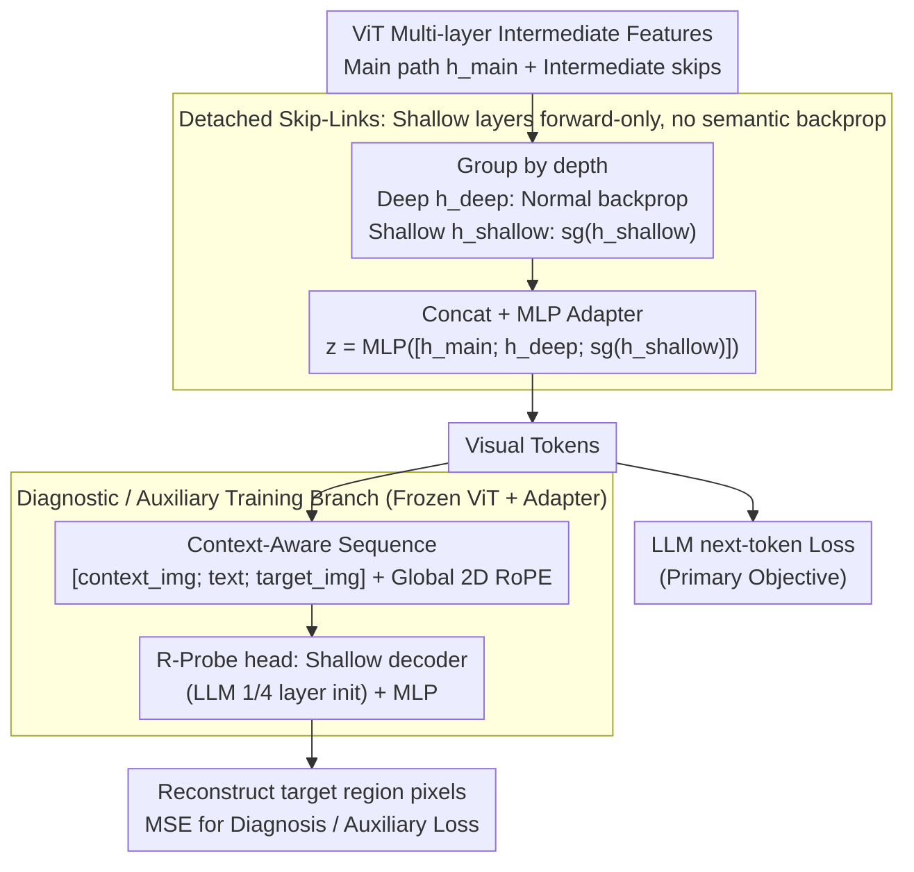

# Detached Skip-Links and $R$-Probe: Decoupling Feature Aggregation from Gradient Propagation for MLLM OCR

**Conference**: ICML 2026  
**arXiv**: [2603.20020](https://arxiv.org/abs/2603.20020)  
**Code**: None  
**Area**: Multimodal VLM  
**Keywords**: MLLM OCR, Multi-layer feature fusion, Stop-gradient, Reconstruction probe, Training stability  

## TL;DR
Addressing OCR scenarios in MLLMs, the authors introduce stop-gradient operations (Detached Skip-Links) to shallow skip branches within multi-layer ViT→LLM fusion architectures. They also propose $R$-Probe, a reconstruction diagnostic tool initialized with the first 1/4 layers of the LLM itself, to verify whether visual tokens effectively deliver fine-grained information to the language model.

## Background & Motivation

**Background**: Current MLLMs excel at high-level semantic dialogue but perform poorly on "low-level perception" tasks like OCR, dense text recognition, and small object grounding. Existing works typically treat ViT (especially CLIP-style contrastive-trained ones) as a bottleneck and suggest two paths: adding auxiliary supervision like reconstruction loss (Fini et al., Tschannen et al.) or adopting multi-layer fusion to feed shallow features containing geometric/pixel information into the LLM (DenseConnector, DeepStack, ML, etc.).

**Limitations of Prior Work**: While multi-layer fusion is theoretically sound for "forward" propagation—shallow features contain stroke-level details—the authors find that naive fusion presents risks in "backward" propagation. Semantic gradients from the LLM's next-token loss travel directly through skip branches to shallow ViT blocks, scattering attention maps that originally encoded low-level structures. This results in training instability, slow convergence, and destruction of pre-trained spatial priors.

**Key Challenge**: Shallow features are valuable during "forward propagation" (compensating for lost local details in deep layers), but their optimization direction in "backward propagation" conflicts with the deep LLM's semantic goals. Forcing shallow layers to update according to semantic loss essentially uses the wrong optimizer for layers specialized in low-level patterns.

**Goal**: (i) Eliminate gradient interference while retaining the benefits of multi-layer fusion; (ii) Provide a diagnostic tool to determine if "visual tokens actually deliver details to the LLM," rather than relying solely on downstream benchmarks.

**Key Insight**: Treat "feature aggregation" and "gradient propagation" as decoupleable processes—the former handled by concatenation in the forward pass, the latter controlled separately via stop-gradient.

**Core Idea**: Use $\text{sg}(\cdot)$ (stop-gradient) to cut gradients of shallow skip branches, allowing them to contribute forward features without receiving backward updates. Additionally, use a lightweight decoder initialized by the LLM's initial layers to reconstruct image pixels as a diagnostic signal for "information arrival at the LLM."

## Method

### Overall Architecture
The framework follows a standard ViT→Adapter→LLM multimodal structure with two modifications on the ViT side: (1) Applying stop-gradient to "shallow skip groups" before multi-layer features enter the adapter; (2) Attaching a Transformer decoder + MLP initialized with the first 1/4 layers of the LLM to reconstruct pixels from post-adapter visual tokens during diagnostic or auxiliary training phases. Training consists of two stages: adapter pre-training (freezing ViT and LLM) → FFT/SFT (full-model fine-tuning).

### Key Designs

**1. Detached Skip-Links: Forward-only contribution for shallow features**

While shallow features provide stroke-level details for OCR in the forward pass, LLM semantic gradients can disrupt shallow ViT attention maps. The authors decouple these by splitting selected intermediate blocks into $\mathbf{h}_{\text{shallow}}$ (e.g., blocks 6, 12) and $\mathbf{h}_{\text{deep}}$ (e.g., blocks 18, 23). The adapter input is defined as $\mathbf{z}=\text{MLP}([\mathbf{h}_{\text{main}};\mathbf{h}_{\text{deep}};\text{sg}(\mathbf{h}_{\text{shallow}})])$. Theoretically, analyzing the gradient second moment $\mathbb{E}[\|\mathbf{g}_{\text{full}}\|^2]$ proves that in early training, skip paths are variance-dominated ($\text{tr}(\Sigma_s)\ge c\cdot\text{tr}(\Sigma_m)$) and nearly orthogonal to the main path ($\cos(\mathbf{g}^{\text{main}},\mathbf{g}^{\text{skip}})\approx 0$). Cutting skip gradients increases the effective Signal-to-Noise Ratio $\eta(\mathbf{g})=\|\mathbb{E}[\mathbf{g}]\|^2/\mathbb{E}[\|\mathbf{g}\|^2]$. Visualizing [CLS] attention in block 4 confirms that detaching preserves pre-trained spatial consistency.

**2. $R$-Probe: Diagnosing information delivery via LLM-initialized probes**

Traditional benchmarks conflate "vision encoding failure" with "language reasoning failure." $R$-Probe freezes the ViT and adapter, using a shallow Transformer decoder + MLP to reconstruct pixels from visual tokens. Crucially, this decoder is initialized with the first 1/4 of the target LLM (e.g., LLaMA-3.1-8B) weights. This ensures the probe's "view of the world" matches the LLM's. Success in reconstruction indicates that visual tokens contain sufficient information and reside in a subspace easily consumable by the LLM. It assesses pixel-level recoverability rather than abstract linear separability, ensuring the evaluator and consumer share the same inductive bias.

**3. Context-Aware Reconstruction Sequence: Simulating OCR reasoning**

Standard unconditional reconstruction acts as a simple autoencoder. The authors propose conditional reconstruction—reconstructing a specific text-containing region given a large image and a prompt. Images are tiled into $448\times 448$ patches, and ViT patches are compressed into visual tokens via $2\times 2$ pooling. The sequence $\mathcal{S}=[\mathbf{E}_{\text{context\_img}},\mathbf{E}_{\text{text}},\mathbf{E}_{\text{target\_img}}]$ uses global 2D RoPE to maintain spatial relationships. This probe can target auxiliary losses to inject "visual faithfulness" constraints. Modality ablation shows text prompts reduce reconstruction MSE from 1.980 to 1.103, proving the probe captures cross-modal alignment.

### Loss & Training
Two-stage training: adapter pre-training (5M multimodal samples, frozen ViT+LLM) → FFT+SFT (2M task samples, full-model fine-tuning). Default backbones: LLaMA-3.1-8B + 300M–400M ViT. Detached Skip-Links introduce no extra parameters or hyperparameters; $R$-Probe adds only a shallow decoder when used as an auxiliary loss.

## Key Experimental Results

### Main Results
Evaluation across 22 benchmarks categorized into four groups (STEM, General, Alignment, OCR). The table compares the method against three representative multi-layer fusion methods using the same setup.

| Setup | STEM | General | Align. | OCR | Overall |
|------|------|---------|--------|-----|---------|
| PE baseline (No fusion) | 63.0 | 53.2 | 72.6 | 65.2 | 61.1 |
| DenseConnector (DC) | 63.2 | 54.0 | 72.5 | 66.7 | 62.0 |
| DC + detach | 64.2 | 54.4 | 72.8 | 67.6 | 62.6 |
| ML | 63.5 | 54.1 | 72.6 | 66.9 | 62.1 |
| ML + detach | 63.1 | 54.0 | 73.2 | 68.1 | 62.5 |
| DeepStack | 63.8 | 54.5 | 73.2 | 67.6 | 62.6 |
| **Ours (PE-best)** | **64.1** | **54.6** | **73.6** | **68.3** | **63.0** |

Consistent improvements were observed across four ViT backbones (Perception Encoder, InternViT-300M, AimV2-L, SigLip2-So400M), with OCR gains typically between +1.8 and +3.1.

### Ablation Study
Two core hyperparameters: sampling stride $S$ (density of intermediate layers) and detached layer count $D$ (from shallowest upwards).

| Configuration | Observation | Insight |
|------|------|------|
| Small stride ($S=3,4$) | Significantly outperforms sparse fusion ($S=12$) | Multi-layer fusion works; higher density is better. |
| Detach shallowest layers | Robust improvements across all $S$ | Shallow layers are the primary source of gradient noise. |
| Detach deep layers | Instability and degradation | Deep layers are already aligned with LLM targets. |
| $R$-Probe as auxiliary loss | Significant OCR boost, slight drop in reasoning | OCR data bias introduces distribution shift. |

### Key Findings
- On InternViT-300M, OCR increased by +1.9 and Alignment by +7.4 (+2.5 overall), suggesting maximum benefit for ViTs with weaker initial alignment.
- During early training (approx. first 1.3k steps), skip gradient variance $\text{tr}(\Sigma_s)$ is significantly larger than the main branch, justifies the detachment strategy.
- $R$-Probe reconstruction error ranking aligns with downstream OCR scores, serving as a "cheap" diagnostic tool for visual representation quality.

## Highlights & Insights
- **Decoupling Forward Features and Backward Gradients**: While $\text{sg}(\cdot)$ is a known trick, its application in MLLM multi-layer fusion is justified here through SNR theory and empirical verification. This is transferable to other architectures (e.g., video temporal fusion).
- **LLM-based Probe Decoder**: Sharing the inductive bias between the "evaluator" and the "consumer" (LLM) prevents decoupling between reconstruction metrics and actual LLM performance.
- **Zero-Cost Integration**: The core modification is a simple `.detach()`, making it a drop-in improvement for existing pipelines and orthogonal to architecture-focused methods like DenseConnector or DeepStack.

## Limitations & Future Work
- Theoretical results (Proposition 4.3) only cover "early training stages," leaving the long-term convergence behavior of detachment unproven; shallow layers might eventually benefit from minor semantic signals.
- $R$-Probe as an auxiliary loss biases the model toward OCR-style data, causing slight drops in STEM/General benchmarks.
- Evaluation was limited to LLaMA-3.1-8B and document-centric data; scalability to larger LLMs or non-document scenes (wild scene text) needs further verification.

## Related Work & Insights
- **vs DenseConnector / DeepStack / ML**: These focus on architectural design ("where and how to fuse"). Detachment is an orthogonal, training-side improvement.
- **vs Perception Tokens / SeTok**: These works introduce new tokens or reconstruction targets that require model structural changes; $R$-Probe is a lightweight external diagnostic.
- **vs H-detach (Arpit et al., 2018)**: Shares the philosophy of selective gradient cutting for stability; this work extends the concept from LSTMs to ViT-LLM cross-modal fusion with SNR-based theoretical backing.

## Rating
- Novelty: ⭐⭐⭐⭐ Stop-gradient is common, but its application in MLLM fusion paired with SNR analysis and LLM-probes is a novel combination.
- Experimental Thoroughness: ⭐⭐⭐⭐ Comprehensive evidence across 22 benchmarks and various ViT backbones.
- Writing Quality: ⭐⭐⭐⭐ Clear structure following motivation—theory—diagnosis—ablation.
- Value: ⭐⭐⭐⭐ Low engineering cost, orthogonal to existing methods, and provides useful diagnostic tools.

<!-- RELATED:START -->

## Related Papers

- [\[ACL 2025\] Improving MLLM's Document Image Machine Translation via Synchronously Self-reviewing Its OCR Proficiency](../../ACL2025/multimodal_vlm/improving_mllms_document_image_machine_translation_via_synchronously_self-review.md)
- [\[ICML 2026\] RESTORE: 通过矫正失真改进视觉 Token 缩减以提升 MLLM 推理效率](improving_visual_token_reduction_via_rectifying_distortions_for_efficient_multim.md)
- [\[ICML 2026\] From Seeing to Thinking: Decoupling Perception and Reasoning Improves Post-Training of Vision-Language Models](from_seeing_to_thinking_decoupling_perception_and_reasoning_improves_post-traini.md)
- [\[CVPR 2026\] Reading or Reasoning? Format Decoupled Reinforcement Learning for Document OCR](../../CVPR2026/multimodal_vlm/reading_or_reasoning_format_decoupled_reinforcement_learning_for_document_ocr.md)
- [\[CVPR 2025\] Multimodal OCR: Parse Anything from Documents](../../CVPR2025/multimodal_vlm/multimodal_ocr_parse_anything_from_documents.md)

<!-- RELATED:END -->
