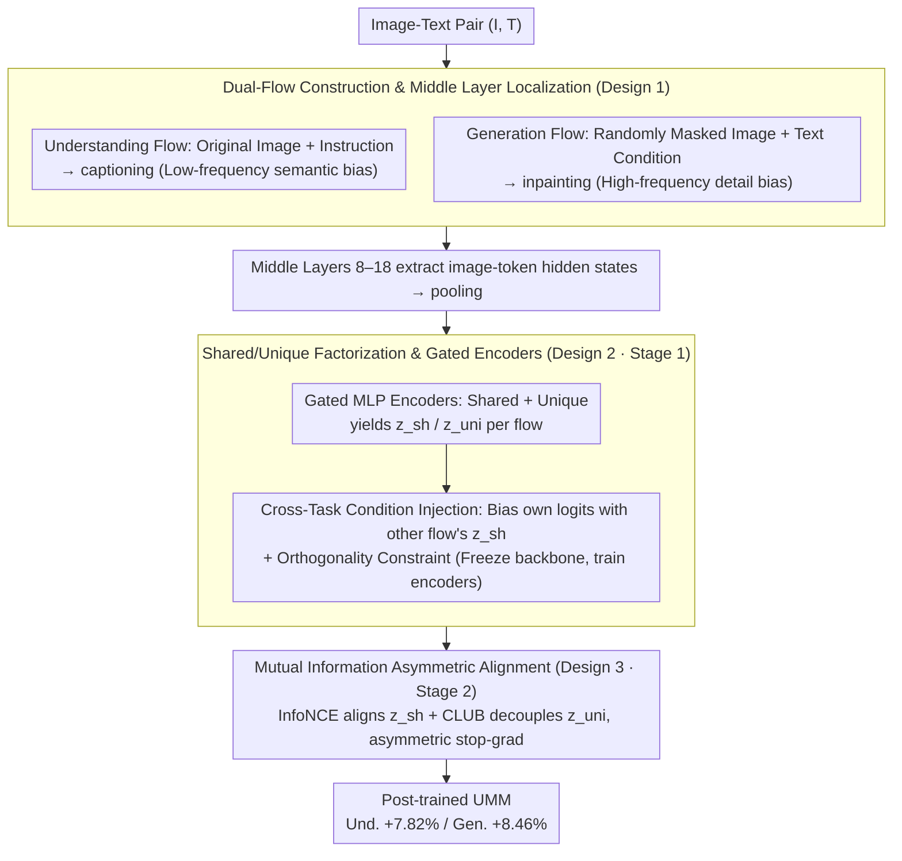

# DIVA: Harnessing the Representation Divergence in Unified Multimodal Models for Mutual Reinforcement

**Conference**: ICML 2026  
**arXiv**: [2605.25328](https://arxiv.org/abs/2605.25328)  
**Code**: https://github.com/Jayyy-H/DIVA  
**Area**: Multimodal VLM / Unified Multimodal Models / Representation Learning  
**Keywords**: Unified Multimodal Models, Representation Divergence, Mutual Information, Shared/Unique Factorization, Post-training

## TL;DR
DIVA discovers that Unified Multimodal Models (UMMs) spontaneously decouple "understanding" and "generation" information flows in middle layers. Consequently, it explicitly factorizes representations into shared and unique components using Contrastive/CLUB mutual information constraints to achieve "shared alignment + unique decoupling." Without changing the architecture, it simultaneously improves understanding by +7.82% and generation by +8.46% on Show-o/Liquid/Nexus-Gen.

## Background & Motivation

**Background**: Unified Multimodal Models (UMM, e.g., Janus-Pro, Show-o, Liquid, Nexus-Gen) utilize a single transformer to simultaneously handle both "image understanding" and "image generation" tasks. While this appears efficient, most reports admit that the two objectives often conflict. To mitigate this, mainstream patches involve "separation"—using separate visual encoders (e.g., BLIP3-o), separate transformer backbones (Bagel using MoT), or even hybrid AR + Diffusion approaches.

**Limitations of Prior Work**: All "separation" routes betray the core promise of UMMs—that only a shared backbone can facilitate true beneficial transfer between understanding and generation. Once the encoder or backbone is decoupled, the system becomes two serial models, closing the channel for mutual assistance. Conversely, maintaining a shared backbone creates tension between the inductive biases of the two tasks: understanding requires semantic invariance, low frequencies, and discarding details; generation requires high fidelity, high frequencies, and preserving details.

**Key Challenge**: The inductive biases of the two objectives are mathematically non-equivalent. Forcing them into the same set of parameters leads to "compromised representations"—neither semantically abstract enough nor pixel-precise enough. Through a triple analysis of gradients, geometry, and spectrum, the authors reveal an overlooked fact: UMM middle layers **spontaneously** push the two information flows into different subspaces (gradient conflict is strongest in shallow and deep layers but weakest in the middle; effective rank surges in the middle; the understanding flow has a low-frequency bias while the generation flow preserves high frequencies), yet deep layers realign due to the same physical anchor.

**Goal**: To transform this spontaneous "middle-layer divergence, deep-layer convergence" phenomenon from an unconscious byproduct into an explicitly controllable factorized structure, thereby converting conflict into mutual gain.

**Key Insight**: Since the middle layers are already naturally branched while the deep layers share semantic anchors, it is better to explicitly define two components—a shared component for cross-task transfer and a unique component for task-specific biases—and use mutual information tools to directly align the shared and decouple the unique.

**Core Idea**: Factorize visual representations into "Shared + Unique" components, maximize the lower bound of mutual information for the shared components of the two flows, and minimize the upper bound (CLUB) for the unique components, turning conflict into controllable bidirectional gain.

## Method

### Overall Architecture
DIVA is a post-training framework that does not modify the backbone architecture. The procedure involves: (1) Constructing two information flows for the same image-text pair $(I, T)$—the understanding flow uses a captioning instruction with the original image, while the generation flow uses random masking + text conditioning for inpainting; (2) Extracting and pooling image-token hidden states from middle layers $\mathcal{I}_{mid}=\{l \mid l_{start}\leq l \leq l_{end}\}$, passing them through shared encoders ($E_{sh}^i$) and unique encoders ($E_{uni}^i$) to obtain shared/unique components; (3) Two-stage post-training: Stage 1 freezes the backbone to train the encoders (cross-task condition injection + orthogonality constraints), and Stage 2 freezes the encoders while unfreezing the backbone, using asymmetric InfoNCE to align the shared components and CLUB to decouple the unique components.

### Key Designs

**1. Dual-Flow Construction & Middle Layer Localization: Creating Biased Flows from a Shared Anchor**

To decompose "Shared vs. Unique," one must first have two flows that share a physical anchor but possess significantly different inductive biases. DIVA starts with the same image-text pair $(I, T)$ and constructs two flows: the understanding flow takes the original image and a template prompt $t_{prompt}$ (e.g., "Please describe this image in detail"), driven by a captioning loss $\mathcal{L}_{\text{Und}} = \mathcal{L}(f_\theta(\text{concat}(t_{question}, h_v)), t_{answer})$, which naturally induces a low-frequency semantic flow. The generation flow takes a corrupted image $I_{mask} = I \odot (1-M)$ with a mask ratio $r \in [0.2, 0.6]$ and the original text $T$ as the condition, driven by an inpainting loss $\mathcal{L}_{\text{Gen}}$, inducing a high-frequency detail flow. Both flows pool image-token hidden states $h_i^{(\ell)} = \text{Pool}(H_i^{img,\ell}) \in \mathbb{R}^d$ for each layer $\ell$.

The middle layer range (set to 8–18 in the paper) is localized based on the observed peak in effective-rank—where gradient conflict is weakest and rank surges, indicating where the two flows spontaneously diverge. Shared anchors ensure the "shared factor" is meaningful, while bias differences ensure a decomposable structure exists.

**2. Shared/Unique Factorization & Gated Encoders: Explicitly Splitting Representations**

With dual flows, DIVA explicitly splits the representation of each layer into a shared component $z_{sh}^{\ell,i}$ and a unique component $z_{uni}^{\ell,i}$, corresponding to the mutual information decomposition $I(X_1, X_2; Y) = \Pi_{sh} + \Pi_{uni}^i + \Pi_{uni}^j + \epsilon_{noise}$. Each flow $i \in \{U, G\}$ is equipped with two 3-layer Gated MLPs, modulated by element-wise soft gates $g_{(\cdot)}^{(i)}(\ell) = \sigma(W_{(\cdot)}^i h_i^{(\ell)})$: $z_{sh}^{\ell,i} = g_{sh}^{(i)}(\ell) \odot \phi_{sh}(h_i^{(\ell)})$ and $z_{uni}^{\ell,i} = g_{uni}^{(i)}(\ell) \odot \phi_{uni}(h_i^{(\ell)})$.

Stage 1 freezes the backbone and injects the factorized outputs as logit biases **across tasks**—the logit for the understanding flow uses the shared component of the generation flow: $\tilde{s}_U = s_U + A_U z_{sh}^{\ell,G} + B_U z_{uni}^{\ell,U}$ and $\tilde{s}_G = s_G + A_G z_{sh}^{\ell,U} + B_G z_{uni}^{\ell,G}$, training the encoders with native task losses. This cross-task conditioning is essential: it forces the components learned by the shared encoder to be "useful for the other flow"; otherwise, logit injection would fail to reduce loss, preventing the shared factor from degrading into task-specific information. Additionally, an orthogonality constraint $\mathcal{L}_\perp = \sum_i \|(\mathbf{z}_{sh}^i)^\top \mathbf{z}_{uni}^i\|_F^2$ prevents the unique encoder from redundantly encoding shared semantics.

**3. Mutual Information Driven Asymmetric Alignment (Stage 2): Turning Conflict into Mutual Gain**

Stage 2 unfreezes the backbone, using mutual information tools to align shared components and decouple unique ones. For shared components, InfoNCE maximizes the lower bound $I_{sha}(X_i^s; X_j^s) = \mathbb{E}[\log \frac{\exp f(x_i, x_j^+)}{\sum_k \exp f(x_i, x_j^-)}]$ to bring shared information together. For unique components, CLUB minimizes the upper bound $I_{uni}(X_i^u; X_j^u)$ to force unique information apart, preventing the shared space from absorbing task-private information or the unique space from redundant encoding.

Given the scale disparity between understanding and generation losses, stop-gradient is used for asymmetric alignment: $\mathcal{L}_{U \to G} = -\log \frac{\exp(\text{sim}(z_{sh}^U, \text{sg}[z_{sh}^G])/\tau)}{\sum_j \exp(\text{sim}(z_{sh}^U, \text{sg}[z_{sh}^{G,j}])/\tau)}$, plus the symmetric $\mathcal{L}_{G \to U}$. This prevents a sudden loss spike in one task from distorting the representation of the other. The total loss combines five terms: $\mathcal{L}_{total} = \mathcal{L}_{U \to G} + \mathcal{L}_{G \to U} + \mathcal{L}_{uni} + \mathcal{L}_{Und} + \mathcal{L}_{Gen}$.

### Loss & Training
Two-stage post-training: Stage 1 uses native task loss + $\mathcal{L}_\perp$ to train shared/unique encoders (backbone frozen, warming up shared-only before adding unique residual). Stage 2 unfreezes the backbone for joint optimization with the five terms of $\mathcal{L}_{total}$. Training data consists of 200K image-text pairs (60K each from CapsFusion-120M and Infinity-MM, 70K each from JourneyDB and MidjourneyV6, with captions refined by Qwen2.5-VL-32B). Targeted backbones include Show-o (1.5B), Nexus-Gen (7B), and Liquid (7B).

## Key Experimental Results

### Main Results
Post-training was performed on three representative UMMs, compared across 8 understanding/generation benchmarks:

| Backbone | Setting | MMMU | POPE | MMVet | GenEval | DPG-Bench | WISE |
|------|------|------|------|-------|---------|-----------|------|
| Show-o (1.5B) | Base | 26.3 | 73.1 | 32.5 | 0.57 | 69.81 | 0.29 |
| Show-o (1.5B) | +DIVA | **32.4 (+6.1)** | **79.1 (+6.0)** | **33.8** | **0.64 (+0.07)** | **76.03 (+6.22)** | **0.34** |
| Nexus-Gen (7B) | Base | 43.5 | 83.6 | 45.2 | 0.77 | 81.30 | 0.39 |
| Nexus-Gen (7B) | +DIVA | **49.4 (+5.9)** | **87.4 (+3.8)** | **46.6** | **0.83 (+0.06)** | **87.87 (+6.57)** | **0.45** |
| Liquid (7B) | Base | 30.2 | 77.4 | 36.9 | 0.70 | 80.63 | 0.41 |
| Liquid (7B) | +DIVA | **34.0 (+3.8)** | **84.5 (+7.1)** | **37.8** | **0.81 (+0.11)** | **83.47 (+2.84)** | **0.44** |

Understanding improved by an average of +7.82%, and generation by +8.46%. All three backbones showed **consistent gains**—credible evidence of "mutual reinforcement."

### Ablation Study

| Configuration | MMMU | POPE | GenEval | DPG-Bench |
|------|------|------|---------|-----------|
| Base | 26.3 | 73.1 | 0.69 | 69.81 |
| Base + Standard SFT | 26.8 | 74.5 | 0.67 | 70.75 |
| Base + DIVA | **32.4** | **79.1** | **0.75** | **76.03** |
| DIVA w/o $I_{uni}$ (No CLUB) | 28.3 | 75.8 | 0.70 | 71.58 |
| DIVA w/o sg[·] | 31.7 | 78.2 | 0.73 | 74.92 |
| Mid-Layer (9–17) | 31.5 | 78.4 | 0.72 | 73.36 |
| Mid-Layer (8–18) | **32.4** | **79.1** | **0.75** | **76.03** |
| Linear+LN encoder | 29.4 | 75.9 | 0.71 | 72.37 |

### Key Findings
- Simple SFT on the same 200K data showed negligible gains or even drops (GenEval 0.69 → 0.67), proving DIVA's success is due to structured factorization, not just data volume.
- Removing the CLUB term ($I_{uni}$) caused the largest drop (MMMU -4.1), indicating that "strictly decoupling unique components" is more critical than "aligning shared components"—the former prevents interference, while the latter accelerates transfer.
- Results are sensitive but not fragile regarding the middle-layer range: 8–18 is optimal, 7–19 is nearly identical, and 9–17 drops by 1 point, validating the effective-rank geometric observation.
- Gated MLP encoders outperform Linear+LN by 3 points (MMMU 32.4 vs 29.4), highlighting the importance of soft-gate feature filtering.

## Highlights & Insights
- The reinterpretation of "UMM mutual interference" as "spontaneous middle-layer decoupling that isn't explicitly utilized" is the paper's most valuable insight. The empirical evidence via gradient conflict and effective-rank peaks is compelling.
- Shared/unique factorization combined with InfoNCE/CLUB is a "textbook" approach to mutual information decomposition, but applying it to multimodal post-training with asymmetric stop-gradient to handle task scale heterogeneity is a noteworthy engineering feat.
- Cross-task conditioning (biasing one's own logits with the other flow's shared factor) is the key to Stage 1, ensuring the shared factor has "cross-task utility."
- This paradigm is directly transferable to other scenarios where tasks compete for the same backbone, such as video understanding + generation, 3D reconstruction + rendering, or ASR + TTS.

## Limitations & Future Work
- The 200K post-training dataset is relatively small for UMMs; stability of the shared/unique structure at 1M+ scales remains unverified.
- The middle layer range (8–18) was set manually for an 18-layer backbone; a systematic method for deeper models (e.g., 32-layer Llama-style) is missing.
- All three backbones are AR-based; effectiveness on AR + Diffusion hybrids (BLIP3-o) or MoT (Bagel) was not explored.
- CLUB upper bound estimation has high variance in high dimensions; although the paper uses asymmetric stop-gradient, a convergence analysis is absent.

## Related Work & Insights
- **vs. Bagel / BLIP3-o (Architecture Separation)**: These models isolate tasks using MoT or independent visual encoders. DIVA conversely proves that "representation decomposition within a shared backbone" is sufficient to match or exceed separation schemes (Show-o +DIVA 1.5B reaches 80% of Janus-Pro 7B's GenEval score) with much higher parameter efficiency.
- **vs. Show-o / Liquid / Nexus-Gen baselines**: DIVA is a plug-in post-training method that leaves architecture intact. Gains across three backbones prove it addresses a **universal** structural issue in UMMs rather than a specific model bug.
- **vs. General MoE / LoRA branching**: MoE diverts flows at the token level, whereas DIVA diverts at the representation level via encoders. The former modifies architecture and increases inference costs, while the latter only adds lightweight MLPs in middle layers, which can even be discarded after fine-tuning the backbone.

## Rating
- Novelty: ⭐⭐⭐⭐⭐ The empirical validation of "UMM middle-layer spontaneous decoupling" + the prescription of "explicit factorization for shared alignment and unique decoupling" is a first for the unified multimodal field.
- Experimental Thoroughness: ⭐⭐⭐⭐ Solid cross-comparison of 3 backbones across 8 benchmarks; ablation covers 5 dimensions, though scaling law and hybrid architecture validation are missing.
- Writing Quality: ⭐⭐⭐⭐ Clear logical chain from observation to method. Formulas are generally precise, though some dimensions are not explicitly defined.
- Value: ⭐⭐⭐⭐⭐ Provides the first demonstrably effective lightweight scheme for UMM post-training, highly valuable for industrial UMM deployment.

<!-- RELATED:START -->

## Related Papers

- [\[ICML 2026\] Seeing is Understanding: Unlocking Causal Attention into Modality-Mutual Attention for Multimodal LLMs](seeing_is_understanding_unlocking_causal_attention_into_modality-mutual_attentio.md)
- [\[ICML 2026\] Breaking Dual Bottlenecks: Evolving Unified Multimodal Models into Self-Adaptive Interleaved Visual Reasoners](breaking_dual_bottlenecks_evolving_unified_multimodal_models_into_self-adaptive_.md)
- [\[CVPR 2026\] TUNA: Taming Unified Visual Representations for Native Unified Multimodal Models](../../CVPR2026/multimodal_vlm/tuna_taming_unified_visual_representations_for_native_unified_multimodal_models.md)
- [\[ICML 2026\] Calibrated Multimodal Representation Learning with Missing Modalities](calibrated_multimodal_representation_learning_with_missing_modalities.md)
- [\[NeurIPS 2025\] Unified Reinforcement and Imitation Learning for Vision-Language Models](../../NeurIPS2025/multimodal_vlm/unified_reinforcement_and_imitation_learning_for_vision-language_models.md)

<!-- RELATED:END -->
