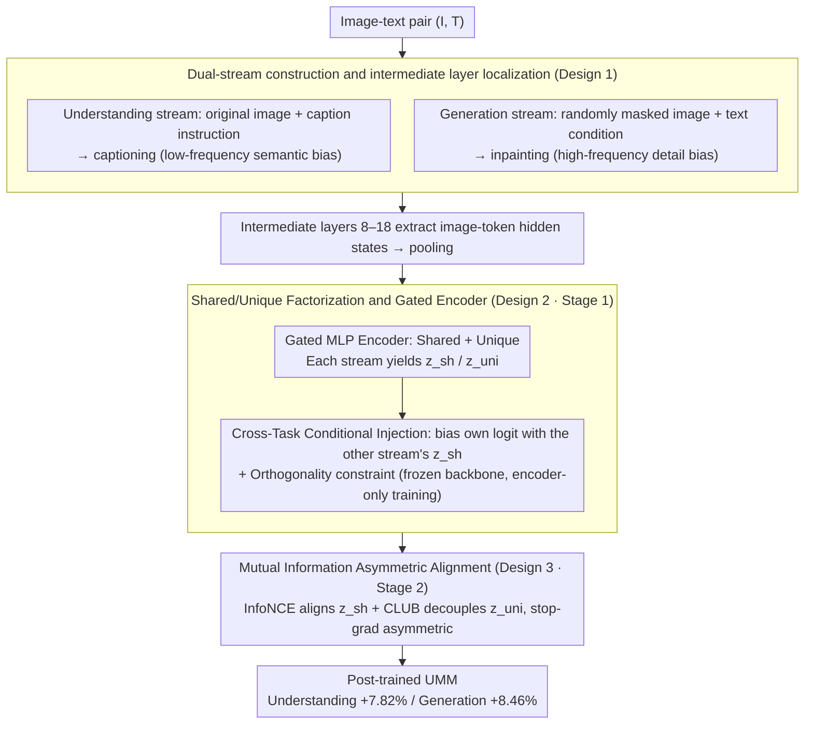

# DIVA: Harnessing the Representation Divergence in Unified Multimodal Models for Mutual Reinforcement

**Conference**: ICML 2026  
**arXiv**: [2605.25328](https://arxiv.org/abs/2605.25328)  
**Code**: https://github.com/Jayyy-H/DIVA  
**Area**: Multimodal VLM / Unified Multimodal Models / Representation Learning  
**Keywords**: Unified Multimodal Models, Representation Divergence, Mutual Information, Shared/Unique Decomposition, Post-training

## TL;DR
DIVA discovers that Unified Multimodal Models (UMM) spontaneously decouple "understanding" and "generation" information flows within intermediate layers. By explicitly factorizing representations into shared and unique components and applying contrastive/CLUB mutual information constraints for "shared alignment + unique decoupling," it simultaneously improves understanding by +7.82% and generation by +8.46% on Show-o/Liquid/Nexus-Gen without architectural modifications.

## Background & Motivation

**Background**: Unified Multimodal Models (UMM, e.g., Janus-Pro, Show-o, Liquid, Nexus-Gen) utilize a single transformer to handle both "image understanding" and "image generation" tasks. While theoretically efficient, most existing reports acknowledge that these two objectives often interfere with each other. To mitigate this conflict, mainstream solutions involve "separation"—using distinct visual encoders (e.g., BLIP3-o), separate transformer backbones (e.g., Bagel via MoT), or AR + Diffusion hybrids.

**Limitations of Prior Work**: All "separation" approaches abandon the core promise of UMM—that a shared backbone should enable genuine beneficial transfer between understanding and generation. Once encoders or backbones are decoupled, the system becomes two serial models, closing the channel for mutual assistance. However, maintaining a shared backbone creates tension between inductive biases: understanding requires semantic invariance, low frequency, and discarded details, whereas generation requires fidelity, high frequency, and preserved details.

**Key Challenge**: The inductive biases of the two objectives are mathematically inequivalent. Forcing them into the same set of parameters leads to "compromised representations"—neither semantically abstract nor pixel-precise. Through gradient, geometric, and spectral analysis, the authors identified an overlooked fact: UMM intermediate layers **spontaneously** push the two information flows into different subspaces (gradient conflict is strongest in shallow/deep layers and weakest in the middle; effective rank surges in intermediate layers; understanding flow has a low-frequency bias, while generation preserves high frequency), yet they re-align in deep layers due to the same physical anchor.

**Goal**: To transform this spontaneous "intermediate divergence, deep convergence" phenomenon from an unconscious byproduct into an explicitly controllable factorized structure, thereby converting conflict into mutual reinforcement.

**Key Insight**: Since intermediate layers naturally diverge while deep layers converge at semantic anchors, it is better to explicitly define two components—a shared component for cross-task transfer and a unique component for task-specific biases—and use mutual information tools to align the shared and decouple the unique.

**Core Idea**: Factorize visual representations into "shared + unique" components, maximizing the lower bound of mutual information for the shared components and minimizing the upper bound (CLUB) for the unique components to turn conflict into controllable bidirectional gain.

## Method

### Overall Architecture
DIVA is a post-training framework that does not modify the backbone architecture. The process involves: (1) constructing two information flows from the same image-text pair $(I, T)$—an understanding flow using a captioning instruction with the original image, and a generation flow using random masking + text conditioning for inpainting; (2) extracting image-token hidden states from intermediate layers $\mathcal{I}_{mid}=\{l \mid l_{start}\leq l \leq l_{end}\}$ which are pooled and passed through shared ($E_{sh}^i$) and unique ($E_{uni}^i$) encoders; (3) two-stage post-training: Stage 1 freezes the backbone to train encoders (cross-task conditioning + orthogonality constraints), and Stage 2 freezes encoders while unfreezing the backbone, using asymmetric InfoNCE to align shared components and CLUB to decouple unique components.

### Key Designs

**1. Dual Flow Construction and Intermediate layer Positioning: Creating Biased Flows from a Single Anchor**

To decompose "shared vs. unique" factors, one must first have two flows sharing physical anchors but possessing distinct inductive biases. DIVA starts from the same image-text pair $(I, T)$ to create: an understanding flow using the original image and a prompt template $t_{prompt}$ (e.g., "Please describe this image in detail") driven by a captioning loss $\mathcal{L}_{\text{Und}} = \mathcal{L}(f_\theta(\text{concat}(t_{question}, h_v)), t_{answer})$, yielding a low-frequency semantic flow; and a generation flow using a corrupted image $I_{mask} = I \odot (1-M)$ with a mask ratio $r \in [0.2, 0.6]$ and the original text $T$ as a condition, driven by an inpainting loss $\mathcal{L}_{\text{Gen}}$, yielding a high-frequency detail flow. Both flows pool image-token hidden states $h_i^{(\ell)} = \text{Pool}(H_i^{img,\ell}) \in \mathbb{R}^d$ for each layer $\ell$.

The range of intermediate layers (set to 8–18 in the paper) is determined by the observed peaks in effective rank—gradient conflict is lowest in the middle, and the effective rank surge suggests this is where the two flows spontaneously diverge. Shared anchors ensure meaningful "shared factors," while bias differences ensure a decomposable structure.

**2. Shared/Unique Factorization and Gated Encoders: Explicitly Splitting Representations and Locking Decomposition**

With the dual flows, DIVA explicitly splits each layer's representation into a shared component $z_{sh}^{\ell,i}$ and a unique component $z_{uni}^{\ell,i}$, corresponding to the mutual information decomposition $I(X_1, X_2; Y) = \Pi_{sh} + \Pi_{uni}^i + \Pi_{uni}^j + \epsilon_{noise}$. Each flow $i \in \{U, G\}$ is assigned two 3-layer Gated MLPs modulated by element-wise soft gates $g_{(\cdot)}^{(i)}(\ell) = \sigma(W_{(\cdot)}^i h_i^{(\ell)})$, resulting in $z_{sh}^{\ell,i} = g_{sh}^{(i)}(\ell) \odot \phi_{sh}(h_i^{(\ell)})$ and $z_{uni}^{\ell,i} = g_{uni}^{(i)}(\ell) \odot \phi_{uni}(h_i^{(\ell)})$.

Stage 1 freezes the backbone and injects the factorized outputs as logit biases **across tasks**—e.g., the understanding flow's logit uses the shared component from the generation flow: $\tilde{s}_U = s_U + A_U z_{sh}^{\ell,G} + B_U z_{uni}^{\ell,U}$. The encoder is trained via native task losses. This cross-task conditioning is essential: it forces the shared encoder to learn features "useful for the other flow," otherwise the injection would not reduce loss, preventing the shared factor from degrading into task-specific information. An additional orthogonality constraint $\mathcal{L}_\perp = \sum_i \|(\mathbf{z}_{sh}^i)^\top \mathbf{z}_{uni}^i\|_F^2$ prevents the unique encoder from redundantly encoding shared semantics.

**3. Mutual Information Driven Asymmetric Alignment (Stage 2): Converting Conflict to Bidirectional Gain**

Stage 2 unfreezes the backbone to utilize mutual information tools for simultaneously aligning the shared and decoupling the unique components. For shared components, InfoNCE is used to maximize the lower bound $I_{sha}(X_i^s; X_j^s) = \mathbb{E}[\log \frac{\exp f(x_i, x_j^+)}{\sum_k \exp f(x_i, x_j^-)}]$. For unique components, CLUB is used to minimize the upper bound $I_{uni}(X_i^u; X_j^u)$, ensuring the shared space does not absorb task-private information and the unique space does not redundantly encode shared semantics.

Given the scale differences between understanding and generation losses, an asymmetric stop-gradient approach is used: $\mathcal{L}_{U \to G} = -\log \frac{\exp(\text{sim}(z_{sh}^U, \text{sg}[z_{sh}^G])/\tau)}{\sum_j \exp(\text{sim}(z_{sh}^U, \text{sg}[z_{sh}^{G,j}])/\tau)}$, plus the symmetric $\mathcal{L}_{G \to U}$. This prevents a loss spike in one objective from distorting the representation of the other. The total loss combines five terms: $\mathcal{L}_{total} = \mathcal{L}_{U \to G} + \mathcal{L}_{G \to U} + \mathcal{L}_{uni} + \mathcal{L}_{Und} + \mathcal{L}_{Gen}$.

### Loss & Training
Two-stage post-training: Stage 1 uses native task loss + $\mathcal{L}_\perp$ to train the shared/unique encoders (backbone frozen, starting with shared-only warmup followed by unique residual addition). Stage 2 unfreezes the backbone and optimizes via the combined $\mathcal{L}_{total}$. Training data consists of 200K image-text pairs (60K each from CapsFusion-120M and Infinity-MM, 70K each from JourneyDB and MidjourneyV6, with captions refined using Qwen2.5-VL-32B). Target backbones are Show-o (1.5B), Nexus-Gen (7B), and Liquid (7B).

## Key Experimental Results

### Main Results
Post-training results on three representative UMMs across 8 benchmarks:

| Backbone | Setting | MMMU | POPE | MMVet | GenEval | DPG-Bench | WISE |
|------|------|------|------|-------|---------|-----------|------|
| Show-o (1.5B) | Base | 26.3 | 73.1 | 32.5 | 0.57 | 69.81 | 0.29 |
| Show-o (1.5B) | +DIVA | **32.4 (+6.1)** | **79.1 (+6.0)** | **33.8** | **0.64 (+0.07)** | **76.03 (+6.22)** | **0.34** |
| Nexus-Gen (7B) | Base | 43.5 | 83.6 | 45.2 | 0.77 | 81.30 | 0.39 |
| Nexus-Gen (7B) | +DIVA | **49.4 (+5.9)** | **87.4 (+3.8)** | **46.6** | **0.83 (+0.06)** | **87.87 (+6.57)** | **0.45** |
| Liquid (7B) | Base | 30.2 | 77.4 | 36.9 | 0.70 | 80.63 | 0.41 |
| Liquid (7B) | +DIVA | **34.0 (+3.8)** | **84.5 (+7.1)** | **37.8** | **0.81 (+0.11)** | **83.47 (+2.84)** | **0.44** |

Understanding improved by +7.82% and generation by +8.46% on average, with **consistent gains** across all three backbones—credible evidence of mutual reinforcement.

### Ablation Study

| Config | MMMU | POPE | GenEval | DPG-Bench |
|------|------|------|---------|-----------|
| Base | 26.3 | 73.1 | 0.69 | 69.81 |
| Base + Standard SFT | 26.8 | 74.5 | 0.67 | 70.75 |
| Base + DIVA | **32.4** | **79.1** | **0.75** | **76.03** |
| DIVA w/o $I_{uni}$ (No CLUB) | 28.3 | 75.8 | 0.70 | 71.58 |
| DIVA w/o sg[·] | 31.7 | 78.2 | 0.73 | 74.92 |
| Mid-Layer (9–17) | 31.5 | 78.4 | 0.72 | 73.36 |
| Mid-Layer (8–18) | **32.4** | **79.1** | **0.75** | **76.03** |
| Linear+LN encoder | 29.4 | 75.9 | 0.71 | 72.37 |

### Key Findings
- Standard SFT on the same 200K data shows minimal gain or even regression (GenEval 0.69 → 0.67), proving DIVA's performance is due to structured factorization rather than data scale.
- Removing the CLUB term ($I_{uni}$) causes the largest drop (MMMU -4.1), indicating that "strictly decoupling unique components" is more critical than "aligning shared components"—the former prevents interference while the latter accelerates transfer.
- Results are sensitive but robust to intermediate layer range: 8–18 is optimal. Expanding (7–19) shows little change, while shrinking (9–17) causes a slight drop, confirming that geometric observations of effective rank point to a stable operational zone.
- Gated MLP encoders outperform Linear+LN by 3 points (MMMU 32.4 vs 29.4), showing the soft-gate mechanism is vital for layer-wise feature selection.

## Highlights & Insights
- The re-interpretation of "UMM mutual interference" as "unutilized spontaneous intermediate decoupling" is the most valuable insight. The empirical evidence of the inverse-parabolic gradient conflict combined with mid-layer effective rank peaks is highly compelling.
- The combination of shared/unique factorization with InfoNCE/CLUB is a standard mutual information approach, yet applying it to multimodal post-training while using asymmetric stop-gradients to handle task scale heterogeneity is a noteworthy engineering achievement.
- Cross-task conditioning in Stage 1 is the essence: it forces the shared factor to maintain cross-task utility, avoiding its degradation into a shadowed copy of task-specific features.
- This paradigm can be extended to other scenarios where tasks compete for the same backbone, such as video understanding + generation, 3D reconstruction + rendering, or ASR + TTS.

## Limitations & Future Work
- The 200K post-training dataset is relatively small; the stability of the shared/unique structure when scaled to 1M+ samples remains unverified.
- The intermediate layer range (8–18) was set manually for an 18-layer backbone; the paper does not provide a systematic selection method for deeper models (e.g., 32-layer Llama-style).
- All three backbones are from the AR family; effectiveness on AR + Diffusion hybrids (BLIP3-o) or MoT-based architectures (Bagel) has not been tested.
- CLUB upper-bound estimation can suffer from high variance in high dimensions; the asymmetric stop-gradient mitigates this, but a thorough convergence analysis is missing.

## Related Work & Insights
- **vs. Bagel / BLIP3-o (Architectural Separation)**: These models use MoT or independent visual encoders to physically isolate tasks. DIVA demonstrates that "representation decomposition within a shared backbone" can match or exceed such schemes (Show-o +DIVA 1.5B achieves a GenEval of 0.64, reaching 80% of Janus-Pro 7B's 0.80) with significantly higher parameter efficiency.
- **vs. Show-o / Liquid / Nexus-Gen Baselines**: DIVA is a plug-in post-training method that leaves architecture untouched. Improvements across three different backbones indicate it addresses a **universal** structural issue in UMMs rather than a model-specific bug.
- **vs. General MoE / LoRA Branches**: While MoE diverts flows at the token level, DIVA diverts them at the representation level using encoders. MoE alters architecture and increases inference costs, whereas DIVA only adds lightweight MLPs during training, which can potentially be discarded after fine-tuning the backbone.

## Rating
- Novelty: ⭐⭐⭐⭐⭐ The empirical validation of spontaneous intermediate decoupling in UMMs and the prescriptive "explicit factorization with shared alignment and unique decoupling" are pioneering.
- Experimental Thoroughness: ⭐⭐⭐⭐ Horizontal comparisons across three backbones and eight benchmarks are solid, and the ablation study covers five dimensions; however, scaling laws and hybrid architecture validations are missing.
- Writing Quality: ⭐⭐⭐⭐ The logic from observation to motivation to method is clear; some formulas and notation are slightly redundant (e.g., dimensions for $W_{sh}^i, W_{uni}^i$ are not explicitly defined).
- Value: ⭐⭐⭐⭐⭐ Provides the first demonstrably effective lightweight post-training solution for unified multimodal models, offering high reference value for industrially deployed UMMs.

<!-- RELATED:START -->

## Related Papers

- [\[ICML 2026\] Seeing is Understanding: Unlocking Causal Attention into Modality-Mutual Attention for Multimodal LLMs](seeing_is_understanding_unlocking_causal_attention_into_modality-mutual_attentio.md)
- [\[CVPR 2026\] Unified Multimodal Models as Auto-Encoders](../../CVPR2026/multimodal_vlm/unified_multimodal_models_as_auto-encoders.md)
- [\[CVPR 2026\] TUNA: Taming Unified Visual Representations for Native Unified Multimodal Models](../../CVPR2026/multimodal_vlm/tuna_taming_unified_visual_representations_for_native_unified_multimodal_models.md)
- [\[ICML 2026\] Calibrated Multimodal Representation Learning with Missing Modalities](calibrated_multimodal_representation_learning_with_missing_modalities.md)
- [\[NeurIPS 2025\] Unified Reinforcement and Imitation Learning for Vision-Language Models](../../NeurIPS2025/multimodal_vlm/unified_reinforcement_and_imitation_learning_for_vision-language_models.md)

<!-- RELATED:END -->
