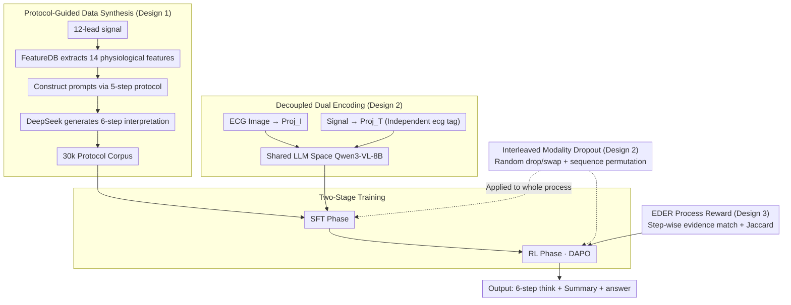

# ECG-R1: Protocol-Guided and Modality-Agnostic MLLM for Reliable ECG Interpretation

**Conference**: ICML 2026  
**arXiv**: [2602.04279](https://arxiv.org/abs/2602.04279)  
**Code**: Available as stated in the paper  
**Area**: Medical Imaging / Multimodal VLM / Reinforcement Learning  
**Keywords**: ECG Interpretation, Medical MLLM, Protocol Guidance, Modality Dropout, Step-wise Reward RL

## TL;DR
ECG-R1 is the first "reasoning" medical multimodal large language model (MLLM) for ECG interpretation. Through a four-pronged approach—**protocol-guided instruction data synthesis + decoupled signal/image encoding + interleaved modality dropout training + evidence-based process reward RL**—it improves ECG diagnostic accuracy from the previous SOTA (GEM) of 74.7 to 80.3, maintaining cross-modality consistency even when one modality is missing.

## Background & Motivation

**Background**: Current mainstream practices assign ECG interpretation to two types of models: general/medical MLLMs (GPT-5.1, MedGemma, etc.) which usually only view ECG images, and a few specialized ECG MLLMs (PULSE, GEM) that incorporate 12-lead time-series signals for omni-perception. Both follow the "VLM + Fine-tuning" paradigm common in general multimodal training.

**Limitations of Prior Work**: Systematic evaluation on the ECG-Grounding test set revealed two concerning issues. First, even flagship models like GPT-5.1 achieve only 31.5% diagnostic accuracy, producing "hallucinatory" interpretations that look professional but are clinically incorrect. Second, omni-models like GEM suffer significant performance drops when one modality (signal or image) is missing during testing, and interpretations for the same ECG across different modalities are contradictory (BLEU-4 of only 0.33).

**Key Challenge**: Existing training corpora are unreliable. Datasets like ECG-Grounding are created by prompting LLMs to reverse-engineer interpretations from diagnostic labels. LLM responses rely on pre-training priors rather than actual ECG diagnostic rules, embedding numerous clinical errors. Consequently, SFT only reinforces these incorrect causal chains. Furthermore, omni-architectures often stuff time-series tokens into `<image>` placeholders, assuming modalities must co-occur, which is unnatural and leads to capacity bottlenecks during single-modality inference.

**Goal**: To solve these three issues: (1) create interpretation corpora that strictly follow clinical protocols; (2) ensure model stability and self-consistency when a modality is missing; (3) ensure the reasoning process itself is rewarded, not just the final answer.

**Key Insight**: Electrocardiography has established diagnostic protocols (e.g., Chapter 23 of *ECG from Basics to Essentials* breaks the process into five steps). These explicit rules can "constrain LLM generation of training data," hard-coding medical priors into the synthesis prompt. Since images and signals are two renderings of the same waveform, the cross-modality divergence $\Delta_{\text{view}}$ should theoretically be minimal, justifying "cross-modality invariance."

**Core Idea**: Inject medical rules into data via protocols, embed robustness and consistency into training targets via IMD, and incorporate process evidence into RL rewards via EDER. All three layers align with "verifiable clinical evidence."

## Method

### Overall Architecture
The input to ECG-R1 is a triplet $(x^{\text{text}}, x^I, x^T)$—text instruction, ECG image, and 12-lead time-series signal. The output is a structured interpretation $y$ consisting of a `<think>` block (six-step protocol reasoning), a short summary, and an `<answer>` block (final diagnosis). The pipeline includes: FeatureDB extraction → Protocol-guided synthesis → Decoupled dual encoding → Two-stage training (SFT + RL) with Interleaved Modality Dropout (IMD). The LLM backbone is Qwen3-VL-8B, and the time-series encoder is ECG-CoCa.

### Key Designs

**1. Protocol-Guided Instruction Data Synthesis: Suppressing Clinical Hallucinations**

ECG-R1 utilizes two-step constrained generation: First, a deterministic FeatureDB extracts 14 physiological features (Heart rate, RR, P/QRS/T amplitudes, durations, PR/QT/QTc, ST descriptors, etc.) from signals, denoted as $\boldsymbol{x}^{fs} = \mathrm{FeatureDB}(\boldsymbol{x}^T)$. Second, a five-step protocol (Rate & Rhythm → Conduction & Axis → Hypertrophy → Ischemia → Electrolytes & QT) is used to assemble a prompt $\boldsymbol{x}^p = \mathrm{ProtocolGuider}(\boldsymbol{x}^{fs}, x^{\text{protocol}})$. This is fed to DeepSeek-V3.1-Terminus to produce 30k SFT samples with a fixed schema. This explicitly injects quantitative thresholds and differential exclusion rules into the generation constraints.

**2. Decoupled Dual Encoding + Interleaved Modality Dropout (IMD): Robustness and Consistency**

ECG-R1 introduces an explicit `<ecg>` tag before `<image>`. Signals and images use independent projectors: $z^T = \mathrm{Proj}_T(\mathrm{Encoder}_T(x^T))$ and $z^I = \mathrm{Proj}_I(\mathrm{Encoder}_I(x^I))$. During training, transformations $\tau$ are sampled from $\mathcal{T}_{\text{test}}=\{\tau_I, \tau_T, \tau_{IT}, \tau_{TI}\}$ (dropping image, dropping signal, or different concatenation orders). The model minimizes the mixed risk $R_q(\theta)=\mathbb{E}_{\tau\sim q}[R_\tau(\theta)]$. This ensures cross-modality divergence $\mathcal{F}(\theta)$ is controlled at the magnitude of $\Delta_{\text{view}}+\sqrt{\varepsilon_{\tau_I}/2}+\sqrt{\varepsilon_{\tau_T}/2}$.

**3. EDER: Process Rewards via Diagnostic Evidence**

EDER extracts key evidence phrases $\mathcal{E}_k(y)$ from 3,948 RL reference traces. It defines a step-level reward $r^{(k)}_{\text{step}}=|\mathrm{match}(\mathcal{E}_k(y), \tilde{y}^{(k)})|/|\mathcal{E}_k(y)|$. Final answer accuracy uses a Jaccard score $R_{\text{accuracy}} = |\mathcal{S}(\hat{a}) \cap \mathcal{S}(a^\star)| / |\mathcal{S}(\hat{a}) \cup \mathcal{S}(a^\star)|$. Total reward is $R_{\text{total}} = R_{\text{format}} + R_{\text{accuracy}} + \lambda R_{\text{EDER}}$, optimized using DAPO. This forces the model to ground every reasoning step in clinical evidence.

### Loss & Training
Two stages: The SFT stage uses the union of protocol-guided data and ECGInstruct for one epoch with teacher-forcing $\min_\theta \mathbb{E}_{(x,y)\sim\mathcal{D}_{\text{SFT}}}[-\log\pi_\theta(y|x)]$ and IMD enabled. The RL stage runs DAPO on a subset of $|\mathcal{D}_{\text{RL}}|=3{,}948$ samples, optimizing $J(\theta)=\mathbb{E}[\frac{1}{N}\sum_{i,t}\min(r_{i,t}, \tilde{r}_{i,t}) \hat{A}_i]$ with IMD.

## Key Experimental Results

### Main Results
Testing conducted on the ECG-Grounding test set (2,381 cases) using DeepSeek-V3.1-Terminus scoring across seven rubrics, plus a blind review of 100 cases by four cardiologists.

| Category | Model | Diagnosis Acc | Analysis Completeness | Lead Evidence Validity | Clinical Diagnostic Fidelity |
| :--- | :--- | :--- | :--- | :--- | :--- |
| Closed-source | GPT-5.1-Instant | 31.48 | 3.03 | 1.92 | 43.46 |
| Medical MLLM | MedGemma-27B | 25.23 | 3.20 | 0.81 | 39.22 |
| ECG Specific | PULSE | 66.13 | 1.90 | 0.19 | 40.53 |
| ECG Specific | GEM (Prev. SOTA) | 74.70 | 4.25 | 4.41 | 62.90 |
| Ours | ECG-R1 (SFT) | 79.33 | 6.36 | 5.53 | 83.51 |
| Ours | ECG-R1 (RL) | **80.29** | **6.51** | **5.81** | **84.20** |

Diagnostic accuracy improved by 5.6 points over GEM (74.7 → 80.3), and clinical fidelity improved by 21 points (62.9 → 84.2).

### Cross-modality Consistency

| Metric | BLEU-4 | ROUGE-L | SBERT |
| :--- | :--- | :--- | :--- |
| GEM | 0.33 | 0.43 | 0.92 |
| ECG-R1 | **0.69** | **0.73** | **0.97** |

BLEU-4 more than doubled, proving high consistency regardless of whether signals or images are provided.

## Key Findings
- The IMD coverage assumption directly yields an $\alpha^{-1}$ upper bound for worst-case risk, ensuring the model does not fail if one modality is missing—a critical requirement for clinical deployment.
- Although the SFT → RL gain is modest (~1%), EDER addresses "correct answer with fabricated reasoning," which is vital for medical compliance.
- The massive gap compared to GPT-5.1 (80.3 vs 31.5) indicates that specialized protocol-guided data provides more leverage for small models than parameter scaling.

## Highlights & Insights
- "Encoding domain rules into data synthesis prompts" is a highly transferable paradigm for any medical field with standards of care (e.g., radiology grading, pathology reports).
- The IMD theoretical analysis is clean: it abstracts modality loss and sequence swapping into four deterministic transformations, achieving consistency guarantees.
- $R_{\text{EDER}}$ uses phrase matching via LLM, avoiding the high cost of training a specialized PRM.

## Limitations & Future Work
- Dependency on FeatureDB: Any abnormality (e.g., rare waveforms) not detected by FeatureDB cannot be covered by the protocol.
- LLM-as-author: 30k samples are generated by DeepSeek; errors in the protocol itself could be systematically amplified.
- Cross-modality consistency relies on the $\Delta_{\text{view}} \approx 0$ assumption unique to ECG, which may not hold in heterogeneous scenarios like RGB + Depth.

## Related Work & Insights
- **vs GEM**: GEM couples time-series into `<image>` tags; Ours decouples them via `<ecg>` tags and independent projectors. Ours uses IMD to solve single-modality collapse.
- **vs ECG-Grounding**: Both use LLM for synthesis, but Ours constrains generation via 5-step clinical protocols instead of relying on pre-training priors.
- **vs DeepSeek-R1**: R1-style RL rewards format and answers. EDER adapts this to medical reasoning by introducing step-wise evidence matching.

## Rating
- Novelty: ⭐⭐⭐⭐ (Protocol-guided data + IMD + EDER combination is a first for ECG).
- Experimental Thoroughness: ⭐⭐⭐⭐⭐ (Multifaceted validation across rubrics, consistency, and human review).
- Writing Quality: ⭐⭐⭐⭐ (Clear structure, though some formulas have redundant symbols).
- Value: ⭐⭐⭐⭐⭐ (Addresses hallucinations and modality loss, highly transferable paradigm).

<!-- RELATED:START -->

## Related Papers

- [\[AAAI 2026\] anyECG-chat: A Generalist ECG-MLLM for Flexible ECG Input and Multi-Task Understanding](../../AAAI2026/multimodal_vlm/anyecg-chat_a_generalist_ecg-mllm_for_flexible_ecg_input_and.md)
- [\[NeurIPS 2025\] GEM: Empowering MLLM for Grounded ECG Understanding with Time Series and Images](../../NeurIPS2025/multimodal_vlm/gem_empowering_mllm_for_grounded_ecg_understanding_with_time_series_and_images.md)
- [\[ICML 2026\] AOEPT: Breaking the Implicit Modality-Reduction Bottleneck in Modality-Missing Prompt Tuning](aoept_breaking_the_implicit_modality-reduction_bottleneck_in_modality-missing_pr.md)
- [\[ICML 2026\] Less Precise Can Be More Reliable: A Systematic Evaluation of Quantization's Impact on VLMs Beyond Accuracy](less_precise_can_be_more_reliable_a_systematic_evaluation_of_quantizations_impac.md)
- [\[ICML 2026\] RESTORE: 通过矫正失真改进视觉 Token 缩减以提升 MLLM 推理效率](improving_visual_token_reduction_via_rectifying_distortions_for_efficient_multim.md)

<!-- RELATED:END -->
