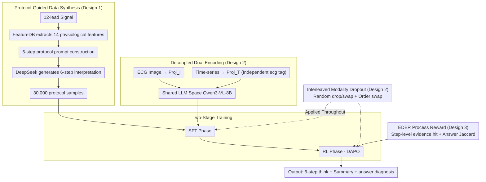

# ECG-R1: Protocol-Guided and Modality-Agnostic MLLM for Reliable ECG Interpretation

**Conference**: ICML 2026  
**arXiv**: [2602.04279](https://arxiv.org/abs/2602.04279)  
**Code**: Code is available at here  
**Area**: Medical Imaging / Multimodal VLM / Reinforcement Learning  
**Keywords**: ECG Interpretation, Medical MLLM, Protocol Guidance, Modality Dropout, Process-Reward RL

## TL;DR
ECG-R1 is the first "reasoning-type" medical multimodal large model dedicated to ECG interpretation. Through a suite of **protocol-guided instruction data synthesis + decoupled signal/image encoding + interleaved modality dropout training + evidence-driven process reward RL**, it improves ECG diagnostic accuracy from the previous SOTA (GEM) of 74.7 to 80.3, while maintaining cross-modal consistency even when a modality is missing.

## Background & Motivation

**Background**: Current mainstream approaches delegate ECG interpretation to two types of models: general or medical MLLMs (e.g., GPT-5.1, MedGemma), which usually only process ECG images; and a few ECG-specific MLLMs (e.g., PULSE, GEM), which have begun incorporating 12-lead time-series signals for omni-perception. Both paths follow the "VLM + Fine-tuning" route, adopting standard multimodal training paradigms.

**Limitations of Prior Work**: The authors performed a systematic evaluation on the ECG-Grounding test set and discovered two concerning issues: first, even flagship models like GPT-5.1 achieve only 31.5% diagnostic accuracy and produce many "hallucinatory" interpretations that look structured and professional but are clinically incorrect. Second, omni models like GEM suffer significant performance drops if one modality is missing during testing (only signal or only image remains), and interpretations generated for the same ECG under different modalities are contradictory, with a BLEU-4 of only 0.33.

**Key Challenge**: Existing training corpora are inherently unreliable—datasets like ECG-Grounding are constructed by having an LLM "reverse prompt" an interpretation from diagnostic labels. The LLM's response relies on pre-training priors rather than real clinical diagnostic rules, embedding numerous clinical errors into the dataset. Models after SFT merely become more proficient at learning these incorrect causal chains. Furthermore, omni architectures that stuff time-series tokens into `<image>` placeholders and reuse the same image-language projector assume both modalities must always co-occur, making single-modality inference unnatural and constrained.

**Goal**: To address these three issues: (1) create an interpretation corpus that truly follows clinical protocols; (2) ensure model stability and self-consistency even when a modality is missing; and (3) reward the reasoning process itself rather than just the final answer.

**Key Insight**: Electrocardiography has established diagnostic protocols (e.g., Chapter 23 of *ECG from Basics to Essentials* breaks the process into five steps). These explicit rules can be used to "constrain LLM generation of training data," hard-coding medical priors into the data synthesis prompt. Additionally, since images and time-series are essentially two renderings of the same waveform, the cross-modal divergence $\Delta_{\text{view}}$ should theoretically be minimal, providing natural legitimacy for "cross-modality swap invariance."

**Core Idea**: Inject medical rules into data via protocols, embed robustness and consistency into training targets via IMD, and incorporate process evidence into RL rewards via EDER. All three layers align with "verifiable clinical evidence."

## Method

### Overall Architecture
The input to ECG-R1 is a triplet $(x^{\text{text}}, x^I, x^T)$—text instructions, ECG rendered images, and 12-lead time-series signals. The output is a structured interpretation $y$, consisting of a `<think>` block (six-step protocol reasoning), a short summary, and an `<answer>` block (final diagnosis). The pipeline consists of four modules: FeatureDB for feature extraction → Protocol-guided instruction data synthesis → Decoupled dual encoders mapping images/signals to a shared LLM space → Two-stage training (SFT + RL), with Interleaved Modality Dropout (IMD) applied throughout. The LLM backbone is Qwen3-VL-8B, and the time-series encoder is ECG-CoCa.

### Key Designs

**1. Protocol-Guided Instruction Data Synthesis: Suppressing Clinical Hallucinations at the Source**

The root cause of errors in corpora like ECG-Grounding is allowing an LLM to generate freely based only on diagnostic labels, which results in the LLM treating incorrect causal chains from its pre-training priors as "ECG rules." ECG-R1 changes this to a two-step constrained generation: first, a deterministic, non-trainable FeatureDB extracts 14 categories of physiological features from the 12-lead sequence (Heart Rate, RR, P/QRS/T amplitudes and durations, PR/QT/QTc, ST descriptors, etc.), denoted as $\boldsymbol{x}^{fs} = \mathrm{FeatureDB}(\boldsymbol{x}^T)$. Then, the five-step reading protocol from Chapter 23 of the textbook (Rate & Rhythm → Conduction & Axis → Hypertrophy → Ischemia → Electrolytes & QT, with mandatory differential exclusion) is used to construct a prompt $\boldsymbol{x}^p = \mathrm{ProtocolGuider}(\boldsymbol{x}^{fs}, x^{\text{protocol}})$. This is fed to DeepSeek-V3.1-Terminus to force it to output the six-step `<think>` + Summary + `<answer>` according to a fixed schema, creating 30,000 SFT samples from MIMIC-IV-ECG.

The key here is **explicitly injecting quantitative thresholds and differential exclusion rules** used by physicians into the generation constraints. The LLM no longer hallucinates a professional-sounding interpretation based on impression; it is forced by the protocol to check features item-by-item and perform differential diagnosis. A byproduct is that it can identify anomalies missed in original reports.

**2. Decoupled Dual Encoding + Interleaved Modality Dropout (IMD): Ensuring Robustness and Self-Consistency**

Omni models like GEM stuff time-series tokens into `<image>` placeholders and reuse the image-language projector, which assumes both modalities must be present—inference with only signal or only image leads to performance drops and contradictions. ECG-R1 decouples this architecturally by introducing an explicit `<ecg>` tag placed before the `<image>` tag. Time-series and images use independent projectors: $z^T = \mathrm{Proj}_T(\mathrm{Encoder}_T(x^T))$ and $z^I = \mathrm{Proj}_I(\mathrm{Encoder}_I(x^I))$, completely uncoupling time-series from image placeholders.

During training, "modality absence" and "order swapping" are incorporated into the objective. Transformations $\tau \in \mathcal{T}_{\text{test}}=\{\tau_I, \tau_T, \tau_{IT}, \tau_{TI}\}$ are sampled from distribution $q$ (drop image, drop signal, two concatenation orders), minimizing mixed risk $R_q(\theta)=\mathbb{E}_{\tau\sim q}[R_\tau(\theta)]$. The authors prove that under the coverage assumption $q(\tau)\geq\alpha$, we have $R_{\max}(\theta) \leq \alpha^{-1} R_q(\theta)$, and the cross-modal divergence $\mathcal{F}(\theta)$ is controlled at the magnitude of $\Delta_{\text{view}}+\sqrt{\varepsilon_{\tau_I}/2}+\sqrt{\varepsilon_{\tau_T}/2}$. Since the two ECG modalities are different renderings of the same waveform, $\Delta_{\text{view}}\approx 0$. By minimizing $R_q$, robustness and consistency are achieved simultaneously. Compared to existing omni models that only perform ERM under "both modalities present + fixed order," IMD includes all target test environments in the training objective without requiring extra alignment losses or missing-modality generators.

**3. EDER: Using Clinical Evidence as Process Rewards to Suppress "Right Answer, Wrong Reason"**

General reasoning RL (like DeepSeek-R1) only checks format and final answers, allowing the intermediate reasoning to be fabricated. ECG diagnosis, however, requires evidence for every step. EDER first uses DeepSeek-V3.1-Terminus to extract key evidence phrases $\mathcal{E}_k(y)$ (at most 3 per step, each $\leq 6$ words) from the reference trace of each RL sample (3,948 total). It then defines a step-level reward $r^{(k)}_{\text{step}}=|\mathrm{match}(\mathcal{E}_k(y), \tilde{y}^{(k)})|/|\mathcal{E}_k(y)|$ to measure how much required evidence was hit in step $k$. The process reward is the average across steps: $R_{\text{EDER}}=\frac{1}{K}\sum_k r^{(k)}_{\text{step}}$.

For the answer, a set-level Jaccard index is used: $R_{\text{accuracy}} = |\mathcal{S}(\hat{a}) \cap \mathcal{S}(a^\star)| / |\mathcal{S}(\hat{a}) \cup \mathcal{S}(a^\star)|$ (splitting multi-labels by semicolons). The total reward is $R_{\text{total}} = R_{\text{format}} + R_{\text{accuracy}} + \lambda R_{\text{EDER}}$, optimized via DAPO ($\epsilon_{\text{low}}=0.2, \epsilon_{\text{high}}=0.3$, with per-response advantage shared across all tokens). Thus, "key findings that must be mentioned in step k" are treated as direct training signals to suppress hallucinations in reasoning—furthermore, evidence extraction is achieved via LLM + string matching, avoiding the high cost of training a PRM.

### Loss & Training
Two stages: The SFT stage uses $\mathcal{D}_{\text{SFT}}$ (union of protocol corpus + ECGInstruct) for one epoch of teacher-forcing $\min_\theta \mathbb{E}_{(x,y)\sim\mathcal{D}_{\text{SFT}}}[-\log\pi_\theta(y|x)]$ with IMD enabled. The RL stage runs DAPO on a $|\mathcal{D}_{\text{RL}}|=3{,}948$ subset with the objective $J(\theta)=\mathbb{E}[\frac{1}{N}\sum_{i,t}\min(r_{i,t}, \tilde{r}_{i,t}) \hat{A}_i]$, also with IMD.

## Key Experimental Results

### Main Results
Testing was conducted on the ECG-Grounding test set (2,381 cases), scored by DeepSeek-V3.1-Terminus using seven rubrics. Additionally, 100 cases were blind-evaluated by four practicing cardiologists based on reliability and utility.

| Model Category | Model | Diagnosis Acc | Analysis Completeness | Lead Evidence Validity | Clinical Diagnostic Fidelity |
| :--- | :--- | :--- | :--- | :--- | :--- |
| Closed-source Flagship | GPT-5.1-Instant | 31.48 | 3.03 | 1.92 | 43.46 |
| Medical MLLM | MedGemma-27B | 25.23 | 3.20 | 0.81 | 39.22 |
| ECG-Specific | PULSE | 66.13 | 1.90 | 0.19 | 40.53 |
| ECG-Specific | GEM (Prev. SOTA) | 74.70 | 4.25 | 4.41 | 62.90 |
| Ours | ECG-R1 (SFT) | 79.33 | 6.36 | 5.53 | 83.51 |
| Ours | ECG-R1 (RL) | **80.29** | **6.51** | **5.81** | **84.20** |

The diagnostic accuracy improved by 5.6 absolute points over GEM (74.7 → 80.3), and clinical diagnostic fidelity improved by 21 points (62.9 → 84.2), with RL providing an additional ~1% gain.

### Cross-modal Consistency

| Metric | BLEU-4 | ROUGE-L | SBERT |
| :--- | :--- | :--- | :--- |
| GEM | 0.33 | 0.43 | 0.92 |
| ECG-R1 | **0.69** | **0.73** | **0.97** |

BLEU-4 more than doubled, proving that the model's output remains highly consistent whether only signal or only image is provided.

### Key Findings
- The coverage assumption of IMD directly yields an $\alpha^{-1}$ upper bound on worst-case risk. Engineering-wise, this means the model does not collapse regardless of which modality is missing—a hard requirement for clinical deployment.
- While the incremental gain from SFT to RL is small (~1 point), EDER specifically addresses the "correct answer, fabricated reasoning" failure mode, which is vital for medical compliance. Diagnosis Acc alone underestimates the value of RL.
- The gap compared to GPT-5.1 (80.3 vs 31.5) demonstrates that specialized protocol corpora provide much more leverage for small models than blindly increasing parameters.

## Highlights & Insights
- "Encoding domain rules into data synthesis prompts" is the most transferable paradigm in this paper: any medical sub-domain with standard-of-care documents (e.g., radiology grading, pathology reports) can adopt this protocolized + LLM-generated pipeline.
- The theoretical analysis of IMD is particularly clean: by abstracting "modality absence" and "order swap" into 4 deterministic transformations, the assumption $\Delta_{\text{view}}\approx 0$ holds in ECG scenarios (where both views render the same physical object), providing a provable consistency guarantee.
- The process reward $R_{\text{EDER}}$, implemented using LLM-extracted phrases and string matching, avoids the high cost of training a PRM, representing a lightweight yet precise design choice for medical RL.

## Limitations & Future Work
- FeatureDB is a deterministic external tool that sets the ceiling for grounding—any abnormality FeatureDB cannot extract (e.g., rare waveforms) will not be covered by the protocol.
- The 30K protocol corpus is entirely generated by DeepSeek-V3.1-Terminus; it still follows the LLM-as-author paradigm, although "protocolization" suppresses free-form hallucinations. If the protocol itself has omissions (e.g., new criteria not mentioned in the textbook), errors will be systematically amplified.
- The strong guarantee of cross-modal consistency depends on the negligible $\Delta_{\text{view}}$ specific to ECG; this assumption might not hold in truly heterogeneous multimodal scenarios like RGB+depth or audio+text.
- The RL subset is only 3,948 samples and shuffled with a fixed seed, which may limit the coverage and policy diversity of DAPO.

## Related Work & Insights
- **vs. GEM (Lan et al., 2025)**: GEM stuffs time-series into `<image>` placeholders and reuses the projector. This work uses explicit `<ecg>` tags and independent projectors for decoupling. More importantly, GEM lacks IMD during training, causing single-modality inference to fail.
- **vs. ECG-Grounding (Lan et al., 2025) Data**: Both use LLMs to generate interpretations, but ECG-Grounding allows the LLM to rely on pre-training priors. This work uses a 5-step textbook protocol to constrain generation within clinical rules.
- **vs. DeepSeek-R1 / R1-VL (Zhang et al., 2025)**: Standard R1 rewards only format and answers. EDER borrows step-level rewards from R1-VL but replaces general visual reasoning with diagnostic evidence phrase hit rates, representing a precise adaptation of the R1 paradigm for medical RL.

## Rating
- Novelty: ⭐⭐⭐⭐ The combination of protocol-guided data + IMD + EDER is a first in the ECG domain, and IMD provides theoretical guarantees.
- Experimental Thoroughness: ⭐⭐⭐⭐⭐ Three layers of validation: seven rubrics + cross-modal consistency + cardiologist blind evaluation, covering flagship, open-source, medical, and ECG-specific baselines.
- Writing Quality: ⭐⭐⭐⭐ Modules are clearly segmented, and definitions correspond well with theorems; however, some formulas have redundant symbols.
- Value: ⭐⭐⭐⭐⭐ Directly addresses two major hurdles for medical MLLM deployment: hallucinations and modality absence. The paradigm is transferable to other protocol-based medical scenarios.

<!-- RELATED:START -->

## Related Papers

- [\[AAAI 2026\] anyECG-chat: A Generalist ECG-MLLM for Flexible ECG Input and Multi-Task Understanding](../../AAAI2026/multimodal_vlm/anyecg-chat_a_generalist_ecg-mllm_for_flexible_ecg_input_and.md)
- [\[NeurIPS 2025\] GEM: Empowering MLLM for Grounded ECG Understanding with Time Series and Images](../../NeurIPS2025/multimodal_vlm/gem_empowering_mllm_for_grounded_ecg_understanding_with_time_series_and_images.md)
- [\[ICML 2026\] AOEPT: Breaking the Implicit Modality-Reduction Bottleneck in Modality-Missing Prompt Tuning](aoept_breaking_the_implicit_modality-reduction_bottleneck_in_modality-missing_pr.md)
- [\[ICML 2026\] Jailbreaking Vision-Language Models Through the Visual Modality](jailbreaking_vision-language_models_through_the_visual_modality.md)
- [\[ICML 2026\] WeatherSyn: An Instruction Tuning MLLM For Weather Forecasting Report Generation](weathersyn_an_instruction_tuning_mllm_for_weather_forecasting_report_generation.md)

<!-- RELATED:END -->
