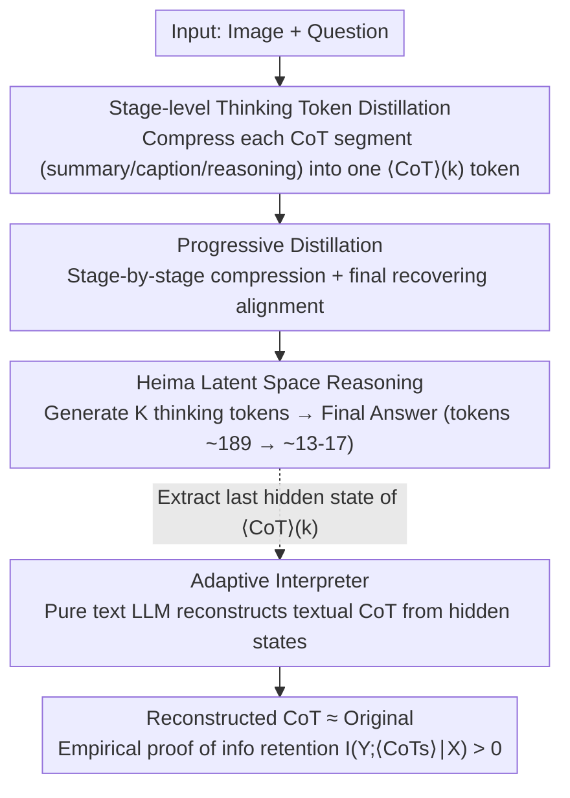

# Efficient Reasoning with Hidden Thinking

**Conference**: ICML 2026  
**arXiv**: [2501.19201](https://arxiv.org/abs/2501.19201)  
**Code**: https://github.com/shawnricecake/Heima  
**Area**: Multimodal VLM / Efficient Inference / Latent Space Reasoning / CoT Compression  
**Keywords**: Heima, thinking tokens, progressive distillation, information-theoretic bound, interpreter

## TL;DR
Heima distills each stage (summary / caption / reasoning) of a multimodal LLM's lengthy Chain-of-Thought (CoT) into **a single special thinking token**. This allows the model to "think" in latent space, reducing the token count from the 100-200 range to 13-16 while maintaining zero-shot accuracy more stably than LLaVA-CoT. A companion LLM "interpreter" is trained to reconstruct the textual reasoning chain from the hidden states of these thinking tokens, thereby empirically validating the information-theoretic upper bound of compression loss.

## Background & Motivation

**Background**: Utilizing CoT for complex multimodal reasoning in MLLMs has become mainstream (e.g., LLaVA-CoT). However, generating hundreds of tokens for every CoT lead to high inference latency and massive API costs. While Coconut (Hao et al., 2024) explored CoT compression on GPT-2, it was only validated on text and small models.

**Limitations of Prior Work**: (1) CoT in MLLMs is even longer than in pure text models (requiring image descriptions + reasoning), exacerbating latency issues; (2) existing latent reasoning methods (Cheng & Van Durme) compress the entire CoT into a segment of continuous embeddings, which leads to significant accuracy drops in mathematical problems—indicating that "naive compression" loses critical information; (3) there is a lack of a theoretical framework to determine how many tokens can be compressed without sacrificing reasoning capabilities.

**Key Challenge**: Shorter CoT leads to faster inference, but removing any segment of CoT may decrease $I(Y;\text{CoTs}|X)$ (the target-related mutual information carried by the CoT). To quantify this trade-off and ensure that $I(Y;\langle CoTs\rangle|X)>0$ after compression, a formal information-theoretic characterization and empirical methods to verify information retention are required.

**Goal**: (i) Design a latent CoT compression framework for MLLMs; (ii) formalize the "compression-accuracy" trade-off using information theory; (iii) design an interpreter capable of reconstructing textual CoT to empirically validate compression loss.

**Key Insight**: The CoT in LLaVA-CoT is organized by stages (summary / caption / reasoning). Each stage acts as an independent semantic unit, which can be distilled into **a single stage-token**. Although the capacity of a single token's hidden state is limited, 768-4096 dimensions are sufficient to store the "semantic fingerprint of a reasoning segment."

**Core Idea**: Each CoT stage is distilled into a special token $\langle CoT\rangle(k)$. The model directly generates these tokens in the embedding space to produce the final answer. A separate LLM interpreter then reverses the hidden states of each token to reconstruct the corresponding textual CoT, serving as empirical evidence of information retention.

## Method

### Overall Architecture
The framework consists of two types of models:
- **Heima** (based on LLaVA-CoT-11B / LLaVA-Next-Vicuna-7B): Performs latent space reasoning. It takes (image, question) as input and outputs $K_i$ thinking tokens + the final answer.
- **Interpreters** (based on Llama-3.1-8B / Vicuna-7B, pure LLM without vision): One for each CoT stage. It takes (explanatory prompt, text question, thinking token hidden state) as input and outputs the original CoT text.

Only Heima is used during inference, reducing token counts from $\sum|CoT(k)|$ (~100-200) to $K_i$ (3-4). Interpreters are used only for "information-theoretic empirical analysis."

### Key Designs

**1. Stage-level Thinking Token Distillation + Information-Theoretic Guarantee: Compressing each CoT segment into one special token and quantifying information loss**

The CoT in LLaVA-CoT is already organized by stages (summary / caption / reasoning), where each stage is a semantically independent unit suitable for compression into a special token. The original dataset $D=\{(X,\text{CoTs},Y)\}$ is rewritten as $D_H=\{(X,\langle CoTs\rangle,Y)\}$, where $\langle CoTs\rangle:=\{\langle CoT\rangle_{(k)}\}_{k=1}^{K_i}$ replaces each stage with a newly added token in the vocabulary. The distillation objective $\mathcal{L}(\theta)=-\mathbb{E}_{(X,Y,\langle CoTs\rangle)\sim D_H}\log P_\theta(\langle CoTs\rangle,Y|X)$ fine-tunes the model to predict the sequence of thinking tokens plus the answer. Crucially, the authors formalize whether compression compromises reasoning as an information-theoretic problem: since $\langle CoTs\rangle=f(X,\text{CoTs})$ forms a Markov chain $Y-(X,\text{CoTs})-\langle CoTs\rangle$, Theorem 3.1 states $0\leq I(Y;\langle CoTs\rangle|X)\leq I(Y;\text{CoTs}|X)$. The information gap $I(Y;\text{CoTs}|X)-I(Y;\langle CoTs\rangle|X)=I(Y;\text{CoTs}|X,\langle CoTs\rangle)\geq 0$ precisely quantifies the "compression loss." If $I(Y;\langle CoTs\rangle|X)>0$, reasoning capability is preserved. This transforms the adequacy of thinking tokens from an empirical question into a measurable quantity via the interpreter. The $k$-th stage across all samples shares the same token (not per-sample), preventing vocabulary explosion.

**2. Progressive Distillation: Compressing one stage at a time to avoid optimization collapse**

Compressing all CoT stages into tokens simultaneously forces each token to shoulder too much compression task, making the loss landscape difficult to optimize. A curriculum approach is used: the process is divided into $M=\max\{K_i\}+1$ stages. For the $s$-th stage, the training data is $D_P=\{(X,\{\langle CoT\rangle_{(k)}\}_{k=1}^s,\{CoT_{(k)}\}_{k=s+1}^{K_i},Y)\}$, where the first $s$ stages are compressed into thinking tokens while the remaining stages remain as original text. This progresses until all stages are compressed. The model learns to internalize one new compression at a time, gradually "absorbing" reasoning patterns into hidden states. A final recovering stage is added, where training is conducted using only thinking tokens to resolve alignment issues between stages. Ablations show a 1.7% drop without progressive distillation and a 1.4% drop without the recovering stage, proving both are necessary.

**3. Adaptive Interpreter: Reconstructing textual CoT from hidden states to measure information retention**

While theory provides bounds for the information gap, the actual difference must be empirically measured. For each stage $k$, an interpreter $\mathcal{I}_{\theta_k}$ initialized with Llama-3.1-8B is used. The training data $D_I$ includes explanatory prompts, textual questions (no images), thinking tokens, the last hidden state $H_{\langle CoT\rangle_{(k)}}$ of the thinking token, and the original CoT text. Critically, the interpreter **replaces** the word embedding of the thinking token with the last hidden state output by Heima—since reasoning information is encoded in the hidden state rather than the token ID. It is then trained with standard next-token loss $\max_{\theta_k}\mathbb{E}\log P_{\theta_k}(CoT_{(k)}|X_e,X_q,H_{\langle CoT\rangle_{(k)}})$ to reconstruct the original text. The closer the reconstructed text is to the original CoT, the smaller $I(Y;\text{CoTs}|X,\langle CoTs\rangle)$ is, indicating more complete information retention. This architecture also proves that Heima is performing true latent reasoning rather than simple overfitting—information can be decoded back into coherent text. For instance, in a BMW logo example, the interpreter reconstructed "sleek modern sports car with black exterior" and "cross with a circle" from the hidden state, perfectly matching the original CoT.

### Loss & Training
- Heima: LoRA fine-tuning of LLaVA-CoT-11B (rank=16, alpha=32). Image encoder is frozen; all attention, MLP, and output projections are updated. Progressive distillation consists of $M$ stages, each lasting one epoch.
- Interpreter: Same LoRA configuration using next-token prediction loss, extracting hidden states from the frozen Heima model.
- All experiments conducted using torchtune on 8×H100 GPUs.

## Key Experimental Results

### Main Results

Performance on 6 zero-shot benchmarks for the LLaVA-CoT-11B series (token counts in parentheses):

| Model | MMStar | MMBench | MMVet | MathVista | AI2D | Hallusion | Avg | Tokens |
|-------|--------|---------|-------|-----------|------|-----------|-----|--------|
| Llama-3.2-11B-Vision | 48.1 | 58.2 | 50.2 | 50.3 | 68.5 | 37.2 | 52.1 | ~119 |
| LLaVA-CoT | 54.0 | 70.7 | 49.8 | 50.9 | 77.6 | 63.8 | 61.1 | ~189 |
| Heima w/o progressive | 49.7 | 72.5 | 39.0 | 39.3 | 75.9 | 61.3 | 56.3 | ~23 |
| Heima w/o recover | 49.8 | 71.6 | 42.8 | 39.8 | 77.3 | 58.5 | 56.6 | ~24 |
| **Heima (full)** | 49.9 | **72.8** | 43.3 | 43.6 | 77.5 | 60.6 | 58.0 | **~24** |

Heima averages 13-17 tokens (a **10-15× reduction** compared to LLaVA-CoT on CoT benchmarks); it even outperforms LLaVA-CoT on MMBench and AI2D.

### Ablation Study

| Configuration | Avg Acc | Notes |
|------|---------|------|
| Heima w/o progressive | 56.3 | Compressing all stages at once, -1.7 |
| Heima w/o recover | 56.6 | Missing the final recovering stage, -1.4 |
| Heima (full) | 58.0 | Complete method |

Interpreter reconstruction quality (4300 samples): Evaluated using BLEU-4 / METEOR / ROUGE / BERTScore + GPT-4o similarity. The paper states that reconstructed texts "closely align with original CoTs," verifying a controllable information gap.

### Key Findings
- **Heima (43.6) < LLaVA-CoT (50.9) on MathVista**, though it uses 16× fewer tokens. This indicates that mathematical reasoning still relies on full CoT, acting as the bottleneck case. Conversely, Heima is more accurate on MMBench/AI2D, likely due to the removal of CoT noise.
- **Progressive distillation is crucial**: Removing it results in a 1.7% loss; excluding the recovering stage adds another 1.4% loss—demonstrating that curriculum learning and final alignment are both necessary.
- **The token count reduction from ~189 to ~13-17 is a 14× compression**, while the average accuracy only drops by 3% (61.1→58.0), offering extreme cost-efficiency.
- **The Interpreter can reconstruct almost complete captions and reasoning from hidden states** (e.g., the BMW example), verifying that hidden states are not a black box but truly carry reasoning information.
- **Without progressive distillation, MMVet performance plunges to 39.0** (vs. 43.3 full), showing that one-time compression is unfeasible for long CoT tasks.

## Highlights & Insights
- **First to achieve latent CoT compression + rigorous information-theory analysis + interpretable interpreters at the MLLM scale**. While Coconut focused on GPT-2 and math, Heima operates on an 11B MLLM across 6 multimodal benchmarks.
- **Theorem 3.1 provides a rare formal result in latent reasoning**: It quantifies the intuition that "compression is acceptable as long as $I(Y;\langle CoTs\rangle|X)>0$," providing a baseline for future latent reasoning frameworks.
- **The Interpreter serves as both a diagnostic and an explainability tool**: Once trained, it objectively evaluates hidden information content and allows end-users to see "what the model was thinking in the hidden space," which is valuable for alignment and safety.
- **Stage-shared token design balances expressivity and vocabulary overhead**: Sharing $\langle CoT\rangle_{(k)}$ across samples avoids vocabulary explosion while maintaining stage-specific semantics.
- **The progressive distillation training paradigm is transferable** to any task involving the "compression of multiple semantic units," such as long-context summarization, dialogue history compression, and multi-step code generation.

## Limitations & Future Work
- **Significant performance drop in mathematical reasoning** (MathVista 50.9→43.6), indicating that 13-17 hidden tokens cannot contain a complete arithmetic chain; latent reasoning has bottlenecks in precise symbolic operations.
- **Granularity of one token per stage is manually designed**; the study did not explore "adaptive stage counts" or "adaptive token counts."
- **Dependency on the stage divisions of the LLaVA-CoT dataset**; other CoT data without stage labels would require pre-segmentation.
- **High training cost for Interpreters**: Requiring one interpreter per stage leads to near-linear growth for multi-stage tasks.
- **Unverified scale laws**: Not yet tested on larger models (34B+) or closed-source models like GPT-4V.
- **Lack of comparison with Coconut on MLLMs**: Coconut uses continuous thinking embeddings while Heima uses token-level representations; which is better for MLLMs remains an open question.
- **Future Directions**: (i) Variable thinking token counts (e.g., a token indicating "how many more steps to think"); (ii) multiple tokens per stage to improve math reasoning; (iii) using latent CoT for reward shaping during RLHF.

## Related Work & Insights
- **vs. Coconut (Hao et al., 2024)**: Coconut used GPT-2 for single-task text math; Heima uses 11B MLLMs across 6 benchmarks with an information-theoretic framework, increasing scale and breadth by an order of magnitude.
- **vs. Cheng & Van Durme 2024**: They compressed CoT into continuous embeddings but faced significant math accuracy degradation; Heima uses token-level discrete representations with progressive distillation to avoid such catastrophic degradation.
- **vs. Speculative decoding / Medusa**: These provide acceleration for autoregressive decoding; latent reasoning is an optimization in a different dimension that can be used concurrently.
- **vs. LISA / VLM-Latent (Lai et al., Pi et al.)**: These insert visual info into LLM hidden states for downstream tasks (segmentation/detection); Heima does the inverse by inserting reasoning processes, proving hidden states can carry logic as well as vision.
- **vs. RLHF for efficient reasoning**: RLHF learns short CoT via rewards but still relies on text; Heima changes the representation itself, offering a more fundamental optimization.

## Rating
- Novelty: ⭐⭐⭐⭐⭐ First stage-token latent CoT on MLLM with rigorous information-theoretic characterization and interpreter validation.
- Experimental Thoroughness: ⭐⭐⭐⭐ 6 zero-shot benchmarks + 2 model families + complete ablation; however, lacks wall-clock latency data and RLHF comparisons.
- Writing Quality: ⭐⭐⭐⭐⭐ Concise and rigorous information theory session; vivid motivating example with the BMW logo.
- Value: ⭐⭐⭐⭐⭐ MLLM inference cost is a major deployment bottleneck; 14× token compression with only a 3% average drop is an industry-grade optimization. Code is open-sourced.

<!-- RELATED:START -->

## Related Papers

- [\[ICML 2026\] From Seeing to Thinking: Decoupling Perception and Reasoning Improves Post-Training of Vision-Language Models](from_seeing_to_thinking_decoupling_perception_and_reasoning_improves_post-traini.md)
- [\[ICML 2026\] Bad Seeing or Bad Thinking? Rewarding Perception for Vision-Language Reasoning](bad_seeing_or_bad_thinking_rewarding_perception_for_vision-language_reasoning.md)
- [\[AAAI 2026\] AStar: Boosting Multimodal Reasoning with Automated Structured Thinking](../../AAAI2026/multimodal_vlm/astar_boosting_multimodal_reasoning_with_automated_structure.md)
- [\[ICLR 2026\] SophiaVL-R1: Reinforcing MLLMs Reasoning with Thinking Reward](../../ICLR2026/multimodal_vlm/sophiavl-r1_reinforcing_mllms_reasoning_with_thinking_reward.md)
- [\[CVPR 2026\] Thinking with Programming Vision: Towards a Unified View for Thinking with Images](../../CVPR2026/multimodal_vlm/thinking_with_programming_vision_towards_a_unified_view_for_thinking_with_images.md)

<!-- RELATED:END -->
