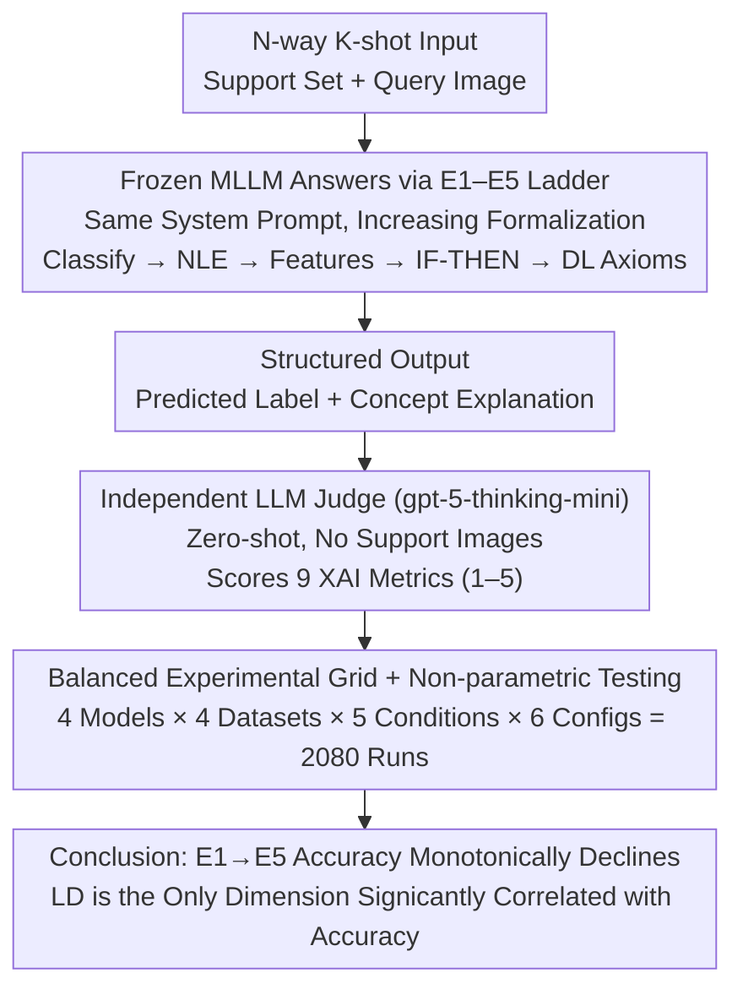

# Explaining Is Harder than Predicting Alone: Evaluating Concept-Based Explanations of MLLMs as ICL Visual Classifiers

**Conference**: ICML 2026  
**arXiv**: [2605.28215](https://arxiv.org/abs/2605.28215)  
**Code**: TBD  
**Area**: Interpretability / Multimodal VLM / In-Context Learning  
**Keywords**: Concept-based Explanation, Description Logic, LLM-as-a-judge, Few-shot ICL, XAI Evaluation

## TL;DR
The authors utilize a 5-level formalization ladder of explanation conditions (pure classification → natural language explanation → feature lists → IF-THEN knowledge base → DL axioms) and an LLM-as-a-judge pipeline evaluating 9 XAI metrics to conduct 2,080 ICL classification experiments on 4 SOTA MLLMs. They find that "forcing models to generate increasingly formal concept explanations leads to a monotonic decline in classification accuracy (93.8% → 90.1%)," yet "local discriminativeness" is the only explanation quality dimension significantly correlated with accuracy.

## Background & Motivation

**Background**: MLLMs combined with few-shot In-Context Learning (ICL) can perform image classification without weight updates. The mainstream method for "explanation" is Chain-of-Thought (CoT) prompting, where the model describes its reasoning steps.

**Limitations of Prior Work**: (1) CoT text does not equal true internal reasoning—Barez et al. (2025) proved that CoT trajectories may not reflect internal computation, and Turpin et al. (2023) noted that models often provide "plausible but misleading" post-hoc rationalizations. (2) ICL literature focuses almost exclusively on classification accuracy, lacking formalized, machine-verifiable evaluations of explanation quality. (3) Neuro-symbolic approaches (e.g., logic-explained networks) rely on supervised training and cannot evaluate whether "frozen MLLMs can generate symbolic explanations on their own."

**Key Challenge**: There is a mismatch between "natural language fluency" and "concept verifiability"—the latter is what XAI truly requires, but the former dominates nearly all current evaluations.

**Goal**: To systematically answer two questions in a well-controlled few-shot image classification setting: (1) Can frozen MLLMs spontaneously produce explanations following conceptual and formal requirements? (2) Do explanation requirements inversely damage the classification performance itself?

**Key Insight**: Using image classification as a "conceptual anchor"—visual features can be verified against the query image, bringing "concepts" from linguistic abstractions back to visual evidence. Designing the explanation requirements as a "five-level formalization ladder" allows for isolating the marginal impact of "incrementally increasing complexity" on the same dataset.

**Core Idea**: Reformulate "concept explanations" into machine-verifiable artifacts like Description Logics (DL) axioms, and then quantify them using an independent judge + 9-dimensional XAI metrics to quantitatively determine if "requiring explanations drags down prediction performance."

## Method

### Overall Architecture
Task Setting: $N$-way $K$-shot image classification. Given a support set $\mathcal{S}=\{(x_i, y_i)\}_{i=1}^{N\times K}$ and a query image $x_q$, a frozen MLLM views examples in-context and outputs a predicted class $\hat{y}_q \in \mathcal{Y}$ while simultaneously producing a structured explanation according to a specific "explanation condition." The system prompt enforces three constraints: (i) Use only observable visual evidence in the query image; (ii) Prohibit external world knowledge/assumptions; (iii) The final class label must be placed in `<response>` XML tags and extracted verbatim from the candidate list for deterministic parsing. An independent judge (gpt-5-thinking-mini) receives the query image, candidate labels, the model's full output, the explanation condition description, and a rubric to score 9 metrics on a scale of 1–5. The judge does **not see support set images**, ensuring a zero-shot evaluation. The entire pipeline is a "Classify-Explain-Evaluate" workflow: the same frozen MLLM acts as both classifier and explainer, with an independent judge scoring the output.

### Key Designs

**1. Five-Level Formalization Explanation Ladder (E1–E5): Isolating Explanation Complexity**

Previous explanation evaluations were either scattered across incomparable prompt styles or only tested free-form text. This study structures explanation requirements into a ladder of monotonically increasing complexity: E1 (baseline) outputs only the label in `<response>`; E2 adds a short natural language explanation (NLE) in `<explanation>` (standard CoT); E3 lists minimal sufficient observable visual features in `<features>`; E4 lists features and induces IF-THEN rules from examples in `<kb>`, then checks rules against the query in `<rule_check>`; E5 utilizes Description Logics (DL) — `<tbox>` uses `hasVisualFeature` roles for concept axioms, `<abox>` contains query property assertions, and `<dl_explanation>` derives the predicted class. Since these levels only increase in "formalization," changes in accuracy can be cleanly attributed to the marginal cost of formalization.

**2. LLM-as-a-judge + 9-Dimensional XAI Metrics: Quantifying Explanation Quality**

To distinguish between different failure modes, the judge (gpt-5-thinking-mini) independently scores 9 dimensions: Textual Groundedness (TG), Hallucination Free (HF), Concept Counting (CC), Comprehensibility (CP), Conciseness (Cn), Specificity (S), Local Discriminativeness (LD), Instruction Following (IF), and Logical Coherence (LC). The judge deliberately does not see support set images to rely on its own priors for dimensions like LD.

**3. Reproducible Experimental Grid + Balanced Statistical Design**

The study emphasizes statistical rigor: 4 datasets (CIFAR-10 / DTD / Flowers102 / Pets) × 4 models × 5 conditions (E1–E5) × 6 $(N,K)$ configurations = 2,080 runs. The query count is fixed at $Q=1$ to ensure independent samples for McNemar / Wilcoxon / Friedman tests. Repetitions are balanced such that $\text{Reps}\times N=12$ to avoid oversampling small $N$ configurations. All models and conditions share the same support sets generated with fixed seed 42 to eliminate sampling noise.

### Loss & Training
Frozen MLLMs with no gradient updates; all models accessed via OpenRouter API with temperature $T=0$ for deterministic output.

## Key Experimental Results

### Main Results
Mean accuracy (%) aggregated by explanation condition × model (across 4 datasets × 6 configurations):

| XAI Condition | Gemini 2.5F | Gemma 4 | Qwen3 VL | LLaMA 4 |
|----------|-------------|---------|----------|---------|
| E1 — Classify Only | **96.9** | 94.4 | 95.1 | 88.5 |
| E2 — NLE | 97.2 | 94.1 | 92.7 | 90.3 |
| E3 — Features | 96.9 | 93.1 | 93.8 | 88.5 |
| E4 — Feature-value pairs | 95.8 | 94.4 | 92.4 | 86.5 |
| E5 — DL Axioms | 96.2 | 92.4 | **83.0** | 88.9 |

Overall mean 92.6%; accuracy declines monotonically from E1 to E5 (93.8% → 90.1%), with Qwen3 VL 8B showing the sharpest drop (−12.1 pp).

### Ablation Study
Judge scores for 9 explanation quality metrics across 4 conditions (Mean, best in **bold**):

| Condition | TG | HF | CC | CP | Cn | S | LD | IF | LC |
|------|----|----|----|----|----|----|----|----|----|
| NLE | 3.62 | 4.46 | **4.68** | 4.95 | 4.81 | 3.73 | 3.69 | 4.70 | 4.84 |
| Features | 3.62 | **4.81** | **4.68** | **4.99** | **4.97** | 3.81 | 3.62 | **4.82** | **4.89** |
| Feature-value pairs | **3.70** | 4.77 | 4.37 | 4.92 | 4.95 | **4.14** | **3.91** | 4.43 | 4.72 |
| DL Axioms | 2.31 | 4.40 | 4.20 | 3.97 | 4.94 | 2.85 | 3.10 | 3.05 | 2.97 |

### Key Findings
- **Stricter Formalization, Worse Classification**: DL axioms (E5) reduced the overall mean from 93.8% to 90.1%, contradicting the assumption that explicit reasoning is always beneficial.
- **DL Axioms Collapse in 5 Dimensions**: TG (2.31), Specificity (2.85), LD (3.10), IF (3.05), and LC (2.97) were significantly lower—indicating MLLMs can write syntactically correct axioms but struggle to anchor them to discriminative visual evidence.
- **Increasing support shots $K$ from 1 to 5 improved accuracy by 7.0 pp ($p=2.0\times 10^{-13}$)**, but only LD showed a significant corresponding increase among the 9 metrics ($\Delta=+0.26$).
- **Increasing class count $N$ monotonically reduced accuracy**, and only LD significantly declined ($N=2$ score 3.86 → $N=4$ score 3.40).
- **LD is the only metric significantly correlated with accuracy** (Spearman, after Bonferroni correction for 36 tests)—the other 8 metrics cannot predict classification success.

## Highlights & Insights
- **"Explanation Cost" Quantified**: The study provides a reproducible figure (3.7 pp drop from E1 to E5), cautioning against sacrificing predictive power for formalized explanations.
- **Diagnosis of DL Axiom Failure**: Failure is not due to "syntax errors" (HF and Cn scores remain high), but "semantic emptiness"—models generate the correct structure but lack *discriminative* content.
- **LD as a Proxy for XAI Utility**: Since only LD correlates with accuracy, future XAI evaluations should prioritize LD as a core KPI.
- **Transferable Task Design**: The paradigm of using ICL + multi-prompting to probe frozen model capabilities is a structural contribution applicable to other tasks.

## Limitations & Future Work
- The judge (gpt-5-thinking-mini) lacks access to support images, making LD scores dependent on its own priors.
- Evaluation limited to 4 standard datasets, excluding high-risk domains like medicine or satellite imagery.
- Fixed prompt templates may contribute to low DL scores; prompt robustness requires further ablation.
- Experiments used $Q=1$ for statistical independence, leaving "explanation consistency across multiple queries" unanswered.
- Lack of human baseline to verify if judge scores align with human intuition, particularly for Comprehensibility.

## Related Work & Insights
- **vs. Barez et al. (2025) on CoT unreliability**: This work adds quantification—CoT-style E2 remains decent in LD (3.69), whereas formalization is where performance truly collapses.
- **vs. Neuro-symbolic / Logic-explained networks**: While those rely on supervised learning, Ours proves frozen MLLMs yield syntactically correct but semantically weak axioms, suggesting instruction tuning is necessary.
- **vs. Liu et al. (2025) "CoT reduces accuracy"**: Ours provides stronger evidence in multimodal + formalization contexts.
- **vs. Polignano et al. (2024) XAI Surveys**: This work responds to calls for systematic evaluation frameworks.

## Rating
- Novelty: ⭐⭐⭐⭐ Quantifies "explanation cost" in multimodal ICL for the first time.
- Experimental Thoroughness: ⭐⭐⭐⭐⭐ Rigorous statistical design with 2,080 runs and non-parametric checks.
- Writing Quality: ⭐⭐⭐⭐ Clear definitions of tasks, conditions, and metrics.
- Value: ⭐⭐⭐⭐ Challenges the "explanation = good" assumption and identifies LD as the key metric.

<!-- RELATED:START -->

## Related Papers

- [\[ICML 2026\] Hyper-ICL: Attention Calibration with Hyperbolic Anchor Distillation for Multimodal ICL](hyper-icl_attention_calibration_with_hyperbolic_anchor_distillation_for_multimod.md)
- [\[CVPR 2026\] Where MLLMs Attend and What They Rely On: Explaining Autoregressive Token Generation](../../CVPR2026/multimodal_vlm/where_mllms_attend_and_what_they_rely_on_explaining_autoregressive_token_generat.md)
- [\[ICCV 2025\] SparseMM: Head Sparsity Emerges from Visual Concept Responses in MLLMs](../../ICCV2025/multimodal_vlm/sparsemm_head_sparsity_emerges_from_visual_concept_responses_in_mllms.md)
- [\[ICML 2026\] 通用骨架理解：可微渲染与 MLLMs](universal_skeleton_understanding_via_differentiable_rendering_and_mllms.md)
- [\[CVPR 2026\] When Token Pruning is Worse than Random: Understanding Visual Token Information in VLLMs](../../CVPR2026/multimodal_vlm/when_token_pruning_is_worse_than_random_understanding_visual_token_information_i.md)

<!-- RELATED:END -->
