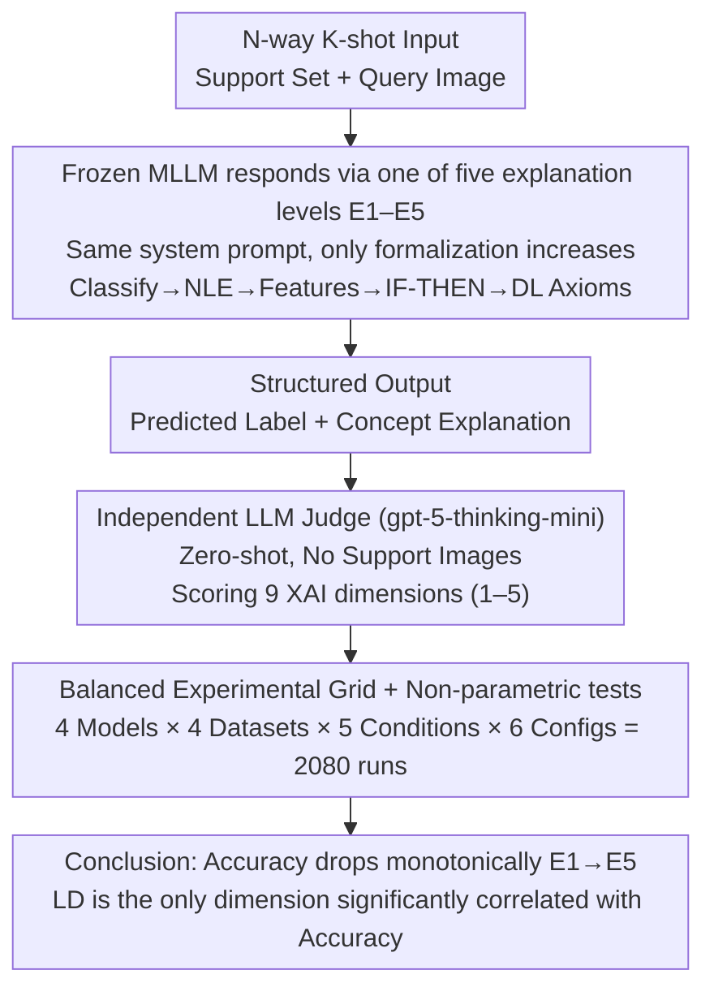

# Explaining Is Harder than Predicting Alone: Evaluating Concept-Based Explanations of MLLMs as ICL Visual Classifiers

**Conference**: ICML 2026  
**arXiv**: [2605.28215](https://arxiv.org/abs/2605.28215)  
**Code**: To be confirmed  
**Area**: Interpretability / Multimodal VLM / In-Context Learning  
**Keywords**: Concept Explanation, Description Logic, LLM-as-a-judge, Few-shot ICL, XAI Evaluation

## TL;DR
The authors utilize a five-level formalization ladder of explanation conditions (classification only → natural language explanation → feature list → IF-THEN knowledge base → DL axioms) and an LLM-as-a-judge pipeline evaluating 9 XAI metrics to conduct 2,080 ICL classification experiments on four SOTA MLLMs. They find that "forcing models to generate more formal concept explanations leads to a monotonic decline in classification accuracy (93.8% → 90.1%)," yet "Local Discriminativeness" is the only explanation quality dimension significantly correlated with accuracy.

## Background & Motivation

**Background**: MLLMs combined with few-shot In-Context Learning (ICL) can perform image classification without updating weights. The mainstream "explanation" method is Chain-of-Thought (CoT) prompting, which lets the model describe its reasoning steps.

**Limitations of Prior Work**: (1) CoT text does not equate to true internal reasoning—Barez et al. (2025) proved that CoT trajectories may not reflect internal computation, and Turpin et al. (2023) noted that models often provide "plausible but misleading" post-hoc rationalizations. (2) ICL literature focuses almost exclusively on classification accuracy, lacking formalized, machine-verifiable evaluations for explanation quality. (3) Neuro-symbolic paths (e.g., logic-explained networks) rely on supervised training and cannot measure "whether a frozen MLLM itself can generate symbolic explanations."

**Key Challenge**: The "natural language fluency" of an explanation and its "concept verifiability" are two different things—the latter is what XAI truly requires, yet the former dominates nearly all current evaluations.

**Goal**: Within a well-controlled few-shot image classification setting, systematically answer two questions: (1) Can frozen MLLMs spontaneously produce explanations according to conceptual and formal requirements? (2) Do explanation requirements negatively impact the classification task itself?

**Key Insight**: Image classification is used as a "conceptual anchor"—visual features can be directly verified against the query image, bringing "concepts" from linguistic abstraction back to visual evidence. Formalization requirements are designed as a "five-level ladder," allowing isolation of the marginal impact of "progressively increasing complexity" on the same dataset.

**Core Idea**: Re-formalize "concept explanations" into machine-verifiable outputs like Description Logics (DL) axioms, then quantify them using an independent judge and 9-dimensional XAI metrics to quantitatively answer "whether demanding an explanation drags down prediction performance."

## Method

### Overall Architecture
Task Setting: $N$-way $K$-shot image classification. Given a support set $\mathcal{S}=\{(x_i, y_i)\}_{i=1}^{N\times K}$ and a query image $x_q$, the frozen MLLM observes examples directly in-context and outputs a predicted class $\hat{y}_q \in \mathcal{Y}$. Simultaneously, it generates a structured explanation according to a specific "explanation condition." The system prompt enforces three constraints: (i) use only observable visual evidence from the query image; (ii) prohibit external world knowledge/hypotheses; (iii) the final class label must be placed within `<response>` XML tags and extracted verbatim from the candidate list for deterministic parsing. The judge (gpt-5-thinking-mini) receives the query image, candidate labels, the model's full output, explanation condition descriptions, and a scoring manual to rate 9 metrics on a 1–5 scale. The judge performing zero-shot evaluation **does not see the support set images**. The entire pipeline follows a "Classify-Explain-Evaluate" workflow: the same frozen MLLM acts as both classifier and explainer, while the independent judge handles downstream scoring.

### Key Designs

**1. Five-Level Formalization Ladder (E1–E5): Isolating "Explanation Complexity" as an Experimental Variable**

Previous explanation evaluations were either scattered across incomparable prompt styles or only tested free-text, failing to answer "the cost of formalization itself." This work structures explanation requirements into a ladder of monotonically increasing complexity: E1 only outputs the label in `<response>` tags as an accuracy baseline; E2 adds a short natural language explanation in `<explanation>` (standard CoT style); E3 lists minimal sufficient observable visual features in `<features>` (short noun phrases); E4 lists features, then induces IF-THEN rules from examples in `<kb>`, and finally specifies the best matching rule for the query in `<rule_check>`, forbidding new evidence; E5 adopts Description Logics form—using `hasVisualFeature` roles in `<tbox>` for necessary/sufficient concept axioms, `<abox>` for query property assertions, and `<dl_explanation>` for the derivation. Since the five levels only increase in "formalization degree" while other conditions remain fixed, changes in accuracy can be cleanly attributed to the marginal cost of "formalization."

**2. LLM-as-a-judge + 9D XAI Metrics: Deconstructing "Explanation Quality" beyond Fluency**

A generic "explanation quality" score fails to distinguish between "verbose but accurate" and "concise but irrelevant." Therefore, the judge (gpt-5-thinking-mini) independently rates 9 dimensions on a 1–5 scale: Textual Groundedness (covers all salient concepts in the image), Hallucination Free (every assertion is verifiable), Concept Counting (precise enumeration), Comprehensibility (readable by non-experts), Conciseness (no redundancy), Specificity (uses precise rather than generalized details), Local Discriminativeness (highlights features distinguishing this class from others), Instruction Following (adherence to format), and Logical Coherence (valid reasoning chain). By zero-shot scoring without the support set, the judge relies on its own priors for dimensions like LD. This decomposition allows identifying which specific dimension causes DL axioms to fail and correlates each dimension with accuracy.

**3. Reproducible Experimental Grid + Balanced Statistical Design: Rigorous Comparison across Models and Conditions**

Conclusions in ICL XAI often fail to distinguish whether differences arise from the method or the data due to small sample sizes or varied support sets across models. This paper elevates statistical design: 4 Datasets (CIFAR-10 / DTD / Flowers102 / Pets) × 4 Models × 5 Conditions (E1–E5) × 6 $(N,K)$ configurations = 2,080 runs. The number of queries is fixed at $Q=1$ to ensure independent samples for McNemar / Wilcoxon / Friedman tests. Repetitions are balanced such that $\text{Reps}\times N=12$, preventing small-$N$ configurations from being oversampled and inflating confidence. All support sets are generated with a fixed seed (42) and shared across all models and conditions to eliminate sampling noise. This balance allows the conclusions regarding accuracy decline and LD correlation to pass parallel testing after Bonferroni correction.

### Loss & Training
Frozen MLLMs, no gradient updates; all models accessed via OpenRouter API with temperature $T=0$ to ensure deterministic output.

## Key Experimental Results

### Main Results
Average accuracy (%) aggregated by explanation condition and model (4 datasets × 6 configurations, 104 observations per cell):

| XAI Condition | Gemini 2.5F | Gemma 4 | Qwen3 VL | LLaMA 4 |
|----------|-------------|---------|----------|---------|
| E1 — Classify only | **96.9** | 94.4 | 95.1 | 88.5 |
| E2 — NLE | 97.2 | 94.1 | 92.7 | 90.3 |
| E3 — Features | 96.9 | 93.1 | 93.8 | 88.5 |
| E4 — Feature-value pairs | 95.8 | 94.4 | 92.4 | 86.5 |
| E5 — DL Axioms | 96.2 | 92.4 | **83.0** | 88.9 |

Overall mean is 92.6%, with a monotonic decline from E1 to E5 (93.8% → 90.1%). Qwen3 VL 8B shows the sharpest drop (−12.1 pp), while Gemini 2.5 Flash is nearly unaffected.

### Ablation Study
Judge scores for 9 explanation quality metrics across 4 explanation conditions (mean, best in **bold**):

| Condition | TG | HF | CC | CP | Cn | S | LD | IF | LC |
|------|----|----|----|----|----|----|----|----|----|
| NLE | 3.62 | 4.46 | **4.68** | 4.95 | 4.81 | 3.73 | 3.69 | 4.70 | 4.84 |
| Features | 3.62 | **4.81** | **4.68** | **4.99** | **4.97** | 3.81 | 3.62 | **4.82** | **4.89** |
| Feature-value pairs | **3.70** | 4.77 | 4.37 | 4.92 | 4.95 | **4.14** | **3.91** | 4.43 | 4.72 |
| DL Axioms | 2.31 | 4.40 | 4.20 | 3.97 | 4.94 | 2.85 | 3.10 | 3.05 | 2.97 |

### Key Findings
- **Stricter formalization leads to worse classification**: DL axioms in E5 pull the overall mean from 93.8% down to 90.1%, contradicting the default assumption that explicit reasoning is always beneficial.
- **DL axioms collapse in 5 dimensions**: TG (2.31), Specificity (2.85), LD (3.10), IF (3.05), and LC (2.97) are significantly lower than other conditions—indicating MLLMs can write syntactically correct axioms (HF=4.40, Cn=4.94) but struggle to anchor them to truly discriminative visual evidence.
- **Increasing support shots from $K=1$ to $K=5$ improves accuracy by 7.0 pp ($p=2.0\times 10^{-13}$)**, yet among the 9 metrics, only LD increases significantly ($\Delta=+0.26$), suggesting that "seeing more examples" primarily helps identify discriminative features.
- **Increasing the number of classes $N$ monotonically decreases accuracy**, and LD is the only metric that significantly drops (3.86 at $N=2$ → 3.40 at $N=4$), identifying LD as the most sensitive dimension under pressure.
- **LD is the only explanation quality metric significantly correlated with accuracy** (Spearman, after 36 parallel tests with Bonferroni correction)—the other 8 dimensions cannot predict whether a classification is correct.

## Highlights & Insights
- **Quantification of "Explanation Cost"**: While CoT/explanations are often assumed to be free or beneficial, this paper provides a reproducible cost figure (3.7 pp drop from E1 to E5), warning against sacrificing predictive power for purely aesthetic explanations.
- **Diagnostic of DL Axiom Failure**: Failures are not "syntactic" (IF=3.05 is not a complete collapse; HF/Cn remain high) but "semantic"—models can produce the structure but not the *discriminative* content. This points towards instruction tuning specifically for DL axiom generation rather than just more compute.
- **LD as a Proxy for Explanation Utility**: Since LD is the only dimension correlated with accuracy among the nine, it should be treated as the core KPI in future XAI evaluations instead of relying on a broad set of metrics.
- **Transferable Task Design**: The paradigm of using ICL + multi-prompting to probe frozen model capabilities can be extended to other verifiable tasks like counting, spatial relations, and attribute attribution.

## Limitations & Future Work
- The judge (gpt-5-thinking-mini) does not see the support set, so LD scores rely on its own priors; for fine-grained categories unfamiliar to the judge, LD scores might be noisy.
- Evaluation is limited to 4 conventional visual datasets (CIFAR-10/DTD/Flowers/Pets), and does not cover high-stakes domains like medicine or satellite imagery where formal explanations are truly needed.
- Prompts for the five conditions are fixed templates; the low scores for "DL Axioms" might partially stem from suboptimal prompt engineering, necessitating future prompt robustness studies.
- Experiments were conducted at $Q=1$ for statistical independence, leaving the question of explanation consistency across multiple queries for the same support set unanswered.
- Lack of human evaluation makes it difficult to judge if the 9-dimensional scores systematically deviate from human intuition, especially for subjective dimensions like Comprehensibility.

## Related Work & Insights
- **Comparison with Barez et al. (2025) on CoT unreliability**: This work provides quantitative support—CoT-style E2 actually performs reasonably well on LD (3.69), while the collapse occurs at higher formalization levels (E5).
- **Comparison with Neuro-symbolic / logic-explained networks**: These rely on supervised training for axioms; this paper proves frozen MLLMs generate syntactically valid but semantically weak axioms, suggesting fine-tuning is necessary.
- **Comparison with Liu et al. (2025) on "CoT hurting accuracy"**: This paper provides stronger evidence of this phenomenon in multimodal settings with a formalization ladder—accuracy decreases as explanations become more formal.
- **Comparison with Polignano et al. (2024) XAI Surveys**: Responds to calls for systematic evaluation frameworks by providing the 9D metric + judge pipeline as a reusable template.

## Rating
- Novelty: ⭐⭐⭐⭐ "Explanation cost" is systematically quantified for the first time in multimodal ICL; the 5-level ladder + 9D metrics is a structural contribution.
- Experimental Thoroughness: ⭐⭐⭐⭐⭐ 2,080 runs, 4 models × 4 datasets × 5 conditions × 6 config, balanced statistical design with non-parametric tests—rarely seen rigor.
- Writing Quality: ⭐⭐⭐⭐ Task definitions, five levels, and 9 dimensions are clearly explained, with the appendix handling extensive details.
- Value: ⭐⭐⭐⭐ Solidly challenges the "explanation = good" assumption for the XAI community and identifies LD as the core KPI for future evaluations.

<!-- RELATED:START -->

## Related Papers

- [\[ICML 2026\] Hyper-ICL: Attention Calibration with Hyperbolic Anchor Distillation for Multimodal ICL](hyper-icl_attention_calibration_with_hyperbolic_anchor_distillation_for_multimod.md)
- [\[CVPR 2026\] Where MLLMs Attend and What They Rely On: Explaining Autoregressive Token Generation](../../CVPR2026/multimodal_vlm/where_mllms_attend_and_what_they_rely_on_explaining_autoregressive_token_generat.md)
- [\[ICCV 2025\] SparseMM: Head Sparsity Emerges from Visual Concept Responses in MLLMs](../../ICCV2025/multimodal_vlm/sparsemm_head_sparsity_emerges_from_visual_concept_responses_in_mllms.md)
- [\[ICML 2026\] 通用骨架理解：可微渲染与 MLLMs](universal_skeleton_understanding_via_differentiable_rendering_and_mllms.md)
- [\[CVPR 2026\] ENC-Bench: A Benchmark for Evaluating MLLMs in Electronic Navigational Chart Understanding](../../CVPR2026/multimodal_vlm/enc-bench_a_benchmark_for_evaluating_multimodal_large_language_models_in_electro.md)

<!-- RELATED:END -->
