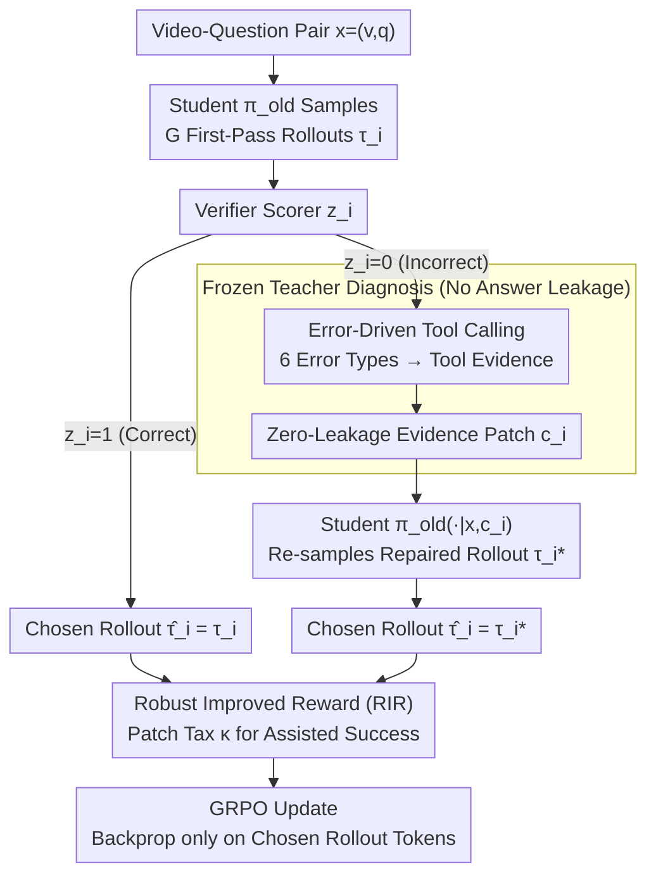

# Find, Fix, Reason: Context Repair for Video Reasoning

**Conference**: ICML 2026  
**arXiv**: [2604.16243](https://arxiv.org/abs/2604.16243)  
**Code**: Yes (FFR, anonymous link)  
**Area**: Multimodal VLM / Video Reasoning / Reinforcement Learning  
**Keywords**: Video Reasoning, GRPO, Tool-Augmented Teacher, Context Repair, Spatio-temporal Dependency

## TL;DR
This paper addresses the dilemma in video reasoning where on-policy RL stagnates at capability ceilings while off-policy distillation suffers from entropy collapse. It introduces a frozen, tool-augmented large teacher model that inserts minimal "evidence patches" (key-frame intervals, error types) when student rollouts fail. The student re-answers the same question under these refined conditions, and the repaired trajectories are incorporated into GRPO optimization via a chosen-rollout mechanism.

## Background & Motivation

**Background**: GRPO-based video reasoning LMMs (e.g., Video-R1, VideoRFT, VideoChat-R1) typically follow a pure on-policy RLVR route, using binary 0/1 signals to verify answer correctness. While successful in textual mathematical reasoning, this paradigm struggles with complex spatio-temporal dependencies and sparse reasoning templates in video, often leading to self-exploration plateaus.

**Limitations of Prior Work**: Three existing "breakthrough" routes have significant drawbacks: (a) hybrid policy (LUFFY, Replay) inserts strong teacher trajectories into a buffer, alleviating entropy collapse but remaining wholesale imitation that requires heavy regularization; (b) tool-integrated reasoners (Pixel-Reasoner, Video-Thinker) allow small models to call tools for evidence, but are limited by the small model's tool-calling accuracy, often falling into "self-doubt" loops; (c) SFT teacher distillation is simple but causes the student to lose on-policy exploration capabilities.

**Key Challenge**: The trade-off between the student model’s capability ceiling and the distribution shift caused by teacher guidance—the more the student sees, the more it becomes a replica of the teacher; the less it sees, the harder it is to break its own ceiling. The essence of the problem lies in the *granularity of intervention*: should one modify rewards, trajectories, or observations?

**Goal**: To find an "observation-level" intervention that modifies neither the task, the reward, nor the policy, but only the "evidence" seen by the student, thereby preserving on-policy characteristics while guiding exploration toward causal directions.

**Key Insight**: The authors observe that large models (GLM-4.5V) are significantly stronger than 7B students in instruction following and tool usage. They can reliably diagnose which spatio-temporal dependency caused a student's failure and locate evidence via simple tools (frame range, object region).

**Core Idea**: A frozen tool-augmented large teacher acts as a "diagnostician," outputting minimal evidence patches $c_i$ (e.g., "re-examine frames 13-17, notice the color of the lifted object") for failed student rollouts **without revealing the answer**. The student re-attempts the question given the original query + patch, and the repaired trajectory is included in the GRPO update as a chosen rollout.

## Method

### Overall Architecture
Each video-question pair $x=(v,q)$ undergoes two stages: ① The student samples $G$ first-pass rollouts $\{\tau_i\}$ using $\pi_{\theta_{old}}$, which are scored by a verifier; ② For failed rollouts $\tau_i$ ($z_i=0$), a frozen teacher $\mathcal{T}$ outputs an error type $e_i\in\{$temporal, spatial, attribute, counting, dynamics, logic$\}$ and an evidence patch $c_i$. The student re-samples a repaired rollout $\tau_i^*$ using $\pi_{\theta_{old}}(\cdot|x,c_i)$. Correct rollouts $\tau_i$ are kept directly. Finally, the "chosen rollout" $\hat\tau_i$ ($\tau_i$ if $z_i=1$, otherwise $\tau_i^*$) is used to calculate token-level importance ratios for the GRPO update.

### Key Designs

**1. Error-Driven Tool Calling: Granular Repair Signals for Different Root Causes**

For observation-level intervention to work, the teacher must know "where the student should look again." Different error causes require vastly different information—signals that are too vague (text only) or too localized (visual boxes only) lose information. FFR directs the teacher to classify failed rollouts into six categories (temporal / spatial / attribute / counting / dynamics / logic) and call corresponding tools: temporal outputs frame intervals, spatial outputs region coordinates, attribute outputs descriptive object features, etc. These textual error classes + optional visual contexts (frame indices, region masks) are assembled into patches $c_i$ and injected into the student prompt. Ablations confirm these signals are complementary; removing visual context drops Video-Holmes performance by 10.0 points, while removing GT references drops it by 7.6 points.

**2. Zero-Leakage Teacher Evidence Patch: Diagnosing without Revealing**

The efficacy of observation-level intervention relies on the teacher "pointing the way without giving the answer." If the teacher reveals the answer, the student degrades into wholesale imitation. FFR utilizes the teacher's ICL capabilities with designed negative prompts and format constraints to separate "diagnosis" from "answer." The teacher receives $\mathcal{S}_i=(x,y,\tau_i)$ (with GT) or $(x,\tau_i)$ (without GT) and is strictly forbidden from leaking the answer: in counting tasks, it cannot say "exactly 3 people in frame 15," but instead "please recount within frames [13,17]." This forces the student to **re-observe** rather than copy. Manual verification of 200 interactions showed a leakage rate reduction from 39.5% (unconstrained) to 0%.

**3. Chosen Rollout and Robust Improved Reward (RIR): Integrating Repaired Trajectories into GRPO**

Since repaired rollouts are sampled under modified observations (original query + patch), treating them as off-policy samples for importance sampling is unstable. FFR treats them as on-policy samples under different observations. A scalar score is calculated for each chosen rollout $\hat\tau_i$:

$$\tilde R_i=z_i\big(R(\tau_i)+R_{fmt}(\tau_i)\big)+(1-z_i)\big(R(\tau_i^*)+R_{fmt}(\tau_i^*)-\kappa\big),$$

where $\kappa\ge 0$ is the "patch tax," penalizing samples that only succeeded due to teacher assistance. Group normalization yields advantages $A_i=(\tilde R_i-\text{mean})/\text{std}$, and updates are performed using the token-level ratio $r_{i,t}(\theta)$ within the PPO clip framework, backpropagating only through chosen rollout tokens. The patch tax $\kappa=0.3$ proved optimal, balancing imitation and independent exploration.

### Loss & Training
The GRPO objective is $\mathcal{J}_{FFR}(\theta)=\tfrac{1}{\sum|\hat\tau_i|}\sum_i\sum_{t\in\hat\tau_i}\text{CLIP}(r_{i,t}(\theta),A_i,\epsilon)-\beta D_{KL}[\pi_\theta\|\pi_{ref}]$, applied only to chosen rollout tokens. Training used 4,000 samples, 8 rollouts/sample, 1 epoch, lr=5e-6, on 8×A100, with GLM-4.5V as the default teacher.

## Key Experimental Results

### Main Results
Performance was evaluated on 4 video reasoning (MMVU/VSI-Bench/VideoMMMU/Video-Holmes) and 4 general video understanding (LongVideoBench/LVBench/MVBench/TempCompass) benchmarks against 7B student baselines.

| Baseline/Method | MMVU | VSI-Bench | Video-Holmes | LVBench |
|---|---|---|---|---|
| GPT-4o | 75.4 | 34.0 | 42.0 | 48.9 |
| GLM-4.5V (Teacher) | 68.7 | - | - | 53.8 |
| Video-R1 | 63.8 | 35.8 | 36.5 | 35.3 |
| **+ FFR** | **68.5** | **38.9** | **52.3** | **38.1** |
| Gain | +11.75% | +22.33% | +51.16% | +24.10% |
| VideoRFT | 68.5 | 36.8 | 40.0 | 33.9 |
| **+ FFR** | **70.1** | **38.6** | **48.0** | **37.8** |

Notably, the 7B student outperformed GPT-4o by 10 points on Video-Holmes (causal narrative reasoning).

### Ablation Study

| Configuration | MMVU | Video-Holmes |
|---|---|---|
| vanilla GRPO | 60.3 | 45.6 |
| SFT + T-GRPO (Video-R1) | 63.8 | 36.5 |
| FFR (no visual context) | 64.4 | 42.3 |
| FFR (no GT reference) | 63.7 | 44.7 |
| FFR Full | **68.5** | **52.3** |
| SFT-Teacher 32B | 63.9 | 43.3 |
| SFT-Teacher 235B | 67.4 | 47.1 |
| FFR (teacher=32B) | **67.9** | **47.8** |
| FFR (teacher=235B) | **68.2** | **51.6** |

### Key Findings
- FFR with a 32B teacher (51.2 avg) outperformed SFT with a 235B teacher (50.7), suggesting targeted intervention is significantly more data-efficient than wholesale distillation.
- The intervention ratio decreased from 26.3% in early training to 13.7% later, while accuracy rose from 77.5% to 80.2%, indicating the student internalized diagnostic capabilities rather than relying on "cheating."
- Error distribution: Misconception (41.2%) > Spatial (32%) > Temporal (26.8%). Students primarily struggle with "understanding what is being asked" rather than failing to "see" the image.

## Highlights & Insights
- **Innovation in Granularity**: Observation-level intervention is a distinct innovation. Unlike prior works that modify rewards (downstream), trajectories (output), or policies (parameters), FFR modifies only what the student sees—the most lightweight yet targeted intervention.
- **Counter-intuitive "Diagnosis $\neq$ Answering"**: The teacher does not need to be correct; it only needs to diagnose where the student was wrong. This allows "diagnostic-only" distillation where a small model (Qwen3-VL-8B + FFR) can outperform its 32B teacher.
- **Patch Tax Nuance**: Using $\kappa$ to penalize assisted success forces the student to rank independent success higher than teacher-assisted success in advantage sorting, elegantly managing the tension between imitation and exploration.

## Limitations & Future Work
- Computational overhead is high due to teacher calls (vision understanding + tool use) for every failed rollout. GLM-4.5V was used for Pareto efficiency, but it remains costlier than pure RLVR.
- Potential teacher bias: If the teacher systematically misdiagnoses a specific problem type, the student may be misled.
- Leakage prevention relies on prompt engineering without mathematical guarantees.
- Generalization to architectures beyond Qwen2.5-VL and Qwen3-VL remains unverified.
- While the "declining intervention ratio" suggests internalization, further trajectory probing is needed to distinguish this from reward or distribution drift.

## Related Work & Insights
- **vs. LUFFY/Replay (hybrid policy)**: These mix off-policy teacher trajectories into the buffer, requiring complex regularization. FFR intervenes only at the observation level, preserving on-policy nature and leading across 8 benchmarks.
- **vs. Pixel-Reasoner/Video-Thinker (tool-use reasoner)**: These have students call tools themselves, which is unstable for small models. FFR out-sources tool use to the teacher, allowing the student to focus solely on evidence-based reasoning.
- **vs. SFT-Teacher**: SFT is wholesale imitation. FFR intervenes only during failure and provides "where to look" rather than "what to say"—FFR significantly outperforms SFT for any given teacher size.
- **Insight**: Observation-level intervention can be extended to any scenario where small models lack capability but large models excel at locating evidence, such as medical image diagnosis, code debugging, or agent task planning.

## Rating
- Novelty: ⭐⭐⭐⭐⭐ The choice of observation-level intervention, combined with zero-leakage prompt design and chosen rollouts, forms a robust new paradigm.
- Experimental Thoroughness: ⭐⭐⭐⭐⭐ Comprehensive coverage across 8 benchmarks, multiple base models, various teachers, and detailed ablation/dynamic analyses.
- Writing Quality: ⭐⭐⭐⭐ Comparisons of paradigms are clear (Figure 1), and case studies (Figure 3) are instructional, though some math notation is dense.
- Value: ⭐⭐⭐⭐⭐ The result of a 7B model surpassing GPT-4o is highly practical, and the method integrates seamlessly into existing GRPO pipelines.

<!-- RELATED:START -->

<!-- RELATED:END -->

## Related Papers

- [\[CVPR 2026\] Select Less, Reason More: Prioritizing Evidence Purity for Video Reasoning](../../CVPR2026/multimodal_vlm/select_less_reason_more_prioritizing_evidence_purity_for_video_reasoning.md)
- [\[CVPR 2026\] CoVR-R: Reason-Aware Composed Video Retrieval](../../CVPR2026/multimodal_vlm/covr-rreason-aware_composed_video_retrieval.md)
- [\[NeurIPS 2025\] Video-R1: Reinforcing Video Reasoning in MLLMs](../../NeurIPS2025/multimodal_vlm/video-r1_reinforcing_video_reasoning_in_mllms.md)
- [\[CVPR 2026\] OneThinker: All-in-one Reasoning Model for Image and Video](../../CVPR2026/multimodal_vlm/onethinker_all-in-one_reasoning_model_for_image_and_video.md)
- [\[CVPR 2026\] Think Visually, Reason Textually: Vision-Language Synergy in Abstract Reasoning](../../CVPR2026/multimodal_vlm/think_visually_reason_textually_vision-language_synergy_in_abstract_reasoning.md)

<!-- RELATED:END -->
