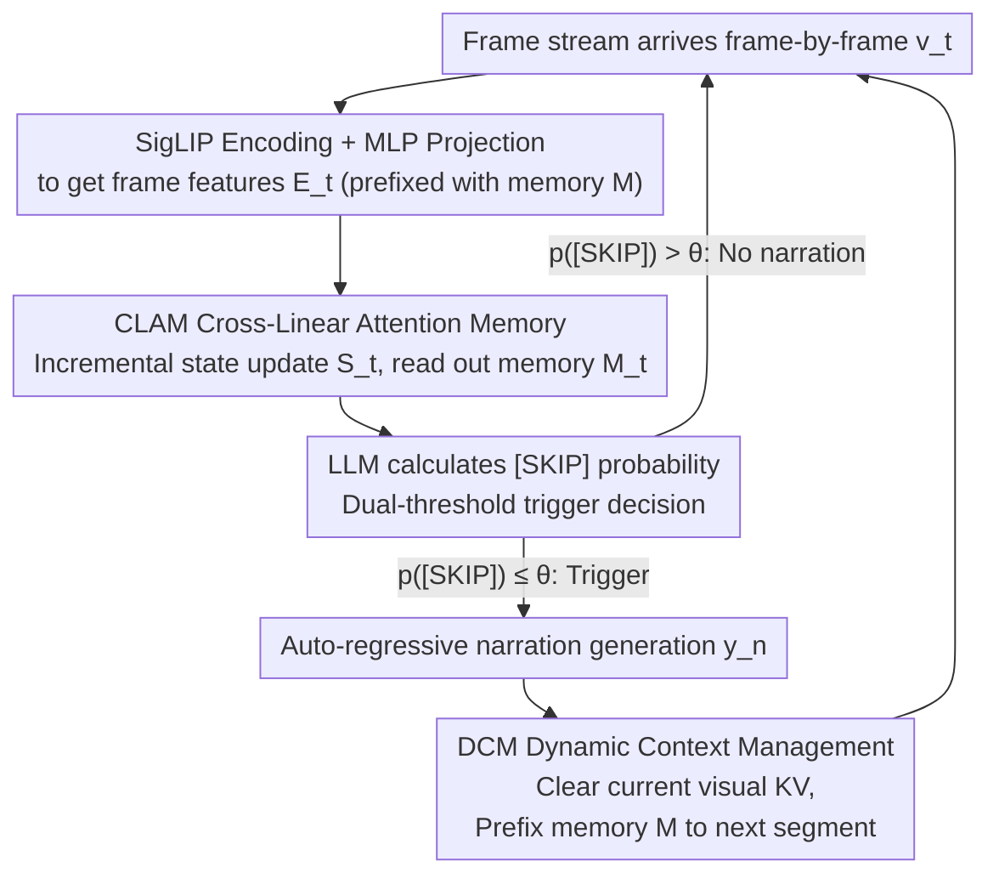

# FlowNar: Scalable Streaming Narration for Long-Form Videos

**Conference**: ICML 2026  
**arXiv**: [2606.00620](https://arxiv.org/abs/2606.00620)  
**Code**: https://github.com/zeyun-zhong/FlowNar (Available)  
**Area**: Video Understanding / Multimodal VLM / Streaming Video  
**Keywords**: Streaming Video Narration, KV Cache Pruning, Linear Attention, Long-Form Video Understanding, Self-conditioned Evaluation  

## TL;DR
FlowNar employs a combination of "clearing visual KV cache at segment ends + compressing historical visual information into fixed-length memory tokens via gated linear attention." This allows the streaming video narration model to maintain constant memory and computational overhead, processing $10\times$ longer videos and achieving $3\times$ throughput. Simultaneously, it introduces a self-conditioned evaluation protocol revealing that baseline methods are significantly overestimated in real-world deployment scenarios.

## Background & Motivation

**Background**: Online streaming narration requires LMMs to continuously receive a frame stream, autonomously determine when to output a narration, and generate the content. Representative works like Videollm-online and Videollm-mod can perform frame-aligned narration.

**Limitations of Prior Work**: These methods continuously store the KV pairs of all historical visual frames in the LLM context. Consequently, memory and computation grow at least linearly with video length—leading to OOM on 24GB GPUs and a significant drop in FPS over time. Furthermore, existing evaluations use *teacher-forcing* mode with Ground Truth (GT) narrations as history, masking the error accumulation of "previous mistakes propagating through subsequent generations" in real-world deployment.

**Key Challenge**: The dilemma of long context—retaining full visual history provides information but leads to complexity explosion and amplifies noise or erroneous history; pruning history saves memory but results in the loss of long-range visual information and narrative incoherence.

**Goal**: (1) Ensure visual memory and per-step computational complexity remain constant relative to video length $T$; (2) Retain long-term visual summaries to prevent performance collapse; (3) Provide an evaluation protocol closer to real deployment.

**Key Insight**: It is observed that what is truly needed between segments is not "all raw KV pairs," but rather a "visual summary sufficient for narrative continuity." Detailed KVs can be aggressively pruned after each narrative segment, passing forward only a fixed-size memory token block along the timeline.

**Core Idea**: A combination of "Dynamic Context Management (DCM) + Cross-Linear Attention Memory (CLAM)" is used to compress the complexity of visual history from $O(T)$ to $O(1)$, while the evaluation is "realized" using a self-conditioned protocol.

## Method

### Overall Architecture
The input is a continuous frame stream $\mathbf{V}=\{\mathbf{v}_t\}_{t=1}^{T}$, and the output is a narration sequence with timestamps $\Psi=\{(t_n, y_n)\}_{n=1}^{N}$. At each frame $t$, the pipeline performs: (1) SigLIP encoding + MLP projection to language space to obtain $\mathbf{E}_t$; (2) CLAM incrementally updates a $D\times D$ recurrent state $\mathbf{S}_t$ with current frame tokens, then reads out a fixed-length memory $\mathbf{M}_t \in \mathbb{R}^{M\times D}$ using $M$ learnable queries; (3) The LLM calculates the `[SKIP]` probability based on the visual cache $\mathcal{C}_t^{\text{vid}}$ and previous narration cache $\mathcal{C}_{n-1}^{\text{nar}}$ to decide whether to trigger narration; (4) Upon triggering, it auto-regressively generates $y_n$, then clears all detailed visual KVs for the current segment, prefixing the final memory $\mathbf{M}_{t_n}$ to the start of the next segment as a long-term summary. The FlowNar-C variant additionally retains only the last $k$ narration textual KVs to achieve constant complexity across all dimensions.

### Key Designs

**1. Dynamic Context Management (DCM) + Dual-threshold Trigger: Clearing visual KV after each segment to prevent error snowballing**

In self-conditioned deployment, long context not only consumes memory but also repeatedly feeds back "previous generation errors" into the LLM. DCM takes an aggressive approach: after each narration, it explicitly clears the visual KV $\mathcal{C}_t^{\text{vid}} \leftarrow \emptyset$, discarding even the prefixed $\mathbf{M}_{t_{n-1}}$, forcing the model to rely only on the newly computed $\mathbf{M}_{t_n}$ as history. Pacing is controlled by two thresholds: the primary threshold $\theta$ determines if $p(\text{[SKIP]} \mid \mathbf{E}_t, \mathcal{C}_{t-1}^{\text{vid}}, \mathcal{C}_{n-1}^{\text{nar}}) \le \theta$; immediately after a trigger, it switches to a lower $\theta_{\text{low}}=0.5$ for a short duration to suppress consecutive bursts. Ablations show that "retaining all history" actually performs worst (CIDEr 28.04 vs. CLAM 35.64), confirming that aggressive pruning is more stable than full history in self-conditioned settings.

**2. CLAM Cross-Linear Attention Memory: Compressing visual history into fixed-length tokens via gated linear attention**

Naive KV caches expand linearly, but between segments, only a "visual summary sufficient for continuity" is required. CLAM maintains a $D\times D$ recurrent state $\mathbf{S}_t$. Each frame token $\mathbf{x}_{t,j}$ computes key/value pairs and a gating matrix $\mathbf{G}_{t,j}\in(0,1)$, following the recurrence $\mathbf{S}_{t,j} = \mathbf{G}_{t,j} \odot \mathbf{S}_{t,j-1} + \mathbf{k}_{t,j}^\top \mathbf{v}_{t,j}$. Then, $M$ learnable queries $\mathbf{Z}$ are linearly projected to $\mathbf{Q}$ to read the fixed-length memory $\mathbf{M}_t = \mathbf{Q}\mathbf{S}_t$. The recurrent perspective of linear attention provides "constant memory, constant per-step computation, and parallelizable training." It decouples "compression" (token-by-token recurrence) and "reading" (fixed queries), avoiding the issues of similarity-based merging (like MovieChat) or long-range information loss in sliding windows.

**3. Self-conditioned Evaluation Protocol + Alignment before Scoring: Exposing error propagation masked by teacher-forcing**

Previous evaluations used teacher-forcing with GT narrations as history, hiding error accumulation where "the first mistake leads to constant failure," making mediocre models appear performant. The self-conditioned protocol requires each $y_n$ to be based only on the model's own previous $\{y_j^{\text{pred}}\}$. Since predicted and GT segments may not align in number or boundaries, the protocol first performs segment-level matching using IoU $\tau=0.5$ to calculate Precision/Recall/F1 for temporal alignment. It then uses Generalized IoU to retrieve the best-matching predicted segment for each GT segment and calculates CIDEr/METEOR/ROUGE-L on these pairs. This "alignment-first" protocol maintains temporal evaluation capability while exposing objective performance—in teacher-forcing, the gap between FlowNar and baselines narrows significantly, proving that prior SOTA numbers partially stem from "cheating" with GT history.

### Loss & Training
The model end-to-end minimizes standard next-token cross-entropy, with joint supervision on narration tokens $y_n$ and `[SKIP]` trigger tokens. During training, a segment-level attention mask is used: besides the causal mask, attention from the current segment to "original frame tokens of distant segments" and "memory tokens of distant segments" is blocked. This forces the model to depend solely on "previous end-segment $\mathbf{M}_{t_{n-1}}$ + current frames + generated narration," aligning training with the test-time KV clearing behavior. To bridge the disparity in positional encoding between training (continuous sequences) and inference (clearing cache), a persistent position counter is used during inference. Training FlowNar-1B on 4×H100 takes 67 GPU-hours, approximately $1.9\times$ that of Videollm-online.

## Key Experimental Results

### Main Results
Comparison with Videollm-online and Videollm-mod under the self-conditioned protocol on Ego4D / EgoExo4D / EpicKitchens100 long-form egocentric datasets (Llama-3-1B backbone):

| Dataset | Method | F1↑ | CIDEr↑ | Cache (M)↓ |
|--------|------|-----|--------|-----------|
| Ego4D | Videollm-online | 16.29 | 28.04 | 737.6 |
| Ego4D | FlowNar-C | 17.90 | 34.48 | **20.2** |
| Ego4D | **FlowNar** | **24.85** | **35.64** | 59.2 |
| EgoExo4D | Videollm-online | 31.77 | 69.88 | 878.5 |
| EgoExo4D | **FlowNar** | **32.99** | **75.33** | 125.9 |
| EK100 | Videollm-online | 12.98 | 29.00 | 1096.0 |
| EK100 | FlowNar-C | 25.20 | 37.28 | **22.7** |
| EK100 | **FlowNar** | **29.12** | **46.63** | 65.3 |

FlowNar-C reduces cache on EK100 from 1096M to 22.7M (approx. $48\times$ reduction) while CIDEr increases from 29.00 to 37.28.

### Ablation Study
Ablation of visual history strategies under self-conditioned Ego4D:

| Visual History Strategy | DCM | CIDEr↑ | METEOR↑ | ROUGE↑ |
|------|-----|--------|---------|--------|
| No visual history | ✓ | 30.40 | 11.36 | 30.54 |
| Recent frames only | ✓ | 30.16 | 11.42 | 30.59 |
| Retain full history | ✗ | 28.04 | 11.33 | 29.86 |
| **CLAM** | ✓ | **35.64** | **12.14** | **31.64** |

### Key Findings
- **Full history is the worst performing** (CIDEr 28.04)—verifying that in self-conditioned settings, "long context = long error chains"; DCM is a necessity.
- **CLAM significantly outperforms alternatives** like last-$k$, K-Means, MovieChat-style token merging, TokenMLP, and RetNet (Table 5). This indicates that parametric compression via gated linear attention is more suitable for streaming than similarity-based or fixed-window methods.
- Dual-threshold triggering improves F1 from 16.78 to 24.85 (Table 4), showing that pacing control is as vital as context management.
- Under the teacher-forcing protocol (Table 2), the gap between FlowNar and baselines narrows significantly, suggesting that previous SOTA results benefited from the "cheating" nature of GT history.

## Highlights & Insights
- **"Less is More" empirically proven in long video**: In self-conditioned settings, aggressive pruning is more accurate than full history because the cost of error propagation outweighs the cost of information loss. This mirrors observations in NLP where "garbage context" drags down generation.
- **Recurrent view of Linear Attention fits streaming compression**: Interpreting $\mathbf{S}_t$ as "content-addressable associative memory" and reading a fixed summary with learnable queries effectively converts the Transformer-RNN into a "compressor + reader," avoiding the fragility of similarity heuristics.
- **Evaluation protocol is a core contribution**: Replacing teacher-forcing with self-conditioning + "alignment before scoring" resets the benchmarks for the long-video narration track, representing a methodology-level correction.

## Limitations & Future Work
- Training cost is roughly $1.9\times$ Videollm-online, primarily due to unoptimized attention kernels under segment-level masking and additional memory tokens.
- Memory capacity arguments are based on the theoretical result that $D\times D$ states can store $O(D)$ key-value pairs; whether this holds for ultra-long (multi-hour) videos remains to be tested beyond egocentric datasets.
- Pacing hyperparameters like $\theta_{\text{low}}$ and refresh periods depend on average segment durations of the dataset and may require recalibration for different video sources.
- Current evaluations are limited to English; error propagation patterns in multi-lingual streaming generation may differ.

## Related Work & Insights
- **vs. Videollm-online**: Both perform frame-aligned narration, but this work explicitly prunes visual KV and adds linear attention summaries, reducing complexity from $O(T)$ to $O(1)$.
- **vs. Videollm-mod**: Videollm-mod uses routing to reduce computation, but cache still grows linearly; FlowNar excels in both cache reduction and narration quality.
- **vs. MovieChat / Online K-Means**: Those methods merge tokens based on similarity, which is heuristic-driven and still allows memory to grow; CLAM uses learnable gating for parametric, fixed-length compression.

## Rating
- Novelty: ⭐⭐⭐⭐ The triad of DCM + Linear Attention compression + Self-conditioned evaluation is a robust complete solution.
- Experimental Thoroughness: ⭐⭐⭐⭐⭐ Extensive testing across three datasets, two protocols, and multi-dimensional ablations.
- Writing Quality: ⭐⭐⭐⭐ Clear algorithms and motivation, though some LaTeX rendering issues appear in formulas.
- Value: ⭐⭐⭐⭐⭐ Directly addresses engineering bottlenecks in streaming narration and reshapes the evaluation standards of the field.

<!-- RELATED:START -->

## Related Papers

- [\[CVPR 2026\] MSJoE: Jointly Evolving MLLM and Sampler for Efficient Long-Form Video Understanding](../../CVPR2026/multimodal_vlm/msjoe_jointly_evolving_mllm_and_sampler_for_efficient_long-form_video_understand.md)
- [\[CVPR 2026\] REVISOR: Beyond Textual Reflection, Towards Multimodal Introspective Reasoning in Long-Form Video Understanding](../../CVPR2026/multimodal_vlm/revisor_beyond_textual_reflection_towards_multimodal_introspective_reasoning_in_.md)
- [\[CVPR 2026\] Thinking With Videos: Multimodal Tool-Augmented Reinforcement Learning for Long Video Reasoning](../../CVPR2026/multimodal_vlm/thinking_with_videos_multimodal_tool-augmented_reinforcement_learning_for_long_v.md)
- [\[CVPR 2026\] VinQA: Visual Elements Interleaved Long-form Answer Generation for Real-World Multimodal Document QA](../../CVPR2026/multimodal_vlm/vinqa_visual_elements_interleaved_long-form_answer_generation_for_real-world_mul.md)
- [\[CVPR 2026\] AXG-Reasoner: Error Detection and Explanation in Long Task Videos with Vision-Language Models](../../CVPR2026/multimodal_vlm/axg-reasoner_error_detection_and_explanation_in_long_task_videos_with_vision-lan.md)

<!-- RELATED:END -->
