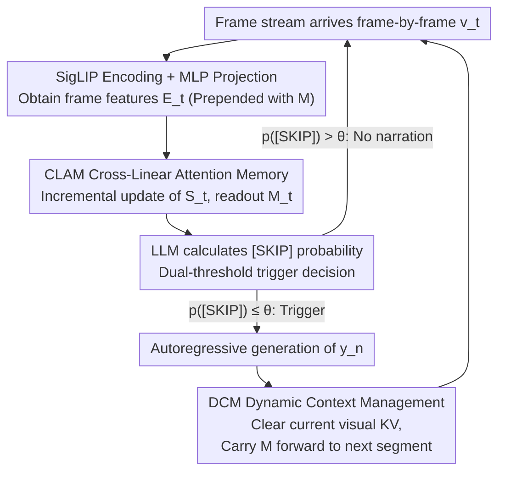

# FlowNar: Scalable Streaming Narration for Long-Form Videos

**Conference**: ICML 2026  
**arXiv**: [2606.00620](https://arxiv.org/abs/2606.00620)  
**Code**: https://github.com/zeyun-zhong/FlowNar (Available)  
**Area**: Video Understanding / Multimodal VLM / Streaming Video  
**Keywords**: Streaming Video Narration, KV Cache Pruning, Linear Attention, Long-form Video Understanding, Self-conditioned Evaluation

## TL;DR
FlowNar employs a combination of "segment-end visual KV cache clearing + compressing historical visual information into fixed-length memory tokens via gated linear attention." This allows the streaming video narration model to maintain constant memory and computational overhead, enabling the processing of $10\times$ longer videos with $3\times$ throughput. Simultaneously, the introduction of a self-conditioned evaluation protocol reveals that baseline methods are significantly overestimated under real-world deployment scenarios.

## Background & Motivation

**Background**: Online streaming narration requires LMMs to continuously receive frame streams, autonomously determine when to output a narration, and generate content. Representative works such as Videollm-online and Videollm-mod can already perform frame-aligned narration.

**Limitations of Prior Work**: These methods continuously store KV caches of all historical visual frames in the LLM context, leading to memory and computational costs that grow at least linearly with video length. This causes OOM (Out-of-Memory) on a 24GB GPU and a significant drop in FPS over time. Furthermore, existing evaluations use *teacher-forcing* mode with GT (Ground Truth) narrations as history, masking the error accumulation of "one mistake leads to another" seen in real-world deployment.

**Key Challenge**: The dilemma of long context—retaining all visual history provides information but leads to complexity explosion and amplifies noise/erroneous history; pruning history saves memory but loses distant visual information, leading to disjointed narratives.

**Goal**: (1) Maintain constant memory and per-step computational complexity relative to video length $T$; (2) Preserve distant visual summaries to avoid performance collapse; (3) Provide an evaluation protocol closer to real-world deployment.

**Key Insight**: It is observed that what is truly needed between segments is not "all raw KV caches," but a "visual summary sufficient for maintaining narrative continuity." Detailed KV caches can be aggressively pruned after each narrative segment is generated, passing only a fixed-size memory token block forward in time.

**Core Idea**: Use a combination of "Dynamic Context Management (DCM) + Cross-Linear Attention Memory (CLAM)" to compress the complexity of visual history from $O(T)$ to $O(1)$, and "realize" evaluation through a self-conditioned protocol.

## Method

### Overall Architecture
The input is a continuous frame stream $\mathbf{V}=\{\mathbf{v}_t\}_{t=1}^{T}$, and the output is a timestamped narration sequence $\Psi=\{(t_n, y_n)\}_{n=1}^{N}$. The pipeline performs the following at each frame $t$: (1) SigLIP encoding + MLP projection into language space to obtain $\mathbf{E}_t$; (2) CLAM incrementally updates a $D\times D$ recurrent state $\mathbf{S}_t$ using current frame tokens, then reads out fixed-length memory $\mathbf{M}_t \in \mathbb{R}^{M\times D}$ using $M$ learnable queries; (3) The LLM calculates the `[SKIP]` probability based on the visual cache $\mathcal{C}_t^{\text{vid}}$ and previous narration cache $\mathcal{C}_{n-1}^{\text{nar}}$ to decide whether to trigger narration; (4) Upon triggering, $y_n$ is generated autoregressively, all detailed visual KV caches of the current segment are cleared, and the segment-end memory $\mathbf{M}_{t_n}$ is prepended to the start of the next segment as a distant summary. The FlowNar-C variant further maintains only the text KV caches of the most recent $k$ narrations to achieve constant complexity across all dimensions.

### Key Designs

**1. Dynamic Context Management (DCM) + Dual-threshold Triggering: Clear visual KV after each segment to prevent error snowballing**

In self-conditioned deployment, long context not only consumes memory but also repeatedly feeds "previous narration errors" back into the LLM, causing them to snowball. DCM takes an aggressive approach: after each narration is generated, the current segment's visual KV $\mathcal{C}_t^{\text{vid}} \leftarrow \emptyset$ is explicitly cleared, and even the prepended $\mathbf{M}_{t_{n-1}}$ is discarded, forcing the model to rely solely on the newly calculated $\mathbf{M}_{t_n}$ as history. Pacing is controlled by two thresholds: the default main threshold $\theta$ determines if $p(\text{[SKIP]} \mid \mathbf{E}_t, \mathcal{C}_{t-1}^{\text{vid}}, \mathcal{C}_{n-1}^{\text{nar}}) \le \theta$ triggers; immediately after triggering, it switches to a lower $\theta_{\text{low}}=0.5$ for a short period to suppress rapid-fire triggers. Ablation shows that "retaining all history" actually performs worst (CIDEr 28.04 vs CLAM 35.64), confirming that aggressive pruning is more stable than full history under self-conditioned settings.

**2. CLAM: Cross-Linear Attention Memory: Compressing visual history into fixed-length memory tokens using Gated Linear Attention**

Naive KV caches expand linearly with the number of frames, but what is needed between segments is a "visual summary sufficient to maintain continuity." CLAM maintains a $D\times D$ recurrent state $\mathbf{S}_t$. For each token $\mathbf{x}_{t,j}$ within a frame, it calculates key/value and a gate matrix $\mathbf{G}_{t,j} \in (0,1)$, updating via $\mathbf{S}_{t,j} = \mathbf{G}_{t,j} \odot \mathbf{S}_{t,j-1} + \mathbf{k}_{t,j}^\top \mathbf{v}_{t,j}$. Then, $M$ learnable queries $\mathbf{Z}$ are linearly projected to $\mathbf{Q}$ to read out fixed-length memory $\mathbf{M}_t = \mathbf{Q}\mathbf{S}_t$. The recurrent perspective of linear attention naturally combines "constant memory, constant per-step computation, and parallelizability during training." It also decouples "compression" (token-by-token recurrence) from "readout" (fixed queries), avoiding the pitfalls of similarity-based merging in MovieChat or simple sliding windows that lose long-range information. Ablations show CLAM significantly outperforms last-$k$, K-Means, token merging, TokenMLP, and RetNet alternatives.

**3. Self-conditioned Evaluation Protocol + Align-then-Score: Exposing error propagation masked by teacher-forcing**

Previous evaluations used teacher-forcing where GT narrations were fed as history, masking the error accumulation inherent in real-world deployment. The self-conditioned protocol requires each $y_n$ to be based only on the model's previously generated $\{y_j^{\text{pred}}\}$, without GT input. Since predicted segments and GT segments may not align in count or boundaries, segment-level matching is first performed using IoU $\tau=0.5$ to calculate Precision/Recall/F1 for temporal alignment. Then, Generalized IoU is used to retrieve the best-matching predicted segment for each GT segment, and narration quality (CIDEr/METEOR/ROUGE-L) is calculated on these pairs. This "align-then-score" protocol maintains temporal evaluation capability while exposing real-world error accumulation—FlowNar's lead over baselines narrows significantly under teacher-forcing, suggesting that prior SOTA numbers partially derived from "cheating with GT history."

### Loss & Training
The model end-to-end minimizes standard next-token cross-entropy, with joint supervision for narration tokens $y_n$ and the `[SKIP]` trigger token. During training, a segment-level attention mask is used (in addition to the causal mask, it blocks attention from the current segment to "raw frame tokens of distant segments" and "memory tokens of distant segments"). This forces the model to rely only on "the end-of-previous-segment $\mathbf{M}_{t_{n-1}}$ + current segment frames + generated narration," consistent with the cache-clearing behavior at inference. To bridge the gap in positional encoding between training (multiple segments in one sequence) and inference (clearing cache), an independent position counter is used at inference to simulate training-style position IDs. Cost: Training FlowNar-1B on $4\times$ H100 takes 67 GPU-hours, approximately $1.9\times$ that of Videollm-online (one-time overhead).

## Key Experimental Results

### Main Results
Comparison with Videollm-online and Videollm-mod under the self-conditioned protocol on three long-form egocentric datasets (Llama-3-1B backbone):

| Dataset | Method | F1↑ | CIDEr↑ | Cache (M)↓ |
|---------|--------|-----|--------|-----------|
| Ego4D | Videollm-online | 16.29 | 28.04 | 737.6 |
| Ego4D | FlowNar-C | 17.90 | 34.48 | **20.2** |
| Ego4D | **FlowNar** | **24.85** | **35.64** | 59.2 |
| EgoExo4D | Videollm-online | 31.77 | 69.88 | 878.5 |
| EgoExo4D | **FlowNar** | **32.99** | **75.33** | 125.9 |
| EK100 | Videollm-online | 12.98 | 29.00 | 1096.0 |
| EK100 | FlowNar-C | 25.20 | 37.28 | **22.7** |
| EK100 | **FlowNar** | **29.12** | **46.63** | 65.3 |

FlowNar-C reduces cache from 1096M to 22.7M (approx. $48\times$ reduction) on EK100 while improving CIDEr from 29.00 to 37.28.

### Ablation Study
Ablation of visual history strategies under self-conditioning on Ego4D:

| Visual History Strategy | DCM | CIDEr↑ | METEOR↑ | ROUGE↑ |
|-------------------------|-----|--------|---------|--------|
| No History Frames | ✓ | 30.40 | 11.36 | 30.54 |
| Recent Frames Only | ✓ | 30.16 | 11.42 | 30.59 |
| Retain All Frames | ✗ | 28.04 | 11.33 | 29.86 |
| **CLAM** | ✓ | **35.64** | **12.14** | **31.64** |

### Key Findings
- **Retaining all history is the worst** (CIDEr 28.04), validating that "long context = long error chain" under self-conditioning; DCM is a necessity, not an option.
- **CLAM far outperforms alternatives** such as last-$k$, K-Means, MovieChat-style token merging, TokenMLP, and restructured RetNet (Table 5), indicating that gated linear attention for fixed-length compression is more suitable for streaming narration than similarity-based or window-based methods.
- The dual-threshold trigger improves F1 from a static 16.78 to 24.85 (Table 4), showing that pacing control is as critical as context management.
- Under the teacher-forcing protocol (Table 2), the gap between FlowNar and baselines narrows, proving that previous SOTA results were partly inflated by "cheating GT history."

## Highlights & Insights
- **"Less is more" is empirically proven for long video**: Aggressive pruning is more accurate than retaining full history under self-conditioning because the cost of error propagation outweighs the cost of information loss—this echoes observations in NLP where "garbage context" drags down generation.
- **Linear attention's recurrent view fits streaming compression perfectly**: Interpreting $\mathbf{S}_t$ as "content-addressable associative memory" and reading out fixed-length summaries using learnable queries essentially turns the Transformer into an "Encoder-RNN" hybrid, avoiding the fragility of similarity heuristics in token merging.
- **The evaluation protocol is a core contribution**: Replacing teacher-forcing with self-conditioning + align-then-score scales the true SOTA of "long video narration," representing a methodological correction.

## Limitations & Future Work
- The training cost is $1.9\times$ higher than Videollm-online, primarily due to unoptimized attention kernels under segment-level masking and additional memory tokens.
- Memory capacity justification is based on the theoretical result that $D\times D$ states can store $O(D)$ key-value pairs; whether this holds for ultra-long (hour-level+) videos remains to be tested beyond egocentric datasets.
- Hyperparameters for the trigger (e.g., $\theta_{\text{low}}$, refresh cycles) depend on the average segment duration of the dataset, requiring re-calibration for different video sources.
- Current evaluations are limited to English; error propagation patterns in multilingual streaming generation may differ.

## Related Work & Insights
- **vs Videollm-online**: Both perform frame-aligned narration, but FlowNar explicitly prunes visual KV and adds linear attention summaries, reducing visual context complexity from $O(T)$ to $O(1)$.
- **vs Videollm-mod**: Videollm-mod uses routing to reduce intermediate visual computation, but its cache still grows linearly. FlowNar dominates in both cache efficiency and narration quality.
- **vs MovieChat / Online K-Means**: Those methods merge tokens based on similarity, which is heuristic-dependent and still allows memory to grow; CLAM uses learnable gating for parametric, fixed-length, end-to-end compression.
- **vs Streaming QA (e.g., StreamForest)**: Those works trigger answers based on external queries, whereas this work autonomously decides when to narrate. The memory management concepts are complementary.

## Rating
- Novelty: ⭐⭐⭐⭐ Packaging DCM, linear attention compression, and self-conditioned evaluation into a complete solution is highly effective.
- Experimental Thoroughness: ⭐⭐⭐⭐⭐ Conducted cross-dataset validation, two evaluation protocols, multi-dimensional memory ablations, and training/inference alignment.
- Writing Quality: ⭐⭐⭐⭐ Clear pseudo-code, motivation, and diagrams.
- Value: ⭐⭐⭐⭐⭐ Directly addresses engineering bottlenecks in long-video streaming and provides a protocol that resets the standards of the field.

<!-- RELATED:START -->

## Related Papers

- [\[CVPR 2026\] MSJoE: Jointly Evolving MLLM and Sampler for Efficient Long-Form Video Understanding](../../CVPR2026/multimodal_vlm/msjoe_jointly_evolving_mllm_and_sampler_for_efficient_long-form_video_understand.md)
- [\[AAAI 2026\] MAVIS: A Benchmark for Multimodal Source Attribution in Long-form Visual Question Answering](../../AAAI2026/multimodal_vlm/mavis_a_benchmark_for_multimodal_source_attribution_in_long-form_visual_question.md)
- [\[CVPR 2026\] VinQA: Visual Elements Interleaved Long-form Answer Generation for Real-World Multimodal Document QA](../../CVPR2026/multimodal_vlm/vinqa_visual_elements_interleaved_long-form_answer_generation_for_real-world_mul.md)
- [\[CVPR 2026\] Streaming Video Instruction Tuning (Streamo)](../../CVPR2026/multimodal_vlm/streaming_video_instruction_tuning.md)
- [\[CVPR 2025\] ReVisionLLM: Recursive Vision-Language Model for Temporal Grounding in Hour-Long Videos](../../CVPR2025/multimodal_vlm/revisionllm_recursive_vision-language_model_for_temporal_grounding_in_hour-long_.md)

<!-- RELATED:END -->
