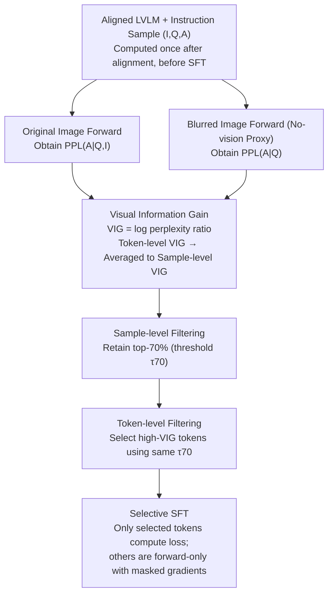

# Focusing Where Vision Matters: Selective Training for Large Vision Language Models via Visual Information Gain

**Conference**: ICML 2026  
**arXiv**: [2602.17186](https://arxiv.org/abs/2602.17186)  
**Code**: To be confirmed  
**Area**: Multimodal VLM  
**Keywords**: Visual Information Gain, Selective Training, Language Bias, Token-level Loss Masking, Data-efficient Instruction Tuning

## TL;DR
This paper proposes **Visual Information Gain (VIG)**—a visual dependency metric based on the log-ratio of perplexity between "with image vs. without image (approximated by a blurred image)." It quantifies how much an image is actually utilized at both sample and token granularities. By performing selective instruction fine-tuning—calculating loss only on high-VIG samples and tokens—LLaVA-1.5-13B outperforms vanilla training across all benchmarks using only 21% of effective tokens, while significantly mitigating language bias and hallucinations.

## Background & Motivation

**Background**: LVLMs (e.g., LLaVA, ShareGPT4V, Qwen-VL) are trained by jointly tuning a vision encoder, an adapter, and an LLM for VQA, captioning, and multimodal reasoning. The mainstream training approach feeds all instruction-tuning data with equal weight for next-token SFT.

**Limitations of Prior Work**: Models frequently exhibit "language bias"—outputs are dominated by text priors even when an image is present, leading to visual ignorance and hallucinations (describing non-existent objects). Existing mitigation strategies include: (1) contrastive decoding during inference between image/no-image outputs; (2) modifying attention mechanisms to force higher weights on image tokens; (3) using stronger models to generate higher-quality data. However, none of these **quantify how much information each sample or token actually gains from the image**.

**Key Challenge**: Typical LVLM instruction data contains both samples that require the image to answer (e.g., color, spatial relations) and samples solvable by common sense alone. At the token level, visually grounded content words (white, sitting, lying) and purely syntactic words (a, the, of) are treated equally by the same cross-entropy loss. This "indiscriminate supervision" encourages models to exploit "language shortcuts," as predicting syntactic words is much easier than predicting vision-dependent ones.

**Goal**: (1) Design a metric to quantify "visual information contribution" at both sample and token granularities; (2) Implement selective training by discarding low-VIG samples and masking low-VIG tokens; (3) Improve visual understanding and reduce hallucinations with less supervision.

**Key Insight**: From an information theory perspective, if an image is helpful for prediction, providing it should reduce the model's uncertainty (perplexity) regarding the answer. Conversely, if perplexity remains unchanged (or increases), the image was not utilized for that specific data or token.

**Core Idea**: Define $\mathrm{VIG} = \log\frac{\mathrm{PPL}(A|Q)}{\mathrm{PPL}(A|Q,I)}$, approximate "no vision" using a blurred image, and apply a single threshold $\tau_p$ to perform selection at both the sample and token levels.

## Method

### Overall Architecture
The method consists of two steps: **(1) VIG Computation**: For each multimodal instruction sample $(I,Q,A)$, two forward passes are performed using a pre-trained aligned LVLM—one with the original image and one with a blurred image (serving as a "no vision" proxy). The perplexity ratio yields a sample-level $\mathrm{VIG}_i$, which is also decomposed into token-level $\mathrm{VIG}_{i,t}$. **(2) Selective Fine-tuning**: Samples are ranked by $\mathrm{VIG}_i$ to retain the top-$p\%$ (default $p=70$, threshold $\tau_{70}$). Within these retained samples, loss is only calculated for tokens satisfying $\mathrm{VIG}_{i,t}\geq\tau_{70}$. Other tokens participate in the forward pass but do not contribute gradients.

### Key Designs

**1. Visual Information Gain: Quantifying visual dependency via log-perplexity ratio**

To perform selective training, a metric is needed to measure image utility. VIG originates from the information theory intuition: if an image is useful, its presence should reduce uncertainty. $\mathrm{VIG}=\log(\mathrm{PPL}(A|Q)/\mathrm{PPL}(A|Q,I))=\mathcal{L}(A|Q)-\mathcal{L}(A|Q,I)$, representing the cross-entropy reduction under the image condition. Under one-hot supervision, this simplifies to $\mathrm{VIG}=D_{\text{KL}}(p_{A|Q}\|q_Q)-D_{\text{KL}}(p_{A|I,Q}\|q_{I,Q})$, the correction of the prediction distribution bias by visual input. Unlike direct KL divergence, this metric naturally decomposes into token-level $\mathrm{VIG}_{i,t}=-\log q_\theta(a_t|a_{<t},Q)+\log q_\theta(a_t|a_{<t},Q,z_v)$, which averages back to $\mathrm{VIG}_i$.

**2. Dual-granularity Selection: Focussing gradient budget with a shared threshold $\tau_p$**

Instruction data contains both "vision-critical" and "common-sense" samples. At the token level, treat visually grounded words (white, sitting) and syntactic words (a, the) equally encourages language shortcuts. VIG isolates the "should-be-learned" subset: it first selects the top-$p\%$ samples $\mathcal{S}_p=\{i\mid\mathrm{VIG}_i\geq\tau_p\}$ via descending $\mathrm{VIG}_i$, then applies the **same threshold** $\tau_p$ within these samples to pick tokens $\mathcal{T}_i^+=\{t\mid\mathrm{VIG}_{i,t}\geq\tau_p\}$. Masked tokens are forward-propagated to maintain context integrity but do not update gradients. Sharing $\tau_p$ avoids new hyperparameters; $p=70$ is the empirically determined "sweet spot."

**3. Blurred Image as Proxy & Post-alignment Computation**

VIG requires a "no visual input" distribution $q_Q$. Since LVLM architectures require visual input, this work replaces image $I$ with its Gaussian-blurred version to obtain $\mathrm{PPL}(A|Q)$. This maintains the standard vision encoder pipeline and avoids out-of-distribution perplexity spikes while stripping visual signals. Calculation is performed after pre-training (adapter alignment) but before instruction tuning. At this stage, visual features are aligned to the language space, yet the model has not overfitted to instructions, making VIG a "prior filter" rather than a "post-hoc diagnostic."

### Loss & Training
LLaVA-1.5 7B/13B and ShareGPT4V 7B are aligned using 558K (or 1.2M) image-caption pairs and fine-tuned on ~665K instructions. Open-Qwen2VL 2B is tuned on 1M MAmmoTH-VL samples. $p=70$ is fixed; VIG is only applied to multimodal samples. Other hyperparameters follow vanilla baselines except for the loss mask.

## Key Experimental Results

### Main Results

| Model | # Active Tokens | LLaVA-W ↑ | MMVet ↑ | CV-Bench ↑ | POPE F1 ↑ | CHAIR $C_S$ ↓ | MMHal Hall. ↓ |
|------|-----------------|-----------|---------|------------|-----------|---------------|----------------|
| LLaVA-1.5 7B (vanilla) | 58.61M (100%) | 59.02 | 28.62 | 59.18 | 87.08 | 52.93 | 71.25 |
| LLaVA-1.5 7B + VIG (Ours) | 38.45M (-34%) | **61.22** | **32.71** | **62.48** | **87.47** | **47.00** | **62.78** |
| LLaVA-1.5 13B (vanilla) | 58.61M (100%) | 72.01 | 36.19 | 60.16 | 87.05 | 51.96 | 67.09 |
| LLaVA-1.5 13B + VIG (Ours) | 12.14M (**-79%**) | **73.45** | **36.87** | **62.89** | **87.53** | **48.19** | **63.11** |

On 13B, Ours outperforms vanilla across 8/8 metrics using only **21%** effective tokens. For 7B, MMVet improved by 4.1 points and the CHAIR $C_S$ hallucination rate dropped from 52.93 to 47.00.

### Ablation Study

| Config | Meaning | Key Observation |
|------|------|---------|
| Full data, full token (vanilla) | No selection | Baseline |
| Top-70% sample, full token | Sample-level only | Improves most metrics, limited hallucination relief |
| Full data, token mask | Token-level only | Slight vision improvement, token waste |
| Top-70% sample + token mask (Default) | Dual-granularity | Maximum gains in efficiency and hallucination reduction |
| Threshold $p$=30/50/70/90 | Selection ratio | $p=70$ is the best trade-off; too low underfits, too high degrades to vanilla |

### Key Findings
- **Token-level filtering is the true source of hallucination suppression**: Sample filtering alone primarily improves efficiency. Masking syntactic tokens (loss diff $\approx 0$) forces gradients to concentrate on visual keywords, compelling the model to "actually look at the image."
- **VIG consistency with benchmark modality dependence**: VIG distributions for COCO/CV-Bench/POPE are positive (vision-heavy), while GQA/SQA are neutral or negative (text-heavy), positioning VIG as a "visual dependency thermometer" for benchmarks.
- **Sensitivity to image content**: Fixing Q-A and varying the image shows VIG=0.923 for correct images, VIG=0.409 for partially correct (wrong attributes), and VIG=-0.520 for contradictory images.
- **Better Scaling**: The 13B model remains superior with only 12.14M (-79%) active tokens, suggesting larger models benefit more from "high-quality sparse supervision."

## Highlights & Insights
- **Blurred images as a counterfactual proxy is a lightweight trick**: It bypasses the "no None input" constraint of LVLM architectures while maintaining a normal pipeline, making VIG a plug-and-play metric.
- **The shared threshold $\tau_p$ is elegant**: It ensures that only high-density visual tokens within high-utility samples contribute to the loss, effectively identifying the "upper-right" high-VIG quadrant in the (sample, token) grid.
- **VIG as a general "visual importance" score**: Beyond selective training, it can be used for benchmark normalization, hallucination data mining, and reward shaping in multimodal RLHF.

## Limitations & Future Work
- VIG depends on specific blur configurations; residual low-frequency cues in blurred images might underestimate true VIG.
- VIG is a static pre-computed score; it doesn't update dynamically. The value of a sample might change as the model learns.
- Threshold $p=70$ was not optimized for model size or data scale (e.g., 2B vs 13B).
- Current experiments are limited to the SFT stage; potential in RLHF/DPO/RLVR or other modalities (video/audio) remains unexplored.

## Related Work & Insights
- **vs. Contrastive Decoding (Leng et al. 2024)**: That method compares "image vs. no-image" during inference (doubling cost). This work moves the logic to training, making inference cost-free.
- **vs. Selective Modeling for LLM (Lin et al. 2024)**: While LLMs use reference loss for token selection, this work adapts the concept to multimodality using "no-vision" as the reference.
- **vs. Data Quality Filtering**: Unlike strategies that use stronger models to rewrite data, VIG relies only on the model's own forward pass, making it cost-effective and model-independent.

## Rating
- Novelty: ⭐⭐⭐⭐ Establishing visual dependency via perplexity difference at the token level is a first.
- Experimental Thoroughness: ⭐⭐⭐⭐ Tested across 4 LVLMs and 8 benchmarks, though lacking RLHF scenarios.
- Writing Quality: ⭐⭐⭐⭐⭐ Derivations are clean; visualizations are highly persuasive.
- Value: ⭐⭐⭐⭐ Provides a "zero architecture change" efficiency tool, offering ~5× speedup on 13B with performance gains.

<!-- RELATED:START -->

...

## Related Papers

- [\[ICML 2026\] VEENA: Interpreting and Enhancing Emotional Circuits in Large Vision-Language Models via Cross-Modal Information Flow](interpreting_and_enhancing_emotional_circuits_in_large_vision-language_models_vi.md)
- [\[ICML 2026\] On the Adversarial Robustness of Large Vision-Language Models under Visual Token Compression](on_the_adversarial_robustness_of_large_vision-language_models_under_visual_token.md)
- [\[ICML 2026\] Large Vision-Language Models Get Lost in Attention](large_vision-language_models_get_lost_in_attention.md)
- [\[ICML 2026\] Jailbreaking Vision-Language Models Through the Visual Modality](jailbreaking_vision-language_models_through_the_visual_modality.md)
- [\[ICML 2026\] From Seeing to Thinking: Decoupling Perception and Reasoning Improves Post-Training of Vision-Language Models](from_seeing_to_thinking_decoupling_perception_and_reasoning_improves_post-traini.md)

<!-- RELATED:END -->
