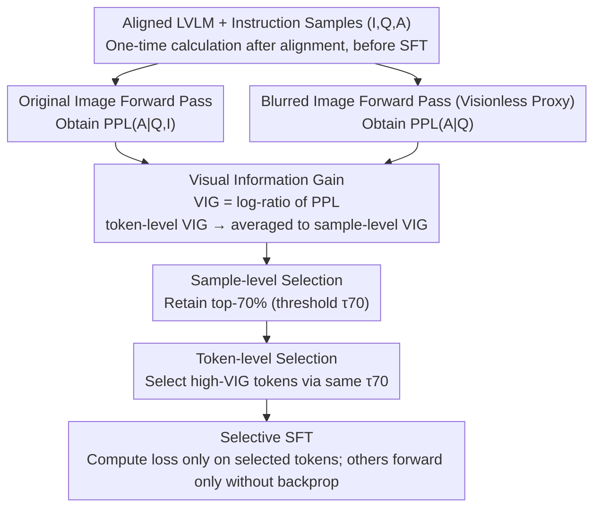

# Focusing Where Vision Matters: Selective Training for Large Vision Language Models via Visual Information Gain

**Conference**: ICML 2026  
**arXiv**: [2602.17186](https://arxiv.org/abs/2602.17186)  
**Code**: To be confirmed  
**Area**: Multimodal VLM  
**Keywords**: Visual Information Gain, Selective Training, Language Bias, Token-level Loss Masking, Data-efficient Instruction Tuning

## TL;DR
This paper proposes **Visual Information Gain (VIG)**—a visual dependency metric based on the log-ratio of perplexity between "with image vs. without image (proxied by a blurred image)." VIG quantifies "to what extent a data sample or a specific token depends on the image." Based on this, selective instruction tuning is performed: loss is computed only on high-VIG samples and tokens. This allows LLaVA-1.5-13B to outperform vanilla training across the board using only 21% of effective tokens, while significantly mitigating language bias and hallucinations.

## Background & Motivation

**Background**: Large Vision-Language Models (LVLMs) such as LLaVA, ShareGPT4V, and Qwen-VL solve VQA, captioning, and multimodal reasoning by jointly tuning a visual encoder, an adapter, and an LLM. The mainstream training approach involves feeding all instruction-tuning data with equal weights for next-token SFT.

**Limitations of Prior Work**: Models frequently exhibit "language bias." Even when presented with an image, the output remains dominated by textual priors, manifesting as visual ignorance and hallucinations (describing non-existent objects). Existing mitigation strategies fall into three categories: (1) contrastive decoding during inference to compare outputs with/without images; (2) modifying attention mechanisms to force higher weights on visual tokens; (3) using stronger models to generate higher-quality instruction data. However, none of these **quantify how much information each sample or token actually extracts from the image**.

**Key Challenge**: In typical LVLM instruction-tuning data, there are samples that require the image to answer (e.g., colors, spatial relations) and samples that can be answered by common sense alone. At the token level, this is even more pronounced—visually grounded content words (e.g., *white*, *sitting*, *lying*) and purely syntactic tokens (e.g., *a*, *the*, *of*) are treated equally by the same cross-entropy loss. This "undifferentiated supervision" encourages the model to actively learn "linguistic shortcuts," as predicting syntactic tokens is much easier than predicting vision-related tokens.

**Goal**: (1) Design a metric capable of quantifying "visual information contribution" at both sample and token granularities; (2) Implement selective training by discarding low-VIG samples and masking low-VIG tokens; (3) Improve visual understanding and reduce hallucinations with less supervision.

**Key Insight**: Information Theory perspective—if an image truly aids prediction, the "presence of the image" should reduce the model's uncertainty (perplexity) regarding the answer. Conversely, if perplexity remains unchanged (or increases) after providing the image, it indicates that the image is not being utilized for that data or token.

**Core Idea**: Define $\mathrm{VIG} = \log\frac{\mathrm{PPL}(A|Q)}{\mathrm{PPL}(A|Q,I)}$, approximate the "visionless" condition using a blurred image, and apply a single threshold $\tau_p$ to perform selection at both the sample and token levels.

## Method

### Overall Architecture
The method consists of two steps: **(1) VIG Computation**: For each multimodal instruction sample $(I,Q,A)$, two forward passes are performed using a pre-aligned LVLM—one with the original image and one with a blurred image (as a visionless proxy). The log-ratio of the resulting perplexities yields the sample-level $\mathrm{VIG}_i$, which is also decomposed into token-level $\mathrm{VIG}_{i,t}$. **(2) Selective Fine-tuning**: Samples are ranked by $\mathrm{VIG}_i$ to retain the top $p\%$ (default $p=70$, threshold $\tau_{70}$). Within these retained samples, loss is only computed for tokens satisfying $\mathrm{VIG}_{i,t}\geq\tau_{70}$. Other tokens participate in the forward pass but do not contribute to the gradient.

### Key Designs

**1. Visual Information Gain: Quantifying visual dependency via the log-ratio of perplexity.**

To perform selective training, a metric is needed to measure visual dependency. VIG is grounded in the information-theoretic intuition that if an image is useful, its inclusion should decrease the model's uncertainty (perplexity). If the perplexity remains similar or increases, the image is likely ignored. Thus, VIG is defined as $\mathrm{VIG}=\log(\mathrm{PPL}(A|Q)/\mathrm{PPL}(A|Q,I))=\mathcal{L}(A|Q)-\mathcal{L}(A|Q,I)$, representing the cross-entropy without the image minus the cross-entropy with the image. Under one-hot supervision, this simplifies to $\mathrm{VIG}=D_{\text{KL}}(p_{A|Q}\|q_Q)-D_{\text{KL}}(p_{A|I,Q}\|q_{I,Q})$, reflecting the correction of the prediction distribution by the visual input. Log-ratio is preferred over direct KL divergence because it naturally decomposes into token-level components $\mathrm{VIG}_{i,t}=-\log q_\theta(a_t|a_{<t},Q)+\log q_\theta(a_t|a_{<t},Q,z_v)$, which can be averaged to the sample level $\mathrm{VIG}_i=\frac{1}{T_i}\sum_t\mathrm{VIG}_{i,t}$.

**2. Dual-granularity Selection: Using a shared threshold $\tau_p$ to focus the gradient budget.**

Instruction data contains both "vision-dependent" and "commonsense-sufficient" samples. At the token level, visual content words (e.g., *white*, *sitting*) and syntactic words (e.g., *a*, *the*) are treated identically by standard cross-entropy, effectively encouraging the model to take linguistic shortcuts. VIG partitions the data into "what should be learned": first, the top $p\%$ of samples are selected via sample-level $\mathrm{VIG}_i$ to form $\mathcal{S}_p=\{i\mid\mathrm{VIG}_i\geq\tau_p\}$. Then, within each retained sample, the **same threshold** $\tau_p$ is used to select tokens $\mathcal{T}_i^+=\{t\mid\mathrm{VIG}_{i,t}\geq\tau_p\}$. Loss is computed only for these tokens; others participate in the forward pass to maintain context but have their gradients masked. Sharing $\tau_p$ avoids new hyperparameters. Empirically, $p=70$ is the "sweet spot"—lower values ($p=30$) lead to underfitting due to data scarcity, while higher values ($p=90$) regress toward vanilla training. This nested selection geometrically isolates the high-VIG sub-region in the (sample, token) grid.

**3. Blurred Images as a Visionless Proxy + Post-alignment Computation.**

VIG requires a visionless conditional distribution $q_Q$. However, most LVLM architectures require a visual input. The authors use a Gaussian-blurred version of the original image $I$ as a proxy for "no vision" to compute $\mathrm{PPL}(A|Q)$. This maintains the standard forward pipeline and avoids out-of-distribution perplexity spikes while effectively stripping visual information. VIG is computed once after pre-training (adapter alignment) but before instruction tuning. At this stage, the visual feature space is preliminary aligned to language, yet the model is not overfitted to instructions, allowing VIG to act as a "prior filter" rather than a "post-hoc diagnostic."

### Loss & Training
LLaVA-1.5 7B/13B and ShareGPT4V 7B are aligned using 558K (or 1.2M) image-caption pairs and SFT-tuned on ~665K samples. Open-Qwen2VL 2B is tuned on a 1M MAmmoTH-VL subset. In all experiments, $p=70$ is used. VIG is computed only for multimodal samples; pure text samples are retained. All other hyperparameters follow vanilla baselines, except for the loss mask.

## Key Experimental Results

### Main Results
Performance of four LVLMs across visual understanding and hallucination benchmarks:

| Model | # Active Tokens | LLaVA-W ↑ | MMVet ↑ | CV-Bench ↑ | POPE F1 ↑ | CHAIR $C_S$ ↓ | MMHal Hall. ↓ |
| :--- | :--- | :--- | :--- | :--- | :--- | :--- | :--- |
| LLaVA-1.5 7B (vanilla) | 58.61M (100%) | 59.02 | 28.62 | 59.18 | 87.08 | 52.93 | 71.25 |
| LLaVA-1.5 7B + VIG | 38.45M (-34%) | **61.22** | **32.71** | **62.48** | **87.47** | **47.00** | **62.78** |
| LLaVA-1.5 13B (vanilla) | 58.61M (100%) | 72.01 | 36.19 | 60.16 | 87.05 | 51.96 | 67.09 |
| LLaVA-1.5 13B + VIG | 12.14M (**-79%**) | **73.45** | **36.87** | **62.89** | **87.53** | **48.19** | **63.11** |

On the 13B model, using only **21%** of active tokens outperforms vanilla training on all 8 metrics. For the 7B model, MMVet improves by 4.1 points, and the CHAIR $C_S$ hallucination rate drops from 52.93 to 47.00.

### Ablation Study

| Configuration | Meaning | Key Observation |
| :--- | :--- | :--- |
| Full data, full token (vanilla) | No selection | Baseline |
| Top-70% sample, full token | Sample-level selection only | Improves most metrics, but limited hallucination mitigation |
| Full data, token mask | Token-level selection only | Slight improvement in visual understanding; high token waste |
| Top-70% sample + token mask (Default) | Dual-granularity, shared $\tau_{70}$ | Max gains in both efficiency and hallucination mitigation |
| Threshold $p$=30/50/70/90 | Selection ratio sensitivity | $p=70$ is optimal; too low leads to underfitting, too high regresses to vanilla |

### Key Findings
- **Token-level selection is the true source of hallucination suppression**: Sample-level selection mainly improves efficiency. Token masking removes syntactic tokens (loss diff $\approx 0$), forcing the gradient to concentrate on visual content words (e.g., *white*, *lying*), thereby teaching the model to actually "look at the image."
- **VIG consistency with benchmark modality dependence**: VIG distributions for COCO/CV-Bench/POPE lean positive (vision-heavy), while GQA/SQA lean negative (text-heavy), suggesting VIG acts as a "thermometer" for visual dependency.
- **VIG sensitivity to image content**: For a fixed Q-A pair, VIG varies with the image: correct image (VIG=0.923), partially correct (VIG=0.409), contradictory image (VIG=-0.520).
- **Scalability**: For larger models (13B), active tokens can be reduced by 79% while still outperforming vanilla. This indicates that larger models are more sensitive to "high-quality sparse supervision."

## Highlights & Insights
- **Blurred images are an elegant high-pass filter**: This bypasses the engineering hurdle of LVLMs requiring visual inputs while maintaining the forward pipeline. VIG becomes a plug-and-play contrastive metric requiring no change to architecture or loss.
- **Shared threshold $\tau_p$ ensures geometric alignment**: Using one threshold ensures that only high-density visual tokens within high-quality samples are learned.
- **VIG as a general "visual importance" score**: Beyond selective training, VIG could be used for normalizing benchmark modality dependence, mining hallucination data, or reward shaping in multimodal RLHF.

## Limitations & Future Work
- VIG relies on the specific configuration of blurred images (kernel size, intensity); different blur settings might yield different VIG sensitivities.
- VIG is calculated statically post-alignment. Dynamic VIG updates during SFT might further optimize training.
- The threshold $p=70$ was fixed across models; size-adaptive ratios were not explored.
- Experiments focused on SFT; the potential for VIG in RLHF/DPO or other modalities (video, audio) remains to be validated.

## Related Work & Insights
- **vs. Contrastive Decoding (Leng et al. 2024)**: While that method compares "vision vs. no-vision" during inference (doubling cost), VIG consolidates this insight into a one-time training filter with zero inference overhead.
- **vs. Selective Modeling for LLM (Lin et al. 2024)**: LLM selective training uses reference loss for token selection; VIG replaces the "reference" with a visionless contrast, extending the principle to multimodal contexts.
- **vs. Data Quality Filtering**: Unlike models that relabel data using stronger teachers, VIG is a self-supervised metric derived from the model itself, making it cost-effective and compatible with other data strategies.

## Rating
- Novelty: ⭐⭐⭐⭐ (Using perplexity difference for token-level visual grounding is simple yet impactful.)
- Experimental Thoroughness: ⭐⭐⭐⭐ (Extensive across 4 LVLMs and 8 benchmarks; lacks RLHF validation.)
- Writing Quality: ⭐⭐⭐⭐⭐ (Clean derivations and highly persuasive visualizations.)
- Value: ⭐⭐⭐⭐ (Provides a practical, zero-architecture-change tool for data efficiency and hallucination reduction.)

<!-- RELATED:START -->

## Related Papers

- [\[ICML 2026\] VEENA: Interpreting and Enhancing Emotional Circuits in Large Vision-Language Models via Cross-Modal Information Flow](interpreting_and_enhancing_emotional_circuits_in_large_vision-language_models_vi.md)
- [\[ICML 2026\] Large Vision-Language Models Get Lost in Attention](large_vision-language_models_get_lost_in_attention.md)
- [\[CVPR 2026\] MODIX: A Training-Free Multimodal Information-Driven Positional Index Scaling for Vision-Language Models](../../CVPR2026/multimodal_vlm/modix_a_training-free_multimodal_information-driven_positional_index_scaling_for.md)
- [\[ICML 2026\] Jailbreaking Vision-Language Models Through the Visual Modality](jailbreaking_vision-language_models_through_the_visual_modality.md)
- [\[ICML 2026\] Unveiling Visual Counting Bottlenecks in Vision-Language Models](unveiling_the_visual_counting_bottleneck_in_vision-language_models.md)

<!-- RELATED:END -->
