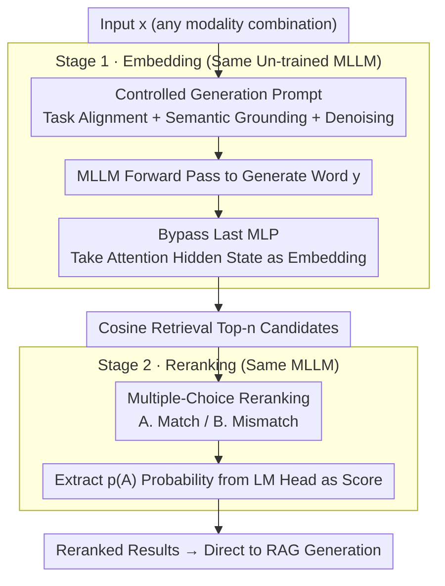

# FreeRet: MLLMs as Training-Free Retrievers

**Conference**: ICML 2026  
**arXiv**: [2509.24621](https://arxiv.org/abs/2509.24621)  
**Code**: None  
**Area**: Multimodal VLM / Multimodal Retrieval  
**Keywords**: training-free retrieval, MLLM embedding, lexicalization pressure, LLM framing effect, two-stage retrieval

## TL;DR
FreeRet introduces a fully training-free two-stage multimodal retrieval framework: the first stage bypasses the last MLP layer of the MLLM and utilizes controlled generation prompts to extract semantically faithful embeddings for candidate retrieval; the second stage reformulates reranking as a multiple-choice question (MCQ) task to circumvent the LLM's framing bias. It outperforms retrieval models trained on tens of millions of paired data on MMEB.

## Background & Motivation
**Background**: CLIP-style dual-tower models are mainstream in multimodal retrieval but struggle with long queries, compositional semantics, and interleaved modalities. Recent works treat MLLMs as universal encoders, followed by post-training using contrastive learning, RL, or data scaling.

**Limitations of Prior Work**: The training route has two fatal flaws—first, every change in backbone or modality combination requires retraining with massive amounts of paired data; second, generalization is fragile (SOTA models on MMEB often experience significant performance drops when transferred to MIEB). Existing training-free methods (e.g., E5-V, PromptEOL) focus solely on embeddings and lack reranking, resulting in performance far inferior to trained versions.

**Key Challenge**: MLLMs inherently possess strong multimodal semantic and reasoning capabilities, but their final MLP layer is designed for "next-token prediction"—this "lexicalization pressure" forcibly drags semantic vectors toward the vocabulary space, destroying the fine-grained semantics required for retrieval. Reranking suffers from another hidden bias: the choice of label pairs like "Yes/No," "True/False," or "Right/Wrong" can lead to a 5–8% difference in accuracy for the same semantic judgment.

**Goal**: To use the same MLLM for both embedding and reranking without any weight updates, while explicitly characterizing and mitigating the two aforementioned biases.

**Key Insight**: Treat the MLLM as a generator. Since its intermediate layers are closer to pure semantics than the final layer, bypass the last MLP layer. Since the binary classification in reranking is subject to lexical bias, formulate it as an MCQ where the model selects an answer from options (e.g., "Select A/B").

**Core Idea**: The embedding stage uses "intermediate hidden states + three types of controlled prompts (task, semantic, denoising)"; the reranking stage converts discriminative judgment into multiple-choice selection, using the probability of option 'A' from the LM head as the score.

## Method

### Overall Architecture
FreeRet decomposes retrieval into two stages, both performed by the same frozen MLLM. **Stage 1 Embedding**: Given input $x$ (any modality combination), a controlled prompt is appended to generate a word $y$. Instead of taking the final MLP output, the hidden state $h_L^{\text{Attn}}(y)$ (after the last attention layer but before the last MLP) is extracted as the embedding $e(x)$. Candidates are retrieved via cosine similarity to get top-$n$ results. **Stage 2 Reranking**: The query and each candidate are wrapped into an MCQ prompt ("A. Match / B. Mismatch"). Correlation scores are derived from the softmax of $p(\text{`A'})$ at the LM head. This pipeline requires no extra parameters or auxiliary models and can be seamlessly integrated into RAG workflows to achieve "retrieve + rerank + generate" using a single model.

### Key Designs

**1. Bypassing the Last MLP to Alleviate Lexicalization Pressure (§3.2): Moving the Extraction Point Up One Layer**

The last MLP layer of an MLLM serves next-token prediction, which forcibly pulls semantic vectors toward the vocabulary direction (lexicalization pressure), destroying the fine-grained semantics needed for retrieval. Probing with Qwen2.5-VL (3B/7B/32B) confirms this: using metrics like $\alpha_\ell^{\text{Attn}}=\cos(h^{\text{MLP}}_{\ell-1},h^{\text{Attn}}_{\ell})$ and $\beta_\ell^{\text{MLP}}=\cos(h^{\text{MLP}}_{\ell},\mathbf{w}_{y^*})$, the authors found $\alpha$ drops sharply to <0.3 and $\beta$ jumps to ~0.5 after the last MLP. The cosine similarity of 250 synonym pairs also drops from ~94% to ~87% at this layer. By directly taking $h_L^{\text{Attn}}$ as the embedding, stable gains of 5.33% and 5.71% were achieved on 3B and 7B models respectively, serving as the foundation for further improvements.

**2. Controlled Generation Prompts Injecting Three Priors (§3.3): Semantic Focusing of Summarization**

Free summarization prompts like "Summarize above content in one word" often produce semantic drift words like "Self" or "Searching," diluting the embedding space. This is replaced with controlled generation using three constraints: (i) Task alignment ("You are required to assess if <A> is related to <B>") to systematically align query and target summary words; (ii) Semantic grounding ("Capture the semantics of <X>"); (iii) Noise suppression ("Do not use function words, prepositions, or symbols"). Tab. 3b shows these steps add 4.29, 1.49, and 2.47 percentage points on the 3B model, and 5.07, 0.9, and 2.17 on the 7B model, all while only modifying prompts.

**3. MCQ Reranking to Alleviate LLM Framing Effect (§3.4): Using MCQ to Eliminate Label Bias**

Reranking often asks a binary question, but the "framing" is a confounding variable. The authors found that while "Right/Wrong," "Yes/No," and "True/False" are logically equivalent, accuracy varies by up to 5%, and context-free output logits are visibly skewed. They mitigate this by formulating reranking as an MCQ—"A. Match, B. Mismatch"—and using the softmax of $p(\text{`A'})$ as the score. MCQ neutralizes semantic/emotional bias of labels and leverages the distribution of "A/B question types" in pre-training data, outperforming direct yes/no prompts by 8.4% without any training.

### Loss & Training
Completely training-free. All modifications involve (i) extraction position, (ii) prompt templates, and (iii) reranking output format. Since no new parameters are introduced, it is model-agnostic and plug-and-play for MLLMs including the Qwen2-VL, Qwen2.5-VL, Qwen2.5-Omni, InternVL3, and LLaVA-OV series.

## Key Experimental Results

### Main Results (MMEB, Average Precision@1 on 36 Datasets)

| Method | Backbone | Training Data (M) | Average |
|------|----------|--------------|------|
| MMRet (embed-only) | LLaVA-1.6-7B | 26.2 | 44.0 |
| GME (embed-only) | Qwen2-VL-7B | 8.0 | 56.0 |
| LamRA-Ret | Qwen2.5-VL-7B | 1.4 | 52.4 |
| E5-V (train-free repro) | Qwen2.5-VL-7B | – | 39.8 |
| **FreeRet-embed** | Qwen2.5-VL-7B | – | **53.7** |
| MM-Embed (top-10 rerank) | LLaVA-Next-7B | 1.1+0 | 54.9 |
| LamRA (top-10 rerank) | Qwen2.5-VL-7B | 1.4+1.1 | 55.0 |
| **FreeRet (top-10)** | Qwen2.5-VL-7B | – | **67.8** |
| **FreeRet (top-50)** | Qwen2.5-VL-7B | – | **70.7** |

### MMEB-V2 Video Subset (Ours has zero video retrieval training)

| Method | Backbone | Training Data (M) | Video Cls | Video Ret |
|------|----------|--------------|-----------|-----------|
| VLM2Vec-V2 | Qwen2-VL-2B | 1.7 | 39.3 | 28.8 |
| GME | Qwen2-VL-7B | 8.0 | 37.4 | 28.4 |
| **FreeRet-embed** | Qwen2-VL-2B | – | 47.7 | 31.7 |
| **FreeRet** | Qwen2-VL-7B | – | **63.2** | **39.3** |

### Ablation Study (Tab. 3)

| Setting | 3B | 7B | Description |
|------|----|----|------|
| Extract $h^{\text{MLP}}_L$ (baseline) | 45.34 | 47.97 | Extraction like E5-V |
| Extract $h^{\text{Attn}}_L$ (FreeRet) | 50.67 | 53.68 | Bypass only one MLP layer |
| Extract $h^{\text{MLP}}_{L-2}$ | 50.64 | 48.78 | Performance drops if bypassing more |
| Yes/No reranking | 58.39 | 65.28 | Baseline for framing bias |
| True/False | 60.06 | 66.71 | Slightly less bias |
| **MCQ reranking** | **60.31** | **70.72** | Eliminates framing effect |

### Key Findings
- The last MLP layer is the performance bottleneck, but skipping more layers sacrifices semantic intermediate information; skipping exactly one layer is most stable. This effect is more pronounced in shallower models.
- Among prompt controls, "semantic grounding" provides the highest gain (~5pt), suggesting MLLMs default to generalized summary words that drift from original semantics.
- The 8% difference between "Yes/No vs MCQ" stems entirely from label distribution bias in pre-training, unrelated to logic. This is a critical insight for all LLM-as-judge or reranking tasks.
- On video tasks, FreeRet-2B outperforms VLM2Vec-V2 (trained on 1.7M video pairs), showing that frozen MLLMs already encode cross-modal information well; the key is how to extract it.

## Highlights & Insights
- Provides a systematic training-free retrieval manual by clarifying "where to extract + how to prompt" and "how to formulate reranking," quantifying gains at each step.
- Uses cosine similarity and LM-head projection to characterize "lexicalization pressure," offering a mechanistic tool for representation research.
- The mitigation of "LLM framing effect" via MCQ formatting is directly applicable to all LLM-as-judge research, including rerankers, automated evaluation, and reward models.
- Since weights are unchanged, FreeRet preserves MLLM conversational and reasoning abilities, allowing retrieval, reranking, and generation to occur within the same model for a minimalist RAG implementation.

## Limitations & Future Work
- The second stage requires an MLLM forward pass for every query-candidate pair, which is slow for large candidate pools. The paper restricts candidates (top-5/10/50), but latency remains a bottleneck in real-world large-scale scenarios.
- Relies on the assumption that the "un-trained MLLM itself is strong enough." For small models or specific domains (medical, code), this "free lunch" might not hold.
- MCQ templates and prompt controls are manually designed. Lack of systematic search via "prompt automatic search" or "per-task prompt tuning." Stability depends on prompt quality.

## Related Work & Insights
- **vs E5-V**: E5-V extracts from the last hidden layer without considering lexicalization. FreeRet's layer-skipping and controlled prompting improve MMEB performance by 13.9pt on the same backbone.
- **vs Trained Versions (MM-Embed / LamRA / GME)**: These require 1M–26M multimodal pairs; FreeRet matches or exceeds them without training, proving the training-free path is significantly undervalued.
- **vs PromptEOL / MetaEOL / Echo-Embedding**: These text-only training-free methods focus on embeddings. FreeRet extends their spirit to multimodal retrieval and adds the critical reranking stage.
- **vs Zhao et al. (2021) framing bias**: FreeRet ports LLM calibration research into retrieval, using MCQ to provide a lightweight de-biasing solution for LLM-as-judge tasks.

## Rating
- Novelty: ⭐⭐⭐⭐ Systematic training-free retrieval with clear mechanistic insights into lexicalization and framing effects.
- Experimental Thoroughness: ⭐⭐⭐⭐ Covers 36 MMEB datasets + MMEB-V2 video across multiple MLLM families; lacks efficiency/latency benchmarks.
- Writing Quality: ⭐⭐⭐⭐ Clear concepts, clean narrative of the three-step method, well-integrated probing and ablation.
- Value: ⭐⭐⭐⭐ High practical value for RAG and multimodal retrieval communities, with methodological insights for LLM-based evaluation.

<!-- RELATED:START -->

## Related Papers

- [\[ICCV 2025\] Training-Free Personalization via Retrieval and Reasoning on Fingerprints](../../ICCV2025/multimodal_vlm/training-free_personalization_via_retrieval_and_reasoning_on_fingerprints.md)
- [\[ICML 2026\] Med-Scout: Curing MLLMs' Geometric Blindness in Medical Perception via Geometry-Aware RL Post-Training](med-scout_curing_mllms_geometric_blindness_in_medical_perception_via_geometry-aw.md)
- [\[CVPR 2026\] PAS: A Training-Free Stabilizer for Temporal Encoding in Video LLMs](../../CVPR2026/multimodal_vlm/pas_a_training-free_stabilizer_for_temporal_encoding_in_video_llms.md)
- [\[NeurIPS 2025\] Training-free Online Video Step Grounding](../../NeurIPS2025/multimodal_vlm/training-free_online_video_step_grounding.md)
- [\[AAAI 2026\] Filter, Correlate, Compress: Training-Free Token Reduction for MLLM Acceleration](../../AAAI2026/multimodal_vlm/filter_correlate_compress_training-free_token_reduction_for_.md)

<!-- RELATED:END -->
