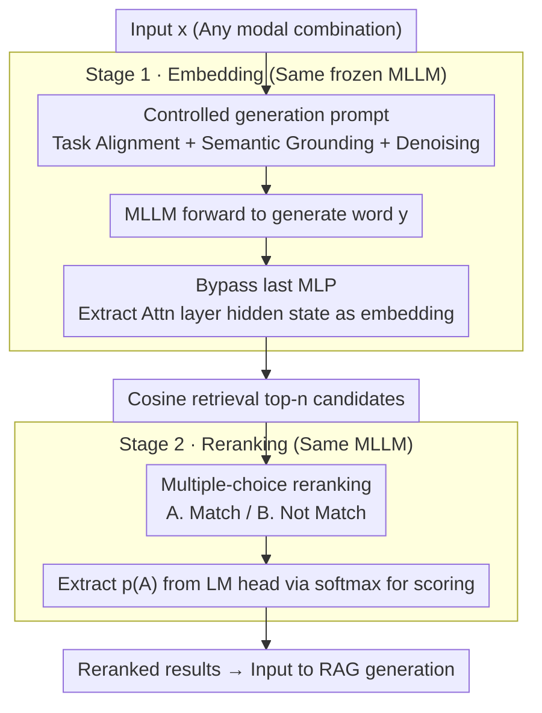

# FreeRet: MLLMs as Training-Free Retrievers

**Conference**: ICML 2026  
**arXiv**: [2509.24621](https://arxiv.org/abs/2509.24621)  
**Code**: None  
**Area**: Multimodal VLM / Multimodal Retrieval  
**Keywords**: Training-free retrieval, MLLM embedding, Lexicalization pressure, LLM framing effect, Two-stage retrieval

## TL;DR
FreeRet proposes a fully training-free two-stage multimodal retrieval framework: the first stage bypasses the last MLP layer of the MLLM and utilizes controlled generation prompts to extract semantically faithful embeddings for candidate retrieval; the second stage transforms reranking into a multiple-choice question (MCQ) format to circumvent the LLM framing bias. It outperforms retrieval models trained on tens of millions of paired data points on MMEB.

## Background & Motivation
**Background**: CLIP-style dual-tower architectures are dominant in multimodal retrieval but struggle with long queries, compositional semantics, and interleaved modalities. Recent works utilize MLLMs as general-purpose encoders, followed by post-training via contrastive learning, RL, or data scaling.

**Limitations of Prior Work**: The training-based approach faces two critical issues: first, swapping the backbone or modal combination requires massive paired data for contrastive fine-tuning; second, generalization is fragile (SOTA models on MMEB often experience significant performance drops on MIEB). Existing training-free methods (e.g., E5-V, PromptEOL) focus solely on embeddings without reranking, resulting in performance far inferior to trained versions.

**Key Challenge**: MLLMs inherently possess strong multimodal semantic and reasoning capabilities, but their final MLP layer is optimized for "next-token prediction." This "lexicalization pressure" forces semantic vectors toward the vocabulary space, destroying the fine-grained semantics required for retrieval. Furthermore, reranking suffers from an invisible bias: choosing between different label pairs like "Yes/No," "True/False," or "Right/Wrong" can cause an accuracy variance of 5–8% for the same semantic judgment.

**Goal**: To use a single MLLM for both embedding and reranking without modifying any weights, while explicitly identifying and mitigating the two aforementioned biases.

**Key Insight**: Treat the MLLM as a generator. Since its intermediate layers are semantically closer than the final layer, bypass the last MLP. Since binary reranking suffers from lexical bias, reframe it as an MCQ to let the model select answers like "Choose A/B."

**Core Idea**: The embedding stage uses "intermediate hidden states + task/semantic/denoising controlled prompts"; the reranking stage transforms discrimination into multiple-choice, using the probability of option "A" from the LM head as the score.

## Method

### Overall Architecture
FreeRet decomposes retrieval into two stages, both handled by the same frozen MLLM. **Stage 1 Embedding**: After inputting $x$ (any combination of modalities), a controlled prompt is concatenated. Instead of taking the final MLP output, the hidden state $h_L^{\text{Attn}}(y)$ after the last attention layer but before the final MLP is used as the embedding $e(x)$. Candidates are retrieved via cosine similarity to get top-$n$ results. **Stage 2 Reranking**: The query and each candidate are wrapped into an MCQ prompt ("A. Match / B. Not Match"). The probability $p(\text{`A'})$ is extracted from the LM head and softmaxed as the relevance score. This pipeline requires no extra parameters and integrates seamlessly into RAG workflows for "retrieve + rerank + generate" using a single model.

### Key Designs

**1. Bypassing the Last MLP to Mitigate Lexicalization Pressure (§3.2): Moving the extraction point forward**

The final MLP layer of an MLLM serves next-token prediction, pulling semantic vectors toward the vocabulary space (lexicalization pressure), which degrades the fine-grained semantics needed for retrieval. Probing with Qwen2.5-VL (3B/7B/32B) using metrics like $\alpha_\ell^{\text{Attn}}=\cos(h^{\text{MLP}}_{\ell-1},h^{\text{Attn}}_{\ell})$ and $\beta_\ell^{\text{MLP}}=\cos(h^{\text{MLP}}_{\ell},\mathbf{w}_{y^*})$, the authors found that $\alpha$ drops sharply to <0.3 after the last MLP while $\beta$ jumps to ~0.5. Layer-wise cosine similarity for 250 synonym pairs falls from ~94% to ~87% at this layer. Using the hidden state $h_L^{\text{Attn}}$ before the MLP yields a stable gain of 5.33% and 5.71% on 3B and 7B models, respectively.

**2. Controlled Generation Prompts with Three Priors (§3.3): Focusing semantics on "summarization"**

Free-form summarization like "Summary above content in one word" often produces semantic drift or functional words (e.g., "Self", "Searching"), diluting the embedding space. This is replaced by controlled generation with three constraints: (i) Task alignment ("You are required to assess if <A> is related to <B>") to systematically align query and target summary words; (ii) Semantic grounding ("Capture the semantics of <X>"); and (iii) Noise suppression ("Do not use function words, prepositions, or symbols"). These steps add cumulative improvements of 4.29, 1.49, and 2.47 percentage points respectively on the 3B model.

**3. MCQ Reranking to Resolve LLM Framing Effect (§3.4): Eliminating label bias**

Reranking often asks a binary question, but the "framing" acts as a confounding variable. The authors found that logically equivalent pairs like "Right/Wrong" and "Yes/No" vary in accuracy by up to 5% on the same benchmark. The output logits are skewed even in context-free settings (LLM framing effect). Reframing this as an MCQ ("A. Match, B. Not Match") and taking $p(\text{`A'})$ via softmax neutralizes semantic/emotional bias and leverages the "MCQ task" distribution prevalent in pre-training data, outperforming Yes/No by 8.4%.

### Loss & Training
Fully training-free. Improvements involve only: (i) extraction position, (ii) prompt templates, and (iii) reranking output format. No new parameters are introduced, making it model-agnostic and "plug-and-play" for models like Qwen2-VL, Qwen2.5-VL, InternVL3, and LLaVA-OV series.

## Key Experimental Results

### Main Results (MMEB, Average Precision@1 on 36 datasets)

| Method | Backbone | Training Data (M) | Avg |
|--------|----------|-------------------|-----|
| MMRet (embed-only) | LLaVA-1.6-7B | 26.2 | 44.0 |
| GME (embed-only) | Qwen2-VL-7B | 8.0 | 56.0 |
| LamRA-Ret | Qwen2.5-VL-7B | 1.4 | 52.4 |
| E5-V (training-free repro.) | Qwen2.5-VL-7B | – | 39.8 |
| **FreeRet-embed** | Qwen2.5-VL-7B | – | **53.7** |
| MM-Embed (top-10 rerank) | LLaVA-Next-7B | 1.1+0 | 54.9 |
| LamRA (top-10 rerank) | Qwen2.5-VL-7B | 1.4+1.1 | 55.0 |
| **FreeRet (top-10)** | Qwen2.5-VL-7B | – | **67.8** |
| **FreeRet (top-50)** | Qwen2.5-VL-7B | – | **70.7** |

### MMEB-V2 Video Subset (Ours has zero video retrieval training)

| Method | Backbone | Training Data (M) | Video Cls | Video Ret |
|--------|----------|-------------------|-----------|-----------|
| VLM2Vec-V2 | Qwen2-VL-2B | 1.7 | 39.3 | 28.8 |
| GME | Qwen2-VL-7B | 8.0 | 37.4 | 28.4 |
| **FreeRet-embed** | Qwen2-VL-2B | – | 47.7 | 31.7 |
| **FreeRet** | Qwen2-VL-7B | – | **63.2** | **39.3** |

### Ablation Study

| Setting | 3B | 7B | Description |
|---------|----|----|-------------|
| Extract $h^{\text{MLP}}_L$ (baseline) | 45.34 | 47.97 | E5-V style extraction |
| Extract $h^{\text{Attn}}_L$ (FreeRet) | 50.67 | 53.68 | Skipping only one MLP layer |
| Extract $h^{\text{MLP}}_{L-2}$ | 50.64 | 48.78 | Performance drops if skipping extra layers |
| Yes/No reranking | 58.39 | 65.28 | Baseline with framing bias |
| True/False | 60.06 | 66.71 | Slightly lower bias |
| **MCQ reranking** | **60.31** | **70.72** | Eliminates framing effect |

### Key Findings
- The last MLP layer is the performance bottleneck; however, skipping more layers sacrifices the semantic intermediate representations. "Exactly one layer" is optimal. This effect is more pronounced in shallower models.
- Among the three prompt controls, "semantic grounding" provides the highest gain (~5pt), suggesting MLLMs default to generalized summary words that deviate from original input semantics.
- the 8% gap between "Yes/No vs MCQ" stems almost entirely from pre-trained label distribution bias rather than logic—a detail alerting all works using LLMs as judges.
- On video tasks, FreeRet-2B outperforms VLM2Vec-V2 trained on 1.7M video pairs, suggesting that "untrained MLLMs" already encode cross-modal info well; the key is how to extract it.

## Highlights & Insights
- provides a systematic "training-free retrieval manual" by quantifying the gains of extraction points, prompt controls, and MCQ formatting.
- The use of cosine similarity and LM-head projections to characterize "lexicalization pressure" is a clear mechanistic analysis tool for LLM representation research.
- The migration of the "LLM framing effect" to retrieval is valuable: rerankers, auto-evaluators, and reward models should adopt MCQ formatting to debias.
- By keeping weights frozen, FreeRet preserves the MLLM's conversational and reasoning abilities, enabling a unified model for retrieval, reranking, and generation.

## Limitations & Future Work
- Stage 2 requires an MLLM forward pass for every query-candidate pair; latency may be a bottleneck in large-scale retrieval.
- Relies on the assumption that the "untrained MLLM is inherently strong," which might not hold for small models or niche domains (medical, code).
- Prompts and templates were manually designed; systematic exploration of automatic prompt searching or task-specific prompt tuning was not conducted.

## Related Work & Insights
- **vs E5-V**: E5-V extracts from the last hidden layer without considering lexicalization; FreeRet’s layer-skipping and prompts improve MMEB performance by 13.9pt on the same backbone.
- **vs Trained Models (MM-Embed, LamRA, GME)**: While these require 1M–26M pairs, FreeRet matches or exceeds them, showing the training-free path is undervalued.
- **vs Echo-Embedding / PromptEOL**: FreeRet extends the Spirit of these text-only training-free methods to the multimodal domain and fills the reranking gap.
- **vs Zhao et al. (2021) framing bias**: FreeRet directly applies LLM calibration findings to retrieval, offering a lightweight MCQ solution for debiasing.

## Rating
- Novelty: ⭐⭐⭐⭐ Systematizes training-free multimodal retrieval and clarifies lexicalization and framing effect mechanisms.
- Experimental Thoroughness: ⭐⭐⭐⭐ Covers 36 MMEB datasets + MMEB-V2 Video across multiple MLLM families; lacks efficiency/latency benchmarks.
- Writing Quality: ⭐⭐⭐⭐ Clear concepts, clean narrative, and well-aligned probing/ablation.
- Value: ⭐⭐⭐⭐ Directly applicable to RAG and multimodal retrieval communities with methodological implications for LLM-as-judge research.

<!-- RELATED:START -->

<!-- RELATED:END -->

## Related Papers

- [\[ICML 2026\] Med-Scout: Curing MLLMs' Geometric Blindness in Medical Perception via Geometry-Aware RL Post-Training](med-scout_curing_mllms_geometric_blindness_in_medical_perception_via_geometry-aw.md)
- [\[CVPR 2026\] PAS: A Training-Free Stabilizer for Temporal Encoding in Video LLMs](../../CVPR2026/multimodal_vlm/pas_a_training-free_stabilizer_for_temporal_encoding_in_video_llms.md)
- [\[NeurIPS 2025\] Training-free Online Video Step Grounding](../../NeurIPS2025/multimodal_vlm/training-free_online_video_step_grounding.md)
- [\[CVPR 2026\] Pointing at Parts: Training-Free Few-Shot Grounding in Multimodal LLMs](../../CVPR2026/multimodal_vlm/pointing_at_parts_training-free_few-shot_grounding_in_multimodal_llms.md)
- [\[CVPR 2026\] DRS-GUI: Dynamic Region Search for Training-Free GUI Grounding](../../CVPR2026/multimodal_vlm/drs-gui_dynamic_region_search_for_training-free_gui_grounding.md)

<!-- RELATED:END -->
