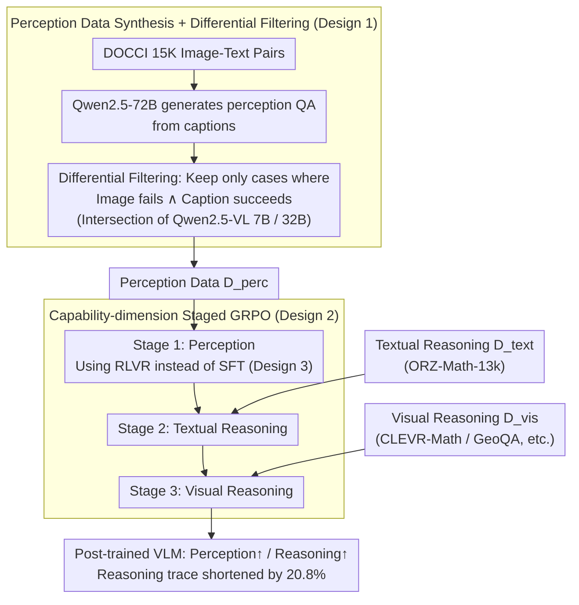

# From Seeing to Thinking: Decoupling Perception and Reasoning Improves Post-Training of Vision-Language Models

**Conference**: ICML 2026  
**arXiv**: [2605.20177](https://arxiv.org/abs/2605.20177)  
**Code**: https://ucsc-vlaa.github.io/VLM-CapCurriculum/ (Project Page)  
**Area**: Multi-modal VLM  
**Keywords**: Visual Perception, Staged Post-training, Capability-dimension Curriculum, RLVR, Visual Mathematical Reasoning

## TL;DR
This paper identifies that current VLM post-training overemphasizes "long-chain reasoning" while neglecting perception bottlenecks. It explicitly decouples post-training into three independent stages: "Visual Perception → Textual Reasoning → Visual Reasoning," and utilizes RLVR (instead of caption SFT) to specifically refine perception. This approach enables Qwen3-VL-8B to achieve relative improvements of approximately +5.9% and +1.2% on visual math and perception benchmarks, respectively, while shortening reasoning traces by 20.8%.

## Background & Motivation

**Background**: Following DeepSeek-R1, the mainstream paradigm for VLM post-training involves "long-chain CoT + RLVR," where tasks such as visual QA, geometry, chart understanding, and visual math are jointly optimized in a single stage (e.g., the Mixed Reward in LLaVA-CoT and VLAA-Thinker), aiming to improve accuracy by encouraging the model to "think longer."

**Limitations of Prior Work**: The authors performed an attribution analysis of errors made by Qwen3-VL-8B on three visual math datasets using Claude-Haiku-4.5. They found that **86.9% of incorrect answers originated from perception errors in the first step**, rather than subsequent reasoning failures. Once perception fails, extended chain-of-thought only "self-justifies" based on incorrect premises, even when repeatedly re-examining the image.

**Key Challenge**: Merged training (mixing perception and reasoning data) assumes all capabilities can be optimized simultaneously by the same reward. However, visual perception is a more fundamental capability than "reasoning" and requires specific objectives and data. If reasoning is trained prematurely, the model adopts a "long-chain + self-persuasion" behavioral pattern without properly aligning visual features, leading to a "perception tax" where MMStar scores drop by 1.6% after reasoning-only training.

**Goal**: (1) Demonstrate that perception must be trained separately with specialized data; (2) Identify the optimal sequence of stages; (3) Compare whether caption-SFT or RLVR is more suitable for learning perception; (4) Integrate "stage-by-capability dimension" and traditional "incremental difficulty curriculum learning" into a unified framework.

**Key Insight**: Post-training is viewed as the sequential shaping of three capabilities: visual perception, textual reasoning, and visual reasoning. Since perception serves as the "scaffolding" for subsequent reasoning, it should be stabilized before visual reasoning is attempted; otherwise, early reasoning training may contaminate subsequent perception signals.

**Core Idea**: Post-training is organized using a "capability-dimension curriculum" $\mathcal{D}_{\text{perc}} \rightarrow \mathcal{D}_{\text{text}} \rightarrow \mathcal{D}_{\text{vis}}$, employing RLVR instead of caption SFT during the perception stage.

## Method

### Overall Architecture
The method consists of two main components: **(1) Perception Data Synthesis**—reverse-generating "must-see-to-answer" QA from 15K DOCCI image-text pairs and filtering samples using a "image vs. caption" differential; **(2) Staged GRPO Training**—sequentially training on three types of data ($\mathcal{D}_{\text{perc}} \rightarrow \mathcal{D}_{\text{text}} \rightarrow \mathcal{D}_{\text{vis}}$) for the same number of epochs. Each stage uses the same GRPO hyperparameters with the visual encoder enabled throughout. The result is a VLM that is stronger in both visual math and perception with shorter reasoning traces.

### Key Designs

**1. Perception Data Synthesis + Dual-model Differential Filtering: Creating "must-see-to-answer" QA to block language priors.**

To train perception in isolation, a set of samples with pure signals that cannot be guessed via language is required. The authors first use Qwen2.5-72B to generate perception-focused QA pairs $(Q,A)=f_{\text{gen}}(C)$ from fine-grained DOCCI captions. Then, two paths are run for each candidate: $\hat{A}_{\text{img}}=f_\theta(I,Q)$ (image only) and $\hat{A}_{\text{cap}}=f_\theta(C,Q)$ (caption only). Only samples satisfying $\mathbb{I}[\hat{A}_{\text{img}}\neq A]\land\mathbb{I}[\hat{A}_{\text{cap}}=A]$ are retained. Finally, an intersection is taken after filtering with Qwen2.5-VL-7B and 32B base models. This reverse engineering ensures that samples solvable by caption alone (testing language) are removed, leaving only those that expose perception deficits.

**2. Capability-dimension Staged GRPO: Establishing "seeing clearly" before adding "reasoning."**

Merged training assumes all capabilities optimize via a single reward, but perception is more fundamental. Training reasoning first causes "self-persuasion" without visual alignment. Using the same GRPO loss:

$$\mathcal{J}_{\text{GRPO}}(\theta)=\mathbb{E}_{x,y}\Big[\tfrac{1}{G}\sum_i \min(\rho_i A_i, \text{clip}(\rho_i,1-\epsilon,1+\epsilon)A_i)\Big] - \beta\, \text{KL}(\pi_\theta\|\pi_{\text{ref}}),$$

training proceeds in the order $\mathcal{D}_{\text{perc}} \rightarrow \mathcal{D}_{\text{text}} \rightarrow \mathcal{D}_{\text{vis}}$. The reward $R(x,y_i)=r_{\text{acc}}+r_{\text{format}}$ is consistent across stages. Steps are allocated as 90 / 375 / 465 to match the 930 steps of the merged baseline. The visual encoder remains unfrozen to prevent the drift of visual representations. This "capability-dimension curriculum" is **orthogonal to traditional difficulty curricula**.

**3. Perception Stage using RLVR instead of caption-based SFT: Preventing low-quality captions from polluting perception signals.**

Traditional SFT using full captions as targets often introduces off-policy supervision from captions that are lower quality than pre-training data, which can degrade existing capabilities. The authors note that perception QA answers are naturally short (colors, spatial relations, attributes). Thus, exact match can be used as $r_{\text{acc}}$, allowing seamless integration with GRPO's on-policy sampling. Comparative experiments show that replacing RL with SFT in the perception stage results in a drop of 8.1% on WeMath for Qwen2.5-VL-7B and 1.6% for Qwen3-VL-8B.

### Loss & Training
GRPO group size $G=5$, max response length 2048. Three-stage steps: 90 / 375 / 465. The visual encoder is frozen in the merged baseline but fully open in the staged approach. Training used 8×H200 with the EasyR1 framework and Claude-Haiku-4.5 as the judge.

## Key Experimental Results

### Main Results

Comparison of Qwen3-VL-8B with reasoning-VLMs of similar scale (Acc %):

| Model | MathVista | WeMath | RWQA | MMStar | Overall AVG |
|------|-----------|--------|------|--------|-------------|
| Qwen3-VL-8B (Base) | 72.40 | 50.86 | 70.85 | 70.00 | 62.19 |
| OneThinker-8B | 75.10 | 54.57 | 71.50 | 70.20 | 64.87 |
| **Qwen3-VL-8B (Staged, Ours)** | **75.90** | **56.10** | **74.51** | **73.07** | **65.77** |

Relative to the base model: WeMath +5.24, RWQA +3.66, MMStar +3.07. Relative to OneThinker: WeMath +1.53, RWQA +3.01, MMStar +2.87.

### Ablation Study: Training Paradigm + Stage Order

| Configuration (Qwen3-VL-8B) | Vis Math AVG | Perception AVG | Overall | Note |
|--------------------|--------------|----------------|---------|------|
| Base | 45.17 | 79.21 | 62.19 | No post-training |
| Merged | 49.64 | 79.71 | 64.67 | Standard baseline |
| Staged 1→2→3 (Perc→Text→Vis) | **51.10** | **80.44** | **65.77** | Default |
| Order 3→2→1 (Reverse) | 37.70 (7B) | 74.17 (7B) | 55.93 (7B) | -4.6 pts vs normal order |
| Perception Stage as SFT | -1.6 on WeMath | — | — | 8B; -8.1% on 7B |

### Key Findings
- **Perception errors are the real bottleneck**: 86.9% of failures are due to perception. Reasoning-only training triggers a "perception tax" (MMStar -1.6% for 7B), while adding perception data improves RWQA by 3.0%.
- **Stage order is critical**: Reversing the order (3→2→1) drops visual math performance below the merged baseline, suggesting perception gradients are overwritten by established long-chain behaviors if trained last.
- **Shorter reasoning ≠ Weaker reasoning**: The staged model's responses are 20.8% shorter than the merged model (445 vs 562 tokens), yet it achieves higher accuracy (+1.46 pts in visual math), with perception errors dropping from 805 to 781.
- **Curriculum dimensions are stackable**: Combining the capability-dimension curriculum with a difficulty curriculum yields a +4.43% improvement over the merged baseline.

## Highlights & Insights
- **De-mystifying "Long-chain CoT Universalism"**: A simple error attribution experiment (86.9% perception errors) challenges the assumption that "longer reasoning is always better," offering a "diagnosis before prescription" paradigm.
- **Differential Filtering for Data Synthesis**: The "fails on image ∧ succeeds on caption" criterion cleverly identifies perception blind spots without manual labeling.
- **New Design Freedom**: Capability serves as an orthogonal dimension to difficulty in curriculum design, offering a unified perspective for multi-stage post-training.

## Limitations & Future Work
- Fixed step ratios between stages may not be optimal; adaptive stopping was not explored.
- Perception data relies on natural image captions, offering limited coverage for charts, tables, or dense OCR.
- Evaluations utilized Qwen and InternVL series only; scaling laws for 70B+ models remain unverified.
- The judge model (Claude-Haiku-4.5) has a perception-error annotation accuracy of 82.5%, potentially introducing systematic bias in the 86.9% attribution figure.

## Related Work & Insights
- **vs. Reasoning-only RL (OneThinker/WeThink)**: These assume perception is a pre-training byproduct. This work shows explicitly modeling perception is more efficient.
- **vs. Difficulty Curriculum (Curr-ReFT/PC-GRPO)**: This work adds a "capability" dimension that is orthogonal and stackable.
- **vs. Perception Benchmarks (VisOnlyQA)**: While prior work "diagnoses" the bottleneck, this work provides the "treatment" through specific data synthesis and training protocols.

## Rating
- Novelty: ⭐⭐⭐⭐ 
- Experimental Thoroughness: ⭐⭐⭐⭐⭐ 
- Writing Quality: ⭐⭐⭐⭐ 
- Value: ⭐⭐⭐⭐

<!-- RELATED:START -->

## Related Papers

- [\[ICML 2026\] Bad Seeing or Bad Thinking? Rewarding Perception for Vision-Language Reasoning](bad_seeing_or_bad_thinking_rewarding_perception_for_vision-language_reasoning.md)
- [\[ICML 2026\] Med-Scout: Curing MLLMs' Geometric Blindness in Medical Perception via Geometry-Aware RL Post-Training](med-scout_curing_mllms_geometric_blindness_in_medical_perception_via_geometry-aw.md)
- [\[ICML 2026\] Efficient Reasoning with Hidden Thinking](efficient_reasoning_with_hidden_thinking.md)
- [\[ICML 2026\] Focusing Where Vision Matters: Selective Training for Large Vision Language Models via Visual Information Gain](focusing_where_vision_matters_selective_training_for_large_vision_language_model.md)
- [\[ICML 2026\] Learn to Think: Improving Multimodal Reasoning through Vision-Aware Self-Improvement Training](learn_to_think_improving_multimodal_reasoning_through_vision-aware_self-improvem.md)

<!-- RELATED:END -->
