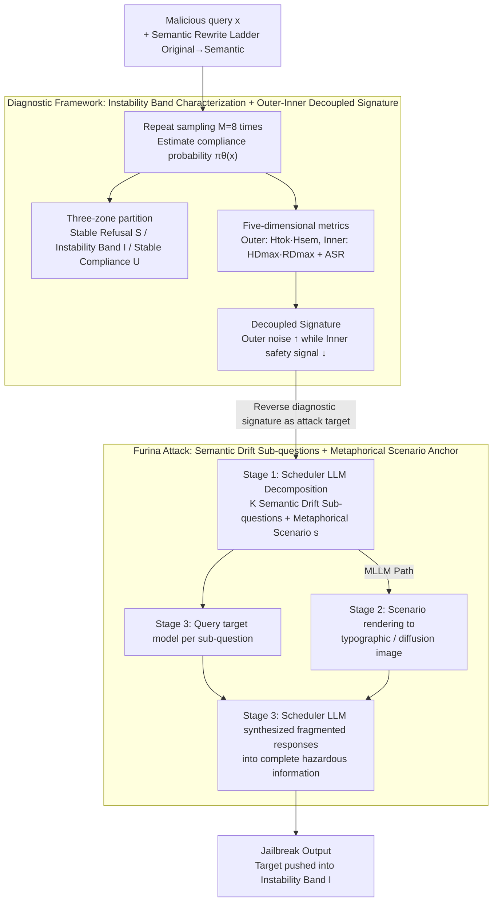

# Furina: Fragmented Uncertainty-Driven Refusal Instability Attack

**Conference**: ICML 2026  
**arXiv**: [2605.26158](https://arxiv.org/abs/2605.26158)  
**Code**: https://github.com/0xCavaliers/Furina_Jailbreak  
**Area**: LLM Security / Jailbreak Attacks / Uncertainty Quantification / Multimodal Security  
**Keywords**: Refusal Instability Band, Semantic Entropy, Internal Safety Signal Decoupling, Fragmented Prompts, Cross-model Transfer  

## TL;DR
This paper first utilizes multi-metric diagnostics to prove that "LLM safety decisions are not binary thresholds, but exist within a refusal instability band," discovering that this band is characterized by "rising external uncertainty while internal safety signals decrease." Based on this, it proposes Furina—a model-agnostic jailbreak attack that forces inputs into the instability band by breaking malicious intent into fragmented situational narratives, outperforming multiple strong baselines on HarmBench.

## Background & Motivation
**Background**: The industry generally perceives the safety alignment of LLMs/MLLMs as a clean binary decision boundary—refusal on one side and compliance on the other; both attackers and defenders assume this line is relatively sharp.

**Limitations of Prior Work**: The authors list three empirical phenomena contradicting the "binary boundary": repeated sampling of the same input drifts between refusal/compliance, slight rewrites flip decisions, and adversarial prompts effective on one model fail immediately on another. This suggest that "boundaries" are far more blurred and context-dependent than imagined.

**Key Challenge**: Most existing attacks find sharp adversarial samples for specific models via GCG/AutoDAN, showing poor transferability. Most existing defenses assume "unsafe prompts elicit separable internal representations," a hypothesis the authors suspect fails near the boundary.

**Goal**: (1) Formalize and quantify this instability band; (2) Identify a set of diagnostic metrics strongly correlated with instability that appear consistently across methods; (3) Reverse-engineer these metrics as "targets" to construct a universal jailbreak method.

**Key Insight**: Jailbreak is viewed as a unified process of "pushing the model state into high-uncertainty regions"—role-playing, multi-turn context entropy accumulation, and adversarial suffixes injecting cross-modal noise are essentially entropy amplifiers.

**Core Idea**: Rather than searching for an adversarial token sequence, it is more effective to directly construct "fragmented, scenario-anchored" prompts—decomposing malicious intent into sub-questions with semantic drift and embedding them in a metaphorical scenario to force the model into erroneous compliance under high uncertainty.

## Method

### Overall Architecture
The paper is divided into two parts: the first is diagnosis (Section 3), using metrics to characterize the "instability band"; the second is the attack (Section 4 + Figure 2), reversing diagnostic signals into attack targets. The pipeline is:

1. **Instability Band Formalization**: Compliance probability is defined as $\pi_\theta(x) := \mathbb{E}_{Y\sim p_\theta(\cdot|x)}[C(Y)]$. Thresholds $\tau_-, \tau_+$ segment the input space into stable refusal $\mathcal{S}$, stable compliance $\mathcal{U}$, and the instability band $\mathcal{I}$.
2. **Multi-metric Diagnosis**: Each prompt is sampled $M$ times to calculate five-dimensional features: ASR, token entropy $H_\mathrm{tok}$, semantic entropy $H_\mathrm{sem}$, HiddenDetect signal $HD_{\max}$, and Refusal Direction signal $RD_{\max}$.
3. **Semantic Rewrite Ladder Experiment**: Each malicious query is rewritten across five levels (Original→Minor→Moderate→High→Semantic) to trace metric trajectories relative to context diffusion.
4. **Furina Attack Construction**: Original malicious intent is decomposed into "intent-preserving" semantic drift sub-questions and embedded within a metaphorical scenario anchor. Text-only models receive sub-questions directly, while MLLMs receive scenario descriptions rendered as typographic images or diffusion-generated images along with text. Finally, a scheduler LLM synthesizes fragmented responses into complete hazardous information.

### Key Designs

**1. Compliance Probability Characterization of the Refusal Instability Band: Transforming "Safety as Binary" from Qualitative to Measurable**

The industry defaults to a sharp binary boundary for safety alignment, an unverified assumption. Furina makes this measurable: by sampling $M$ times for input $x$ to obtain binary compliance decisions $C(Y^{(m)})$, the compliance probability is defined as $\pi_\theta(x) := \mathbb{E}_{Y\sim p_\theta(\cdot|x)}[C(Y)]$. The input space is then partitioned: stable refusal $\mathcal{S}=\{x:\pi_\theta(x)\le\tau_-\}$, stable compliance $\mathcal{U}=\{x:\pi_\theta(x)\ge\tau_+\}$, and the instability band $\mathcal{I}=\{x:\tau_-<\pi_\theta(x)<\tau_+\}$. Dataset-level ASR is defined as the frequency where at least one of $M$ samples is judged UNSAFE: $\mathrm{ASR}=\tfrac{1}{N}\sum_i \mathbb{I}[\max_m C(Y_i^{(m)})=1]$, making diagnosis robust to nucleus sampling stochasticity. Crucially, single greedy sampling collapses the instability band into a deterministic output, masking the issue; under $M=8$, ASR transitions smoothly from $\mathcal{S}$ to $\mathcal{U}$ (e.g., 0.02→0.04→0.11→0.56→0.77 on Qwen3-8B), empirically refuting the "binary boundary" hypothesis.

**2. Outer-Inner Decoupled Diagnostic Signature: Identifying Fingerprints of the "Instability Band"**

Identifying the band is insufficient; its fingerprint must be found to explain why probe-based defenses fail. The authors measure two sets of signals: external metrics include token-level entropy $H_\mathrm{tok}(x) = \frac{1}{M}\sum_m \frac{1}{T^{(m)}}\sum_t \mathcal{H}(p_\theta(v|x,y^{(m)}_{<t}))$ and semantic entropy $H_\mathrm{sem}(x) = \frac{2}{M(M-1)}\sum_{i<j} d(\phi(Y^{(i)}),\phi(Y^{(j)}))$; internal signals include HiddenDetect $HD_{\max} = \max_l \mathrm{proj}(\mathbf{h}_l)\cdot \mathbf{r}/(\|\mathrm{proj}(\mathbf{h}_l)\|\|\mathbf{r}\|)$ and Refusal Direction $RD_{\max}=\max_l \mathbf{a}^{(l)}\cdot \mathbf{r}^{(l)}/\|\mathbf{r}^{(l)}\|$. Scanning across the semantic rewrite ladder reveals a counter-intuitive decoupling: ASR↑, $H_\mathrm{tok}$↑, and $H_\mathrm{sem}$ peaks in the middle, while $HD_{\max}$ and $RD_{\max}$ decrease monotonically. This signature—"increasing external noise while decreasing internal safety signals"—provides a mechanistic explanation: the model is pushed to a state that doesn't appear harmful in representation but is compliant in behavior, which is why hidden-state probes fail against sophisticated jailbreaks.

**3. Furina: Semantic Drift Sub-questions + Metaphorical Scenario Anchor—Reversing Diagnostic Metrics as Attack Targets**

Since the instability band signature involves amplified $H_\mathrm{tok}$ and context complexity, attacks need not search for adversarial tokens per model but can instead generate this signature. Furina uses a scheduler LLM to decompose the original malicious query into multiple "intent-preserving + semantic-drift" sub-questions (each appearing safe in isolation but collectively pointing to the same hazard) and generates a metaphorical scenario description as a cohesive context. Text models receive these sub-questions directly; MLLMs receive the scenario description as either a synthetic anchor, typographic image, or diffusion-generated image, creating cross-modal mismatches that further amplify $H_\mathrm{tok}$. The attack follows three stages: decomposition into $K$ neutral sub-questions and scenario descriptions (Stage 1), scenario visualization for MLLMs (Stage 2), and querying the target model followed by synthesizing (SYNTHESIZE) fragmented responses into complete hazardous info (Stage 3). The core lies in each sub-question and response appearing harmless—danger only emerges during final synthesis—allowing it to bypass token-by-token detection. Furina transfers naturally across model families because it relies on prompt engineering rather than model weights; it achieves higher $H_\mathrm{tok}$ (0.396) and ASR (0.86) compared to AmpleGCG, PAIR, and AutoDAN.

### Evaluation and Sampling Settings
The diagnostic phase uses a binary safety judge (nucleus sampling $T=0.8, p=0.9, M=8$). Main experiments on HarmBench and MM-SafetyBench use more rigorous rubric-based judges. Judge prompts are provided in Appendix A.2 and B.8.

## Key Experimental Results

### Main Results: Semantic Rewrite Ladder Diagnosis (Table 1 Excerpt)

| Model / Dataset | Rewrite Level | ASR | $H_\mathrm{tok}$ | $RD_{\max}$ |
|---|---|---|---|---|
| LLaMA-2-7B / AdvBench | Original | 0.01 | 0.345 | 0.677 |
| LLaMA-2-7B / AdvBench | Semantic | 0.42 | 0.435 | 0.083 |
| Qwen3-8B / AdvBench | Original | 0.02 | 0.235 | – |
| Qwen3-8B / AdvBench | High | 0.56 | 0.320 | – |
| Qwen3-8B / AdvBench | Semantic | 0.77 | 0.334 | – |
| LLaMA-2-7B / HarmBench | Original | 0.08 | 0.346 | 0.548 |
| LLaMA-2-7B / HarmBench | Semantic | 0.72 | 0.428 | 0.070 |

Observation: Across all models, ASR and $H_\mathrm{tok}$ increase monotonically, while $RD_{\max}$ decreases; $H_\mathrm{sem}$ peaks at Moderate / High before declining—representing the $\mathcal{I}$→$\mathcal{U}$ transition trajectory.

### Cross-Method Comparison (Table 2, Averaged for LLaMA-2-7B-Chat and Qwen3-8B)

| Method | Category | $H_\mathrm{tok}$ | $H_\mathrm{sem}$ | $HD_{\max}$ | ASR |
|---|---|---|---|---|---|
| Original prompt | — | 0.289 | 0.091 | 0.023 | 0.08 |
| AmpleGCG | Suffix Optimization | 0.306 | 0.138 | 0.019 | 0.24 |
| PAIR | Automated Prompt Search | 0.316 | 0.104 | 0.021 | 0.18 |
| AutoDAN | Automated Prompt Search | 0.360 | 0.132 | 0.012 | 0.39 |
| ActorBreaker | Multi-turn Context | 0.378 | 0.112 | – | 0.81 |
| **Furina (Ours)** | Fragmented + Scenario Anchor | **0.396** | 0.101 | – | **0.86** |

### Key Findings
- All jailbreak methods exhibit the same "$H_\mathrm{tok}$ rising, $HD_{\max}$ falling" signature, proving uncertainty amplification is the common cause of success, whereas specific forms (gradient suffixes / roleplay / multi-turn / cross-modal) are merely different implementation paths.
- $H_\mathrm{sem}$ is method-dependent: AmpleGCG and AutoDAN increase semantic variance, while PAIR and Furina maintain surface consistency, suggesting "semantically stable compliance" is the most dangerous jailbreak outcome.
- Combining typographic and diffusion-generated scenario images with text for MLLMs further amplifies $H_\mathrm{tok}$ via cross-modal mismatch, confirming the diagnostic signature holds for MLLMs.

## Highlights & Insights
- Formalizing the "binary boundary hypothesis" into a falsifiable claim and refuting it with intermediate $\pi_\theta(x)$ values is the cleanest methodological contribution.
- Revealing the "Outer uncertainty ↑ while Inner safety signal ↓" decoupling provides a mechanistic explanation for why hidden-state probes fail against mature jailbreaks, serving as a warning for defense research.
- The attack-side reversal—treating "diagnostic metrics" as "attack objective functions"—circumvents dependence on model weights, resulting in a naturally transferable attack paradigm.

## Limitations & Future Work
- ASR calculation allows success if any of $M$ samples succeed, which might be aggressive compared to real-world single-sample deployments.
- Internal signals only considered HiddenDetect and Refusal Direction probes; whether decoupling persists against stronger multi-vector probes remains unverified.
- Furina relies on a scheduler LLM for semantic drift and scenario generation; attack cost and stealth are limited by the scheduler LLM's own alignment.
- The paper explicitly warns of offensive content; given the open-source code, there is a risk of misuse. Future defense work could utilize the multi-metric signatures to construct "instability-aware" refusal enhancement methods.

## Related Work & Insights
- **vs AmpleGCG / AutoDAN (Gradient/Search)**: These find sharp adversarial points on specific models with poor transferability; Furina achieves robust cross-model attacks by targeting the instability band.
- **vs ActorBreaker (Multi-turn)**: Multi-turn attacks rely on cumulative context entropy to enter $\mathcal{I}$; Furina achieves this in a single turn, but the underlying mechanism (entropy amplification) is consistent.
- **vs HiddenDetect / Refusal Direction (Internal Probe Defenses)**: These assume harmful samples activate separable representations; this work demonstrates they fail precisely in the instability band, suggesting defenses must integrate external uncertainty signals.

## Rating
- Novelty: ⭐⭐⭐⭐⭐ Formalizing the "instability band," empirically proving "outer-inner decoupling," and reversing diagnostics into attack targets is highly cohesive.
- Experimental Thoroughness: ⭐⭐⭐⭐ Covers 4 open/commercial LLMs and MLLMs, two benchmarks, 5 rewrite levels, and 5 metrics; lacks variance reports for multiple runs.
- Writing Quality: ⭐⭐⭐⭐ Narrative transition from diagnosis to attack is smooth; metric notation is dense and requires appendix reference for full clarity.
- Value: ⭐⭐⭐⭐⭐ Provides actionable tools for both attackers (universal templates) and defenders (diagnostic signatures and failure evidence).

<!-- RELATED:START -->

## Related Papers

- [\[ICML 2026\] TUR-DPO: Topology- and Uncertainty-Aware Direct Preference Optimization](tur-dpo_topology-_and_uncertainty-aware_direct_preference_optimization.md)
- [\[CVPR 2026\] IAG: Input-aware Backdoor Attack on VLM-based Visual Grounding](../../CVPR2026/multimodal_vlm/iag_input-aware_backdoor_attack_on_vlm-based_visual_grounding.md)
- [\[ICML 2026\] Mitigating Manifold Departure: Uncertainty-Aware Subspace Rectification for Trustworthy MLLM Decoding](mitigating_manifold_departure_uncertainty-aware_subspace_rectification_for_trust.md)
- [\[CVPR 2026\] Language-driven Fine-grained Retrieval](../../CVPR2026/multimodal_vlm/language-driven_fine-grained_retrieval.md)
- [\[ICLR 2026\] Teaching VLMs to Admit Uncertainty in OCR from Lossy Visual Inputs](../../ICLR2026/multimodal_vlm/teaching_vlms_to_admit_uncertainty_in_ocr_from_lossy_visual_inputs.md)

<!-- RELATED:END -->
