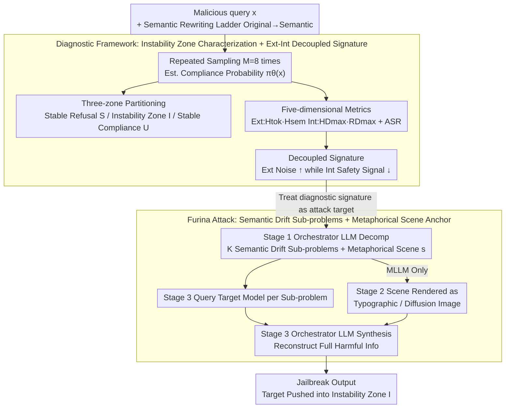

# Furina: Fragmented Uncertainty-Driven Refusal Instability Attack

**Conference**: ICML 2026  
**arXiv**: [2605.26158](https://arxiv.org/abs/2605.26158)  
**Code**: https://github.com/0xCavaliers/Furina_Jailbreak  
**Area**: LLM Security / Jailbreak Attacks / Uncertainty Quantization / Multimodal Security  
**Keywords**: Refusal Instability Zone, Semantic Entropy, Internal Safety Signal Decoupling, Fragmented Prompts, Cross-model Transfer  

## TL;DR
This paper first utilizes multi-metric diagnostics to prove that "LLM safety decisions are not binary thresholds, but rather exist within a refusal instability zone." It further discovers that this zone is characterized by "rising external uncertainty while internal safety signals actually decrease." Based on this, Furina is proposed—a jailbreak attack that requires no model-specific optimization. By shattering malicious intent into contextualized narratives, it forces inputs into the instability zone, outperforming several strong baselines on HarmBench.

## Background & Motivation
**Background**: The industry generally perceives LLM/MLLM safety alignment as a clean binary decision boundary—one side for refusal and the other for compliance. Both attackers and defenders typically assume this boundary is relatively sharp.

**Limitations of Prior Work**: The authors list three empirical phenomena that contradict the "binary boundary" assumption: repeated sampling of the same input drifts between refusal and compliance, minor rephrasing can flip decisions, and adversarial prompts effective on one model often fail instantly on another. These suggest the "boundary" is far more blurred and context-dependent than imagined.

**Key Challenge**: Most existing attacks, such as GCG or AutoDAN, search for a sharp adversarial sample on a specific model through model-specific optimization, resulting in poor transferability. Most current defenses assume that "unsafe prompts elicit separable internal representations," but the authors suspect this assumption fails near the boundary.

**Goal**: (1) Formalize and quantify this instability zone; (2) identify a set of diagnostic metrics strongly correlated with the unstable state that appear consistently across methods; (3) utilize these metrics as "targets" to reverse-engineer a universal jailbreak method.

**Key Insight**: Jailbreaking is viewed as a unified process of "pushing the model state into high-uncertainty regions." Role-playing with identity blurring, multi-turn dialogues accumulating contextual entropy, and adversarial suffixes injecting cross-modal noise are essentially all entropy amplifiers.

**Core Idea**: Instead of searching for specific adversarial token sequences, it is more effective to directly construct "fragmented, scene-anchored" prompts. By decomposing malicious intent into several semantically drifted sub-problems embedded within a metaphorical scene, the model is forced to make incorrect compliance decisions under high uncertainty.

## Method

### Overall Architecture
The paper is divided into two parts: the first is diagnosis (Section 3), using a set of metrics to characterize the "instability zone"; the second is the attack (Section 4 + Figure 2), treating diagnostic signals as attack targets. The full pipeline is as follows:

1. **Instability Zone Formalization**: The compliance probability is defined as $\pi_\theta(x) := \mathbb{E}_{Y\sim p_\theta(\cdot|x)}[C(Y)]$, and the input space is partitioned into stable refusal $\mathcal{S}$, stable compliance $\mathcal{U}$, and the instability zone $\mathcal{I}$ using thresholds $\tau_-, \tau_+$.
2. **Multi-metric Diagnosis**: Each prompt is sampled $M$ times to calculate five-dimensional features: ASR, token entropy $H_\mathrm{tok}$, semantic entropy $H_\mathrm{sem}$, HiddenDetect signal $HD_{\max}$, and Refusal Direction signal $RD_{\max}$.
3. **Semantic Rewriting Ladder Experiment**: Each malicious query is rewritten into five levels (Original→Minor→Moderate→High→Semantic) to scan the trajectory of metrics as the context diffuses.
4. **Furina Attack Construction**: The original malicious intent is decomposed into several "intent-preserving" semantically drifted sub-problems, and a metaphorical scene description is generated as a contextual anchor. Text-only models receive sub-problems directly, while MLLMs receive the scene description rendered as typographic or diffusion images alongside the text. Finally, an orchestrator LLM synthesizes the fragmented answers into complete harmful information.

### Key Designs

**1. Compliance Probability Characterization of the Refusal Instability Zone: Turning "Is Safety Behavior Binary?" from a Qualitative to a Measurable Quantitative Problem**

The industry implicitly assumes safety alignment is a sharp binary boundary, yet this remains an unverified hypothesis. Furina first defines it as a measurable quantity: by repeatedly sampling an input $x$ for $M$ times to obtain binary compliance judgments $C(Y^{(m)})$, the compliance probability $\pi_\theta(x) := \mathbb{E}_{Y\sim p_\theta(\cdot|x)}[C(Y)]$ is defined. The input space is then partitioned into three segments: stable refusal $\mathcal{S}=\{x:\pi_\theta(x)\le\tau_-\}$, stable compliance $\mathcal{U}=\{x:\pi_\theta(x)\ge\tau_+\}$, and the instability zone $\mathcal{I}=\{x:\tau_-<\pi_\theta(x)<\tau_+\}$. Dataset-level ASR is defined as the frequency of "at least one UNSAFE judgment in $M$ samples," i.e., $\mathrm{ASR}=\tfrac{1}{N}\sum_i \mathbb{I}[\max_m C(Y_i^{(m)})=1]$, ensuring robustness to nucleus sampling randomness. Critically, a single greedy sample "collapses" the instability zone into a deterministic output, masking the issue. At $M=8$ samples, ASR transitions smoothly from $\mathcal{S}$ to $\mathcal{U}$ (e.g., 0.02→0.04→0.11→0.56→0.77 on Qwen3-8B), empirically refuting the "binary boundary" hypothesis via intermediate values of $\pi_\theta$.

**2. External-Internal Decoupled Diagnostic Signature: Identifying the Fingerprints of the "Instability Zone"**

Identifying the instability zone is insufficient; its fingerprints must be found to explain "why probe-based defenses fail." The authors measure both external and internal signals: external signals use two types of entropy—token-level entropy $H_\mathrm{tok}(x) = \frac{1}{M}\sum_m \frac{1}{T^{(m)}}\sum_t \mathcal{H}(p_\theta(v|x,y^{(m)}_{<t}))$ and semantic entropy $H_\mathrm{sem}(x) = \frac{2}{M(M-1)}\sum_{i<j} d(\phi(Y^{(i)}),\phi(Y^{(j)}))$ (where $\phi$ is the MiniLM sentence vector); internal signals use HiddenDetect's $HD_{\max} = \max_l \mathrm{proj}(\mathbf{h}_l)\cdot \mathbf{r}/(\|\mathrm{proj}(\mathbf{h}_l)\|\|\mathbf{r}\|)$ and Refusal Direction's $RD_{\max}=\max_l \mathbf{a}^{(l)}\cdot \mathbf{r}^{(l)}/\|\mathbf{r}^{(l)}\|$ (where $\mathbf{r}^{(l)}=\bm{\mu}_\text{harmful}^{(l)}-\bm{\mu}_\text{harmless}^{(l)}$). Scanning along the semantic rewriting ladder reveals a counter-intuitive decoupling: ASR↑, $H_\mathrm{tok}$↑, and $H_\mathrm{sem}$ peaks in the middle, while $HD_{\max}$ and $RD_{\max}$ monotonically decrease. This signature of "increasing external noise vs. decreasing internal safety signals" provides a mechanistic explanation—the model is pushed to a state that representationally does not look harmful but behaviorally complies, which is the root cause of why hidden-state probes cannot stop sophisticated jailbreaks.

**3. Furina: Semantic Drift Sub-problems + Metaphorical Scene Anchors—Reversing Diagnostic Metrics into Attack Targets**

Since the fingerprint of the instability zone involves amplified $H_\mathrm{tok}$ and contextual complexity, the attack does not need to search for adversarial tokens per model; it can directly manufacture this fingerprint. Furina uses an orchestrator LLM to decompose the original malicious query into several "intent-preserving + semantically drifted" sub-problems (each appearing harmless individually but collectively pointing to the same dangerous information), combined with a metaphorical scene description as a unifying context. Text-only models receive these sub-problems directly. For MLLMs, the scene description is either a synthetic anchor or rendered into typographic or diffusion-generated images, creating cross-modal mismatch to further amplify $H_\mathrm{tok}$. The attack follows three stages (Algorithm 1): the orchestrator LLM decomposes the intent into structured representations to generate $K$ safety-neutral sub-problems and scene descriptions (Stage 1), scene visualization for MLLMs (Stage 2), and querying the target model with each sub-problem followed by the orchestrator LLM synthesizing (SYNTHESIZE) the fragmented answers into full harmful information (Stage 3). The core strength lies in the fact that each sub-problem and each answer appears harmless; the danger only emerges during final synthesis—allowing it to bypass token-by-token detection. Because it relies entirely on prompt engineering to generate instability signals without touching model weights, it inherently transfers across model families. Compared to AmpleGCG / PAIR / AutoDAN, Furina achieves higher $H_\mathrm{tok}$ (0.396) and an ASR of 0.86.

### Sampling & Evaluation Settings
The diagnostic phase uses a binary safety judge (nucleus sampling $T=0.8, p=0.9, M=8$). The main experiments on HarmBench and MM-SafetyBench use a stricter rubric-based judge. Prompts for both judges are provided in Appendices A.2 and B.8.

## Key Experimental Results

### Main Results: Semantic Rewriting Ladder Diagnosis (Selected from Table 1)

| Model / Dataset | Rewriting Level | ASR | $H_\mathrm{tok}$ | $RD_{\max}$ |
|---|---|---|---|---|
| LLaMA-2-7B / AdvBench | Original | 0.01 | 0.345 | 0.677 |
| LLaMA-2-7B / AdvBench | Semantic | 0.42 | 0.435 | 0.083 |
| Qwen3-8B / AdvBench | Original | 0.02 | 0.235 | – |
| Qwen3-8B / AdvBench | High | 0.56 | 0.320 | – |
| Qwen3-8B / AdvBench | Semantic | 0.77 | 0.334 | – |
| LLaMA-2-7B / HarmBench | Original | 0.08 | 0.346 | 0.548 |
| LLaMA-2-7B / HarmBench | Semantic | 0.72 | 0.428 | 0.070 |

Observation: Across all models, ASR and $H_\mathrm{tok}$ rise monotonically while $RD_{\max}$ decreases monotonically. $H_\mathrm{sem}$ peaks at the Moderate/High level before dropping—marking the $\mathcal{I}$→$\mathcal{U}$ transition trajectory.

### Cross-method Comparison (Table 2, Average of LLaMA-2-7B-Chat and Qwen3-8B)

| Method | Category | $H_\mathrm{tok}$ | $H_\mathrm{sem}$ | $HD_{\max}$ | ASR |
|---|---|---|---|---|---|
| Original prompt | — | 0.289 | 0.091 | 0.023 | 0.08 |
| AmpleGCG | Suffix Optimization | 0.306 | 0.138 | 0.019 | 0.24 |
| PAIR | Auto-prompt Search | 0.316 | 0.104 | 0.021 | 0.18 |
| AutoDAN | Auto-prompt Search | 0.360 | 0.132 | 0.012 | 0.39 |
| ActorBreaker | Multi-turn Context | 0.378 | 0.112 | – | 0.81 |
| **Furina (Ours)** | Fragmented + Scene Anchor | **0.396** | 0.101 | – | **0.86** |

### Key Findings
- All jailbreak methods exhibit the same signature: "$H_\mathrm{tok}$ increases, $HD_{\max}$ decreases," proving that uncertainty amplification is a universal cause of jailbreak success, whereas specific forms (gradient suffixes / role-play / multi-turn / cross-modal) are merely different implementation paths.
- $H_\mathrm{sem}$ is method-dependent: AmpleGCG and AutoDAN cause more scattered output semantics, while PAIR and Furina maintain surface-level consistency, indicating that "semantically stable compliance" is the most dangerous jailbreak outcome.
- When typographic and diffusion-generated scene images are fed into MLLMs, cross-modal mismatch further amplifies $H_\mathrm{tok}$, ensuring the diagnostic signature holds for MLLMs as well.

## Highlights & Insights
- Elevating the "binary boundary hypothesis" to a falsifiable one and refuting it with empirical $\pi_\theta(x)$ values is the cleanest methodological contribution of the paper.
- Revealing the decoupling phenomenon of "increasing external uncertainty vs. decreasing internal safety signals" provides a mechanistic explanation for why hidden-state probes fail against mature jailbreaks, serving as a warning for defense research.
- The reversal of the attack logic is also noteworthy—treating "diagnostic metrics" as "attack objective functions" bypasses reliance on model weights, resulting in a naturally transferable attack paradigm.

## Limitations & Future Work
- The ASR calculation in the paper considers a success if "any one of $M$ samples succeeds," which may be aggressive for real-world scenarios where only one sample is taken.
- Internal signals only investigated HiddenDetect and Refusal Direction probes; whether this decoupling persists against stronger multi-vector probes remains unverified.
- Furina relies on an orchestrator LLM for semantic drift and scene generation; attack costs and stealth are influenced by the orchestrator's own alignment strategy.
- The paper explicitly warns of offensive content, and the open-sourcing of code implies misuse risks—future defense work could utilize the multi-metric signatures from this paper to construct "instability-aware" refusal enhancement methods.

## Related Work & Insights
- **vs. AmpleGCG / AutoDAN (Gradient/Search-based)**: These methods find sharp adversarial points on specific models with poor transferability; Furina achieves robust cross-model-family attacks by targeted excitation of the instability zone.
- **vs. ActorBreaker (Multi-turn)**: Multi-turn attacks rely on accumulating contextual entropy to enter $\mathcal{I}$; Furina achieves this in a single turn, but the underlying mechanism (entropy amplification) is consistent, and this paper provides a unified explanation.
- **vs. HiddenDetect / Refusal Direction (Internal Probe Defenses)**: These defenses assume harmful samples activate separable representations; this paper empirically demonstrates they fail in the instability zone, suggesting defenses need to incorporate external uncertainty signals.

## Rating
- Novelty: ⭐⭐⭐⭐⭐ Formalizing the "instability zone," empirically proving "external-internal decoupling," and reversing diagnostics into attack targets is a coherent and brilliant sequence.
- Experimental Thoroughness: ⭐⭐⭐⭐ Covers 4 open-source/commercial LLMs and MLLMs, two benchmarks, 5 rewriting levels, and 5 metric types; however, lacks variance reports for multiple repetitions.
- Writing Quality: ⭐⭐⭐⭐ The narrative flow between the diagnostic framework and attack method is smooth; the metric notation is slightly dense and requires the appendix for full comprehension.
- Value: ⭐⭐⭐⭐⭐ Provides actionable tools for both attackers and defenders: attackers gain a universal template, while defenders gain diagnostic signatures and evidence of failure modes.

<!-- RELATED:START -->

- **GCG**: Universal Adversarial Attacks on Optimized Language Models, 2023.
- **HarmBench**: A Holistic Evaluation Framework for LLM Alignment, 2024.
- **HiddenDetect**: Diagnostic Interpretation of Internal States in LLM Security, 2025.

<!-- RELATED:END -->

## Related Papers

- [\[ICML 2026\] TUR-DPO: Topology- and Uncertainty-Aware Direct Preference Optimization](tur-dpo_topology-_and_uncertainty-aware_direct_preference_optimization.md)
- [\[CVPR 2026\] FlowHijack: A Dynamics-Aware Backdoor Attack on Flow-Matching VLA Models](../../CVPR2026/multimodal_vlm/flowhijack_dynamics_aware_backdoor_attack_on_flow_matching_vla_models.md)
- [\[CVPR 2026\] When to Think and When to Look: Uncertainty-Guided Lookback](../../CVPR2026/multimodal_vlm/when_to_think_and_when_to_look_uncertainty-guided_lookback.md)
- [\[ICLR 2026\] Reasoning-Driven Multimodal LLM for Domain Generalization](../../ICLR2026/multimodal_vlm/reasoning-driven_multimodal_llm_for_domain_generalization.md)
- [\[ACL 2026\] VAUQ: Vision-Aware Uncertainty Quantification for LVLM Self-Evaluation](../../ACL2026/multimodal_vlm/vauq_vision-aware_uncertainty_quantification_for_lvlm_self-evaluation.md)

<!-- RELATED:END -->
