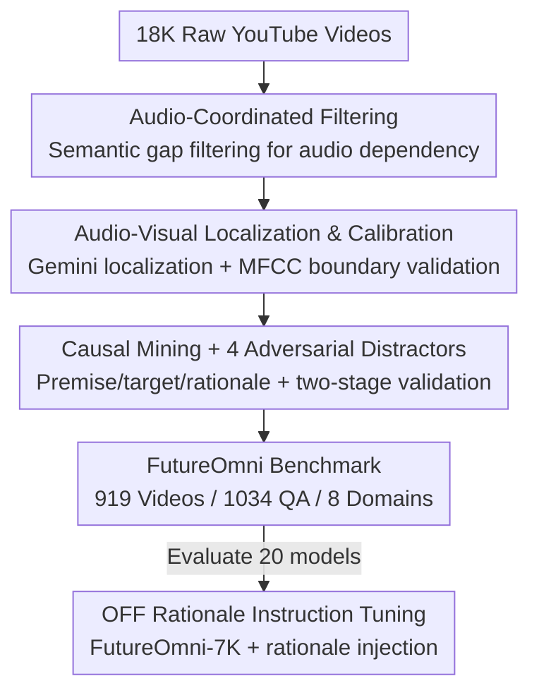

# FutureOmni: Evaluating Future Forecasting from Omni-Modal Context for Multimodal LLMs

**Conference**: ICML2026  
**arXiv**: [2601.13836](https://arxiv.org/abs/2601.13836)  
**Code**: https://github.com/OpenMOSS/FutureOmni  
**Area**: Multimodal VLM  
**Keywords**: Audio-Visual Understanding, Future Forecasting, Omni-modal Benchmark, Causal Reasoning, Instruction Tuning

## TL;DR
This paper introduces FutureOmni, the first benchmark evaluating MLLMs' ability to forecast future events from audio-visual context (919 videos / 1,034 MCQs). Results show even the strongest model, Gemini 3 Flash, achieves only 64.8% accuracy. The authors propose OFF, a rationale-infused instruction tuning method that significantly enhances both forecasting and generalization for open-source models.

## Background & Motivation

**Background**: Audio-visual understanding in Multimodal Large Language Models (MLLMs) has progressed rapidly. Recent benchmarks like WorldSense and DailyOmni evaluate omni-modal perception, but they focus almost exclusively on **retrospective understanding**—describing or localizing "what has already happened."

**Limitations of Prior Work**: Real-world applications like autonomous driving and security require **anticipating the future**. For instance, hearing a horn or seeing a pedestrian's position should lead to immediate decision-making about the next state of the world. Existing future forecasting benchmarks are either text-only (FutureBench, ForecastBench) or vision-centric (VLEP, IntentQA, MM-Forecast), often **ignoring the auditory modality**—despite sound frequently serving as a "precursor" to future events (e.g., a scream preceding a commotion).

**Key Challenge**: There is a vacuum in evaluation data requiring both "omni-modal perception" and "causal future reasoning." Existing datasets often ignore audio tracks, making them incapable of testing scenarios where audio is the primary causal factor.

**Goal**: Construct a benchmark specifically for evaluating the transition from "audio-visual joint observation" to "future events" and identify whether current models fail due to perception or reasoning, while providing a viable improvement strategy.

**Key Insight**: The authors define the task as selecting the correct future event from candidates given past audio-visual observations. By designing **adversarial distractors**, they force models to perform cross-modal causal reasoning rather than relying on unimodal shortcuts.

**Core Idea**: Build the FutureOmni benchmark through "audio-coordinated video filtering + audio-visual temporal localization + causal pair mining + four types of adversarial distractors." Further, propose Omni-modal Future Forecasting (OFF) instruction tuning, which feeds the reasoning rationales generated during construction back into training.

## Method

### Overall Architecture
The core of FutureOmni is a scalable, AI-assisted, human-in-the-loop data pipeline. Starting from ~18K YouTube videos, it uses an audio-coordination strategy to filter low-quality clips, employs Gemini 2.5 Flash for dense event localization, and mines "premise $\to$ future" causal pairs with four types of adversarial distractors. After benchmarking 20 models to expose weaknesses, the authors curate a 7K instruction set (FutureOmni-7K) with rationale injection for OFF training.

### Key Designs

**1. Audio-Coordinated Video Selection: Identifying Informative Audio**

To prevent the benchmark from collapsing into a vision-only task, the authors filter clips where the audio is merely decorative (e.g., background music). After visual similarity filtering, they propose **audio intervention screening**: generating captions for the same video with and without audio. High semantic discrepancy between the two versions indicates high audio dependency. Only the top-50% of clips with the highest audio dependency are retained.

**2. Audio-Visual Temporal Localization & Calibration: High-Fidelity Timestamps**

Causal pairs require precise event boundaries. The authors use Gemini 2.5 Flash for dense event localization with MM:SS precision. To ensure accuracy, they employ **MFCC (Mel-frequency cepstral coefficients)** to detect acoustic transitions at event boundaries. A boundary is accepted only if the MFCC difference exceeds a threshold of $2.0$. Finally, **Audio Fulfilling** labels synchronized acoustic cues (speech, sound effects) within each segment.

**3. Causal Mining & Adversarial Distractors: Turning Prediction into Reasoning**

The authors use DeepSeek-V3.2 to analyze adjacent events, requiring the future event to occur within 30 seconds of the premise and explicitly outputting a **Premise / Target / Rationale** triplet. To ensure difficulty, four types of **adversarial distractors** are introduced:
- **Visual-only Perception**: Visually plausible but contradicted by audio.
- **Audio-only Perception**: Matches audio semantics but never occurs visually.
- **Delayed**: Describes a true event that happened *before* the premise (tests temporal precision).
- **Reverse-Causal**: Describes the *cause* of the premise rather than the *effect* (tests temporal arrow).
All items undergo a two-stage validation (GPT-4o logical check + human review).

**4. OFF Rationale Instruction Tuning: Upgrading from "Answering" to "Reasoning"**

To address the performance gap in open-source models, the authors inject the **reasoning rationales** into the training samples. This teaches the model the underlying logic of "why" a future event follows a specific context. Using the FutureOmni-7K set, they apply LoRA to models like Qwen2.5-Omni-7B, freezing the encoders and updating only the text backbone for 1 epoch at a learning rate of $1 \times 10^{-5}$.

### Loss & Training
OFF follows standard supervised instruction tuning without additional loss terms. The core strategy is the explicit concatenation of the rationale in training samples. LoRA is used to update the LLM backbone while audio-visual encoders remain frozen to maintain computational efficiency while internalizing forecasting logic.

## Key Experimental Results

### Main Results
Evaluation of 20 models reveals that even the best models struggle with future forecasting. Pure vision models consistently underperform omni-modal models due to the lack of audio cues.

| Model | Type | Scale | FutureOmni Avg(%) |
| :--- | :--- | :--- | :--- |
| Gemini 3 Flash | Closed Omni | - | **64.80** |
| Gemini 2.5 Pro | Closed Omni | - | 57.93 |
| Gemini 2.5 Flash | Closed Omni | - | 55.61 |
| Qwen3-Omni | Open Omni | 30B | 53.05 |
| GPT-4o | Closed Vision | - | 49.70 |
| AVicuna | Open Omni | 7B | 30.37 |

### Ablation Study
Modality ablation confirms the necessity of audio-visual synergy. Removing either modality leads to significant performance drops.

| Configuration | Metric (%) | Note |
| :--- | :--- | :--- |
| Qwen2.5-Omni A+V | 47.48 | Full omni-modal input |
| └ V only / A only | 42.50 / 42.50 | ~5% drop for each; no single-modality shortcut |
| └ V+Caption | 43.85 | Textual audio info < raw audio (lacks non-verbal cues) |
| video-SALMONN 2 + OFF | 46.03 $\to$ **49.90 (+3.87)** | Significant gain from OFF |
| Qwen2.5-Omni + OFF (Speech) | 37.83 $\to$ 47.75 ($\approx$+10) | Largest improvement in the hardest category |

### Key Findings
- **Visual Perception is the Primary Bottleneck**: Error analysis of Gemini 3 Flash shows 51.6% of failures stem from visual perception errors, 30.8% from joint reasoning, and only 2.5% from missing world knowledge.
- **Speech is the Hardest Audio Type**: Models perform ~10% worse on Speech than on Music, requiring higher-level decoding and cross-modal alignment.
- **"Context Cold Start" Phenomenon**: Performance is lowest on very short videos and peaks at medium durations (2–4 minutes), suggesting future prediction requires sufficient historical narrative.
- **OFF Generalization**: Models tuned on OFF show gains not only in FutureOmni but also across out-of-domain benchmarks like WorldSense, DailyOmni, and Video-MME.

## Highlights & Insights
- **Audio Intervention Screening**: Utilizing the semantic gap between "audio-on" and "audio-off" captions is a clever, low-cost proxy for measuring informative audio content.
- **Adversarial Distractors**: The inclusion of Visual-only/Audio-only and Reverse-Causal options effectively blocks common shortcuts and temporal confusion.
- **Training on Rationales**: Teaching the "why" instead of just the "what" ensures that forecasting capabilities are internalized as transferable reasoning habits.
- **Error Attribution**: The finding that MLLMs possess sufficient world knowledge but lack dynamic perception and causal synthesis provides a clear roadmap for future research.

## Limitations & Future Work
- Data construction heavily relies on closed-source models (Gemini 2.5 Flash, GPT-4o) for localization and validation, which may affect reproducibility.
- Key thresholds (MFCC $= 2.0$, similarity $70\%$) are empirically set and their robustness across different data domains is not fully explored.
- The scale (1,034 items) is relatively small and limited to multiple-choice formats, excluding open-ended generation.
- Since perception is the main bottleneck, freezing the encoders during OFF tuning might limit the potential for fundamental perception improvements.

## Related Work & Insights
- **vs WorldSense / DailyOmni**: While those focus on retrospective perception, FutureOmni focuses 100% on future forecasting with significantly longer video contexts (avg. 163.5s).
- **vs VLEP / IntentQA**: Earlier future/intent prediction sets were vision-centric; FutureOmni explicitly models "sound as a cause."
- **vs FutureBench / ForecastBench**: These text-only benchmarks require constant updates to prevent data leakage; FutureOmni uses new audio-visual data.

## Rating
- **Novelty**: ⭐⭐⭐⭐⭐ First audio-visual future forecasting benchmark; excellent adversarial design.
- **Experimental Thoroughness**: ⭐⭐⭐⭐⭐ 20 models + modality ablation + error attribution + cross-benchmark validation.
- **Writing Quality**: ⭐⭐⭐⭐ Clear pipeline and findings; some manual thresholding details could be more robust.
- **Value**: ⭐⭐⭐⭐⭐ Provides a scalable benchmark and a practical training paradigm for omni-modal causal reasoning.

<!-- RELATED:START -->

## Related Papers

- [\[CVPR 2026\] Multimodal RewardBench 2: Evaluating Omni Reward Models for Interleaved Text and Image](../../CVPR2026/multimodal_vlm/multimodal_rewardbench_2_evaluating_omni_reward_models_for_interleaved_text_and_.md)
- [\[ICML 2025\] Context is Key: A Benchmark for Forecasting with Essential Textual Information](../../ICML2025/multimodal_vlm/context_is_key_a_benchmark_for_forecasting_with_essential_textual_information.md)
- [\[ICML 2026\] Task-Aware Structured Memory for Dynamic Multi-modal In-Context Learning](task-aware_structured_memory_for_dynamic_multi-modal_in-context_learning.md)
- [\[ICML 2026\] WeatherSyn: An Instruction Tuning MLLM For Weather Forecasting Report Generation](weathersyn_an_instruction_tuning_mllm_for_weather_forecasting_report_generation.md)
- [\[CVPR 2026\] AutoTraces: Autoregressive Trajectory Forecasting via Multimodal Large Language Models](../../CVPR2026/multimodal_vlm/autotraces_autoregressive_trajectory_forecasting_via_multimodal_large_language_m.md)

<!-- RELATED:END -->
