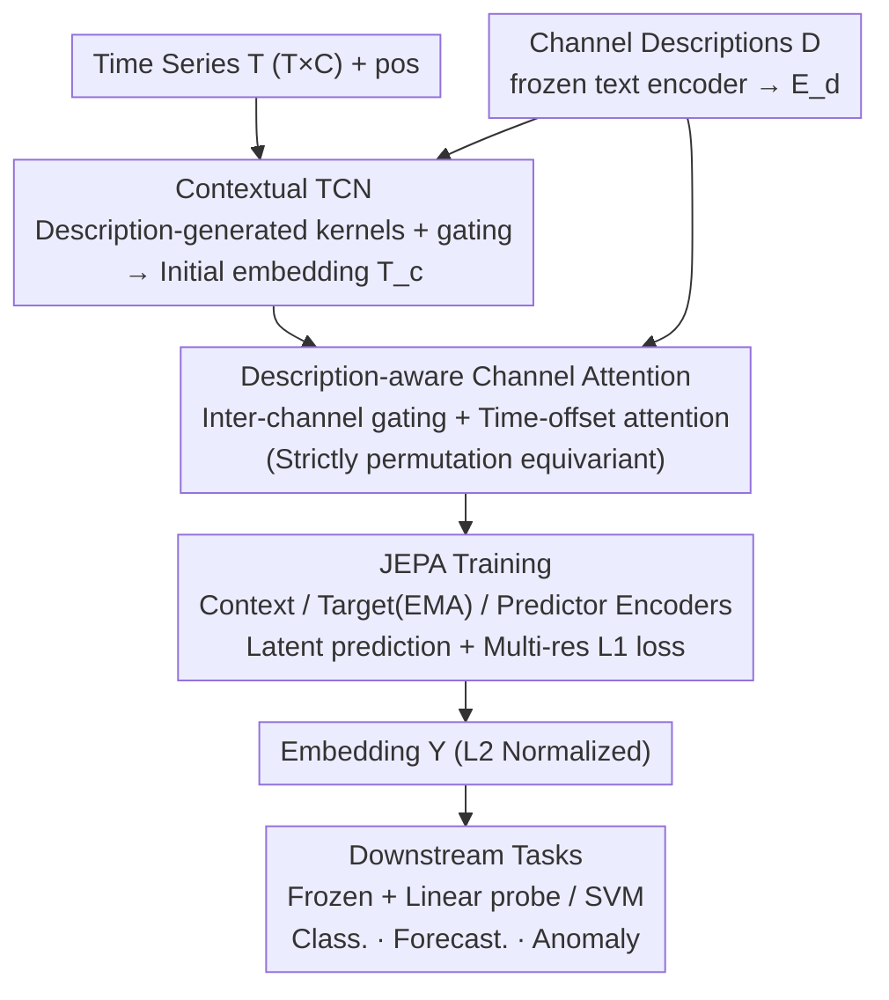

# CHARM: Using Multimodal JEPA + Channel Descriptions for Time Series Foundation Embedding

**Conference**: ICML 2026  
**arXiv**: [2605.31580](https://arxiv.org/abs/2605.31580)  
**Code**: Not provided by the authors  
**Area**: Time Series / Self-Supervised / Multimodal  
**Keywords**: Time Series Foundation Models, JEPA, Channel Description, Equivariant Attention, Sensor Embedding

## TL;DR
CHARM injects channel text descriptions (e.g., "temperature sensor °C") as an inductive bias into a time series Transformer and trains it using a JEPA objective (latent prediction rather than raw signal reconstruction). The resulting embeddings match specialized models like PatchTST, MOMENT, and Moirai across anomaly detection, classification, and forecasting using simple linear probes, while maintaining strict channel-permutation equivariance.

## Background & Motivation

**Background**: Time series models are critical for manufacturing, energy, healthcare, and financial applications, yet most remain narrow-scope and task-specific. While foundation models have succeeded in NLP, CV, and audio, time series foundation models (e.g., TimeFM, Moirai, Chronos) are primarily focused on forecasting, often producing brittle representations unsuitable for broader downstream tasks.

**Limitations of Prior Work**: (1) Most SSL time series models utilize masked reconstruction or next-step prediction, requiring the encoder to impute raw signals—which are often noisy, low-resolution, and contain domain artifacts—causing representations to overfit sensor noise; (2) Nearly all models treat channels as uncategorized streams, discarding critical context provided by sensor identity; (3) Frameworks like UniTS extend reconstruction-based approaches but remain grounded at the raw signal level.

**Key Challenge**: General-purpose embeddings require self-supervised learning (SSL); however, existing SSL objectives based on reconstruction mismatch the goal of semantic representation. There is a need for a sensor-aware model that remains invariant to channel ordering.

**Goal**: To develop a semantically grounded, channel-aware (via text descriptions), and channel-order equivariant time series foundation embedding model.

**Key Insight**: (1) Utilize JOINT-Embedding Predictive Architecture (JEPA) to predict in the latent space rather than the raw signal space, avoiding noise overfitting; (2) Inject channel text descriptions as inductive biases through contextual TCNs and attention gating; (3) Design inter-channel time-offset attention and description-aware gating to ensure strict channel permutation equivariance.

**Core Idea**: CHARM "gives the sensors a voice"—textual descriptions participate in convolutional kernel generation, attention gating, and time-offset embedding. This allows the model to adapt to heterogeneous sensor configurations. JEPA-based latent prediction combined with multi-resolution L1 loss ensures the embeddings are both fine-grained and abstractly robust.

## Method

### Overall Architecture

The input is a tuple $\mathbf{t} = (\mathbf{T}, \mathbf{D}, \mathbf{pos})$ where $\mathbf{T} \in \mathbb{R}^{T \times C}$ is the time series and $\mathbf{D}$ contains text descriptions for $C$ channels (encoded by a frozen text encoder into $\mathbf{E}_d$). A Contextual TCN performs initial embedding $\mathbf{T}_c \in \mathbb{R}^{T \times C \times H}$. Contextual attention layers fuse spatio-temporal-channel information using description-aware gating and inter-channel time-offset attention. Training is conducted via JEPA using three encoders (context, target, and predictor) for latent prediction. These three core designs—description-driven initial embedding, description-aware attention, and JEPA latent prediction—serve as a continuous pipeline of inductive biases centered on channel semantics.

### Key Designs

**1. Contextual TCN: Direct participation of text descriptions in kernel generation**

Conventional multivariate models use fixed patches or simple convolutions. CHARM allows channel descriptions to determine convolutional behavior: channel description embeddings $\mathbf{E}_d$ generate Contextual Kernel Gating $\mathbf{G}_c = \mathrm{sigmoid}(\mathbf{E}_d \mathbf{W}_g)$ to control the receptive field and Contextual Kernels $\mathbf{G}_k = \mathbf{E}_d \mathbf{W}_k$ to generate filters directly. Thus, a "temperature sensor" and a "vibration sensor" receive distinct convolutional processing tailored to their sensor type.

**2. Description-aware Inter-channel Attention + Time-offset Attention: Explicit modeling of channel interactions and lags with equivariance**

Sensor interactions should be determined by semantics. CHARM implements: (a) gating—calculating pairwise similarity $\mathbf{S} = \mathbf{E}_d \mathbf{E}_d^\top$ and thresholds $\mathbf{Z}[i,j] = \mathrm{sigmoid}(\mathbf{E}_d[i,:] \mathbf{W}_b \mathbf{E}_d[j,:]^\top)$, with a gate $\mathbf{G}_d = \mathrm{ReLU}(\mathbf{Z} - \mathbf{S})$ controlling attention flow; (b) time-offset attention—using a learnable tensor $\boldsymbol{\Delta} \in \mathbb{R}^{C \times C \times 2T_{\max}}$ to express lags, constructed symmetrically as $\boldsymbol{\Delta}_{i,j,t} = \boldsymbol{\Delta}_{j,i,-t}$; (c) attention calculation: $\mathbf{A}_{[(i,p),(j,q)]} = \mathrm{Softmax}(\frac{\hat{\mathbf{Q}}\hat{\mathbf{K}}^\top}{\sqrt{D_e}} + \boldsymbol{\Delta}[i,j,q-p] - \lambda_G \mathbf{G}_d[i,j])$. This ensures strict channel-permutation equivariance (variation $<10^{-4}$ under random shuffling) and robustness to sensor configuration changes.

**3. JEPA Training + Multi-resolution L1 Loss: Avoiding the noise trap of raw signal reconstruction**

Standard masked reconstruction forces encoders to fit sensor noise. CHARM utilizes JEPA with three encoders: context (perturbated data), target (clean data, EMA updated), and predictor (narrow context attention). The objective is multi-resolution L1 loss: per (channel, time) grain, per-time cross-channel average, and global average. Matching these scales forces the embedding to learn both fine-grained details and abstract structures. Regularization $R_1$ encourages sparse gating, while $R_2$ regularizes the time-offset tensor.

### Inference

Once trained, CHARM yields $\mathbf{Y} = \mathbf{E}_\theta(\mathbf{T}, \mathbf{D}, \mathbf{pos}) \in \mathbb{R}^{T \times C \times H}$ (L2-normalized). Downstream tasks utilize the frozen $\mathbf{Y}$ with a linear probe or non-linear head.

## Key Experimental Results

### Forecasting: LSF benchmark (5 datasets × 4 horizons)

| Dataset | CHARM+LP | CHARM+NLH FT | Moirai-Large | Toto | TimeMixer++ | VisionTS |
|---------|----------|--------------|--------------|------|-------------|----------|
| Weather (MSE) | 0.230 | 0.222 | 0.226 | 0.242 | 0.269 | 0.228 |
| ETTm1 | 0.416 | 0.411 | 0.368 | 0.448 | 0.373 | 0.344 |
| ETTm2 | 0.220 | **0.208** | 0.269 | 0.322 | 0.281 | 0.259 |
| ETTh1 | 0.592 | 0.557 | 0.395 | 0.400 | 0.392 | 0.418 |
| ETTh2 | 0.323 | **0.316** | 0.339 | 0.341 | 0.333 | 0.352 |

CHARM with a linear probe on frozen embeddings outperforms billion-parameter models like Moirai-Large and Toto on ETTm2 and ETTh2.

### Classification

| Method | Wins ↑ | Avg. Acc ↑ |
|--------|--------|------------|
| TS2Vec | 2 | 78.1 |
| T-Rep | 3 | 78.5 |
| MOMENT | 3 | 72.5 |
| MiniROCKET | 4 | 77.6 |
| **CHARM frozen+SVM** | **4** | **79.6** |

CHARM (frozen + SVM) achieves the highest average accuracy at 79.6%.

### Key Findings

- **Frozen Embeddings are Competitive**: Beating Moirai-Large on multiple datasets proves that channel-aware semantic representations can outperform much larger forecasting-specific models.
- **Cross-task Scalability**: Strong performance across anomaly detection, classification, and forecasting demonstrates target-agnostic general-purpose representations.
- **Strict Permutation Equivariance**: Verified via random permutation tests across 8 datasets.
- **JEPA > Reconstruction**: CHARM's JEPA objective outperforms reconstruction-based approaches (e.g., MOMENT) by 7 percentage points in classification, confirming that latent prediction is superior for time series representation.
- **Descriptions as Identifiers**: Text descriptions act as sensor type inductive biases, facilitating cross-dataset generalization.

## Highlights & Insights

- **Transferring JEPA to Time Series**: This is the first systematic application of JEPA and latent prediction to multivariate time series, proving the viability of cross-modal SSL.
- **Text as Inductive Bias, Not Just Captions**: Unlike previous multimodal models that treat text as descriptive captions, CHARM uses text as a "sensor type identifier" to mechanistically control kernels and attention.
- **Equivariance via Architectural Design**: Symmetrically constrained time-offset tensors and description-aware gating naturally handle heterogeneous sensor fleets.
- **Multi-resolution Loss Prevents Collapse**: Aligning fine and coarse granularities ensures meaningful representations across different scales.

## Limitations & Future Work

- **Dependence on Description Quality**: Poorly written sensor descriptions (missing units, vague terms) may degrade contextual TCN and gating performance.
- **Cross-domain Transferability**: While tested on LSF benchmarks, systemic evaluation of representation reuse across distinct industries (e.g., healthcare to manufacturing) is needed.
- **JEPA Target Stability**: The risk of representation collapse, a known issue in JEPA, requires further long-trajectory empirical validation in time series.
- **Memory Overhead of $\boldsymbol{\Delta}$**: The time-offset tensor $\mathbb{R}^{C \times C \times 2T_{\max}}$ scales poorly with the number of sensors ($C$), potentially requiring sparse or low-rank approximations.
- **Long-horizon Performance**: While competitive, CHARM still lags behind Moirai on long-horizon forecasting (e.g., 720 steps on ETTh1), suggesting that semantic latent prediction may sacrifice some fine-grained signal precision.

## Related Work & Insights

- **Compared to MOMENT/UniTS**: These use reconstruction-based pretraining. CHARM’s JEPA latent prediction is significantly more noise-robust.
- **Compared to Moirai/TimesFM**: These are forecasting-specific foundation models; CHARM provides general-purpose representations that match their forecasting performance even when frozen.
- **Compared to PatchTST/iTransformer**: CHARM moves beyond simple tokens to incorporate fine-grained sensor awareness through description-generated kernels.
- **Insight**: Using text descriptions as architectural inductive biases—rather than just input captions—is a powerful strategy for handling heterogeneous data that could be extended to other fields like robotics or medical imaging.

## Rating

- **Novelty**: ⭐⭐⭐⭐⭐ High. Integrates JEPA, description-driven bias, and equivariance into a cohesive methodology.
- **Experimental Thoroughness**: ⭐⭐⭐⭐ Strong baseline comparisons across three major tasks; lacks broader cross-industry transfer tests.
- **Writing Quality**: ⭐⭐⭐⭐ Clear figures and mathematical detail; some ablation studies are relegated to the appendix.
- **Value**: ⭐⭐⭐⭐ Highly practical. Matching billion-parameter models with linear probes enables high-performance time series analysis for smaller research groups and industrial fleets.

<!-- RELATED:START -->

## Related Papers

- [\[ICLR 2026\] VL-JEPA: Joint Embedding Predictive Architecture for Vision-language](../../ICLR2026/multimodal_vlm/vl-jepa_joint_embedding_predictive_architecture_for_vision-language.md)
- [\[ICML 2026\] Text-Conditional JEPA for Learning Semantically Rich Visual Representations](text-conditional_jepa_for_learning_semantically_rich_visual_representations.md)
- [\[ICML 2025\] M3-JEPA: Multimodal Alignment via Multi-gate MoE based on JEPA](../../ICML2025/multimodal_vlm/m3-jepa_multimodal_alignment_via_multi-gate_moe_based_on_the_joint-embedding_pre.md)
- [\[ACL 2026\] Test-Time Scaling in Multimodal Foundation Models: A Comprehensive Survey of Generation and Reasoning](../../ACL2026/multimodal_vlm/test-time_scaling_in_multimodal_foundation_models_a_comprehensive_survey_of_gene.md)
- [\[NeurIPS 2025\] GEM: Empowering MLLM for Grounded ECG Understanding with Time Series and Images](../../NeurIPS2025/multimodal_vlm/gem_empowering_mllm_for_grounded_ecg_understanding_with_time_series_and_images.md)

<!-- RELATED:END -->
