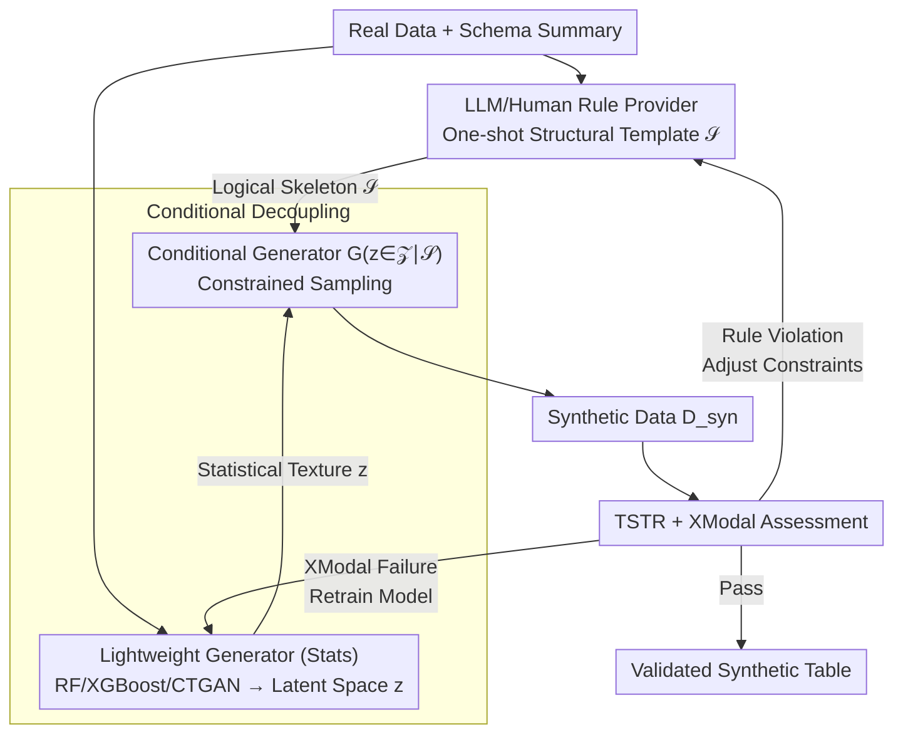

# Hierarchical Synthetic Tabular Data Generation: A Hybrid Top-Down and Bottom-Up Framework

**Conference**: ICML 2026  
**arXiv**: [2605.28198](https://arxiv.org/abs/2605.28198)  
**Code**: None  
**Area**: Synthetic Tabular Data Generation / Multimodal Financial Data / Weak Multimodal Alignment / Controllable Generation  
**Keywords**: Tabular Synthesis, Top-Down/Bottom-Up, Rule Constraints, LLM as Rule Generator, XGBoost Conditional Generation

## TL;DR
This paper proposes the H-TDBU framework: utilizing LLMs or human-written rules in a top-down path to generate a "logical skeleton" $\mathcal{S}$, while using lightweight bottom-up generators such as RandomForest, XGBoost, or CTGAN to learn "statistical texture" $z$. These components are integrated via a conditional generator $G(z\in\mathcal{Z}\mid\mathcal{S})$ and iteratively refined through a TSTR + XModal feedback loop. On weak multimodal financial benchmarks, it achieves TSTR AUROC superior to pure neural network baselines while maintaining cross-modal consistency.

## Background & Motivation

**Background**: Synthetic tabular data generation is a primary solution for mitigating data scarcity, privacy constraints, and multi-source heterogeneity. Two main paradigms exist: pure generative models like CTGAN, TVAE, TabDDPM, and STaSy, which directly learn and sample from the real data distribution; and LLM-based approaches like GReaT, REaLTabFormer, and TabuLa, which serialize table rows into strings for in-context generation.

**Limitations of Prior Work**: Pure generative models are prone to overfitting and mode collapse in data-scarce scenarios (e.g., finance, healthcare), often smoothing out long-tail events like fraud. LLM-based approaches, due to autoregressive token decoding, cannot explicitly enforce structural consistency or functional dependencies, frequently producing "plausible but logically invalid" samples with weak modeling of long-range feature dependencies and numerical-categorical interactions. Additionally, recent research indicates that recursive training on synthetic data leads to model collapse (Shumailov et al. 2024 Nature).

**Key Challenge**: Synthetic tabular data inherently requires two capabilities: **logical controllability** (satisfying business rules, cross-modal alignment, and coverage of rare events) and **statistical authenticity** (marginal distributions, feature correlations, and indistinguishability from real data). Compressing both into a single end-to-end model often compromises both: either relying on expensive LLM reasoning for logic at high cost (e.g., Davidson et al. 2026) or relying on generative models for statistics while sacrificing controllability.

**Goal**: (1) Decouple "logical structure" from "statistical texture" at the framework level; (2) Use LLMs only for generating structural rules rather than row-by-row sampling to minimize costs; (3) Validate that controllability and downstream utility can be simultaneously preserved on weak multimodal (tabular + text sentiment) financial benchmarks.

**Key Insight**: LLMs excel at writing JSON alignment rules for data schemas rather than batch-generating thousands of rows. Thus, the LLM can serve as a *rule provider* rather than a *data provider*, delegating the heavy lifting of per-row generation to efficient tree-based models.

**Core Idea**: Reconcile logical skeletons $\mathcal{S}$ (from LLM/human rules) and latent spaces $z$ (from lightweight generators) within a conditional generator $G(z\mid\mathcal{S})$. A TSTR + XModal feedback loop automatically determines whether to retrain the bottom-up model or adjust the top-down constraints.

## Method

### Overall Architecture

H-TDBU consists of a three-stage pipeline. **Input**: Real data $\mathcal{D}_{\text{real}}$ and a schema description (human or LLM prompt). **Output**: $\mathcal{D}_{\text{syn}}$ — a synthetic table satisfying business rules while statistically matching the real distribution (optionally with other modalities).

Mechanism:

1.  **Top-Down Path**: Humans or LLMs produce a structural template $\mathcal{S}$ after reading data summaries, formatted as a JSON describing "Factor $f_i$ → Samplable Attributes." For example, specifying "`target=1` must align with positive financial text."
2.  **Bottom-Up Path**: An ensemble (RandomForest/XGBoost) or generative model (CTGAN/TVAE) fits the latent space $\mathcal{Z}$ from $\mathcal{D}_{\text{real}}$, capturing complex inter-column correlations.
3.  **Synthesis & Reconciliation**: The skeleton $\mathcal{S}$ and latent noise $z\in\mathcal{Z}$ are fed into $X_{\text{Syn}}:=G(z\in\mathcal{Z}\mid\mathcal{S})$, where every generated row is constrained by $\mathcal{S}$. Post-generation is evaluated via TSTR (downstream utility) and XModal (alignment). Failures trigger either *Retrain Model* (for statistics) or *Adjust Constraints* (for logic).

### Key Designs

**1. Downgrading LLM from "Per-row Generator" to "One-shot Rule Provider"**

Generating entire tables with LLMs is expensive and sensitive to inference quality. This work observes that LLMs are better at generating a single alignment JSON based on a schema. By using Gemini 3.1 Pro to output a rule-provider JSON (e.g., mapping `target=1` to positive sentiments in FinancialPhraseBank) and delegating row generation to tree-based models, high LLM costs are reduced from $O(N_{\text{rows}})$ to $O(1)$.

**2. Conditional Decoupling of Top-Down Skeleton and Bottom-Up Texture**

To avoid the optimization difficulties of embedding rules directly into GAN/Diffusion losses, $G(z\in\mathcal{Z}\mid\mathcal{S})$ separates the two. The bottom-up generator learns an unconstrained latent representation $z$ (e.g., via XGBoost conditional sampling). During sampling, $z$ is clipped/filtered by $\mathcal{S}$ so that $X_{\text{Syn}}$ preserves both learned correlations and alignment rules. This allows swapping rules without retraining models.

**3. TSTR + XModal Feedback Loop: Distinguishing Learning Failure from Rule Failure**

Conventional evaluation relies only on TSTR, failing to pinpoint why synthesis fails. This framework adds XModal (Total Variation Distance on joint distributions like "target × sentiment"). If XModal is high but TSTR is acceptable, the bottom-up model needs retraining. If TSTR is poor or violations are high, the rules $\mathcal{S}$ are revised.

### Loss & Training

The bottom-up phase uses native training schemes: RandomForest (30 trees, 5k samples), XGBoost (80 estimators, depth 6, 8k samples), and CTGAN/TVAE (SDV defaults, 50 epochs). Synthesis generates 12k rows across multiple seeds. The top-down phase requires no training, only rule generation.

## Key Experimental Results

### Main Results

Evaluation on weak multimodal financial benchmarks (Bank Marketing + FinancialPhraseBank):

| Dataset | Method | TSTR Acc ↑ | F1 ↑ | AUROC ↑ | XModal ↓ |
|--------|------|-----------|------|---------|----------|
| Manual | Independent | 0.8830 | 0.0000 | 0.4905 | 0.1094 |
| Manual | Gaussian copula | 0.8949 | 0.2034 | 0.7738 | **0.0485** |
| Manual | **RandomForest** | **0.9281** | **0.6122** | 0.9188 | 0.0555 |
| Manual | XGBoost | 0.9139 | 0.5621 | **0.9190** | 0.1127 |
| Manual | CTGAN | 0.8992 | 0.2694 | 0.8358 | 0.0646 |
| Manual | TVAE | 0.8622 | 0.5581 | 0.8827 | 0.0533 |
| Gemini | Independent | 0.8830 | 0.0000 | 0.5359 | 0.3320 |
| Gemini | Gaussian copula | 0.9423 | 0.6749 | 0.9968 | 0.1605 |
| Gemini | **RandomForest** | **0.9971** | **0.9878** | **0.9998** | 0.1437 |
| Gemini | XGBoost | 0.9746 | 0.9003 | 0.9948 | 0.3234 |
| Gemini | CTGAN | 0.9574 | 0.7863 | 0.9903 | 0.1225 |
| Gemini | TVAE | 0.9881 | 0.9476 | 0.9885 | **0.0193** |

Insight: Stricter rules from Gemini improve TSTR for **all** generators (e.g., RF AUROC 0.9188 → 0.9998), as rules clarify decision boundaries, simplifying the bottom-up task.

### Ablation Study

XGBoost ablation (training rows and conditioning columns):

| Benchmark | Optimal Config | Acc ↑ | F1 ↑ | AUROC ↑ | Note |
|-----------|----------|-------|------|---------|------|
| Manual | 12 cols | 0.9139 | 0.5621 | 0.9190 | Loose rules require more context |
| Gemini | 4 cols | 0.9925 | 0.9690 | 0.9999 | Strict rules allow easier separation |

### Key Findings

-   **Stricter rules simplify generation**: Gemini rules lock `target=1` to positive sentiment, pushing all methods to TSTR $\approx 0.99$.
-   **Utility $\neq$ Fidelity**: RandomForest achieved 0.9188 AUROC in the Manual setting but had higher XModal than Gaussian copula, justifying the dual-metric approach.
-   **Lightweight tree-based methods are competitive**: RandomForest matched or outperformed CTGAN/TVAE at a fraction of the training time.
-   **Adaptive conditioning**: Optimal column counts vary with rule complexity (Manual prefers 12, Gemini 4).

## Highlights & Insights

-   **Efficiency**: Reducing LLM usage to one-shot rule provision lowers costs by orders of magnitude compared to multi-stage reasoning frameworks while retaining semantic priors.
-   **Controlled Experimental Design**: By fixing the bottom-up pipeline and varying only the JSON rules, the work quantifies the causal contribution of the "rule provider."
-   **Diagnostic Loops**: Translating failures into structured "Retrain" or "Adjust" actions transforms ad-hoc tuning into a systematic process.

## Limitations & Future Work

-   The feedback loop description lacks an automated algorithmic protocol (thresholds and convergence criteria are not specified).
-   Benchmarks are relatively weak, using coarse sentiment labels rather than complex financial reports or multi-table relationships.
-   Controllability was tested on simple binary alignments; complex chain constraints (e.g., Age → Salary → Credit) were not assessed.
-   Robustness of LLM rules across different prompts or models (variance) remains unexplored.
-   Lack of head-to-head comparison with reasoning-driven synthesis works like Davidson et al. (2026).

## Related Work & Insights

-   **vs. CTGAN/TVAE**: These learn $p(\text{table})$ directly; Ours splits it into $p(\text{table}\mid\mathcal{S})$ and $p(\mathcal{S})$. Ours is superior for controllability and low-data regimes.
-   **vs. GReaT/TabuLa**: These utilize LLMs for row generation; Ours uses LLMs for metadata rules only, offering better logical enforcement at lower costs.
-   **vs. Model Collapse (Nature 2024)**: Top-down paths help mitigate collapse by forcing rare events into the data via rules rather than letting models erase them during recursive training.

## Rating
- Novelty: ⭐⭐⭐⭐
- Experimental Thoroughness: ⭐⭐⭐
- Writing Quality: ⭐⭐⭐⭐
- Value: ⭐⭐⭐⭐⭐

<!-- RELATED:START -->

## Related Papers

- [\[CVPR 2026\] Socratic-Geo: Synthetic Data Generation and Cross-Modal Geometric Reasoning via Multi-Agent Interaction](../../CVPR2026/multimodal_vlm/socratic-geo_synthetic_data_generation_and_cross-modal_geometric_reasoning_via_m.md)
- [\[ICML 2026\] Left-Right Symmetry Breaking in CLIP-style Vision-Language Models Trained on Synthetic Spatial-Relation Data](left-right_symmetry_breaking_in_clip-style_vision-language_models_trained_on_syn.md)
- [\[ACL 2025\] Scaling Text-Rich Image Understanding via Code-Guided Synthetic Multimodal Data Generation](../../ACL2025/multimodal_vlm/code_guided_text_rich_image.md)
- [\[ICML 2026\] Certified Robustness under Heterogeneous Perturbations via Hybrid Randomized Smoothing](certified_robustness_under_heterogeneous_perturbations_via_hybrid_randomized_smo.md)
- [\[CVPR 2026\] Role-SynthCLIP: A Role-Play Driven Diverse Synthetic Data Approach](../../CVPR2026/multimodal_vlm/role-synthclip_a_role-play_driven_diverse_synthetic_data_approach.md)

<!-- RELATED:END -->
