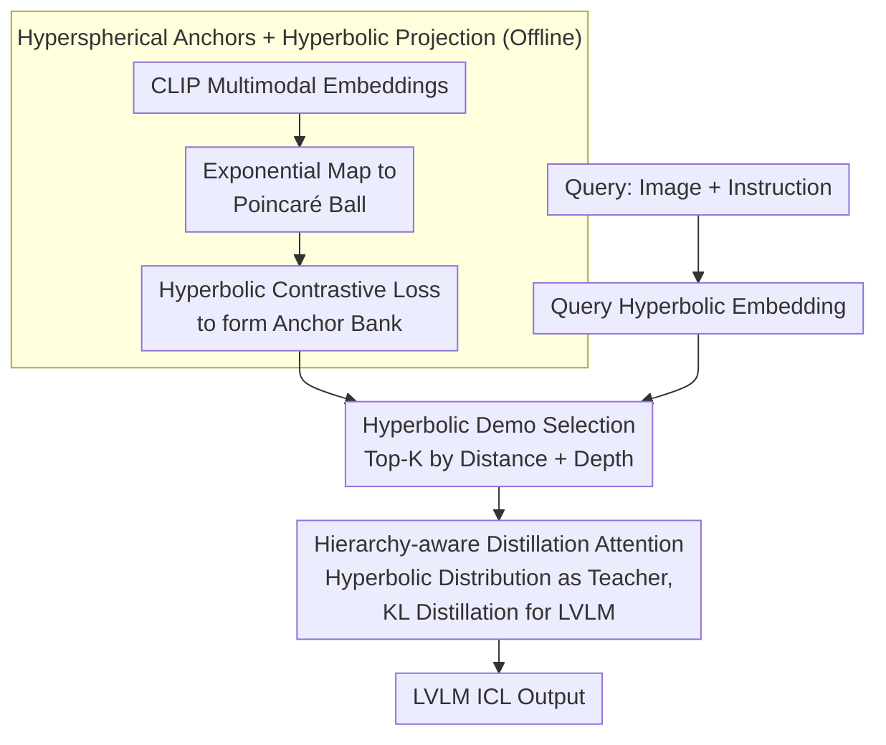

# Hyper-ICL: Attention Calibration with Hyperbolic Anchor Distillation for Multimodal ICL

**Conference**: ICML 2026  
**arXiv**: [2605.29103](https://arxiv.org/abs/2605.29103)  
**Code**: TBD  
**Area**: Multimodal / Vision-Language Models / In-Context Learning  
**Keywords**: Multimodal ICL, Hyperbolic Embeddings, Attention Calibration, Cross-modal Hierarchy

## TL;DR
Hyper-ICL provides a structural prior for multimodal LVLM in-context learning by lifting **CLIP embeddings into hyperbolic space** to form structured "hyperspherical anchors" and combining them with **hierarchy-aware distillation attention**. It consistently outperforms traditional demo selection strategies on tasks such as VQA, Captioning, and Caption Editing.

## Background & Motivation

**Background**: Multimodal ICL requires models to learn from a few demonstrations and apply this knowledge to new queries. However, LVLMs face two major challenges when selecting and combining multimodal demonstrations: **attention mismatch** and **structural blind spots**.

**Limitations of Prior Work**: (1) Existing methods select demonstrations based on Euclidean similarity, ignoring the **hierarchical structure** among images, text, and categories; (2) LVLM attention struggles to focus correctly on the most relevant information within demonstrations, especially when modal information is inconsistent; (3) Traditional high-dimensional Euclidean space is poorly suited to capture heterogeneous semantic hierarchies.

**Key Challenge**: Multimodal semantics naturally possess a hierarchical structure (Image → Local Region → Semantic Concept → Category Label), but Euclidean space suffers from exponential volume explosion, making it difficult to represent such hierarchies efficiently.

**Goal**: To inject structural priors into multimodal ICL and guide attention to focus on hierarchically relevant demonstrations.

**Key Insight**: Hyperbolic geometric space naturally balances **hyperbolic embedding radius vs. node depth**, where the volume grows exponentially with the radius—making it ideal for hierarchical representations.

**Core Idea**: Map CLIP multimodal embeddings into hyperbolic space to form "hyperspherical anchors." These serve as distillation targets to guide LVLM attention, preserving the strong semantics of pre-trained CLIP while enhancing hierarchical understanding.

## Method

### Overall Architecture
The framework is divided into offline and online stages. **Offline**: CLIP multimodal embeddings are projected into hyperbolic space and formed into a "hyperspherical anchor bank" via contrastive loss, providing a hierarchical structural prior. **Online**: For a given query, the system calculates its hyperbolic embedding $\rightarrow$ performs demonstration selection in the anchor bank based on "hyperbolic distance + hierarchical depth" $\rightarrow$ calibrates LVLM attention using hyperbolic hierarchical distance and injects it via distillation to output the final result.

### Key Designs

**1. Hyperspherical Anchors + Hyperbolic Projection: Representing Explicit Hierarchies**

Euclidean embeddings in CLIP compress heterogeneous semantics (images, regions, labels) into a shared sphere, flattening hierarchical relationships. In contrast, the volume of hyperbolic space grows exponentially with the radius, allowing it to naturally accommodate hierarchies where root concepts lie near the center and leaf nodes move toward the boundary. The model first uses an exponential map $\exp_o(x)=\tanh(c\|x\|)\frac{x}{c\|x\|}$ to project CLIP embeddings $x$ into a Poincaré ball $\mathbb{B}^d_c$ with curvature $c$. It then uses a contrastive loss under the hyperbolic metric to pull semantically related demonstrations into a hyperspherical manifold:

$$\mathcal{L}_{\text{anchor}}=\sum_i\log\frac{\exp(-d_{\mathbb{B}}(x_i,x_i^+)/\tau)}{\sum_j\exp(-d_{\mathbb{B}}(x_i,x_j)/\tau)},\quad d_{\mathbb{B}}(u,v)=\frac{2}{\sqrt{c}}\text{arctanh}(\sqrt{c}\|-u\oplus v\|)$$

The resulting "hyperspherical anchors" retain the strong semantics of CLIP while encoding hierarchical depth into the radius.

**2. Hyperbolic Demo Selection: Balancing Semantic Distance and Hierarchical Depth**

Traditional demonstration selection relies on cosine similarity, which only considers semantic distance and often selects demonstrations that are either "too generic" or "too specific." This work projects the query into hyperbolic space as $\hat{x}_q$ and retrieves the top-K demonstrations based on the score: $\text{score}=-d_{\mathbb{B}}(x_i,\hat{x}_q)+\mu\cdot\text{depth}_{\mathbb{B}}(x_i)$. The first term ensures semantic proximity, while the second encourages the selection of levels with appropriate information density. This explicit inclusion of depth allows Hyper-ICL to maintain performance gains as $K$ increases from 4 to 8, whereas traditional methods experience diminishing returns.

**3. Hierarchy-aware Distillation Attention: Soft Guidance for LVLM Attention**

To ensure LVLM attention favors hierarchically relevant demonstrations, a hyperbolic calibration term is added to the standard attention: $\alpha_{i,j}^*=\text{softmax}(QK^T/\sqrt{d}+\lambda\mathcal{H}(x_i,x_j))$, where $\mathcal{H}(\cdot,\cdot)$ is the inverse of the hyperbolic hierarchical distance. Rather than directly overriding the original attention—which might damage pre-trained knowledge—this method uses the calibrated distribution as a teacher for distillation: $\mathcal{L}_{\text{distill}}=\text{KL}(\alpha_{\text{teacher}}\|\alpha_{\text{student}})$. This soft target approach balances the injection of hierarchical priors with the preservation of CLIP/LVLM pre-trained capabilities.

## Key Experimental Results

### Main Results

| Task | Model | Random | TopK-CLIP | RICES | **Hyper-ICL** | Gain vs RICES |
|------|------|--------|---------|-------|----------|---------------|
| VQA v2 | IDEFICS-9B | 28.4 | 31.2 | 33.7 | **37.9** | **+4.2** |
| OK-VQA | IDEFICS-9B | 19.8 | 22.3 | 24.1 | **28.5** | **+4.4** |
| COCO Caption | IDEFICS-9B | 67.5 | 71.8 | 74.2 | **78.6** | **+4.4** |
| Caption Editing | IDEFICS-9B | 31.2 | 35.7 | 38.4 | **42.1** | **+3.7** |
| Image-Text Match | Otter-9B | 52.3 | 56.8 | 59.4 | **64.7** | **+5.3** |
| Visual Reasoning | Otter-9B | 42.8 | 46.3 | 48.9 | **54.2** | **+5.3** |

### Ablation Study

| Configuration | VQA v2 | COCO Caption | Description |
|------|--------|-------------|------|
| Hyperbolic Anchors only | 35.1 | 76.2 | Contribution of anchors |
| Attention Calibration only (Euclidean) | 33.8 | 75.5 | Contribution of attention mechanism |
| Attention Calibration + Hyperbolic Anchors | **37.9** | **78.6** | Full Hyper-ICL |
| Hyperbolic vs Euclidean Metric | 33.7 | 74.2 | Comparison of metric degradation |
| Demo Count K=2 → K=4 → K=8 | 35.2 / 37.9 / 38.4 | 76.8 / 78.6 / 79.2 | K=8 is optimal with diminishing returns |

### Curvature Sensitivity

| Curvature c | VQA v2 ACC | COCO BLEU-4 |
|-------|-----------|-------------|
| 0.5 | 35.6 | 76.4 |
| **1.0** | **37.9** | **78.6** |
| 2.0 | 36.4 | 77.2 |

$c = 1.0$ is optimal; low curvature degrades toward Euclidean space, while excessively high curvature causes numerical instability.

### Key Findings
- Hyperbolic anchors and attention calibration exhibit synergistic effects, yielding +4-5 point improvements when combined.
- The hierarchical advantages of hyperbolic metrics are most pronounced in reasoning and matching tasks.
- The method is robust to demonstration counts; while traditional methods plateau quickly, Hyper-ICL maintains steady growth as $K$ increases.

## Highlights & Insights
- **First application of hyperbolic geometry in multimodal ICL**: Overcomes the representational limits of Euclidean space by introducing new geometric tools.
- **Elegant balance via distillation**: Uses soft targets rather than hard constraints to inject hierarchical priors while retaining LVLM pre-trained knowledge.
- **Unified framework**: Integrates anchor construction, demonstration selection, and attention calibration into a consistent hyperbolic loop.

## Limitations & Future Work
- Numerical stability: Points near the boundary or high curvatures require careful handling to avoid gradient issues.
- Anchor bank coverage: Since it is based on CLIP embeddings, hierarchical mismatch may occur for concepts outside the CLIP training distribution.
- Inference overhead: Includes additional hyperbolic metric calculations (though lightweight).
- Future Work: Exploring more stable hyperbolic optimization; extension to video and audio; testing on larger models such as LLaVA-1.6 or GPT-4V.

## Related Work & Insights
- **vs RICES**: RICES selects demos based on CLIP similarity; Hyper-ICL improves both selection and attention using hyperbolic hierarchies.
- **vs Poincaré Embedding**: Traditional Poincaré embeddings focus on tree-structured corpora; this work extends the concept to the dynamic scenario of LVLM in-context learning.
- **vs Attention Calibration (in NLP)**: Prior work focused solely on text; this study extends the mechanism to multimodal contexts.

## Rating
- Novelty: ⭐⭐⭐⭐⭐ 
- Experimental Thoroughness: ⭐⭐⭐⭐ 
- Writing Quality: ⭐⭐⭐⭐ 
- Value: ⭐⭐⭐⭐⭐ 

<!-- RELATED:START -->

## Related Papers

- [\[ICML 2026\] Explaining Is Harder than Predicting Alone: Evaluating Concept-Based Explanations of MLLMs as ICL Visual Classifiers](explaining_is_harder_than_predicting_alone_evaluating_concept-based_explanations.md)
- [\[ICML 2026\] Seeing is Understanding: Unlocking Causal Attention into Modality-Mutual Attention for Multimodal LLMs](seeing_is_understanding_unlocking_causal_attention_into_modality-mutual_attentio.md)
- [\[CVPR 2026\] Hyperbolic Gramian Volumes for Multimodal Alignment](../../CVPR2026/multimodal_vlm/hyperbolic_gramian_volumes_for_multimodal_alignment.md)
- [\[ICML 2026\] Smoothing Slot Attention Iterations and Recurrences](smoothing_slot_attention_iterations_and_recurrences.md)
- [\[ICML 2026\] Gated Relational Alignment via Confidence-based Distillation for Efficient VLMs](gated_relational_alignment_via_confidence-based_distillation_for_efficient_vlms.md)

<!-- RELATED:END -->
