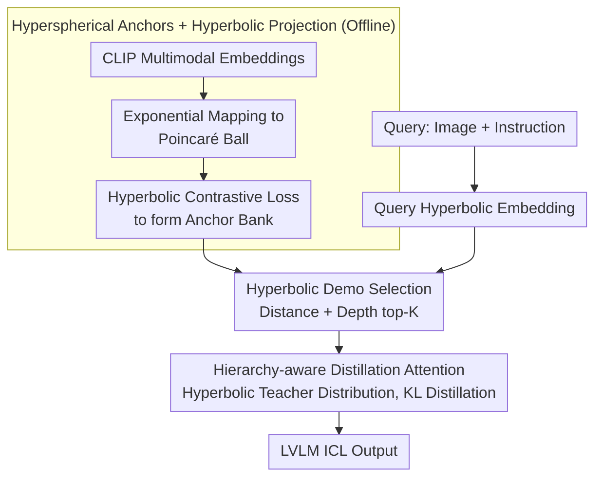

# Hyper-ICL: Attention Calibration with Hyperbolic Anchor Distillation for Multimodal ICL

**Conference**: ICML 2026  
**arXiv**: [2605.29103](https://arxiv.org/abs/2605.29103)  
**Code**: To be confirmed  
**Area**: Multimodal / Vision-Language Models / In-Context Learning  
**Keywords**: Multimodal ICL, Hyperbolic Embedding, Attention Calibration, Cross-modal Hierarchy

## TL;DR
Hyper-ICL provides a structural prior for multimodal LVLM in-context learning by lifting **CLIP embeddings into hyperbolic space** to form structured "hyperspherical anchors," combined with **hierarchy-aware distillation attention**—consistently surpassing traditional demo selection strategies on tasks like VQA, Captioning, and Caption Editing.

## Background & Motivation

**Background**: Multimodal ICL requires models to learn from a few demos and apply them to new queries. However, LVLMs face two major challenges when selecting and composing multimodal demos: **attention mismatch** and **structural blind spots**.

**Limitations of Prior Work**: (1) Existing methods select demos based on Euclidean similarity, ignoring the **hierarchical structure** between images, text, and categories; (2) LVLM attention struggles to focus correctly on the most relevant information in demos, especially when modal information is inconsistent; (3) Traditional high-dimensional Euclidean space finds it difficult to capture heterogeneous semantic hierarchies.

**Key Challenge**: Multimodal semantics naturally possess a hierarchical structure (Image → Local Region → Semantic Concept → Category Label), but Euclidean space suffers from exponential volume expansion, making it difficult to represent such hierarchies efficiently.

**Goal**: Inject structured priors into multimodal ICL to guide attention toward hierarchically relevant demos.

**Key Insight**: Hyperbolic geometric space naturally balances the relationship between **hyperbolic embedding radius vs. node depth**, with volume increasing exponentially with radius—highly suitable for hierarchical representations.

**Core Idea**: Map CLIP multimodal embeddings into hyperbolic space to form "hyperspherical anchors," serving as distillation targets to guide LVLM attention—preserving the strong semantics of pre-trained CLIP while enhancing hierarchical understanding.

## Method

### Overall Architecture
The framework is divided into offline and online stages. **Offline**, CLIP multimodal embeddings are projected into hyperbolic space and pulled into a "hyperspherical anchor bank" using contrastive loss, providing a hierarchical structure prior for the entire process. **Online**, given a query: the query's hyperbolic embedding is calculated → demo selection is performed in the anchor bank based on "hyperbolic distance + hierarchical depth" → LVLM attention is calibrated using hyperbolic hierarchical distance and soft-injected via distillation to produce the final in-context learning result.

### Key Designs

**1. Hyperspherical Anchors + Hyperbolic Projection: Projecting CLIP embeddings into hyperbolic space to make hierarchical structure explicitly representable**

Euclidean embeddings in CLIP compress heterogeneous semantics such as images, local regions, semantic concepts, and category labels onto a shared sphere, flattening hierarchical relationships. Since multimodal semantics are inherently hierarchical and Euclidean space struggles with hierarchical representation due to exponential volume growth, hyperbolic space is utilized instead. In hyperbolic space, volume increases exponentially with the radius, naturally accommodating hierarchies: root concepts reside near the center while leaf nodes move toward the boundary. First, CLIP embeddings $x$ are projected into the Poincaré ball $\mathbb{B}^d_c$ with curvature $c$ using exponential mapping $\exp_o(x)=\tanh(c\|x\|)\frac{x}{c\|x\|}$. Then, a contrastive loss under the hyperbolic metric is used to pull semantically related demos into a hyperspherical manifold:

$$\mathcal{L}_{\text{anchor}}=\sum_i\log\frac{\exp(-d_{\mathbb{B}}(x_i,x_i^+)/\tau)}{\sum_j\exp(-d_{\mathbb{B}}(x_i,x_j)/\tau)},\quad d_{\mathbb{B}}(u,v)=\frac{2}{\sqrt{c}}\text{arctanh}(\sqrt{c}\|-u\oplus v\|)$$

The resulting "hyperspherical anchors" preserve CLIP's strong semantics while encoding hierarchical depth into the radius, providing structural priors for subsequent demo selection and attention calibration.

**2. Hyperbolic Demo Selection: Simultaneously considering semantic distance and hierarchical depth to avoid overly general or niche samples**

With the anchor bank established, the first online step is to select demos for the query. Traditional selection based solely on cosine similarity only considers semantic distance, often choosing demos that are "too general" or "too specific." This method projects the query into hyperbolic space as $\hat{x}_q$ and ranks demos using $\text{score}=-d_{\mathbb{B}}(x_i,\hat{x}_q)+\mu\cdot\text{depth}_{\mathbb{B}}(x_i)$. The first term represents hyperbolic distance (semantic proximity), while the second term represents hierarchical depth (encouraging selections with appropriate information levels). Explicitly incorporating depth is a unique signal provided by hyperbolic representation—this is why Hyper-ICL shows stable growth as the number of demos increases from $K=4$ to $K=8$, whereas traditional methods see sharply diminishing returns.

**3. Hierarchy-aware Distillation Attention: Using hyperbolic anchors to soft-guide LVLM attention rather than hard-modifying weights**

Selecting the right demos is insufficient; LVLM attention must realistically bias toward hierarchically relevant demos. A hyperbolic calibration term is added to the standard attention: $\alpha_{i,j}^*=\text{softmax}(QK^T/\sqrt{d}+\lambda\mathcal{H}(x_i,x_j))$, where $\mathcal{H}(\cdot,\cdot)$ is the inverse function of hyperbolic hierarchical distance—demos closer in hierarchy receive a larger boost. Since directly overwriting LVLM attention risks damaging pre-trained knowledge, a distillation approach is adopted: the calibrated distribution serves as a teacher, and $\mathcal{L}_{\text{distill}}=\text{KL}(\alpha_{\text{teacher}}\|\alpha_{\text{student}})$ is used to let the LVLM internalize the hierarchical prior. Soft-target distillation balances the injection of hierarchical structure with the preservation of CLIP/LVLM pre-training capabilities.

## Key Experimental Results

### Main Results

| Task | Model | Random | TopK-CLIP | RICES | **Hyper-ICL** | Gain vs. RICES |
|------|------|--------|---------|-------|----------|---------------|
| VQA v2 | IDEFICS-9B | 28.4 | 31.2 | 33.7 | **37.9** | **+4.2** |
| OK-VQA | IDEFICS-9B | 19.8 | 22.3 | 24.1 | **28.5** | **+4.4** |
| COCO Caption | IDEFICS-9B | 67.5 | 71.8 | 74.2 | **78.6** | **+4.4** |
| Caption Editing | IDEFICS-9B | 31.2 | 35.7 | 38.4 | **42.1** | **+3.7** |
| Image-Text Match | Otter-9B | 52.3 | 56.8 | 59.4 | **64.7** | **+5.3** |
| Visual Reasoning | Otter-9B | 42.8 | 46.3 | 48.9 | **54.2** | **+5.3** |

### Ablation Study

| Configuration | VQA v2 | COCO Caption | Description |
|------|--------|-------------|------|
| Hyperbolic Anchors Only (No Calibration) | 35.1 | 76.2 | Contribution of anchors |
| Attention Calibration Only (Euclidean) | 33.8 | 75.5 | Contribution of attention mechanism |
| Calibration + Hyperbolic Anchors | **37.9** | **78.6** | Full Hyper-ICL |
| Hyperbolic ↔ Euclidean Metric | 33.7 | 74.2 | Comparison with metric degradation |
| Num Demos K=2 → K=4 → K=8 | 35.2 / 37.9 / 38.4 | 76.8 / 78.6 / 79.2 | K=8 is optimal but with diminishing returns |

### Sensitivity to Curvature

| Curvature c | VQA v2 ACC | COCO BLEU-4 |
|-------|-----------|-------------|
| 0.5 | 35.6 | 76.4 |
| **1.0** | **37.9** | **78.6** |
| 2.0 | 36.4 | 77.2 |

$c = 1.0$ is optimal; too low a curvature degrades to Euclidean, while too high leads to numerical instability.

### Key Findings
- Hyperbolic anchors and attention calibration exhibit synergistic effects—separately they provide +2-3 points, combined they achieve +4-5 points.
- The hierarchical representation advantage of the hyperbolic metric is more significant in hierarchical tasks (reasoning, image-text match).
- More robust to the number of demos—while traditional methods show sharply diminishing returns from K = 4 → 8, Hyper-ICL maintains stable growth.

## Highlights & Insights
- **First application of hyperbolic geometry in multimodal ICL**: Breaking the representational limits of Euclidean space by introducing new geometric tools.
- **Elegant balance via distillation**: Injecting hierarchical priors while preserving LVLM pre-training knowledge through soft distillation rather than hard constraints.
- **Complete closed-loop design**: A unified hyperbolic framework integrating anchor construction, demo selection, and attention calibration, where components mutually reinforce each other.

## Limitations & Future Work
- Numerical stability of hyperbolic computations: High curvature or points near the boundary can cause gradient explosion/vanishing and require careful handling.
- Scale and coverage of the anchor bank: Being based on CLIP embeddings, hierarchical mismatch may occur for concepts outside CLIP's training distribution.
- Inference overhead: Each ICL session requires additional hyperbolic metric calculations (though lightweight, overhead accumulates).
- Future Work: Exploring more stable hyperbolic optimization algorithms; extending to other modalities like video and audio; investigating applicability on larger LVLMs (e.g., LLaVA-1.6, GPT-4V).

## Related Work & Insights
- **vs. RICES**: RICES selects demos based on CLIP similarity; Hyper-ICL introduces hyperbolic hierarchical structures to improve both selection and attention.
- **vs. Poincaré Embedding**: Classic Poincaré embeddings target tree-structured corpora; this work extends to the dynamic scenario of LVLM in-context learning.
- **vs. Attention Calibration (in NLP)**: Prior work focuses only on textual attention; this work is the first to extend to multimodal scenarios.

## Rating
- Novelty: ⭐⭐⭐⭐⭐ First attempt at applying hyperbolic geometry to multimodal ICL, significant cross-disciplinary innovation.
- Experimental Thoroughness: ⭐⭐⭐⭐ Covers 6 tasks + 2 LVLMs + detailed ablations.
- Writing Quality: ⭐⭐⭐⭐ Clear mathematical formulas, though some hyperbolic geometry concepts require reader background.
- Value: ⭐⭐⭐⭐⭐ Provides a new paradigm in the frontier of multimodal ICL, with consistent improvements across tasks indicating high potential.

<!-- RELATED:START -->

## Related Papers

- [\[ICML 2026\] Explaining Is Harder than Predicting Alone: Evaluating Concept-Based Explanations of MLLMs as ICL Visual Classifiers](explaining_is_harder_than_predicting_alone_evaluating_concept-based_explanations.md)
- [\[ICML 2026\] Seeing is Understanding: Unlocking Causal Attention into Modality-Mutual Attention for Multimodal LLMs](seeing_is_understanding_unlocking_causal_attention_into_modality-mutual_attentio.md)
- [\[CVPR 2026\] Hyperbolic Gramian Volumes for Multimodal Alignment](../../CVPR2026/multimodal_vlm/hyperbolic_gramian_volumes_for_multimodal_alignment.md)
- [\[ICML 2026\] Smoothing Slot Attention Iterations and Recurrences](smoothing_slot_attention_iterations_and_recurrences.md)
- [\[ICML 2026\] Large Vision-Language Models Get Lost in Attention](large_vision-language_models_get_lost_in_attention.md)

<!-- RELATED:END -->
