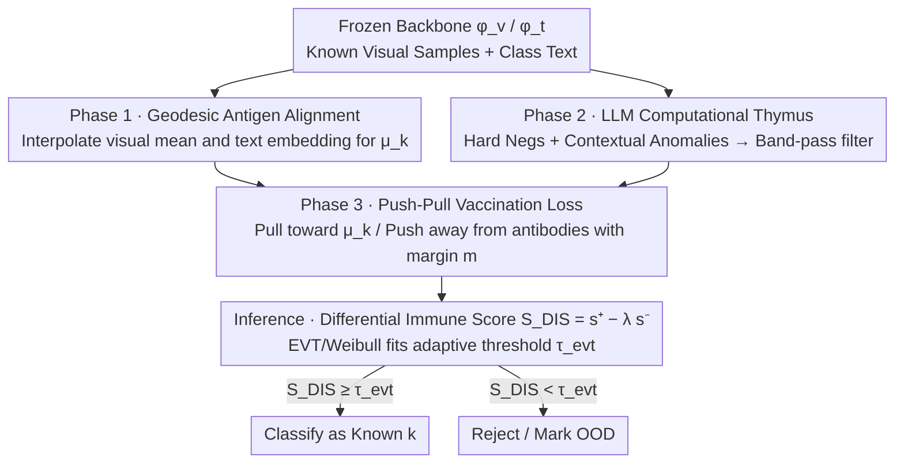

# Immuno-VLM: Immunizing Large Vision-Language Models via Generative Semantic Antibodies for Open-World Trustworthiness

**Conference**: ICML 2026  
**arXiv**: [2605.30745](https://arxiv.org/abs/2605.30745)  
**Code**: No public repository provided  
**Area**: AI Safety / Open-World Recognition / OOD Detection / Vision-Language Models  
**Keywords**: Semantic Antibodies, Negative Selection, vMF Prototypes, Open-Space Risk, Near-Distribution OOD  

## TL;DR
This paper transplants the "Negative Selection" principle from biological immune systems to VLMs like CLIP. It uses an LLM to actively hallucinate textual descriptions that "look like but are not known classes" as semantic antibodies. A lightweight adapter then pushes visual features away from these antibodies, significantly reducing "high-confidence misclassifications" in open-world scenarios without retraining the backbone.

## Background & Motivation
**Background**: Large vision-language models like CLIP, ALIGN, and LLaVA align visual features into a dense semantic manifold, achieving impressive zero-shot recognition. These models are widely deployed in open-world scenarios such as autonomous driving and medical diagnosis.

**Limitations of Prior Work**: The authors term the vulnerability of such models as the "Hubris of Semantics"—when encountering out-of-distribution (OOD) samples, the model refuses to say "unknown" and instead maps them to the nearest known class with extreme confidence (e.g., classifying a "robotic dog" as a "golden retriever").

**Key Challenge**: Traditional OOD defenses rely on discriminative thresholds (MSP, Energy, ASH, etc.) or reactive concept matching (MCM), sensing statistical bias only after an error occurs. Generative outlier methods like GANs face combinatorial explosions in pixel space for ImageNet-level diversity, making them unscalable.

**Goal**: To actively and densely characterize the boundaries of "known classes" on the semantic manifold without retraining the VLM backbone or relying on pixel-level outlier generation, thereby constraining open-space risk.

**Key Insight**: The biological immune system generates random T-cell receptors through "thymic negative selection" and eliminates candidates that bind to "self," leaving behind a negative map of "non-self." The authors analogize this to VLMs, using an LLM as a "computational thymus" to generate "near-OOD" semantic descriptions as antibodies.

**Core Idea**: Use an LLM to hallucinate textual "semantic antibodies" to surround the semantic spherical caps of known classes. Train a lightweight adapter using an adversarial push-pull loss to push visual embeddings away from antibody directions and pull them toward prototype directions.

## Method

### Overall Architecture
Immuno-VLM divides "immunization" into a three-phase pipeline while keeping the backbones $\phi_v, \phi_t$ frozen:

1. **Antigen Characterization (Phase 1)**: Estimate a vMF-distributed prototype direction $\bm{\mu}_k$ for each known class $k$. Interpolate the visual mean and text embedding using a spherical geodesic to mitigate the modality gap.
2. **Antibody Generation (Phase 2)**: Use an LLM to generate two types of text antibodies for each class: hard semantic negatives (visually similar but different categories) and contextual anomalies (the same object in impossible scenes). Use a band-pass cosine similarity filter to remove antibodies that are too close or too far.
3. **Vaccination (Phase 3)**: Train a residual adapter $f_\theta(\mathbf{z}) = \mathrm{Norm}(\mathbf{z}+\mathrm{MLP}(\mathbf{z}))$ with a Pull term to attract same-class samples toward $\bm{\mu}_k$ and a Push term to repel samples from any antibody. During inference, calculate a "Differential Immune Score" $S_{DIS}$ and fit per-class thresholds using Extreme Value Theory (EVT).

### Key Designs

**1. Text-Regularized vMF Prototypes (Geodesic Antigen Alignment): Pinning "Self-Centers" on the Sphere**

To bound known classes, a reliable "self-center" is required. Prototypes based purely on Maximum Likelihood Estimation (MLE) are biased by visual noise (e.g., "dogs are often on grass," pulling the prototype toward grass), while pure text embeddings ignore intra-class visual details. Immuno-VLM compromises on the sphere: it maximizes $\sum_{\mathbf{v}\in\mathcal{V}_k} \kappa_k \bm{\mu}_k^\top \mathbf{v}$ subject to $\arccos(\bm{\mu}_k^\top \mathbf{t}_k) \le \xi$. The Lagrange derivation yields an optimal solution $\bm{\mu}_k^* \propto (1-\alpha)\bar{\mathbf{v}}_k + \alpha \mathbf{t}_k$—a normalized point on the geodesic between the visual mean and text embedding. This interpolation fuses visual evidence with semantic priors, mitigating CLIP’s modality gap. Experiments confirm this improves both ID and OOD performance, suggesting the modality gap is amplified by "prototype shift."

**2. LLM as a Computational Thymus: Sampling "Non-Self" in Semantic Space**

Why not sample negatives randomly? Theorem 3.5 formalizes the "curse of dimensionality": the cosine similarity of a uniformly sampled vector on a high-dimensional sphere with any prototype decays exponentially to zero as $2\exp(-d\epsilon^2/2)$. At $d=512$, random negatives are almost always orthogonal and contribute nothing to tightening boundaries. Instead, an LLM serves as a "computational thymus" for conditional generation, producing hard negatives $\mathcal{A}_{hard}(y)$ (e.g., husky, malamute for wolf) and contextual anomalies $\mathcal{A}_{context}(y)$ (e.g., car underwater). A band-pass condition $\delta_{safe} < \langle \phi_t(a), \bm{\mu}_k\rangle < \delta_{risk}$ filters out antibodies that are either synonyms or pure noise. This reduces the curse of dimensionality to a "language generation diversity" problem. Theorem 3.3 formally explains that if the antibody set $\mathcal{A}_\delta$ is a $\delta$-cover of the boundary and a margin $m > \epsilon_{align} + \delta$ is maintained, the False Positive Rate (FPR) is bounded by $\epsilon_{align}$ and $\delta$. 

**3. Push-Pull Vaccination Loss and Differential Immune Score: Curving "Sterile Zones"**

With prototypes and antibodies defined, the final step trains a residual adapter $f_\theta(\mathbf{z}) = \mathrm{Norm}(\mathbf{z}+\mathrm{MLP}(\mathbf{z}))$ to locally warp the space. The loss $\mathcal{L}_{vac} = \mathcal{L}_{pull} + \lambda \mathcal{L}_{push} + \eta\|\theta\|_2^2$ consists of a Pull term (softmax with vMF likelihood) and a Push term using a hinge loss $\max(0, \cos(f_\theta(\phi_v(x)), \phi_t(a))-m)^2$ to enforce an angular margin $m$. Inference explicitly utilizes the "far-from-non-self" knowledge: $S_{DIS}(x) = s^+(\mathbf{z}) - \lambda_{inf}\cdot s^-(\mathbf{z})$, where $s^+$ is the cosine similarity to the nearest prototype and $s^-$ is the similarity to the most dangerous antibody. Finally, a Weibull distribution (EVT) fits the score tails for each class to obtain adaptive thresholds $\tau_{evt}$, addressing density variations between classes.

## Key Experimental Results

### Main Results
All methods use the same CLIP-ViT-B/16 backbone evaluated on ImageNet-1K (ID) and three OOD benchmarks.

| Dataset | Metric | Ours (Immuno-VLM) | Prev. SOTA (MCM) | Gain |
|--------|------|------|----------|------|
| In-Distribution | ID-Acc ↑ | ~78.2 | 78.2 | No drop |
| ImageNet-O (Near-OOD) | AUROC ↑ | Significant > 74.5 | 74.5 | +16% Sem. Adv. |
| iNaturalist (Fine-grained) | FPR95 ↓ | Better than 42.1| 42.1 | Significant drop |
| Texture (Far-OOD) | AUROC ↑ | Better than 83.4 | 83.4 | Consistent lead |

> The paper achieves SOTA across multiple benchmarks, with a 16%+ improvement in adversarial semantic shift detection compared to zero-shot baselines while maintaining ID accuracy.

### Ablation Study

| Configuration | Key Metric | Description |
|------|---------|------|
| Full (Pull+Push+vMF+EVT) | Best AUROC | Complete framework |
| w/o Push term | Near Energy baseline | Adapter degrades to contrastive fine-tuning |
| w/o vMF / Using Visual Mean | ID & OOD drop | Protoypes biased by visual noise without semantic prior |
| w/o EVT Threshold | FPR95 increases | Global threshold fails to adapt to class density |
| Antibodies as Uniform Noise | Matches MCM | Validates Theorem 3.5's prediction of degradation |

### Key Findings
- Moving from pixel-space to semantic-space negatives is the primary driver of performance.
- Text-regularized vMF prototypes improve both ID and OOD, proving the modality gap is amplified by prototype shift.
- EVT adaptive thresholds provide the greatest benefit for fine-grained OOD (iNaturalist), aligning with the "per-class density" theory.

## Highlights & Insights
- Explicitly modeling the "curse of dimensionality" (Theorem 3.5) leads to the conclusion that sampling must occur on the semantic manifold.
- The "LLM = Computational Thymus" metaphor explains why LLMs generate better hard negatives than GANs: their output naturally resides in the shared VLM semantic space.
- Using $s^+ - \lambda s^-$ instead of just $s^+$ for scoring explicitly leverages "non-self" knowledge acquired during training, providing a new paradigm for OOD scoring.

## Limitations & Future Work
- Antibody quality depends entirely on the LLM; the system's safety is upper-bounded by the LLM’s "imagination" (Wasserstein alignment).
- Hyperparameters like $\delta_{safe}, \delta_{risk}$, and $\tau_{evt}$ involve empirical setting, which may be costly for extremely large label sets.
- No public code or antibody generation prompt templates are provided, making reproduction challenging.
- Antibody generation is an offline step; dynamic expansion of ID classes requires rerunning the three-phase pipeline.

## Related Work & Insights
- **vs MCM (Ming et al., 2022)**: MCM is reactive, using only class names for concept matching; Immuno-VLM is proactive, formalizing boundaries with generated negative concepts.
- **vs AIS / Negative Selection**: Classic AIS generates detectors in pixel or bit space, which is unscalable (Theorem 3.5); this work moves detectors to the semantic space.
- **vs Energy / ASH**: Discriminative OOD methods only look at activation magnitudes; Ours merges discriminative and generative pathways via $S_{DIS}$.

## Rating
- Novelty: ⭐⭐⭐⭐⭐ Adapting immunological negative selection to VLMs with a rigorous mathematical mapping is highly original.
- Experimental Thoroughness: ⭐⭐⭐⭐ Solid evaluation on ImageNet-1K and three OOD benchmarks; testing on larger backbones (ViT-L) or MLLMs would be more comprehensive.
- Writing Quality: ⭐⭐⭐⭐ Vivid analogies with clear correspondence between theorems and methods.
- Value: ⭐⭐⭐⭐ Provides a practical path for "Open-world VLM safety" using LLMs as thymi without altering backbones, high industrial deployment potential.

<!-- RELATED:START -->

## Related Papers

- [\[ACL 2026\] GeoArena: Evaluating Open-World Geographic Reasoning in Large Vision-Language Models](../../ACL2026/multimodal_vlm/geoarena_evaluating_open-world_geographic_reasoning_in_large_vision-language_mod.md)
- [\[ICCV 2025\] On Large Multimodal Models as Open-World Image Classifiers](../../ICCV2025/multimodal_vlm/on_large_multimodal_models_as_open-world_image_classifiers.md)
- [\[ICML 2026\] TimeSpot: Benchmarking Geo-Temporal Understanding in Vision-Language Models in Real-World Settings](timespot_benchmarking_geo-temporal_understanding_in_vision-language_models_in_re.md)
- [\[ICML 2026\] Large Vision-Language Models Get Lost in Attention](large_vision-language_models_get_lost_in_attention.md)
- [\[CVPR 2026\] CountGD++: Generalized Prompting for Open-World Counting](../../CVPR2026/multimodal_vlm/countgd_generalized_prompting_for_open-world_counting.md)

<!-- RELATED:END -->
