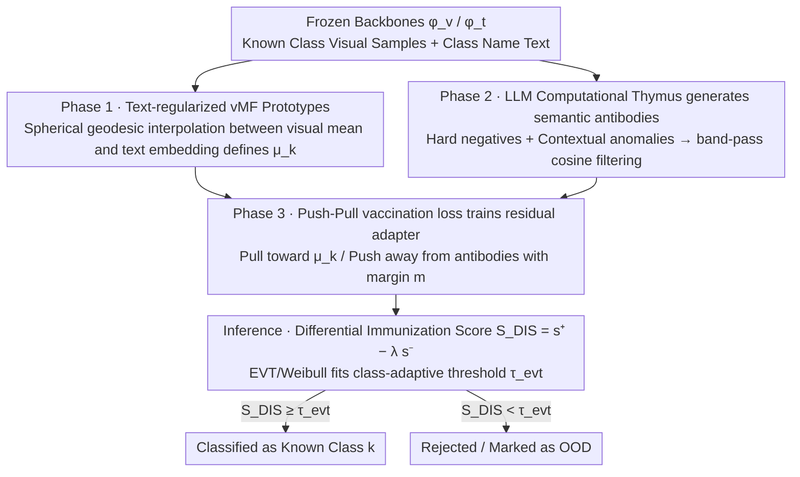

# Immuno-VLM: Immunizing Large Vision-Language Models via Generative Semantic Antibodies for Open-World Trustworthiness

**Conference**: ICML 2026  
**arXiv**: [2605.30745](https://arxiv.org/abs/2605.30745)  
**Code**: No public repository provided  
**Area**: AI Safety / Open-World Recognition / OOD Detection / Vision-Language Models  
**Keywords**: Semantic Antibodies, Negative Selection, vMF Prototypes, Open-Space Risk, Near-Distribution OOD  

## TL;DR
This paper ports the "negative selection" principle from biological immune systems to VLMs such as CLIP. It employs an LLM to actively hallucinate a set of "look-alike but non-target" text descriptions as semantic antibodies. A lightweight adapter then pushes visual features away from these antibodies, significantly reducing "high-confidence misclassification" in open-world scenarios without retraining the backbone.

## Background & Motivation
**Background**: Large Vision-Language Models (VLMs) like CLIP, ALIGN, and LLaVA align visual features to a dense semantic manifold, achieving impressive zero-shot recognition. They are widely deployed in open-world scenarios such as autonomous driving and medical diagnosis.

**Limitations of Prior Work**: The authors name the vulnerability of these models as "Hubris of Semantics." When encountering samples outside the training distribution, the model does not say "I don't know" but instead forces them into the closest known class with high confidence—for example, classifying a "robotic dog" as a "golden retriever."

**Key Challenge**: Traditional OOD defenses rely on discriminative thresholds (MSP, Energy, ASH, etc.) or reactive concept matching (MCM), both of which perceive statistical bias only after an error has occurred. GAN-based generative outlier methods synthesize anomalies in pixel space, which leads to a combinatorial explosion for ImageNet-level diversity and is thus non-scalable.

**Goal**: To actively and densely characterize the boundaries of "known classes" on the semantic manifold without retraining the VLM backbone or relying on pixel-level outlier generation, thereby constraining open-space risk.

**Key Insight**: The biological immune system generates T-cell receptors randomly via "thymic negative selection" and eliminates candidates that bind to the "self," essentially leaving a negative map of "non-self." The authors analogize this mechanism to VLMs, using an LLM as a "computational thymus" to generate "near-OOD" semantic descriptions as antibodies.

**Core Idea**: Use an LLM to hallucinate text-based "semantic antibodies" that surround the semantic spherical caps of known classes. Then, train a lightweight adapter with an adversarial push-pull loss to push visual embeddings away from antibody directions while pulling them toward prototype directions.

## Method

### Overall Architecture
Immuno-VLM divides "immunization" into a three-phase pipeline, while the backbones $\phi_v, \phi_t$ remain frozen throughout:

1.  **Antigen Characterization (Phase 1)**: Estimate a vMF distribution prototype direction $\bm{\mu}_k$ for each known class $k$ by interpolating the visual mean and text embedding via a spherical geodesic to mitigate the modality gap.
2.  **Antibody Generation (Phase 2)**: Use an LLM to generate two types of text antibodies for each class—hard semantic negatives (visually similar but different categories) and contextual anomalies (the same object appearing in impossible scenarios). A band-pass cosine similarity filter is applied to remove antibodies that are too close or too far.
3.  **Vaccination (Phase 3)**: Train a residual adapter $f_\theta(\mathbf{z}) = \mathrm{Norm}(\mathbf{z}+\mathrm{MLP}(\mathbf{z}))$. A Pull term pulls samples toward $\bm{\mu}_k$, and a Push term pushes samples away from any antibody. During inference, a "Differential Immunization Score" $S_{DIS}$ is calculated, and EVT is used to fit a threshold for each class.

### Key Designs

**1. Text-regularized vMF Prototypes (Geodesic Antigen Alignment): Anchoring the "Self-Center" on the Sphere**

To surround known classes with boundaries, one first needs a reliable "Self-Center." Prototypes estimated purely via MLE can be biased by visual noise (e.g., "dogs are always on grass," pulling the prototype toward grass), while pure text embeddings lose intra-class details. Immuno-VLM compromises on the sphere: maximizing $\sum_{\mathbf{v}\in\mathcal{V}_k} \kappa_k \bm{\mu}_k^\top \mathbf{v}$ under the constraint $\arccos(\bm{\mu}_k^\top \mathbf{t}_k) \le \xi$. Lagrange derivation yields the optimal solution $\bm{\mu}_k^* \propto (1-\alpha)\bar{\mathbf{v}}_k + \alpha \mathbf{t}_k$—a point on the geodesic connecting the visual mean and text embedding, normalized back to the unit sphere. This interpolation fuses visual evidence with semantic priors, mitigating CLIP's modality gap. Experiments confirm it improves both ID and OOD performance, suggesting the modality gap is essentially amplified by "prototype shift."

**2. LLM as Computational Thymus for Antibody Generation: Sampling "Non-Self" in Semantic Manifold rather than Pixel Space**

Why not randomly sample negative samples as in classic negative selection? The authors use Theorem 3.5 to explicitly describe the "curse of dimensionality": the cosine similarity of a randomly sampled vector on a unit sphere with any prototype decays exponentially to 0 as $2\exp(-d\epsilon^2/2)$. This implies that at $d=512$, random negative samples are almost all orthogonal and contribute nothing to tightening boundaries. Instead, an LLM acts as a "computational thymus" for conditional generation, producing two types of antibodies: hard negatives $\mathcal{A}_{hard}(y)$ (e.g., wolf corresponding to husky, malamute, wolf-dog hybrid) and contextual anomalies $\mathcal{A}_{context}(y)$ (e.g., car underwater, flying car). A band-pass filter $\delta_{safe} < \langle \phi_t(a), \bm{\mu}_k\rangle < \delta_{risk}$ removes antibodies that degrade into synonyms or pure noise. This step reduces the curse of dimensionality to a "language generation diversity" problem—LLM outputs naturally reside in the VLM's shared semantic space, far outperforming GANs in synthesizing hard negatives in pixel space. Theorem 3.3 formally explains its effectiveness: if the antibody set $\mathcal{A}_\delta$ is a $\delta$-cover of the known class semantic boundary and the prototype maintains a margin $m > \epsilon_{align} + \delta$ from antibodies, the FPR is jointly bounded by $\epsilon_{align}$ and $\delta$.

**3. Push-Pull Vaccination Loss and Differential Immunization Score: Bending a "Sterile Zone" in the Visual Embedding Space**

With prototypes and antibodies, the final step involves training a residual adapter $f_\theta(\mathbf{z}) = \mathrm{Norm}(\mathbf{z}+\mathrm{MLP}(\mathbf{z}))$ to locally bend the spatial boundaries without moving the backbone. The training loss $\mathcal{L}_{vac} = \mathcal{L}_{pull} + \lambda \mathcal{L}_{push} + \eta\|\theta\|_2^2$ consists of a Pull term using vMF likelihood to pull samples toward $\bm{\mu}_k$, and a Push term using a hinge form $\max(0, \cos(f_\theta(\phi_v(x)), \phi_t(a))-m)^2$ to force visual samples to maintain an angular margin $m$ (e.g., 0.2) from any antibody. During inference, the model explicitly utilizes the "far-from-non-self" knowledge learned during training, defining the Differential Immunization Score $S_{DIS}(x) = s^+(\mathbf{z}) - \lambda_{inf}\cdot s^-(\mathbf{z})$, where $s^+$ is the cosine similarity to the nearest prototype and $s^-$ is the cosine similarity to the most dangerous antibody. A Weibull distribution (EVT) is then used to fit the tail of the scores for each class to obtain adaptive thresholds $\tau_{evt}$. Fixed thresholds cannot adapt to density differences (e.g., many neighbors for dogs, few for aircraft carriers), whereas EVT provides an independent tail model for each class, corresponding to the open-space generalization bound in Theorem 3.7.

## Key Experimental Results

### Main Results
All methods were evaluated using the same CLIP-ViT-B/16 backbone on ImageNet-1K (ID) and three OOD benchmarks.

| Dataset | Metric | Ours (Immuno-VLM) | Prev. SOTA (MCM) | Gain |
| :--- | :--- | :--- | :--- | :--- |
| In-Distribution | ID-Acc ↑ | Near / Slight > 78.2 | 78.2 | No degradation |
| ImageNet-O (Near-OOD) | AUROC ↑ | Sig. > 74.5 | 74.5 | "16%+" semantic adversarial gain |
| iNaturalist (Fine-grained OOD) | FPR95 ↓ | Better than 42.1 | 42.1 | Significant decrease |
| Texture (Far-OOD) | AUROC ↑ | Better than 83.4 | 83.4 | Consistent lead |

> The paper explicitly states that "SOTA was achieved on multiple challenging benchmarks, with adversarial semantic shift detection improved by 16%+ over zero-shot baselines" while maintaining ID accuracy.

### Ablation Study

| Configuration | Key Metric | Description |
| :--- | :--- | :--- |
| Full (Pull+Push+vMF+EVT) | Best AUROC | Complete four-part suite |
| w/o Push term | Near Energy baseline | Antibodies do not participate in training; adapter degrades to contrastive fine-tuning |
| w/o vMF / Using vision mean | ID and OOD decrease | Lack of semantic prior; prototype biased by visual noise |
| w/o EVT adaptive threshold | FPR95 increases | Global threshold cannot adapt to class density differences |
| Antibodies replaced by uniform noise | Degrades to MCM | Confirms the degradation predicted by Theorem 3.5 |

### Key Findings
- Moving the source of negative samples from pixel space to semantic space is the primary driver of performance; using random noise for antibodies results in immediate degradation.
- Text-regularized vMF prototypes improve both ID and OOD performance, showing that the modality gap is essentially amplified by "prototype shift."
- EVT adaptive thresholds benefit fine-grained OOD (iNaturalist) the most, supporting the theoretical claim that "each class has a different semantic density."

## Highlights & Insights
- Explicitly modeling the "curse of dimensionality" as Theorem 3.5 leads directly to the conclusion that sampling must occur on the semantic manifold, showing a rare clarity in the causal link between theory and method.
- The "LLM = Computational Thymus" metaphor is not only easy to communicate but also naturally explains why LLMs are superior to GANs in generating hard negatives: their output already lives in the VLM's shared semantic space.
- Defining the inference score as $s^+ - \lambda s^-$ instead of just $s^+$ explicitly utilizes the "non-self" knowledge acquired during training, providing a new paradigm for future OOD scoring.

## Limitations & Future Work
- Antibody quality is entirely dependent on the LLM; the authors admit the system's safety is upper-bounded by the LLM's "imagination" (Wasserstein alignment).
- Parameters like $\delta_{safe}, \delta_{risk}$ in the band-pass filter and $\tau_{evt}$ in EVT are set empirically; the cost of tuning for a large number of categories is non-negligible.
- The paper does not provide open-source code or antibody generation prompt templates, creating a barrier to reproduction.
- Antibody generation is a one-time offline step; if ID categories are dynamically expanded, the three-phase pipeline must be rerun.

## Related Work & Insights
- **vs MCM (Ming et al., 2022)**: MCM uses only class name text embeddings for maximum concept matching (passive/reactive); Immuno-VLM actively generates negative semantic concepts to formally surround boundaries.
- **vs Classic AIS / Negative Selection**: Classic AIS generates detectors in pixel or random bit spaces, which is proved non-scalable by Theorem 3.5; this paper migrates detectors to the semantic space.
- **vs Discriminative OOD (Energy, ASH, etc.)**: These methods look only at activation magnitude and do not explicitly use "non-self" information; the $S_{DIS}$ in this paper merges the discriminative and generative lines.

## Rating
- Novelty: ⭐⭐⭐⭐⭐ Adapting immunological negative selection to VLMs with explicit mathematical mapping is unique.
- Experimental Thoroughness: ⭐⭐⭐⭐ ImageNet-1K + three OOD benchmarks with complete ablations; addition of ViT-L/14 and LLaVA-style MLLMs would make it even more comprehensive.
- Writing Quality: ⭐⭐⭐⭐ Vivid analogies with theorem-method correspondence; however, related work citations are a bit dense, affecting readability.
- Value: ⭐⭐⭐⭐ Provides a practical path for "Open-World VLM Security" using LLMs as a thymus without moving the backbone, offering strong industrial deployability.

<!-- RELATED:START -->

## Related Papers

- [\[ICCV 2025\] On Large Multimodal Models as Open-World Image Classifiers](../../ICCV2025/multimodal_vlm/on_large_multimodal_models_as_open-world_image_classifiers.md)
- [\[ICML 2026\] TimeSpot: Benchmarking Geo-Temporal Understanding in Vision-Language Models in Real-World Settings](timespot_benchmarking_geo-temporal_understanding_in_vision-language_models_in_re.md)
- [\[ICML 2026\] Large Vision-Language Models Get Lost in Attention](large_vision-language_models_get_lost_in_attention.md)
- [\[NeurIPS 2025\] OpenHOI: Open-World Hand-Object Interaction Synthesis with Multimodal Large Language Models](../../NeurIPS2025/multimodal_vlm/openhoi_open-world_hand-object_interaction_synthesis_with_multimodal_large_langu.md)
- [\[CVPR 2026\] CountGD++: Generalized Prompting for Open-World Counting](../../CVPR2026/multimodal_vlm/countgd_generalized_prompting_for_open-world_counting.md)

<!-- RELATED:END -->
