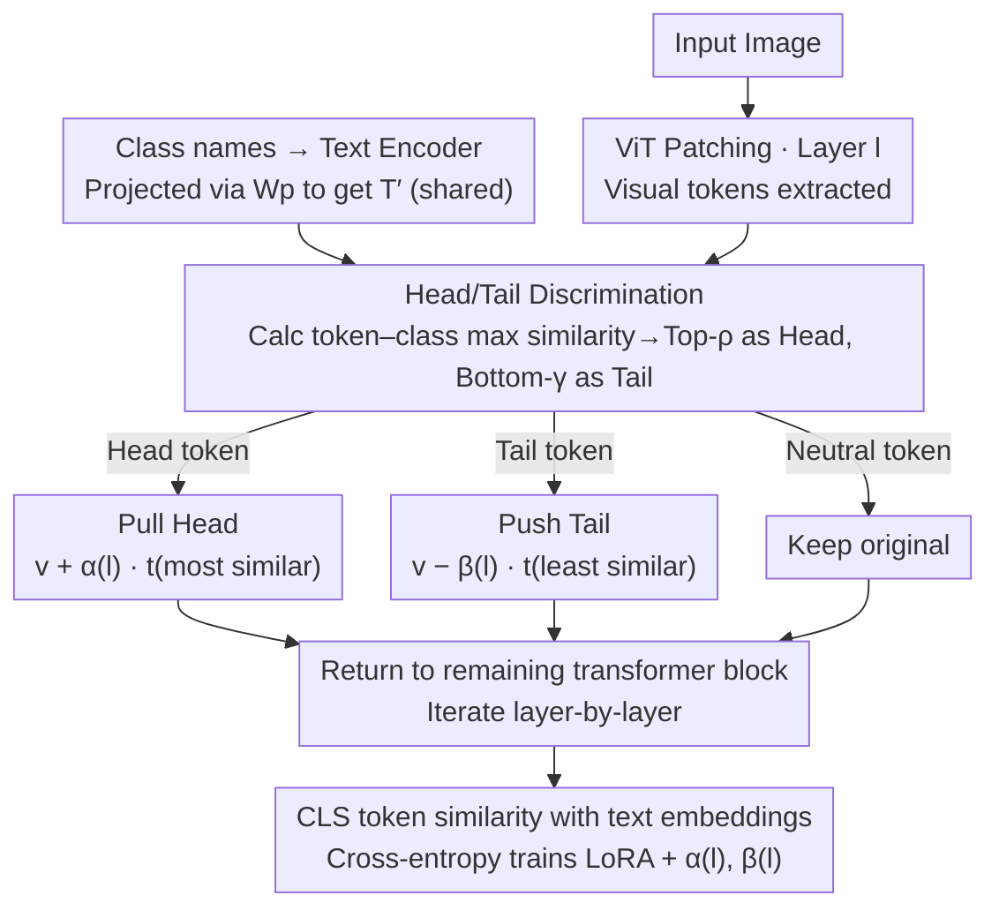

# ATHA: Improving CLIP Adaptation on Source-Free Cross-Domain Few-Shot Learning by Breaking Tail Alignment

**Conference**: ICML 2026  
**arXiv**: [2605.29776](https://arxiv.org/abs/2605.29776)  
**Code**: https://github.com/shuaiyi308/ATHA  
**Area**: Multimodal VLM / Cross-domain few-shot  
**Keywords**: CLIP fine-tuning, Cross-domain few-shot learning, Vision-language alignment, Tail Token, Source-free adaptation  

## TL;DR
ATHA proposes an asymmetric alignment paradigm of "aligning head tokens and pushing away tail tokens" for CLIP cross-domain few-shot fine-tuning. By actively pushing semantically sparse patches away from text embeddings, it mitigates overfitting and improves 1-shot average accuracy from 55.92% to 58.35%.

## Background & Motivation

**Background**: Vision-Language Models (VLMs) like CLIP learn semantically aligned image-text representations through contrastive pre-training, showing strength in zero-shot tasks. When adapting to downstream tasks, the mainstream approach is to **further strengthen the alignment of all patch tokens with corresponding text embeddings**—methods like SPARC, PACL, and Contrastive Localized Pre-Training all employ dense alignment. In cross-domain few-shot learning (CDFSL) and its stricter source-free variant (SF-CDFSL, where source data is inaccessible during fine-tuning), the default assumption remains "stronger alignment leads to better performance."

**Limitations of Prior Work**: The authors discover a **counter-intuitive phenomenon**: in cross-domain few-shot fine-tuning, deliberately pushing the patches with the lowest semantic similarity (termed tail tokens) away from corresponding text embeddings consistently improves performance across four standard CDFSL benchmarks (ISIC, EuroSAT, CropDiseases, ChestX). This directly contradicts the mainstream "all-token alignment" paradigm, where any operation breaking alignment should theoretically degrade performance.

**Key Challenge**: Under the dual constraints of large domain gaps and extremely sparse training data (1 or 5 shots per class), the model is **incapable of extracting sufficient semantics** from images to allow tail tokens to truly learn alignment. Forcing tail token alignment results in "memorizing" specific pixel distributions of support set images (overfitting) rather than "learning better." The authors verify this using CKA domain similarity: standard fine-tuning causes an abnormal drop in source-target domain feature similarity (a typical signal of overfitting), while pushing tail tokens restores this similarity.

**Goal**: (1) Provide a principled explanation for "pushing away tail tokens"; (2) Engineer this observation into an end-to-end trainable module that strengthens alignment for semantically rich patches while suppressing overfitting in semantically sparse patches; (3) Achieve SOTA performance on SF-CDFSL standard benchmarks.

**Key Insight**: Since the fundamental issue with tail tokens is that "forced alignment when semantics are insufficient leads to noise memorization" while head token alignment still provides useful transfer signals, "alignment" should be **processed hierarchically based on token semantic relevance**: pull discriminative patches toward the most similar class text (pull), push weakly discriminative patches away from the least similar class text (push), and keep other tokens unchanged.

**Core Idea**: Using the "maximum class similarity" of a token as a proxy, dynamically identify Head/Tail tokens at each ViT layer, and then apply asymmetric alignment using layer-wise learnable intensity parameters $\alpha^{(l)}, \beta^{(l)}$ to "pull the head and push the tail."

## Method

### Overall Architecture
The base model is CLIP-ViT/B-16, utilizing LoRA (Low-Rank Adaptation) where the backbone is frozen and only the LoRA matrices and a set of layer-wise learnable alignment intensities are trained. Given an input image $\mathbf{x}$ and $N$ target class names, the text encoder produces text embeddings $\mathbf{T}\in\mathbb{R}^{N\times D_t}$, which are then projected into the visual token space using CLIP’s visual projection matrix $\mathbf{W}_p$ as $\mathbf{T}'=\text{LayerNorm}(\mathbf{T})\mathbf{W}_p^\top\in\mathbb{R}^{N\times D}$ (shared across all layers). In the visual path, the image is divided into $L$ patches, yielding $\mathbf{V}^{(l)}\in\mathbb{R}^{B\times(L+1)\times D}$ after the $l$-th ViT layer. Within designated transformer blocks, ATHA first calculates the cosine similarity of each patch token to all class text embeddings, identifies Head/Tail tokens for asymmetric modification, and feeds them back into the remainder of the transformer block. Finally, the [CLS] token is used with text embeddings for cosine similarity, driven by standard cross-entropy loss to train LoRA and $\{\alpha^{(l)},\beta^{(l)}\}$ end-to-end.

### Key Designs

1. **Discriminative Token Selection**:

    - **Function**: Dynamically partitions $L$ patch tokens into head, tail, and neutral categories at each ViT layer to serve as the basis for subsequent asymmetric processing.
    - **Mechanism**: In layer $l$, the token-class similarity $s_{b,i,j}^{(l)}=\frac{{\mathbf{v}_{b,i}^{(l)}}^\top \mathbf{t}'_j}{\|\mathbf{v}_{b,i}^{(l)}\|\|\mathbf{t}'_j\|}$ is computed. For each token, its maximum similarity across all classes $s_{b,i}^{\max,(l)}=\max_j s_{b,i,j}^{(l)}$ is used as a **transferability proxy**. Tokens are sorted by this value: Top-$k_{\text{head}}$ are Head Tokens ($k_{\text{head}}=\lfloor L\cdot\rho\rfloor$), Bottom-$r_{\text{tail}}$ are Tail Tokens ($r_{\text{tail}}=\lfloor L\cdot\gamma\rfloor$), and others remain unchanged. The paper uses $\rho=\gamma=0.1$.
    - **Design Motivation**: Similarity distribution plots show that pre-trained CLIP exhibits a distinct bimodal structure (few heads + many tails) on the source domain, which is flattened after direct transfer to the target domain. "Maximum class similarity" is a **cheap and layer-variable** transferability metric that enables each layer to re-discriminate based on current feature distributions without additional signals.

2. **Asymmetric Head Alignment (Pull Head)**:

    - **Function**: Actively pulls each Head token toward its most similar class text embedding to strengthen alignment for patches that already possess semantics.
    - **Mechanism**: For Head token $i\in\mathcal{I}_{\text{head}}^{(l)}$, find $j^+=\arg\max_j s_{b,i,j}^{(l)}$, then $\tilde{\mathbf{v}}_{b,i}^{(l)}=\mathbf{v}_{b,i}^{(l)}+\alpha^{(l)}\cdot \mathbf{t}'_{j^+}$. Here $\alpha^{(l)}$ is a learnable pull intensity for that layer. The initialization strategy sets $\alpha^{(8)}=0.8$ for a selected layer (layer 8 in the paper) and $\alpha^{(l)}=0$ for others, allowing the model to learn "where to strengthen" before fine-tuning other layers.
    - **Design Motivation**: Head tokens are already close to certain class texts; this alignment direction is supported by real semantics. Explicitly adding the text embedding as a translation equates to "taking a step in the correct semantic direction" in visual space, reducing ambiguity during final classification. Learnable $\alpha^{(l)}$ allows layer-wise adjustment—less aggressive in shallow layers, more explicit in deep layers.

3. **Asymmetric Tail Alignment (Push Tail)**:

    - **Function**: Actively pushes each Tail token away from its least similar class text embedding, explicitly breaking "meaningless alignment" to prevent memorizing noise patches as training sample features.
    - **Mechanism**: For Tail token $i\in\mathcal{I}_{\text{tail}}^{(l)}$, find $j^-=\arg\min_j s_{b,i,j}^{(l)}$, then $\tilde{\mathbf{v}}_{b,i}^{(l)}=\mathbf{v}_{b,i}^{(l)}-\beta^{(l)}\cdot \mathbf{t}'_{j^-}$. It can be proven via dot product that $\mathbf{v}'\cdot \mathbf{t}=\mathbf{v}\cdot\mathbf{t}-\beta\|\mathbf{t}\|^2 < \mathbf{v}\cdot \mathbf{t}$, effectively suppressing vision-text similarity. $\beta^{(l)}$ is initialized to a small value of $0.01$ across all layers to provide a gentle starting point.
    - **Design Motivation**: This is the most counter-intuitive yet critical part of ATHA. CKA domain similarity experiments prove that standard fine-tuning causes features to excessively absorb specific training sample information (abnormally low CKA), while "pushing tails" pulls CKA back. This indicates that tail alignment is essentially **memorization rather than generalization**; explicit pushing closes that memorization channel. Making push intensity a learnable $\beta^{(l)}$ allows the model to automatically select the appropriate strength for different layers.

### Loss & Training
- **Loss**: Standard image-text cross-entropy $\mathcal{L}_{\text{cross}}=-\frac{1}{N}\sum_i \log \frac{\exp(\text{sim}(\mathbf{f}_i,\mathbf{t}_i)/\tau)}{\sum_j \exp(\text{sim}(\mathbf{f}_i,\mathbf{t}_j)/\tau)}$, where $\mathbf{f}_i$ is the final visual embedding of the [CLS] token.
- **Trainable Parameters**: LoRA low-rank matrices + one pair of $(\alpha^{(l)},\beta^{(l)})$ per layer, with the backbone frozen.
- **Optimizer and Hyperparameters**: AdamW, 100 epochs, data augmentation includes random cropping and horizontal flipping; follows episodic protocol for 5-way 1/5-shot, averaging over 800 episodes for 1-shot and 400 episodes for 5-shot.
- **Key Hyperparameters**: $\rho=\gamma=0.1$ (10% tokens each for head/tail); $\alpha^{(8)}=0.8$ for single-layer start, $\beta^{(l)}=0.01$ for all-layer start.

## Key Experimental Results

### Main Results
Testing 5-way 1-shot / 5-way 5-shot on 4 cross-domain few-shot benchmarks (ISIC2018 skin medicine, EuroSAT remote sensing, CropDiseases crop pathology, ChestX chest X-ray):

| Method | Backbone | Shot | ISIC | EuroSAT | CropDiseases | ChestX | Ave. |
|------|----------|------|------|---------|--------------|--------|------|
| StepSTP (TPAMI-25) | ViT/CLIP | 1 | 32.97 | 70.01 | 84.84 | 22.84 | 52.68 |
| CLIP-LoRA (CVPRW-24) | ViT/CLIP | 1 | 35.23 | 81.41 | 85.32 | 21.73 | 55.92 |
| ReCIT (ICML-25, DINO) | ViT/DINO | 1 | 38.48 | 75.23 | 85.92 | 23.84 | 55.87 |
| REAP (ICML-25, DINO) | ViT/DINO | 1 | 38.67 | 75.97 | 85.33 | 24.17 | 56.04 |
| **CLIP-LoRA + ATHA (Ours)** | ViT/CLIP | 1 | **38.86** | **82.56** | **87.99** | **24.00** | **58.35** |
| StyleAdv-FT (CVPR-23) | ViT/DINO | 5 | 51.23 | 90.12 | 95.99 | 26.97 | 66.08 |
| FLoR (CVPR-24) | ViT/DINO | 5 | 53.06 | 90.75 | 96.47 | 27.02 | 66.83 |

ATHA improves the CLIP-LoRA baseline from 55.92% to 58.35% (+2.43 Gain) in the 1-shot setting, while outperforming all previous ViT/CLIP and ViT/DINO-based methods across all four datasets. It improves over the strong CLIP-LoRA baseline by 1.15 points on EuroSAT and 2.67 points on CropDiseases.

### Ablation Study
The authors use distribution and CKA analysis to verify three aspects:

| Configuration | Phenomenon | Conclusion |
|------|------|------|
| Pre-trained CLIP (Direct Target) | Flat similarity distribution, weak discriminative power | Domain gap causes head/tail bimodal structure to vanish |
| Standard Fine-tuning | Curve shifts upward, significant drop in CKA domain similarity | All-token alignment leads to overfitting, pulling noise toward text |
| Push-away-tail Only | Tail portion drops, head portion continues upward, CKA rises | Pushing tails suppresses tail overfitting without damaging head alignment |
| Full ATHA (Pull + Push) | Head shifts further up, tail further suppressed | Pull-push synergy brings +2.43 gain in Main Results |

### Key Findings
- **Push is the primary source of gain**: Applying only Push-away-tail achieves most of the performance improvement, while Pull-head acts as a refined addition. This supports the core assertion that "breaking harmful alignment > strengthening existing alignment."
- **CKA domain similarity is an effective overfitting indicator**: Standard fine-tuning causes an abnormal CKA drop which the Push operation reverses, providing quantifiable evidence that tail alignment equals memorization.
- **Hierarchy initialization is crucial**: Starting $\alpha$ at layer 8 (middle of the 12-layer ViT) and initializing small $\beta$ across all layers allows for a "learn where to strengthen, then learn how to push" progressive training critical for stability.
- **Robustness to $\rho, \gamma$**: The 10% ratio is robust across four datasets, suggesting that the head/tail boundary does not require fine-tuning.

## Highlights & Insights
- **Challenges the core belief of VLM adaptation**: Most cross-modal alignment literature assumes "the more complete the alignment, the better." ATHA provides the first systematic evidence that "active anti-alignment" is correct in few-shot large-domain-gap settings, overturning the design premise of fine-grained alignment methods.
- **Representation-based rather than loss-based alignment control**: By manipulating patch representations via direct addition/subtraction of text embeddings, ATHA bypasses the indirect nature of contrastive loss. The strength and direction of pull/push are more controllable and hierarchically manageable.
- **CKA domain similarity as an "overfitting thermometer"**: This metric can be transferred to any source-free adaptation scenario to diagnose whether the model is falling into the trap of "memorizing training samples."
- **Learnable asymmetric alignment intensities $(\alpha, \beta)$**: This concept can be generalized to any scenario requiring "differential treatment of tokens based on transferability"—such as distinguishing "memorization" vs "generalization" prompt tokens in instruction tuning.

## Limitations & Future Work
- **Fixed head/tail ratios**: Although $\rho=\gamma=0.1$ is robust, semantic density of patches varies across domains (medical vs. remote sensing vs. natural images); adaptive ratios might yield further gains.
- **Verified only under LoRA settings**: The benefit for other PEFT schemes (Prefix, Adapter) or full fine-tuning was not covered.
- **Reliance on class names as semantic proxies**: In zero-shot scenarios where class names are missing or highly abstract (e.g., fine-grained codes), the "maximum class similarity" discrimination might be distorted.
- **No theoretical proof for "pushing the least similar class text"**: While empirically optimal, there is a lack of rigorous optimality analysis for choosing the most dissimilar class as the push direction.
- **Limited to 4 common CDFSL benchmarks**: Transferability to more difficult multimodal domains (e.g., medical multi-modality) remains unknown.

## Related Work & Insights
- **vs. CLIP-LoRA (CVPRW-24)**: Both use frozen backbone + LoRA, but CLIP-LoRA performs standard alignment; ATHA adds asymmetric alignment on top, yielding a +2.43 gain. This emphasizes that "what module to add" is more critical than "what parameters to train."
- **vs. SPARC / PACL (Dense Alignment)**: These represent the mainstream fine-grained alignment route seeking "alignment for every patch"; ATHA proves that "not every patch should be aligned" in few-shot domain transfer.
- **vs. ReCIT / REAP (ICML-25, DINO-based)**: Using DINO instead of CLIP, they average around 56%; ATHA outperforms them at 58.35% using CLIP, verifying that CLIP's image-text priors are more suitable for "alignment manipulation" methods.
- **vs. IM-DCL (TIP-24, RN10)**: Both are source-free, but IM-DCL uses contrastive learning; ATHA's representation-level manipulation avoids the negative sample design costs associated with contrastive losses.
- **vs. StepSTP (TPAMI-25, ViT/CLIP)**: On the same backbone, ATHA is 5.67 points higher on average; StepSTP still uses all-token alignment, demonstrating the value of "breaking tail alignment."

## Rating
- Novelty: ⭐⭐⭐⭐⭐ Triple threat of counter-intuitive discovery + systematic explanation + engineered solution; genuinely challenges an established belief.
- Experimental Thoroughness: ⭐⭐⭐⭐ Solid results across 4 benchmarks and 2 shot settings, plus CKA/similarity analysis; however, ablation granularity and backbone variety could be expanded.
- Writing Quality: ⭐⭐⭐⭐ Clear narrative (Phenomenon → Analysis → Method), with the Fig.1/2/3 sequence conveying the core argument intuitively.
- Value: ⭐⭐⭐⭐⭐ Directly applicable to CLIP adaptation and low-resource scenarios; the observation may drive the VLM adaptation literature to reconsider "alignment worship."

<!-- RELATED:START -->

## Related Papers

- [\[ICLR 2026\] Breaking the Limits of Open-Weight CLIP: An Optimization Framework for Self-supervised Fine-tuning of CLIP](../../ICLR2026/multimodal_vlm/breaking_the_limits_of_open-weight_clip_an_optimization_framework_for_self-super.md)
- [\[CVPR 2026\] Reevaluating the Intra-Modal Misalignment Hypothesis in CLIP](../../CVPR2026/multimodal_vlm/reevaluating_the_intra-modal_misalignment_hypothesis_in_clip.md)
- [\[ICML 2026\] Left-Right Symmetry Breaking in CLIP-style Vision-Language Models Trained on Synthetic Spatial-Relation Data](left-right_symmetry_breaking_in_clip-style_vision-language_models_trained_on_syn.md)
- [\[CVPR 2026\] CLIP-like Model as a Foundational Density Ratio Estimator](../../CVPR2026/multimodal_vlm/clip-like_model_as_a_foundational_density_ratio_estimator.md)
- [\[CVPR 2026\] Boosting Visual Reprogramming for CLIP with Dual Granularity Alignment](../../CVPR2026/multimodal_vlm/boosting_visual_reprogramming_for_clip_with_dual_granularity_alignment.md)

<!-- RELATED:END -->
