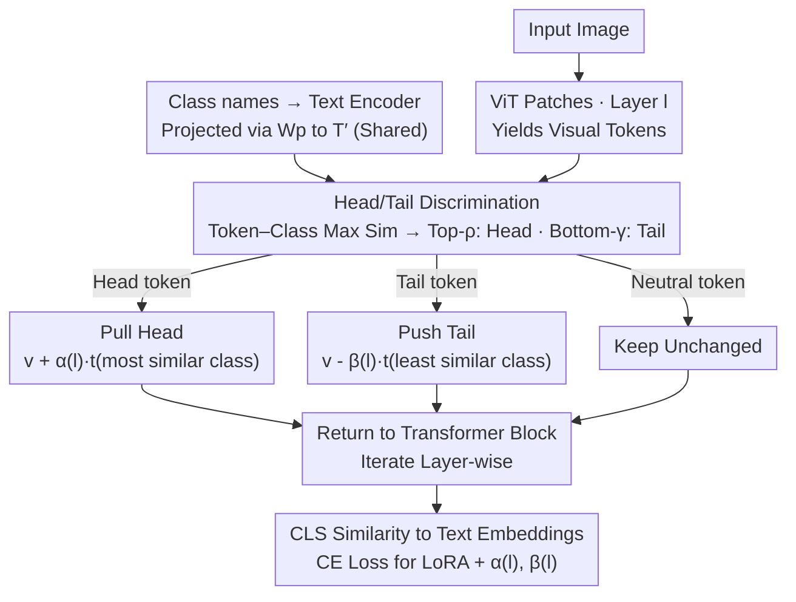

# ATHA: Improving CLIP Adaptation on Source-Free Cross-Domain Few-Shot via Breaking Tail Alignment

**Conference**: ICML 2026  
**arXiv**: [2605.29776](https://arxiv.org/abs/2605.29776)  
**Code**: https://github.com/shuaiyi308/ATHA  
**Area**: Multimodal VLM / Cross-Domain Few-Shot  
**Keywords**: CLIP Fine-tuning, Cross-Domain Few-Shot Learning, Vision-Text Alignment, Tail Token, Source-Free Adaptation  

## TL;DR
ATHA proposes an asymmetric alignment paradigm in CLIP cross-domain few-shot fine-tuning: "align head tokens, push away tail tokens." Actively pushing semantically sparse patches away from text embeddings alleviates overfitting, boosting 1-shot average accuracy from 55.92% to 58.35%.

## Background & Motivation

**Background**: Vision-Language Models (VLMs) like CLIP learn semantically aligned image-text representations through contrastive pre-training, showing strength in zero-shot tasks. When adapting to downstream tasks, the prevailing paradigm is to **further reinforce the alignment of all patch tokens with corresponding text embeddings**—approaches like SPARC, PACL, and Contrastive Localized Pre-Training all employ dense alignment. In Cross-Domain Few-Shot Learning (CDFSL) and its more stringent Source-Free variant (SF-CDFSL, where source data is inaccessible during fine-tuning), the mainstream philosophy assumes that "stronger alignment leads to better performance."

**Limitations of Prior Work**: The authors discovered a **counter-intuitive phenomenon**: in cross-domain few-shot fine-tuning, deliberately pushing away the patches with the lowest semantic similarity (termed "tail tokens") from their corresponding text embeddings consistently improves performance across four standard CDFSL benchmarks (ISIC, EuroSAT, CropDiseases, ChestX). This directly contradicts the "all-token alignment" paradigm, where any disruption of alignment is typically expected to degrade performance.

**Key Challenge**: Under the dual constraints of large domain gaps and extremely sparse training data (1 or 5 shots per class), models lack the **capability to extract sufficient semantics from images** to truly learn alignment for tail tokens. Forcing tail token alignment does not lead to "better learning" but rather "memorization" of training tokens—overfitting to the specific pixel distributions of sparse support set images. This is validated by CKA (Centered Kernel Alignment) domain similarity: standard fine-tuning causes an abnormal drop in source-target domain feature similarity (a typical signal of overfitting), while pushing away tail tokens restores this similarity.

**Goal**: (1) Provide a principled explanation for "pushing away tail tokens"; (2) Engineer this observation into an end-to-end trainable module that reinforces alignment for semantically rich patches while suppressing overfitting in sparse ones; (3) Achieve SOTA performance on standard SF-CDFSL benchmarks.

**Key Insight**: Since the fundamental issue with tail tokens is that "forced alignment in the absence of semantics leads to noise memorization," while head token alignment still conveys useful transfer signals, "alignment" should be **processed hierarchically based on token semantic relevance**. Discriminative patches should be pulled toward the most similar class text (pull), while non-discriminative patches should be pushed away from the least similar class text (push), leaving remaining tokens untouched.

**Core Idea**: Use the "maximum class similarity" of a token as a proxy to dynamically identify Head/Tail tokens at each ViT layer, then perform "Pull Head, Push Tail" asymmetric alignment using per-layer learnable intensity parameters $\alpha^{(l)}, \beta^{(l)}$.

## Method

### Overall Architecture
The base model is CLIP-ViT/B-16, utilizing LoRA (Low-Rank Adaptation)—the backbone is frozen, and only the LoRA matrices and a set of layer-wise learnable alignment intensities are trained. Given an input image $\mathbf{x}$ and $N$ target class names, the text encoder produces text embeddings $\mathbf{T}\in\mathbb{R}^{N\times D_t}$, which are projected into the visual token space $\mathbf{T}'=\text{LayerNorm}(\mathbf{T})\mathbf{W}_p^\top\in\mathbb{R}^{N\times D}$ using CLIP's visual projection matrix $\mathbf{W}_p$ (shared across all layers). On the visual path, the image is partitioned into $L$ patches, passing through the $l$-th ViT layer to obtain $\mathbf{V}^{(l)}\in\mathbb{R}^{B\times(L+1)\times D}$. Within specified transformer blocks, ATHA calculates the cosine similarity of each patch token to all class texts, identifies Head/Tail tokens for asymmetric modification, and feeds them back into the remainder of the block. Finally, the [CLS] token similarity with text embeddings drives end-to-end training of LoRA + $\{\alpha^{(l)}, \beta^{(l)}\}$ via standard cross-entropy loss.

### Key Designs

1. **Discriminative Token Selection**:
    - **Function**: Dynamically categorizes $L$ patch tokens into head, tail, or neutral tokens at each ViT layer to serve as the basis for asymmetric processing.
    - **Mechanism**: Calculates token-class similarity $s_{b,i,j}^{(l)}=\frac{{\mathbf{v}_{b,i}^{(l)}}^\top \mathbf{t}'_j}{\|\mathbf{v}_{b,i}^{(l)}\|\|\mathbf{t}'_j\|}$ at layer $l$. For each token, the maximum similarity across all classes $s_{b,i}^{\max,(l)}=\max_j s_{b,i,j}^{(l)}$ is used as a **transferability proxy**. Tokens are sorted: Top-$k_{\text{head}}$ are Head Tokens ($k_{\text{head}}=\lfloor L\cdot\rho\rfloor$), Bottom-$r_{\text{tail}}$ are Tail Tokens ($r_{\text{tail}}=\lfloor L\cdot\gamma\rfloor$), others remain unchanged. The paper sets $\rho=\gamma=0.1$.
    - **Design Motivation**: Similarity distribution plots show that pre-trained CLIP exhibits a distinct bimodal structure (few heads + many tails) on the source domain, which is flattened upon direct transfer to the target domain. "Maximum class similarity" is a **cheap and layer-variant** transferability metric that enables each layer to re-discriminate based on current feature distributions without extra learning signals.

2. **Asymmetric Head Alignment (Pull Head)**:
    - **Function**: Actively pulls each Head token toward its most similar class text embedding, reinforcing alignment for patches that already possess semantic relevance.
    - **Mechanism**: For Head token $i\in\mathcal{I}_{\text{head}}^{(l)}$, identify $j^+=\arg\max_j s_{b,i,j}^{(l)}$, then $\tilde{\mathbf{v}}_{b,i}^{(l)}=\mathbf{v}_{b,i}^{(l)}+\alpha^{(l)}\cdot \mathbf{t}'_{j^+}$. $\alpha^{(l)}$ is the learnable pull intensity for that layer. The initialization strategy sets $\alpha^{(8)}=0.8$ for a selected layer (mid-level) while others are $\alpha^{(l)}=0$, allowing the model to first learn "where to reinforce" before fine-tuning other layers.
    - **Design Motivation**: Head tokens are already close to a class text; this alignment direction has genuine semantic support. Adding a text embedding essentially moves the visual feature "one step along the correct semantic direction" in feature space, reducing ambiguity during final classification. Learnable $\alpha^{(l)}$ allows layer-wise adjustment—less aggressive in shallow layers, more explicit in deep layers.

3. **Asymmetric Tail Alignment (Push Tail)**:
    - **Function**: Actively pushes each Tail token away from its least similar class text embedding, explicitly breaking "meaningless alignment" to prevent memorizing noise patches as training features.
    - **Mechanism**: For Tail token $i\in\mathcal{I}_{\text{tail}}^{(l)}$, identify $j^-=\arg\min_j s_{b,i,j}^{(l)}$, then $\tilde{\mathbf{v}}_{b,i}^{(l)}=\mathbf{v}_{b,i}^{(l)}-\beta^{(l)}\cdot \mathbf{t}'_{j^-}$. Inner product derivation shows $\mathbf{v}'\cdot \mathbf{t}=\mathbf{v}\cdot\mathbf{t}-\beta\|\mathbf{t}\|^2 < \mathbf{v}\cdot \mathbf{t}$, effectively depressing vision-text similarity. $\beta^{(l)}$ is initialized to a small value of $0.01$ across all layers to provide a gentle starting point.
    - **Design Motivation**: This is the most counter-intuitive yet critical part of ATHA. CKA domain similarity experiments prove that standard fine-tuning causes features to excessively absorb training sample-specific information (abnormally low CKA), whereas "pushing tails" pulls CKA back. This suggests tail alignment is essentially **memorization rather than generalization**; explicitly pushing them away shuts down that memorization channel.

### Loss & Training
- **Loss**: Standard image-text cross-entropy $\mathcal{L}_{\text{cross}}=-\frac{1}{N}\sum_i \log \frac{\exp(\text{sim}(\mathbf{f}_i,\mathbf{t}_i)/\tau)}{\sum_j \exp(\text{sim}(\mathbf{f}_i,\mathbf{t}_j)/\tau)}$, where $\mathbf{f}_i$ is the final visual embedding of the [CLS] token.
- **Learnable Parameters**: LoRA rank-decomposition matrices + per-layer pairs $(\alpha^{(l)}, \beta^{(l)})$. Backbone is fully frozen.
- **Optimizer & Hyperparams**: AdamW, 100 epochs, data augmentation includes random crop and horizontal flip. Follows 5-way 1/5-shot episodic protocol: 800 episodes for 1-shot and 400 for 5-shot.
- **Key Hyperparameters**: $\rho=\gamma=0.1$ (10% tokens for head/tail); $\alpha^{(8)}=0.8$ single-layer start, $\beta^{(l)}=0.01$ all-layer start.

## Key Experimental Results

### Main Results
Performance on 4 cross-domain few-shot benchmarks (ISIC2018 skin lesions, EuroSAT remote sensing, CropDiseases, ChestX chest X-rays) for 5-way 1-shot / 5-way 5-shot:

| Method | Backbone | Shot | ISIC | EuroSAT | CropDiseases | ChestX | Ave. |
| :--- | :--- | :--- | :--- | :--- | :--- | :--- | :--- |
| StepSTP (TPAMI-25) | ViT/CLIP | 1 | 32.97 | 70.01 | 84.84 | 22.84 | 52.68 |
| CLIP-LoRA (CVPRW-24) | ViT/CLIP | 1 | 35.23 | 81.41 | 85.32 | 21.73 | 55.92 |
| ReCIT (ICML-25, DINO) | ViT/DINO | 1 | 38.48 | 75.23 | 85.92 | 23.84 | 55.87 |
| REAP (ICML-25, DINO) | ViT/DINO | 1 | 38.67 | 75.97 | 85.33 | 24.17 | 56.04 |
| **CLIP-LoRA + ATHA (Ours)** | ViT/CLIP | 1 | **38.86** | **82.56** | **87.99** | **24.00** | **58.35** |
| StyleAdv-FT (CVPR-23) | ViT/DINO | 5 | 51.23 | 90.12 | 95.99 | 26.97 | 66.08 |
| FLoR (CVPR-24) | ViT/DINO | 5 | 53.06 | 90.75 | 96.47 | 27.02 | 66.83 |

On 1-shot, ATHA boosts the CLIP-LoRA baseline from 55.92% to 58.35% (+2.43 points), outperforming all previous ViT/CLIP and ViT/DINO based methods across all four datasets. It exceeds the strong CLIP-LoRA baseline by 1.15 points on EuroSAT and 2.67 points on CropDiseases.

### Ablation Study
The paper uses distribution/CKA analysis to validate three observations:

| Configuration | Phenomenon | Key Finding |
| :--- | :--- | :--- |
| Pre-trained CLIP (Direct) | Flat similarity distribution, weak discrimination | Domain gap causes head/tail bimodal structure to vanish |
| Standard Fine-tuning | Curve shifts upward, CKA domain similarity drops significantly | All-token alignment causes overfitting, pulling noise toward text |
| Push-away-tail only | Tail similarity drops, head similarity rises, CKA recovers | Pushing tails inhibits overfitting without damaging head alignment |
| Full ATHA (Pull + Push) | Head rises further, tail inhibited further | Collaborative pull-push yields +2.43 point end-to-end gain |

### Key Findings
- **Push is the primary gain source**: Pushing away tail tokens alone accounts for the majority of the performance gain, with Pull-head being a secondary improvement. This aligns with the "breaking harmful alignment > strengthening existing alignment" thesis.
- **CKA is a valid overfitting proxy**: Abnormal CKA drops under standard fine-tuning are mitigated by "Push," providing quantifiable evidence that tail alignment equals memorization.
- **Layer-wise initialization is critical**: Starting $\alpha$ at layer 8 and $\beta$ across all layers in a small capacity is key to stable training.
- **Insensitivity to $\rho, \gamma$**: The 10% ratio is robust across four datasets, indicating that the head/tail boundary does not require fine-tuning.

## Highlights & Insights
- **Challenging VLM Adaptation Dogma**: Most VLM literature assumes "more alignment is better." ATHA provides the first systematic evidence that in few-shot + large domain gap scenarios, "active anti-alignment" is the correct approach.
- **Representation-based Manipulation**: By directly adding/subtracting text embeddings to manipulate patch representations, ATHA bypasses the indirectness of contrastive loss, making the direction and intensity of alignment more controllable and layer-scalable.
- **CKA as an "Overfitting Thermometer"**: This metric can be migrated to any source-free adaptation scenario to diagnose if the model is trapped in "memorizing training samples."

## Limitations & Future Work
- **Fixed Head/Tail Ratios**: While $\rho=\gamma=0.1$ is robust, semantic density varies across domains (medical vs. remote sensing); adaptive ratios might further improve performance.
- **LoRA dependency**: The paper does not explore if other PEFT schemes (Prefix, Adapter) or full fine-tuning benefit equally.
- **Semantic Proxy Reliance**: In cases where class names are missing or highly abstract (e.g., fine-grained codes), the "maximum class similarity" might be distorted.
- **Optimality Analysis**: The choice of pushing away the "least similar class" is empirically optimal but lacks rigorous theoretical optimality analysis.

## Related Work & Insights
- **vs. CLIP-LoRA (CVPRW-24)**: Both freeze the backbone and use LoRA, but CLIP-LoRA uses standard alignment. ATHA adds asymmetric alignment, yielding a +2.43 point gap, highlighting that "what to add" is more critical than "which parameters to train."
- **vs. SPARC / PACL (Dense Alignment)**: These represent the mainstream fine-tuning route seeking "alignment for every patch." ATHA proves that "not every patch should be aligned" in low-resource settings.
- **vs. StepSTP (TPAMI-25, ViT/CLIP)**: On the same backbone, ATHA averages 5.67 points higher. StepSTP's continued use of all-token alignment illustrates the value of the "breaking tail alignment" concept.

## Rating
- Novelty: ⭐⭐⭐⭐⭐ Counter-intuitive discovery + systematic explanation + engineered solution; challenges an established belief.
- Experimental Thoroughness: ⭐⭐⭐⭐ Solid results on 4 benchmarks with CKA/distribution analysis, though backbone variety is limited.
- Writing Quality: ⭐⭐⭐⭐ Clear narrative from phenomenon to analysis to method; Figures 1-3 illustrate the core arguments effectively.
- Value: ⭐⭐⭐⭐⭐ Highly applicable to CLIP adaptation in few-shot/low-resource scenarios; may prompt a re-evaluation of "alignment-centric" VLM research.

<!-- RELATED:START -->

...

<!-- RELATED:END -->

## Related Papers

- [\[ICLR 2026\] Breaking the Limits of Open-Weight CLIP: An Optimization Framework for Self-supervised Fine-tuning of CLIP](../../ICLR2026/multimodal_vlm/breaking_the_limits_of_open-weight_clip_an_optimization_framework_for_self-super.md)
- [\[CVPR 2026\] Reconstructing CLIP for Open-Vocabulary Dense Perception](../../CVPR2026/multimodal_vlm/reconstructing_clip_for_open-vocabulary_dense_perception.md)
- [\[CVPR 2026\] Reevaluating the Intra-Modal Misalignment Hypothesis in CLIP](../../CVPR2026/multimodal_vlm/reevaluating_the_intra-modal_misalignment_hypothesis_in_clip.md)
- [\[ICML 2026\] Left-Right Symmetry Breaking in CLIP-style Vision-Language Models Trained on Synthetic Spatial-Relation Data](left-right_symmetry_breaking_in_clip-style_vision-language_models_trained_on_syn.md)
- [\[CVPR 2026\] CLIP-like Model as a Foundational Density Ratio Estimator](../../CVPR2026/multimodal_vlm/clip-like_model_as_a_foundational_density_ratio_estimator.md)

<!-- RELATED:END -->
