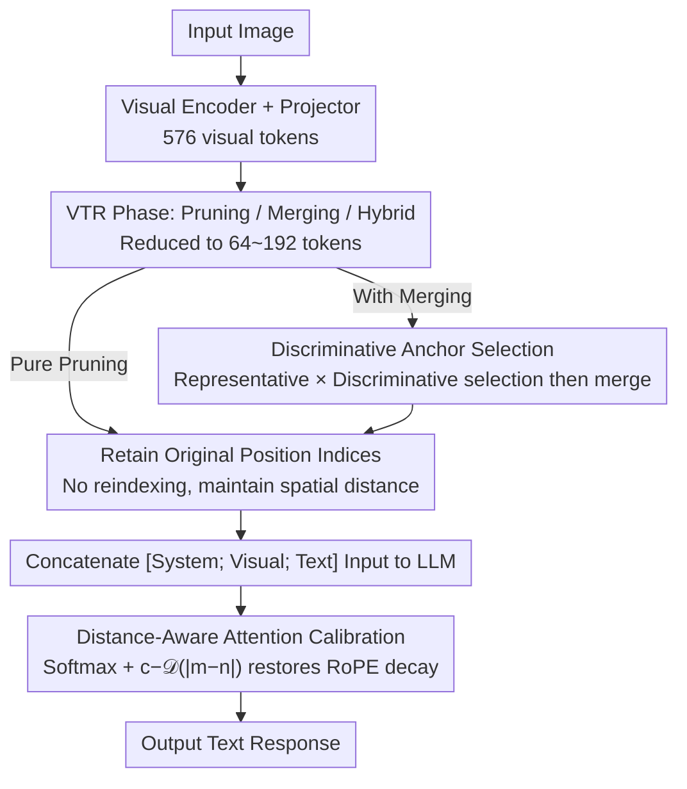

# RESTORE: Improving Visual Token Reduction via Distortion Correction for Enhanced MLLM Inference Efficiency

**Conference**: ICML 2026  
**arXiv**: [2606.01711](https://arxiv.org/abs/2606.01711)  
**Code**: https://cvlab.yonsei.ac.kr/projects/RESTORE (Project Homepage)  
**Area**: Multimodal VLM / LLM Efficiency  
**Keywords**: Visual Token Reduction, MLLM Acceleration, RoPE Attention Calibration, Anchor Token Selection, LLaVA  

## TL;DR
RESTORE highlights the overlooked issues of "positional distortion" and "attention decay" in existing Visual Token Reduction (VTR) methods. By introducing a distance-aware inverse compensation term for RoPE decay and improving token merging with an anchor selection strategy that balances representativeness and discriminativeness, LLaVA-1.5-7B maintains near full-token performance even with only 64 tokens (approximately 11% retention rate).

## Background & Motivation

**Background**: Multimodal Large Language Models (MLLMs, e.g., LLaVA, Qwen2.5-VL) encode visual patches into hundreds or thousands of visual tokens, which are concatenated with text tokens for LLM processing. Due to the $O(N^2)$ complexity of self-attention, these visual tokens represent the primary computational and memory bottleneck. Consequently, Visual Token Reduction (VTR) methods have emerged, primarily falling into two categories: pruning (FastV, SparseVLM, HoloV), which retains high-attention tokens and discards the rest; and merging (ToMe, PruMerge, VisionZip), which aggregates similar tokens into representative anchors.

**Limitations of Prior Work**: The authors identify two types of distortions that have long been ignored. The first is **positional distortion**: after sequence reduction, current methods either reassign retained tokens to continuous positions ("reindex" approach) or maintain their original indices ("retain" approach). The former destroys the true spatial distance between visual and text tokens, while the latter suffers from severe suppression of distant tokens due to the long-range decay of RoPE. The second is **attention decay**: softmax normalization redistributes the probability mass originally occupied by pruned tokens. Since text tokens have smaller mutual distances and higher logits, the overall attention proportion of visual tokens becomes significantly lower than the full-sequence baseline after merging/pruning. This forces the model to "look less at images and guess more from text," leading to hallucinations and weakened visual grounding.

**Key Challenge**: Reindexing sacrifices spatial authenticity for attention volume, while retaining indices preserves spatial authenticity but loses attention volume. Neither path simultaneously satisfies "positional semantic alignment" and "attention distribution alignment."

**Goal**: Without modifying LLM weights or adding significant inference overhead: (1) ensure reduced visual sequences retain original positional indices to maintain spatial relationships; (2) pull the total attention proportion of visual tokens back to full-sequence levels; and (3) select more representative anchors during token merging to reduce detail loss caused by feature averaging.

**Key Insight**: Since the long-range decay function of RoPE $\mathcal{D}(|m-n|)=\frac{2}{d_h}\sum_{j=1}^{d_h/2}\cos(|m-n|\theta_j)$ can be analytically derived, a **distance-inversely-increasing** compensation term $c-\mathcal{D}(|m-n|)$ can be constructed to analytically restore the attention stolen by RoPE. Anchor selection draws inspiration from density peak clustering, requiring tokens to be both "centers of their neighbors" and "sufficiently distant from each other."

**Core Idea**: Use "distance-aware softmax calibration" to correct positional/attention distortions and a "representative × discriminative" dual-metric for anchor selection, creating a plug-and-play universal enhancement module for VTR.

## Method

### Overall Architecture
RESTORE is a **universal VTR enhancer** designed for standard MLLMs (exemplified by LLaVA-1.5). It does not modify the visual encoder or the LLM. It only intervenes in two places: the softmax formula for attention calculation within the LLM and the anchor selection logic during the token merging phase.

Mechanism: Input Image → Visual Encoder + Projector output $\mathbf{X}_{\text{vis}}\in\mathbb{R}^{N_{\text{vis}}\times d}$ ($N_{\text{vis}}{=}576$) → VTR phase (compatible with any pruning/merging/hybrid method) output $\hat{\mathbf{X}}_{\text{vis}}\in\mathbb{R}^{n_{\text{vis}}\times d}$ ($n_{\text{vis}}\in\{64,128,192\}$) → Retained tokens adopt **original positional indices** from the full sequence → LLM uses **calibrated** softmax in each attention layer → Text response output. If the underlying VTR includes a merging step (e.g., VisionZip), RESTORE's discriminative anchor selection replaces the original sampling logic. Because it only modifies the softmax and anchor selection without changing the core "token picking" logic of VTR methods, RESTORE serves as a training-free universal enhancer for backbones like FastV, SparseVLM, ToMe, VisionZip, DivPrune, VisPruner, and HoloV.

### Key Designs

**1. Distance-Aware Attention Calibration: Retaining original indices while analytically restoring RoPE-attenuated attention**

This step is the core of the LLM stage (Node G) and the primary source of RESTORE's gains. The limitation of the "retain" approach is that long-range RoPE decay lowers the attention logits of distant visual tokens. After softmax normalization, probability mass is redistributed to text tokens that are closer and have higher logits, causing the total visual attention to drop below the full-sequence baseline. RESTORE retains original indices to preserve spatial authenticity and then adds an analytical calibration term to the softmax logits in each attention layer.

The approach analytically isolates the long-range decay of RoPE from the attention logit, obtaining a decay function dependent only on relative distance: $\mathcal{D}(|m-n|)=\frac{2}{d_h}\sum_{j=1}^{d_h/2}\cos(|m-n|\theta_j)$. The calibrated attention is $\hat{A}_{m,n}=\frac{\exp(z_{m,n}+\log s_n(c-\mathcal{D}(|m-n|)))}{\sum_{i}\exp(z_{m,i}+\log s_i(c-\mathcal{D}(|m-i|)))}$, where $z_{m,n}$ is the original logit, $s_n$ is the number of tokens merged into the $n$-th token, and $c$ is a constant ensuring non-negative compensation. While $\log s_n$ follows the ToMe approach of scaling merged tokens, $(c-\mathcal{D})$ is RESTORE's addition—as distance increases, $\mathcal{D}$ decreases and the compensation $(c-\mathcal{D})$ increases, precisely counteracting the RoPE-induced suppression of distant visual tokens. This allows the model to maintain both the true spatial relationships of the "retain" approach and the total attention volume of the "reindex" approach.

**2. Discriminative Anchor Token Selection: Making anchors both neighborhood centers and non-redundant**

This step (Node D) applies when the underlying VTR involves merging. Token merging clusters similar tokens into representative anchors. However, prior methods (e.g., PruMerge, VisionZip) do not guarantee that an anchor is truly similar to the tokens it merges, which blurs details. Conversely, selecting multiple highly correlated anchors wastes the token budget on redundant regions.

RESTORE utilizes density peak clustering principles and a pre-computed pairwise correlation matrix $\mathbf{C}=\mathbf{X}_{\text{vis}}\mathbf{X}_{\text{vis}}^T/\|\mathbf{X}_{\text{vis}}\|^2$ to define two metrics. **Representativeness** $\mathcal{R}_i=\sum_j \mathbf{C}_{ij}$ measures how much a token correlates with all others; a higher value indicates a cluster center. **Discriminativeness** $1-\max_j \hat{\mathbf{C}}_{ij}$ measures uniqueness: a binary mask $\mathbf{M}_{ij}=\mathbb{I}(\mathcal{R}_j>\mathcal{R}_i)$ filters for "more central" competitors to create $\hat{\mathbf{C}}$, and the maximum similarity to the strongest competitor is calculated. If a token is not highly covered by any stronger competitor, this maximum is small and $1-\max$ is large. The final anchor set $\mathcal{A}=\operatorname{Top-K}(\mathcal{R}_i\odot(1-\max_j\hat{\mathbf{C}}_{ij}))$ consists of the Top-K products. This ensures anchors are neighborhood centers (reducing blur) and non-redundant.

### Loss & Training
RESTORE is a **purely inference-time module**. It introduces no trainable parameters and does not require retraining the LLM or visual encoder. The constant $c$ is fixed, and the decay $\mathcal{D}$ is analytically derived from RoPE parameters. Anchor selection depends only on the feature correlation matrix. Thus, it can be integrated into any pre-trained MLLM with zero training cost.

## Key Experimental Results

### Main Results
Evaluated using LLaVA-1.5-7B across 8 benchmarks (GQA, MMB, MME, POPE, SQA$^{\text{IMG}}$, VQA$^{\text{V2}}$, VQA$^{\text{Text}}$, SEED). The metric is the "relative percentage of full-token average score." Results at 192 tokens (33.3% retention) follow:

| Method | Type | Avg Score | GQA | MME | POPE | VQA$^{\text{V2}}$ |
|------|------|---------|-----|-----|------|-------------------|
| LLaVA-1.5-7B (Full 576 tokens) | Baseline | 100.0% | 61.9 | 1862 | 85.9 | 78.5 |
| FastV | Text-aware | 96.0% | 57.1 | 1821 | 75.8 | 74.7 |
| SparseVLM | Text-aware | 98.1% | 59.5 | 1782 | 85.4 | 77.0 |
| VisionZip | Hybrid | 96.8% | 59.2 | 1749 | 85.2 | 77.2 |
| **VisionZip + RESTORE** | Hybrid | **98.0%** | **60.6** | **1782** | **86.6** | 77.0 |
| DivPrune | Text-agnostic | 96.9% | 58.9 | 1723 | 86.5 | 76.1 |
| **DivPrune + RESTORE** | Text-agnostic | **98.7%** | **60.9** | **1813** | **86.6** | **77.4** |
| HoloV | Text-agnostic | 96.5% | 58.6 | 1779 | 85.0 | 76.0 |
| **HoloV + RESTORE** | Text-agnostic | **98.8%** | **61.0** | **1793** | **86.6** | **77.6** |

At 128 tokens (22.2%), text-agnostic backbones with RESTORE remain stable above 95%, while other methods drop significantly. At 64 tokens (11.1%), RESTORE consistently pushes several VTR backbones toward near full-token performance.

### Ablation Study
| Configuration | Avg Score (192 tokens) | Description |
|------|---------------------|------|
| HoloV (baseline) | 96.5% | Pruning only, reindexed positions |
| + Retain Original Indices | Slight Decrease | Loss of attention volume, confirms "retain" drawback |
| + Dist.-Aware Calib. ($c-\mathcal{D}$) | 98.4% | Restores attention volume; main gain source |
| + Discrim. Anchor (for merging VTR) | +0.3~0.5% | Additional gain on merging methods like VisionZip |
| **Full RESTORE** | **98.8%** | Calibration + Anchor Selection combined |

### Key Findings
- **Calibration is the main contributor**: Compensating for attention loss while retaining original indices closes the performance gap across all backbones. Significant POPE improvements suggest restored visual grounding.
- **Backbone agnostic**: RESTORE provides stable gains of 1.5–2.3 points across text-aware, text-agnostic, and hybrid methods, indicating that the addressed distortions are fundamental to the VTR paradigm.
- **Higher efficiency, higher impact**: Gains are more pronounced at lower token budgets (e.g., 64 tokens), where attention decay is most severe.
- **M-RoPE Compatibility**: The calibration term analytically extends to M-RoPE used in Qwen2.5-VL with consistent gains.

## Highlights & Insights
- **Analytical Use of RoPE**: The RoPE decay function $\mathcal{D}$ is used as an inverse compensation signal. The cost is negligible (a few cos summations), providing a template for correcting model priors analytically.
- **Taxonomy of Distortion**: The paper independently identifies "positional distortion" and "attention distortion," moving the field beyond simply optimizing token selection strategies.
- **Efficient Anchor Selection**: By leveraging the correlation matrix already computed, the "representativeness × discriminativeness" strategy improves merging quality without extra overhead.
- **Zero-training Deployment**: A true plug-and-play module for existing LLaVA or Qwen2.5-VL deployments.

## Limitations & Future Work
- **Dependency on Base VTR**: RESTORE enhances VTR but cannot recover information if the base method discards critical tokens.
- **Fixed Calibration Constant $c$**: While selection principles are provided, $c$ is not yet adaptive to different resolutions or token counts.
- **Vision-only Anchor Selection**: Anchor selection does not yet account for text-vision mutual information, which might benefit text-aware VTR.
- **Generative Task Validation**: Evaluation focuses on discriminative/QA benchmarks; long-form generation grounding requires further study.

## Related Work & Insights
- **vs FastV / SparseVLM**: These rely on cross-modal attention for selection but do not address positional/attention distortion. RESTORE improves their performance by correcting the distribution.
- **vs ToMe / VisionZip**: ToMe's scaling factor is insufficient in MLLMs due to text token interference; RESTORE's $(c-\mathcal{D})$ fills this gap.
- **vs DivPrune**: while DivPrune ensures diversity during pruning, RESTORE's discriminative metric ensures anchors are non-redundant during merging. They are complementary.

## Rating
- Novelty: ⭐⭐⭐⭐ 
- Experimental Thoroughness: ⭐⭐⭐⭐⭐ 
- Writing Quality: ⭐⭐⭐⭐ 
- Value: ⭐⭐⭐⭐⭐ 

<!-- RELATED:START -->

<!-- RELATED:END -->

## Related Papers

- [\[CVPR 2026\] Rethinking MLLM Itself as a Segmenter with a Single Segmentation Token](../../CVPR2026/multimodal_vlm/rethinking_mllm_itself_as_a_segmenter_with_a_single_segmentation_token.md)
- [\[AAAI 2026\] Filter, Correlate, Compress: Training-Free Token Reduction for MLLM Acceleration](../../AAAI2026/multimodal_vlm/filter_correlate_compress_training-free_token_reduction_for_.md)
- [\[ICML 2026\] V-LynX: Token Interface Alignment for VideoX LLMs](v-lynx_token_interface_alignment_for_videox_llms.md)
- [\[ICML 2026\] WeatherSyn: An Instruction Tuning MLLM For Weather Forecasting Report Generation](weathersyn_an_instruction_tuning_mllm_for_weather_forecasting_report_generation.md)
- [\[ICML 2026\] ECG-R1: Protocol-Guided and Modality-Agnostic MLLM for Reliable ECG Interpretation](ecg-r1_protocol-guided_and_modality-agnostic_mllm_for_reliable_ecg_interpretatio.md)

<!-- RELATED:END -->
