# RESTORE: Improving Visual Token Reduction via Distortion Correction for Enhanced MLLM Inference Efficiency

**Conference**: ICML 2026  
**arXiv**: [2606.01711](https://arxiv.org/abs/2606.01711)  
**Code**: https://cvlab.yonsei.ac.kr/projects/RESTORE (Project Page)  
**Area**: Multimodal VLM / LLM Efficiency  
**Keywords**: Visual Token Reduction, MLLM Acceleration, RoPE Attention Calibration, Anchor Token Selection, LLaVA  

## TL;DR
RESTORE highlights two overlooked issues in existing Visual Token Reduction (VTR): "position distortion" and "attention decay." By introducing a distance-aware reverse compensation term for RoPE decay and improving token merging with an anchor selection strategy balancing representativeness and discriminativeness, it enables LLaVA-1.5-7B to approach full-token performance even at 64 tokens (~11% retention).

## Background & Motivation

**Background**: Multimodal Large Language Models (MLLMs, e.g., LLaVA, Qwen2.5-VL) encode visual patches into hundreds or thousands of visual tokens, which are concatenated with text tokens for LLM processing. Given the $O(N^2)$ complexity of self-attention, these visual tokens represent the primary computational and memory bottleneck. Visual Token Reduction (VTR) methods have emerged, categorized into pruning (FastV, SparseVLM, HoloV), which keeps high-attention tokens, and merging (ToMe, PruMerge, VisionZip), which aggregates similar tokens into representative anchors.

**Limitations of Prior Work**: The authors identify two types of long-ignored distortions. First is **position distortion**: after reduction, methods either renumber tokens sequentially (reindex) or retain original indices (retain). The former destroys the true spatial distance between visual and text tokens, while the latter subjects distant tokens to severe suppression due to RoPE’s long-range decay. Second is **attention decay**: softmax normalization redistributes the probability mass of pruned tokens. Since text tokens have higher logits due to proximity, the overall attention proportion of visual tokens drops significantly compared to the full-sequence baseline, forcing the model to "rely more on text and less on images," leading to hallucinations and weakened visual grounding.

**Key Challenge**: Reindex sacrifices spatial authenticity for attention volume, while retain preserves spatial authenticity but loses attention volume. Neither path simultaneously achieves "positional semantic alignment" and "attention distribution alignment."

**Goal**: Without modifying LLM weights or adding significant inference overhead, (1) retain original position indices to maintain spatial relationships, (2) restore the total attention proportion of visual tokens to full-sequence levels, and (3) select more representative anchors during merging to reduce detail loss from feature averaging.

**Key Insight**: Since the long-range decay function of RoPE, $\mathcal{D}(|m-n|)=\frac{2}{d_h}\sum_{j=1}^{d_h/2}\cos(|m-n|\theta_j)$, is analytically derivable, one can directly construct a **distance-aware reverse compensation** term $c-\mathcal{D}(|m-n|)$ to analytically restore the attention "stolen" by RoPE. For anchor selection, inspired by density peak clustering, anchors should be both "centroids of their neighborhoods" and "sufficiently distant from each other."

**Core Idea**: Use "distance-aware softmax calibration" to correct position/attention distortion and a "representativeness × discriminativeness" dual-metric for anchor selection, forming a plug-and-play universal enhancement module for VTR.

## Method

### Overall Architecture
RESTORE is a **universal VTR enhancer** for standard MLLMs (exemplified by LLaVA-1.5). It modifies only two components without altering the vision encoder or LLM weights: the softmax formula for attention calculation within the LLM and the anchor selection logic during token merging.

Workflow: Input image → Vision encoder output $\mathbf{X}_{\text{vis}}\in\mathbb{R}^{N_{\text{vis}}\times d}$ ($N_{\text{vis}}{=}576$) → VTR stage (pruning/merging/hybrid) yields $\hat{\mathbf{X}}_{\text{vis}}\in\mathbb{R}^{n_{\text{vis}}\times d}$ ($n_{\text{vis}}\in\{64,128,192\}$) → Retained tokens use **original position indices** → LLM uses **calibrated** softmax in each attention layer → Text response. If the underlying VTR involves merging (e.g., VisionZip), RESTORE's discriminative anchor selection replaces the original sampling. By only modifying softmax and anchor selection, RESTORE serves as a training-free enhancer for backbones like FastV, SparseVLM, ToMe, and HoloV.

```mermaid
%%{init: {'flowchart': {'rankSpacing': 24, 'nodeSpacing': 28, 'padding': 6, 'wrappingWidth': 400}}}%%
flowchart TD
    A["Input Image"] --> B["Vision Encoder + Projector<br/>576 tokens"]
    B --> C["VTR Stage: Pruning / Merging / Hybrid<br/>Reduced to 64~192 tokens"]
    C -->|Merging Step| D["Discriminative Anchor Selection<br/>Rep. × Disc. to pick anchors"]
    C -->|Pure Pruning| E
    D --> E["Retain Original Position Indices<br/>No reindexing, maintain spatial distance"]
    E --> F["Concatenate [System; Vision; Text] for LLM"]
    F --> G["Distance-aware Attention Calibration<br/>Softmax + c−𝒟(|m−n|) to restore RoPE decay"]
    G --> H["Output Text Response"]
```

### Key Designs

**1. Distance-aware Attention Calibration: Retaining original indices and analytically compensating for RoPE decay**

This is the core of node G and the primary source of RESTORE's gains. The limitation is that retaining original indices causes far-away visual tokens to have lower attention logits due to RoPE's long-range decay. After softmax, this mass is redistributed to text tokens, causing visual attention to drop below the baseline. RESTORE retains original indices but adds an analytical calibration term to each attention logit.

Specifically, RoPE's long-range decay is isolated into the function $\mathcal{D}(|m-n|)=\frac{2}{d_h}\sum_{j=1}^{d_h/2}\cos(|m-n|\theta_j)$. The calibrated attention is $\hat{A}_{m,n}=\frac{\exp(z_{m,n}+\log s_n(c-\mathcal{D}(|m-n|)))}{\sum_{i}\exp(z_{m,i}+\log s_i(c-\mathcal{D}(|m-i|)))}$, where $z_{m,n}$ is the original logit, $s_n$ is the number of tokens merged into the $n$-th token, and $c$ is a constant ensuring non-Negative compensation. While $\log s_n$ handles merging scale (as in ToMe), the term $(c-\mathcal{D})$ is the novel contribution—as distance increases, $\mathcal{D}$ decreases and $(c-\mathcal{D})$ increases, counteracting RoPE's suppression. This simultaneously preserves spatial authenticity and restores total attention volume. This calibration also extends to M-RoPE used in Qwen2.5-VL.

**2. Discriminative Anchor Token Selection: Making anchors representative centroids and non-redundant**

This applies to node D when merging is involved. Previous methods used high-attention tokens or uniform sampling, which don't guarantee that an anchor is similar to the tokens it merges. RESTORE uses a precomputed correlation matrix $\mathbf{C}=\mathbf{X}_{\text{vis}}\mathbf{X}_{\text{vis}}^T/\|\mathbf{X}_{\text{vis}}\|^2$ to define two metrics. **Representativeness** $\mathcal{R}_i=\sum_j \mathbf{C}_{ij}$ identifies tokens that act as cluster centers. **Discriminativeness** $1-\max_j \hat{\mathbf{C}}_{ij}$ measures uniqueness by comparing a token only to "more central" competitors; if a token is not covered by a stronger competitor, it captures unique features. The anchor set $\mathcal{A}=\operatorname{Top-K}(\mathcal{R}_i\odot(1-\max_j\hat{\mathbf{C}}_{ij}))$ selects tokens maximizing both, reducing detail loss from averaging and avoiding redundancy.

### Loss & Training
RESTORE is a **purely inference-time module** with no trainable parameters. It requires no retraining of the LLM or vision encoder. The calibration term is derived analytically, and anchor selection relies on feature correlations computed during the forward pass.

## Key Experimental Results

### Main Results
Using LLaVA-1.5-7B across 8 benchmarks, the "relative percentage of full-token average score" serves as the metric. Results at 192 tokens (33.3% retention):

| Method | Type | Avg. Score | GQA | MME | POPE | VQA$^{\text{V2}}$ |
|------|------|---------|-----|-----|------|-------------------|
| LLaVA-1.5-7B (Full 576 tokens) | Baseline | 100.0% | 61.9 | 1862 | 85.9 | 78.5 |
| FastV | Text-aware | 96.0% | 57.1 | 1821 | 75.8 | 74.7 |
| SparseVLM | Text-aware | 98.1% | 59.5 | 1782 | 85.4 | 77.0 |
| VisionZip | Hybrid | 96.8% | 59.2 | 1749 | 85.2 | 77.2 |
| **VisionZip + RESTORE** | Hybrid | **98.0%** | **60.6** | **1782** | **86.6** | 77.0 |
| DivPrune | Text-agnostic | 96.9% | 58.9 | 1723 | 86.5 | 76.1 |
| **DivPrune + RESTORE** | Text-agnostic | **98.7%** | **60.9** | **1813** | **86.6** | **77.4** |

At 64 tokens (11.1%), RESTORE pushes several VTR backbones to near full-token performance, whereas standard methods like FastV significantly degrade.

### Ablation Study

| Configuration | Avg. Score (192 tokens) | Description |
|------|---------------------|------|
| HoloV (Baseline) | 96.5% | Pruning only, reindexed positions |
| + Retain Original Indices | Slight Decrease | Loss of total attention (confirms retain pain point) |
| + Dist.-aware Calib. ($c-\mathcal{D}$) | 98.4% | Restores attention volume; main gain source |
| + Disc. Anchors | +0.3~0.5% | Additional gain for merging methods |
| **Full RESTORE** | **98.8%** | Combined effect |

### Key Findings
- **Calibration is the key**: Competing RoPE decay via $c-\mathcal{D}$ accounts for the most significant gains, particularly in POPE (hallucination), confirming the recovery of visual grounding.
- **Agnostic to VTR backbones**: RESTORE provides stable gains (1.5–2.3 points) across text-aware, text-agnostic, and hybrid methods.
- **Critical at high reduction ratios**: The gap between RESTORE and baselines widens as token counts decrease (e.g., at 64 tokens).
- **M-RoPE Compatibility**: Successfully extended to Qwen2.5-VL’s multi-modal RoPE with consistent improvements.

## Highlights & Insights
- **Analytical Use of RoPE**: Instead of treating RoPE as a black box, RESTORE utilizes its decay function $\mathcal{D}$ for reverse compensation with negligible computational cost.
- **Framework Decomposition**: Decouples VTR distortion into "positional" and "attention" dimensions, demonstrating that neither reindexing nor simple retention is optimal.
- **Efficient Anchor Selection**: Reuses the correlation matrix to implement density peak clustering, ensuring anchors are representative and non-redundant without extra overhead.
- **Zero-training Deployment**: A purely plug-and-play solution for deployed MLLMs, offering a "universal tool" for inference acceleration.

## Limitations & Future Work
- **Backbone Dependency**: RESTORE enhances VTR but does not replace it. If the underlying method prunes a critical token early, calibration cannot recover missing information.
- **Fixed Constant $c$**: The optimal value for $c$ might vary with resolution or token count; an adaptive mechanism is currently lacking.
- **Vision-only Anchors**: The selection process does not incorporate text/task awareness, potentially overlooking patches that are visually subtle but contextually vital.
- **Generative Evaluation**: Focuses primarily on discriminative/QA benchmarks; performance in long-form generation needs more validation.

## Related Work & Insights
- **vs. FastV / SparseVLM**: These methods require full attention in early layers to decide what to prune; RESTORE improves their performance by correcting the resulting attention imbalance.
- **vs. ToMe / VisionZip**: ToMe's $\log s_n$ fails in MLLMs due to text interference; RESTORE's $(c-\mathcal{D})$ fills this gap.
- **vs. DivPrune / HoloV**: These handle "where to keep tokens," while RESTORE handles "how preserved tokens attend." They are orthogonal; combining HoloV with RESTORE yields the best 192-token performance.

## Rating
- Novelty: ⭐⭐⭐⭐
- Experimental Thoroughness: ⭐⭐⭐⭐⭐
- Writing Quality: ⭐⭐⭐⭐
- Value: ⭐⭐⭐⭐⭐

<!-- RELATED:START -->

## Related Papers

- [\[CVPR 2026\] Rethinking MLLM Itself as a Segmenter with a Single Segmentation Token](../../CVPR2026/multimodal_vlm/rethinking_mllm_itself_as_a_segmenter_with_a_single_segmentation_token.md)
- [\[ICML 2026\] V-LynX: Token Interface Alignment for VideoX LLMs](v-lynx_token_interface_alignment_for_videox_llms.md)
- [\[ICML 2026\] WeatherSyn: An Instruction Tuning MLLM For Weather Forecasting Report Generation](weathersyn_an_instruction_tuning_mllm_for_weather_forecasting_report_generation.md)
- [\[ICML 2026\] ECG-R1: Protocol-Guided and Modality-Agnostic MLLM for Reliable ECG Interpretation](ecg-r1_protocol-guided_and_modality-agnostic_mllm_for_reliable_ecg_interpretatio.md)
- [\[ICML 2026\] Detached Skip-Links and $R$-Probe: Decoupling Feature Aggregation from Gradient Propagation for MLLM OCR](detached_skip-links_and_r-probe_decoupling_feature_aggregation_from_gradient_pro.md)

<!-- RELATED:END -->
