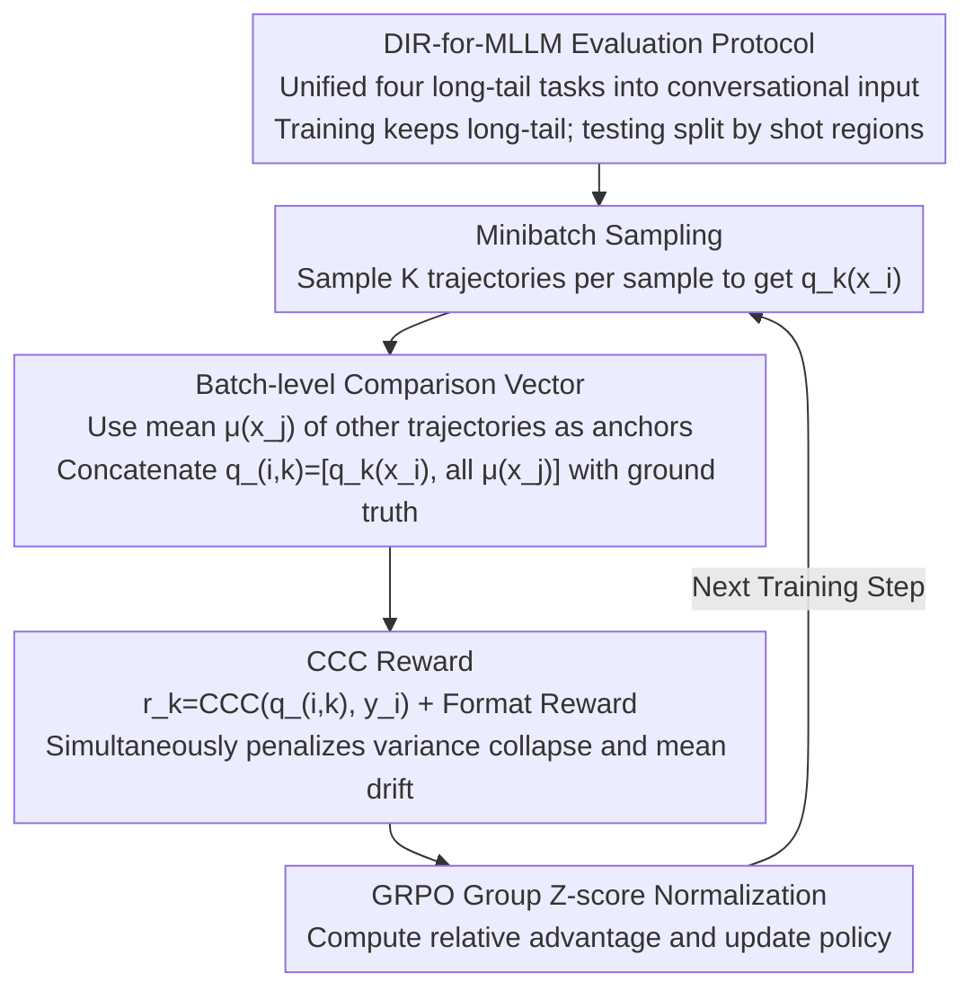

# Injecting Distributional Awareness into MLLMs via Reinforcement Learning for Deep Imbalanced Regression

**Conference**: ICML 2026  
**arXiv**: [2605.01402](https://arxiv.org/abs/2605.01402)  
**Code**: The paper states it will be released after acceptance (not yet available)  
**Area**: Multimodal VLM / Reinforcement Learning / Deep Imbalanced Regression  
**Keywords**: MLLM Regression, Long-tailed Distribution, GRPO, Concordance Correlation Coefficient, Batch-level Reward

## TL;DR
This work transforms the "regression to the mean" problem of MLLM continuous value regression under long-tailed distributions into a distribution-aware RL problem. Within the GRPO framework, the Concordance Correlation Coefficient (CCC) is utilized as a batch-level reward—evaluating correlation, variance, and mean simultaneously—to explicitly penalize predictive distribution collapse. Across four long-tailed regression tasks using Qwen2.5-VL-3B/7B, the method consistently outperforms SFT, SoftLabel, and various point-wise RL approaches, achieving a significant reduction in MAE, particularly in medium/few-shot regions.

## Background & Motivation

**Background**: MLLMs are increasingly utilized to "regress continuous values" (e.g., age, ratings, bone age). Currently, the dominant paradigms are token-level SFT (decomposing numbers into tokens for cross-entropy) or GRPO with point-to-point regression rewards (MAE, Reward Reward, etc.).

**Limitations of Prior Work**: (i) Token-level SFT treats regression as discrete classification; predicting "5 years old" as "6" vs. "50" might incur the same token loss, lacking awareness of numerical distance. (ii) Under long-tailed supervision where most samples concentrate at the "head," SFT causes model predictions to collapse toward the mean (visible in Fig 1). (iii) Existing regression-specific methods either modify the architecture (e.g., Rex-Omni adds coordinate tokens, GEODE adds regression heads), breaking the unified MLLM generation framework, rely on slow CoT reasoning, or use SoftLabel to smooth hard one-hot targets—all of which remain "per-token local signals." (iv) Current RL methods (Visual-RFT, VLM-R1, Perception-R1) still use per-sample MAE as a reward, evaluating each sample independently, which fails to address the long-tail structure.

**Key Challenge**: Long-tailed regression requires "inter-sample relative relationships" to maintain the global distribution structure. Both SFT and per-sample RL rewards focus only on single-point errors, failing to convey the constraint that not all samples should be predicted as the median.

**Goal**: (i) Solve MLLM long-tailed regression collapse via pure post-training without architectural changes or CoT. (ii) Enable supervision signals to perceive the consistency between "predictive distribution vs. ground-truth distribution." (iii) Explicitly penalize mean and variance collapse.

**Key Insight**: The advantage of RL lies in its ability to "calculate any reward on decoded values." Instead of rewarding "single-point proximity to ground truth," the objective is to reward "a batch of predicted distributions approaching a batch of ground-truth distributions"—effectively upgrading the numerical problem to a distributional one.

**Core Idea**: For each sampled prediction in a minibatch, concatenate it with the average predictions of other samples to form a vector. Calculate the CCC between this vector and the corresponding ground-truth vector. Using CCC as a reward simultaneously rewards correlation, penalizes variance collapse, and penalizes mean drift.

## Method

### Overall Architecture
The GRPO framework remains unchanged: for each input $x_i$, $K$ generation trajectories are sampled to obtain numerical predictions $\{q_k(x_i)\}_{k=1}^K$, with the mean $\mu(x_i) = \frac{1}{K}\sum_k q_k(x_i)$ serving as a stable anchor. To evaluate the $k$-th trajectory, it is concatenated with the mean predictions of other samples in the minibatch to form $\mathbf{q}_{i,k} = [q_k(x_i), \{\mu(x_j)\}_{j\neq i}]$, matched against the ground-truth vector $\mathbf{y}_i = [y_i, \{y_j\}_{j\neq i}]$. The reward is defined as $r_k(x_i) = \text{CCC}(\mathbf{q}_{i,k}, \mathbf{y}_i)$ plus a lightweight format validation reward. Standard GRPO group-relative normalization is then used to calculate advantages and update the policy. The only modification is the reward—shifting from "point-wise proximity" to "distributional consistency."

### Key Designs

**1. Batch-level Comparison Vector: Evaluating predictions within a "population" to introduce inter-sample relationships**

Traditional GRPO rewards are $r_k = \text{MAE}(q_k, y_i)$, which focus solely on individual points. This encourages the model to collapse all samples toward high-density regions as long as they stay "close" to their own ground truth. To break this, the reward must see the "global distribution shape." In this work, for each sample in minibatch $\{x_1, \ldots, x_B\}$, $K$ trajectories are sampled. When evaluating a prediction $q_k(x_i)$, it is concatenated with the "mean predictions of the other $B-1$ samples" to form a vector $\mathbf{q}_{i,k} = [q_k(x_i), \{\mu(x_j)\}_{j\neq i}]$ of length $B$. Ground truths are concatenated in the same order. Using the means $\mu(x_j)$ as anchors instead of random samples suppresses reward noise caused by inter-sample variance. Consequently, the signal "don't predict the same value for everyone" is embedded into the reward and gradients.

**2. CCC Reward: A single scalar managing correlation, variance, and mean simultaneously**

The Concordance Correlation Coefficient (CCC) is used for scoring:

$$\text{CCC}(\mathbf{q}, \mathbf{y}) = \frac{2\,\text{Cov}(\mathbf{q}, \mathbf{y})}{\text{Var}(\mathbf{q}) + \text{Var}(\mathbf{y}) + (\mu_{\mathbf{q}} - \mu_{\mathbf{y}})^2}$$

Its structure directly addresses two major issues in long-tailed collapse. The numerator is covariance, rewarding consistent ordering. In the denominator, a small $\text{Var}(\mathbf{q})$ (predictions clustering together) lowers the score, and a large $(\mu_{\mathbf{q}} - \mu_{\mathbf{y}})^2$ (systemic bias toward the head) is penalized. Thus, "variance collapse" and "mean drift"—typical failure modes in daily long-tail regression—are penalized by the two terms in the CCC denominator. Unlike Pearson correlation (which ignores scale/mean) or pure ranking (which ignores absolute values), CCC constrains the distribution.

**3. DIR-for-MLLM Evaluation Protocol: Establishing a fair benchmark for long-tailed regression**

Classic Deep Imbalanced Regression (DIR) methods target CNNs + regression heads, lacking a generative token-decoder setup. This work unifies four long-tailed tasks—AgeDB-DIR, IMDB-WIKI-DIR, the newly constructed IMDB-Movie-DIR (movie poster ratings), and BoneAge-DIR—into a dialogue format for MLLMs. The training set retains the natural long-tailed distribution, while the test set is split by "shot" regions (many > 100, medium 20–100, few < 20) for balanced evaluation. MAE and Geometric Mean (GM) are used as metrics across 129k+ samples.

### Loss & Training
The GRPO optimizer is used without modification; only the reward is changed to reward = CCC + lightweight format reward. Group-wise z-score normalization provides the relative advantage. Backbones include Qwen2.5-VL-3B and 7B. Shot-aware evaluation on the test set ensures fair head/tail comparison.

## Key Experimental Results

### Main Results

| Dataset | Method (Qwen2.5-VL-3B) | All MAE | Many MAE | Medium MAE | Few MAE |
|--------|----------------------|---------|----------|------------|---------|
| AgeDB-DIR | SFT | 6.37 | 5.78 | 7.67 | 8.36 |
| AgeDB-DIR | Regression Reward (Tan 2025) | 5.85 | 5.48 | 6.52 | 7.58 |
| AgeDB-DIR | DISCO MAE Reward | 5.95 | 5.64 | 6.73 | 6.75 |
| AgeDB-DIR | **CCC-GRPO (Ours)** | **5.52** | 5.42 | **5.62** | **6.40** |
| IMDB-Movie-DIR | SFT | 7.44 | 4.87 | 11.21 | 21.51 |
| IMDB-Movie-DIR | Regression Reward | 7.42 | 5.06 | 10.51 | 21.14 |
| IMDB-Movie-DIR | **CCC-GRPO** | **6.89** | 5.60 | **8.12** | **16.35** |

Best performance also observed on 7B: AgeDB All MAE 5.33 vs. SFT 5.82; Movie All MAE 5.95 vs. SFT 6.42.

### Ablation Study

| Setting | Key Phenomenon | Description |
|------|---------|------|
| SFT (point-wise CE) | Prediction collapses toward head | Baseline for long-tail collapse |
| GRPO + MAE reward | Still per-sample, lacks cross-sample structure | Limited improvement in medium/few regions |
| GRPO + DISCO MAE | Frequency-weighted reward | Slight improvement in medium/few but still point-wise |
| **GRPO + CCC reward (Ours)** | Explicitly penalizes collapse + drift | Significant MAE drop in medium/few shot |
| BoneAge-DIR (Multimodal) | CCC-GRPO still optimal | Overall MAE Gain of 23.55% vs SFT |

### Key Findings
- **Highest gains in medium/few-shot**: On the Movie dataset, few-shot MAE decreased from 21.51 (SFT) to 16.35 (−24%). AgeDB few-shot decreased from 8.36 to 6.40 (−23%), confirming CCC primarily fixes "long-tail compression."
- **No sacrifice of the head**: Many-shot MAE remains comparable to SFT/Reg Reward (e.g., 4.87 → 5.60 on Movie), representing a meaningful trade-off for medium/few-shot gains.
- **Notable GM improvement**: Indicates a more uniform error distribution rather than one dominated by extreme tail errors.
- **Multimodal distribution scenarios (BoneAge)**: CCC-GRPO remains robust even when labels are multimodal (not just single-peak long-tail), showing generalizability.
- **VisualQuality Counter-example**: CoT-based methods like VisualQuality perform poorly on regression (MAE 24.43), highlighting that selecting the right reward is more effective than adding "reasoning."

## Highlights & Insights
- **"Reward shape determines prediction shape"**: The biggest insight is that GRPO rewards can shape the global distribution of predictions. Moving from "point-wise similarity" to "distributional similarity" enables the model to preserve variance and scale without architectural hacks.
- **CCC is an underrated metric**: Common in medical/psychometric fields but rarely used as an RL reward. Its three-in-one property (correlation + variance + mean) directly suppresses the failure modes of long-tail regression.
- **Intra-group "mean anchor" strategy**: Using $\mu(x_j)$ as a representative for other samples is a simple but effective technique to reduce reward variance.
- **Establishment of DIR-for-MLLM benchmark**: Porting mature DIR protocols from the classification era to generative MLLMs provides a foundation for future work.

## Limitations & Future Work
- CCC rewards require sufficient diversity within a minibatch; effectiveness might degrade with small batches ($<8$) or extremely small intra-class variance. No batch size sensitivity analysis was performed.
- Tested only on 4 2D visual regression tasks; extension to multivariate regression (e.g., 4D bbox, 3D pose) using multivariate CCC remains unexplored.
- CCC is a non-differentiable signal estimated via policy gradients; variance might remain high when $K$ is small.
- Lacks comparisons with the latest GRPO variants like DAPO or RLOO to verify if reward improvements are complementary to optimizer improvements.

## Related Work & Insights
- **vs. Classic DIR (Yang 2021, RankSim, VIR)**: Classic methods use regression heads and label/feature smoothing, which are incompatible with token-decoder MLLMs. This paper ports the "distribution smoothing" philosophy to the reward layer.
- **vs. SoftLabel (Wang 2025b)**: SoftLabel operates on the token loss level, remaining a local signal. CCC operates at the sequence-level reward across samples.
- **vs. DISCO MAE Reward (Zhou 2025)**: DISCO scales rewards by domain/difficulty but remains per-sample. CCC treats "inter-sample relationships" as a first-order term in the reward.
- **vs. Reasoning-based VisualQuality (Wu 2025)**: Reasoning is largely ineffective for perceptual regression; choosing the correct reward is more critical.

## Rating
- Novelty: ⭐⭐⭐⭐ Introducing CCC into RL rewards to address "distribution collapse" in long-tailed regression is a fresh combination.
- Experimental Thoroughness: ⭐⭐⭐⭐ 4 datasets × 2 backbones × multiple baselines with shot-aware protocols. Missing some sensitivity analysis (batch size, K).
- Writing Quality: ⭐⭐⭐⭐ Fig 2 clearly illustrates the differences between SFT/GRPO/CCC-GRPO.
- Value: ⭐⭐⭐⭐ Provides a plug-and-play solution for fine-grained numerical prediction in MLLMs, highly practical for industrial deployment.

<!-- RELATED:START -->

## Related Papers

- [\[ICML 2026\] ACTIVE-o3: Empowering MLLMs with Active Perception via Pure Reinforcement Learning](active-o3_empowering_mllms_with_active_perception_via_pure_reinforcement_learnin.md)
- [\[CVPR 2026\] Imbalanced View Contribution Evaluation and Refinement for Deep Incomplete Multi-View Clustering](../../CVPR2026/multimodal_vlm/imbalanced_view_contribution_evaluation_and_refinement_for_deep_incomplete_multi.md)
- [\[ICLR 2026\] MMDuet2: Enhancing Proactive Interaction of Video MLLMs with Multi-Turn Reinforcement Learning](../../ICLR2026/multimodal_vlm/mmduet2_enhancing_proactive_interaction_of_video_mllms_with_multi-turn_reinforce.md)
- [\[CVPR 2026\] TempR1: Improving Temporal Understanding of MLLMs via Temporal-Aware Multi-Task Reinforcement Learning](../../CVPR2026/multimodal_vlm/tempr1_improving_temporal_understanding_of_mllms_via_temporal-aware_multi-task_r.md)
- [\[ICML 2026\] Deep Pre-Alignment for VLMs](deep_pre-alignment_for_vlms.md)

<!-- RELATED:END -->
