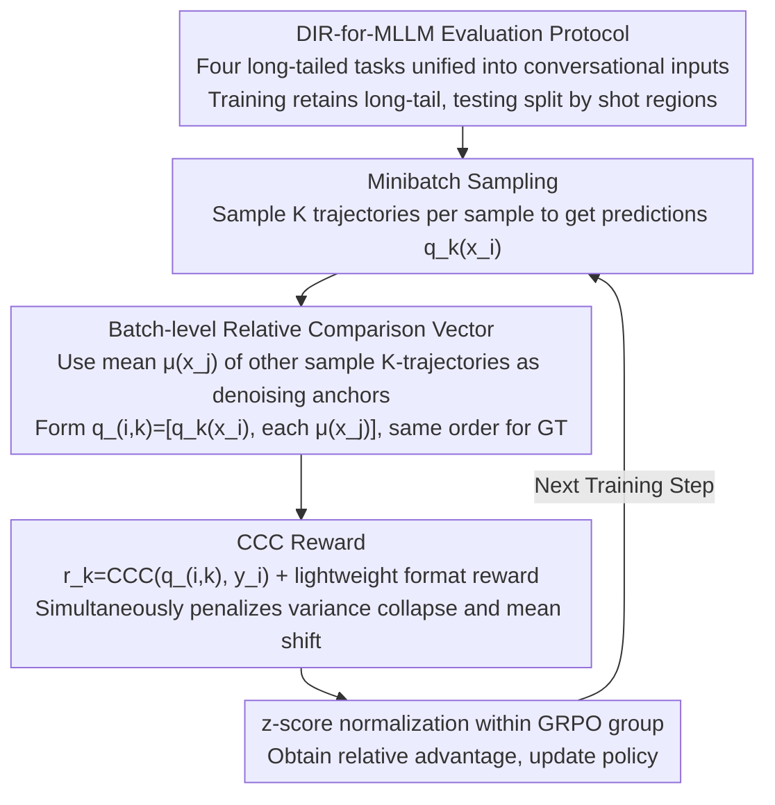

# Injecting Distributional Awareness into MLLMs via Reinforcement Learning for Deep Imbalanced Regression

**Conference**: ICML 2026  
**arXiv**: [2605.01402](https://arxiv.org/abs/2605.01402)  
**Code**: The paper claims it will be released after acceptance (currently unavailable)  
**Area**: Multimodal VLM / Reinforcement Learning / Deep Imbalanced Regression  
**Keywords**: MLLM Regression, Long-tail distribution, GRPO, Concordance Correlation Coefficient, Batch-level reward

## TL;DR
This paper transforms the "regression-to-the-mean" problem in continuous value regression under long-tailed distributions for MLLMs into a distribution-aware RL problem. Within the GRPO framework, it uses the Concordance Correlation Coefficient (CCC) as a batch-level reward—simultaneously monitoring correlation, variance, and mean—to explicitly penalize prediction distribution collapse. Across four long-tailed regression tasks using Qwen2.5-VL-3B/7B, the method consistently outperforms SFT, SoftLabel, and various point-wise RL approaches, showing significant MAE reductions particularly in medium and few-shot regions.

## Background & Motivation

**Background**: MLLMs are increasingly used for "continuous value regression" (age, rating, bone age, etc.). However, current mainstream approaches involve token-level SFT (decomposing numbers into tokens for cross-entropy) or GRPO with point-to-point regression rewards (MAE, Reward Reward, etc.).

**Limitations of Prior Work**: (i) Token-level SFT treats regression as discrete classification; predicting "6 years old" instead of "5" may incur the same token loss as predicting "50", lacking awareness of numerical distance. (ii) Under long-tailed supervision, most samples concentrate at the head, causing SFT models to collapse towards the mean (clearly visible in Fig 1). (iii) Existing regression-specific methods either change the architecture (Rex-Omni adds coordinate tokens, GEODE adds regression heads), breaking the unified generation framework, rely on slow CoT reasoning, or use SoftLabel to smooth hard one-hot targets—yet these remain "per-token local signals". (iv) RL methods (Visual-RFT, VLM-R1, Perception-R1) still use per-sample MAE rewards, evaluating each sample independently and failing to address the long-tailed structure.

**Key Challenge**: Long-tailed regression requires "cross-sample relative relationships" to maintain global distribution structure, whereas both SFT and per-sample RL rewards only consider single-point errors, failing to convey the constraint that the model cannot predict all samples as the median.

**Goal**: (i) Resolve MLLM long-tail regression collapse via pure post-training without architecture changes or CoT. (ii) Ensure supervision signals are aware of the consistency between "predicted distribution vs. ground truth distribution". (iii) Explicitly penalize mean collapse and variance collapse.

**Key Insight**: The authors observe that the advantage of RL lies in the ability to calculate arbitrary rewards on decoded numerical values. Instead of rewarding "closeness to ground truth at a single point," it is better to reward "closeness of a batch of predicted distributions to a batch of ground truth distributions"—upgrading the numerical problem to a distributional one.

**Core Idea**: Concatenate each sampled prediction with the average predictions of other samples within a minibatch to form a vector, then calculate the CCC with the corresponding ground truth vector. Using CCC as a reward simultaneously encourages correlation, penalizes variance collapse, and penalizes mean shift.

## Method

### Overall Architecture
The GRPO framework remains unchanged: for each input $x_i$, $K$ generation trajectories are sampled to obtain numerical predictions $\{q_k(x_i)\}_{k=1}^K$, and the mean $\mu(x_i) = \frac{1}{K}\sum_k q_k(x_i)$ is used as a stable anchor. When evaluating the $k$-th trajectory, it is concatenated with the mean predictions of other samples in the minibatch to form $\mathbf{q}_{i,k} = [q_k(x_i), \{\mu(x_j)\}_{j\neq i}]$, with the corresponding ground truth vector being $\mathbf{y}_i = [y_i, \{y_j\}_{j\neq i}]$. The reward is defined as $r_k(x_i) = \text{CCC}(\mathbf{q}_{i,k}, \mathbf{y}_i)$ plus a lightweight format validation reward to ensure parsable decoding. Finally, relative advantages are normalized within the group following standard GRPO to update the policy. The only modification to the pipeline is the reward—switching from "point-wise proximity" to "distributional proximity"—while retaining existing optimizers, sampling, and architecture.

### Key Designs

**1. Batch-level Relative Comparison Vector: Evaluating predictions within a "group" to introduce cross-sample relationships**

Traditional GRPO rewards are $r_k=\text{MAE}(q_k, y_i)$, focusing solely on single points. As long as individual samples are "close to their own ground truth," the reward is given, which actually encourages the model to collapse all samples toward high-density regions. To break this, the reward must perceive the "group distribution shape." Specifically: for each sample in a minibatch $\{x_1,\ldots,x_B\}$, $K$ trajectories are sampled. When evaluating a prediction $q_k(x_i)$, instead of looking at its distance to $y_i$ in isolation, it is concatenated with the "mean predictions of the other $B-1$ samples" into a vector $\mathbf{q}_{i,k}=[q_k(x_i),\{\mu(x_j)\}_{j\neq i}]$ of length $B$. The ground truth side $\mathbf{y}_i=[y_i,\{y_j\}_{j\neq i}]$ follows the same index order. Using the means $\mu(x_j)$ of other samples as anchors, rather than random samples, suppresses reward noise from cross-sample stochasticity. Consequently, the signal "you cannot predict everyone as the same value" is embedded into the reward vector and transmitted via gradients.

**2. CCC Reward: One scalar managing correlation, variance, and mean simultaneously**

To score the comparison vectors, the authors chose the Concordance Correlation Coefficient (CCC):

$$\text{CCC}(\mathbf{q}, \mathbf{y}) = \frac{2\,\text{Cov}(\mathbf{q}, \mathbf{y})}{\text{Var}(\mathbf{q}) + \text{Var}(\mathbf{y}) + (\mu_{\mathbf{q}} - \mu_{\mathbf{y}})^2}$$

Its geometric structure directly targets the two major pathologies of long-tail collapse. The numerator is covariance, rewarding consistent ranking. In the denominator, if $\text{Var}(\mathbf{q})$ is too small (predictions clustered at one value), it suppresses the overall score; if $(\mu_{\mathbf{q}}-\mu_{\mathbf{y}})^2$ is too large (systematic bias toward the head center), it is also penalized. In other words, "variance collapse" and "mean shift"—the most typical failure modes in long-tailed regression—are each addressed by terms in the CCC denominator. In contrast, pure Pearson only rewards correlation regardless of scale/mean, and pure ranking only considers order, neither effectively managing collapse. In sparse few-shot regions, CCC is also less likely than Pearson to produce "pseudo-good" results that look correlated but are actually compressed.

**3. DIR-for-MLLM Evaluation Protocol: Establishing a fair benchmark for long-tailed regression**

Classic Deep Imbalanced Regression (DIR) methods are rooted in CNN + regression head setups without generative token-decoder settings, and they often use disparate splits. This paper first levels the playing ground: four long-tail tasks—AgeDB-DIR, IMDB-WIKI-DIR, the newly constructed IMDB-Movie-DIR (movie poster ratings), and BoneAge-DIR—are converted into dialogue-formatted MLLM inputs. The training set retains the natural long-tailed distribution, while the test set is split by shot regions (many >100, medium 20–100, few <20) to balance evaluation. This results in 129k+ samples, using MAE and GM (Geometric Mean, more sensitive to uniformity across regions) as metrics. This unified protocol ensures that the comparisons between CCC-GRPO and various baselines are scientifically grounded.

### Loss & Training
The standard GRPO optimizer is used without modifying the algorithm itself, only the reward. The reward comprises CCC plus a lightweight format reward. Relative advantages are derived via z-score normalization within the group. The backbones are Qwen2.5-VL-3B and 7B. Shot-aware evaluation on the test set ensures fair head/tail comparison.

## Key Experimental Results

### Main Results

| Dataset | Method (Qwen2.5-VL-3B) | All MAE | Many MAE | Medium MAE | Few MAE |
|----------|-----------------------|---------|----------|------------|---------|
| AgeDB-DIR | SFT | 6.37 | 5.78 | 7.67 | 8.36 |
| AgeDB-DIR | Regression Reward (Tan 2025) | 5.85 | 5.48 | 6.52 | 7.58 |
| AgeDB-DIR | DISCO MAE Reward | 5.95 | 5.64 | 6.73 | 6.75 |
| AgeDB-DIR | **CCC-GRPO (Ours)** | **5.52** | 5.42 | **5.62** | **6.40** |
| IMDB-Movie-DIR | SFT | 7.44 | 4.87 | 11.21 | 21.51 |
| IMDB-Movie-DIR | Regression Reward | 7.42 | 5.06 | 10.51 | 21.14 |
| IMDB-Movie-DIR | **CCC-GRPO** | **6.89** | 5.60 | **8.12** | **16.35** |

Performance is also superior on the 7B model: AgeDB All MAE 5.33 vs. SFT 5.82; Movie All MAE 5.95 vs. SFT 6.42.

### Ablation Study

| Setting | Key Phenomenon | Explanation |
|---------|----------------|-------------|
| SFT (point-wise CE) | Prediction collapses toward head (Fig 1) | Baseline for long-tail collapse |
| GRPO + MAE reward | Still per-sample; no cross-sample structure | Limited improvement in medium/few regions |
| GRPO + DISCO MAE (Zhou 2025) | Frequency-weighted reward | Medium/few slightly better but still point-to-point |
| **GRPO + CCC reward (Ours)** | Explicitly penalizes collapse + shift | Significant decrease in medium/few MAE |
| BoneAge-DIR (Multimodal distribution) | CCC-GRPO remains superior | Overall MAE gain of 23.55% vs. SFT (Table 12) |

### Key Findings
- **Highest gains in medium/few-shot**: On Movie, few-shot MAE dropped from 21.51 (SFT) to 16.35 (−24%); on AgeDB few-shot, it dropped from 8.36 to 6.40 (−23%), confirming that CCC primarily fixes "long-tail compression".
- **No sacrifice of the head**: Many-shot MAE is largely comparable to SFT/Reg Reward (e.g., 4.87→5.60 on Movie), but the substantial gains in medium/few regions represent a meaningful trade-off.
- **Significant GM improvement**: AgeDB many GM improved from 5.78→5.42, etc., indicating a more uniform error distribution rather than one dominated by extreme outliers.
- **Multimodal scenario (BoneAge-DIR)**: Training labels exhibit multimodal distribution (not simple long-tail), yet CCC-GRPO still provides an overall 23.55% improvement, showing the reward doesn't strictly depend on "unimodal long-tail" assumptions but generalizes to rewarding "distribution shape consistency".
- **VisualQuality counter-example**: The CoT-based method VisualQuality yielded an MAE as high as 24.43 on Movie, showing that reasoning-based approaches are unsuitable for perceptual regression, which highlights that selecting the right reward for post-training is more effective.

## Highlights & Insights
- **"Reward shape determines prediction shape"**: The biggest insight is that the GRPO reward can shape the overall distribution of predictions. By switching from "point-wise similarity" to "distributional similarity," the model naturally learns to preserve variance and scale without needing architectural or loss-level hacks.
- **CCC is an underrated metric**: Common in medical/psychometric fields but rarely used as an RL reward. Its 3-in-1 geometric property (correlation + variance + mean) directly addresses the two main failure modes of long-tail collapse. This strategy could be worth testing in RM/preference learning.
- **"Mean anchor of others" within group**: Using $\mu(x_j)$ as a representative for other samples to denoise is similar to Polyak averaging—a simple but effective trick to reduce reward variance.
- **Establishing the DIR-for-MLLM benchmark**: Migrating mature DIR protocols from the classification era to generative MLLMs will likely foster significant future work.

## Limitations & Future Work
- The CCC reward requires sufficient diversity within a minibatch to be meaningful. Effectiveness might degrade with small batches ($<8$) or in scenarios with extremely small intra-class variance; batch size sensitivity was not explored.
- Only tested on four 2D visual regression tasks; whether multivariate regression (e.g., 4D bbox, 3D pose) requires multi-variable CCC remains unaddressed.
- CCC is a non-differentiable signal in the formal objective, relying on GRPO's policy gradient estimation; variance remains high when $K$ is small, and the optimal value of $K$ was not analyzed.
- Lack of comparison with recent GRPO variants like DAPO or RLOO, making it difficult to determine if reward improvements and optimizer improvements are complementary.
- The paper has not yet released the code ("after acceptance"), so replication must wait.

## Related Work & Insights
- **vs. Classic DIR (Yang 2021, RankSim, VIR)**: Classic methods use regression heads + label/feature smoothing, which are inapplicable to token-decoder MLLMs. This paper essentially migrates "distribution smoothing" to the reward layer.
- **vs. SoftLabel (Wang 2025b)**: SoftLabel smoothes supervision at the token loss layer, remaining a local signal. CCC operates at the sequence-level reward effectively across samples, providing a higher-level signal.
- **vs. DISCO MAE Reward (Zhou 2025)**: Scaling rewards by domain/difficulty remains per-sample. CCC treats "inter-sample relationships" as a first-order term of the reward.
- **vs. Reasoning-based VisualQuality (Wu 2025)**: CoT reasoning is largely ineffective for perceptual regression. This paper shows that choosing the right reward is more important than adding reasoning.
- **vs. Rex-Omni / GEODE**: These require modifying vocabularies or adding heads for retraining. This approach is lighter, requiring only post-training without changing the architecture.

## Rating
- Novelty: ⭐⭐⭐⭐ Combining CCC with RL rewards to explicitly target "distribution collapse" in long-tailed regression is a refreshing combination.
- Experimental Thoroughness: ⭐⭐⭐⭐ 4 datasets × 2 backbones × multiple baselines + shot-aware protocols + rank error curves represents good density, though key ablations on batch size and K are missing.
- Writing Quality: ⭐⭐⭐⭐ Fig 2 clearly illustrates the differences between SFT / GRPO / CCC-GRPO; Fig 5 uses MAE gain to directly show benefits in long-tail regions.
- Value: ⭐⭐⭐⭐ Provides a plug-and-play solution for "fine-grained numerical prediction in MLLMs" without architectural changes, making it practical for industrial applications (age, bone age, rating prediction).

<!-- RELATED:START -->

## Related Papers

- [\[ICML 2026\] iVGR: Internalizing Visually Grounded Reasoning for MLLMs with Reinforcement Learning](ivgr_internalizing_visually_grounded_reasoning_for_mllms_with_reinforcement_lear.md)
- [\[ICML 2026\] Deep Pre-Alignment for VLMs](deep_pre-alignment_for_vlms.md)
- [\[CVPR 2026\] TempR1: Improving Temporal Understanding of MLLMs via Temporal-Aware Multi-Task Reinforcement Learning](../../CVPR2026/multimodal_vlm/tempr1_improving_temporal_understanding_of_mllms_via_temporal-aware_multi-task_r.md)
- [\[CVPR 2026\] Visual Reasoning through Tool-supervised Reinforcement Learning](../../CVPR2026/multimodal_vlm/visual_reasoning_through_tool-supervised_reinforcement_learning.md)
- [\[ICML 2026\] Multimodal Continual Learning with MLLMs from Multi-scenario Perspectives](multimodal_continual_learning_with_mllms_from_multi-scenario_perspectives.md)

<!-- RELATED:END -->
