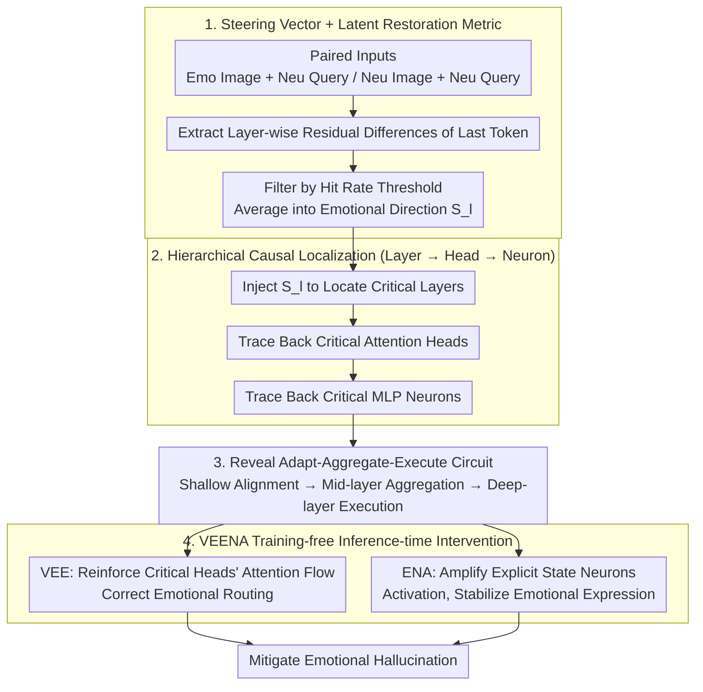

# VEENA: Interpreting and Enhancing Emotional Circuits in Large Vision-Language Models via Cross-Modal Information Flow

**Conference**: ICML 2026  
**arXiv**: [2605.21980](https://arxiv.org/abs/2605.21980)  
**Code**: TBD  
**Area**: Multimodal VLM / Mechanistic Interpretability / Emotional Understanding  
**Keywords**: Emotional Circuits, steering vector, causal intervention, attention head localization, training-free inference-time intervention  

## TL;DR
VEENA utilizes a steering-vector causal attribution framework to locate emotional circuits in LVLMs—discovering a three-stage mechanism: "Adapt (shallow modal alignment) $\rightarrow$ Aggregate (mid-layer emotion-specific heads aggregation) $\rightarrow$ Execute (deep-layer emotion-general heads + neurons generation)." It further implements "Visual Emotion Enhancement + Emotional Neuron Augmentation" as training-free inference-time interventions to significantly mitigate emotional hallucinations.

## Background & Motivation

**Background**: LVLMs are evolving from static perception models toward "empathetic agents," yet they suffer from severe emotional hallucination (e.g., describing a crying face as happy). Unlike object hallucination, emotional misalignment violates social norms and ethical boundaries. Existing methods follow black-box data-driven routes such as visual instruction tuning and RLHF, which do not guarantee internal alignment.

**Limitations of Prior Work**: Emotional circuits in LVLMs remain entirely unexplored. While mechanistic interpretability in LLMs can locate emotional processing components (Tak 2025, Lee 2025), those methodologies cannot be directly transferred: (1) **Lack of counterfactuals**: LLMs use lexical substitution (happy $\leftrightarrow$ sad), but how can LVLMs "change emotion without changing the narrative"? (2) **Failure of discrete metrics**: Emotions are diffusive (the overall tone of long text), making Next-Token-Prediction logits inadequate.

**Key Challenge**: Causal analysis of LVLM emotions requires (a) controllable visual counterfactuals and (b) continuous latent space metrics, rather than LLM-style word substitution and logit difference.

**Goal**: (1) Establish a methodology for causal analysis of LVLM emotional circuits; (2) Locate critical layers, heads, and neurons; (3) Design training-free inference-time interventions to mitigate emotional hallucinations based on findings.

**Key Insight**: (1) Use steering vectors as substitutes for logit difference—extracting the emotional direction $S_l$ from hidden states via paired emotional vs. neutral inputs, transforming "emotion" into an intervenable continuous vector; (2) Use hit rate (the proportion of tokens hitting the standardized emotion wheel) as a latent restoration metric instead of NTP accuracy; (3) Coarse-to-fine hierarchical localization—locating critical layers first, then tracing back to heads and neurons.

**Core Idea**: Steering vector probes + latent restoration metric + hierarchical causal attribution $\rightarrow$ revealing the "Adapt-Aggregate-Execute" mechanism $\rightarrow$ designing VEENA (VEE reinforces attention flow + ENA amplifies semantic activation) for inference-time intervention.

## Method

### Overall Architecture

VEENA consists of two stages: first parsing the emotional circuit, then performing inference-time intervention. Stage I extracts emotional direction vectors $S_l$ for each layer from paired emotional/neutral inputs (filtered by hit rate thresholds). Stage II uses $S_l$ as a probe for coarse-to-fine localization—identifying critical layers (measuring hit rate changes upon $S_l$ injection), tracing back to critical attention heads (via backward activation patching), and finally identifying critical MLP neurons, thus mapping the "Adapt $\rightarrow$ Aggregate $\rightarrow$ Execute" three-stage circuit. Based on this map, VEENA applies two training-free inference-time operations: VEE to reinforce emotional attention flow in critical heads, and ENA to amplify semantic activations in Explicit State Neurons.

### Key Designs

**1. Steering Vector + Latent Restoration Metric: Enabling Causal Analysis in Continuous Latent Space**  
Mechanistic analysis in LLMs relies on lexical substitution and logit difference, which are unsuitable for LVLMs. Emotional signals in LVLMs are diffusive—dispersed throughout the narrative tone—meaning single-token logits cannot capture them. Furthermore, visual counterfactuals are difficult to construct without altering the narrative. VEENA uses steering vectors as probes: constructing paired inputs $X^+ = \text{Concat}(I_{emo}, T_{neu})$ and $X^- = \text{Concat}(I_{neu}, T_{neu})$, calculating the residual difference $s_{i,l} = h^+_{i,l,N} - h^-_{i,l,N}$ at the last token, filtering valid samples where hit rate $\mathcal{H}(X_i^+, y_i) > \tau$, and averaging them into $S_l = \tfrac{1}{|\mathcal{U}|}\sum_{i \in \mathcal{U}} s_{i,l}$. This transforms "emotion" into a continuous vector where injecting $+\alpha S_l$ allows for causal effect measurement.

**2. Hierarchical Causal Localization (Layer $\rightarrow$ Head $\rightarrow$ Neuron)**  
To avoid low signal-to-noise ratios when searching through thousands of components, VEENA employs a coarse-to-fine search: (1) Locate critical layers by injecting $S_l$ into neutral samples $\tilde h^-_{j,l,t} = h^-_{j,l,t} + \alpha S_l$ and measuring hit rate changes $\mathcal{C}$. (2) Locate critical heads using emotional intention $\mathcal{I}(A_c) = \text{sim}(A_c, S_l)$ combined with backward activation patching. (3) Trace back to MLP neurons whose activations align with $S_l$.

**3. Adapt-Aggregate-Execute Mechanism + Functional Decoupling**  
The circuit follows a three-stage path: Shallow layers (**Adapt**) perform modal alignment; Middle layers (**Aggregate**) use Contextual Trigger Neurons to encode situational cues, while emotion-specific heads aggregate signals into the Query token; Deep layers (**Execute**) use Explicit State Neurons to drive emotion-general heads for narrative generation. A key discovery is functional decoupling: mid-layers are emotion-specific (identifying "what emotion"), while deep layers are emotion-general (controlling "how to express").

**4. VEENA Inference-time Intervention: VEE Routing + ENA Expression**  
Since identification and execution are decoupled, VEENA performs dual-path interventions. **VEE (Visual Emotion Enhancement)** amplifies attention in critical heads: during prefill, it enhances $V\to Q$ attention in mid-layers to aggregate cues; during decoding, it enhances $V\to L$ attention in deep layers to anchor tokens to visual details—both by multiplying attention scores by $\beta>1$. **ENA (Emotional Neuron Augmentation)** amplifies activations of top-$K$ Explicit State Neurons by $\gamma>1$ to strengthen stored emotional semantic knowledge. Both are plug-and-play without parameter updates.

### Loss & Training
VEENA is a pure inference-time intervention. It requires no parameter updates or training data. It only modifies attention scores by $\beta$ and neuron activations by $\gamma$ during the forward pass.

## Key Experimental Results

### Main Results on MER-UniBench (Hit Rate $\mathcal{H}$)

| Method | LLaVA-1.5-7B | LLaVA-1.6-13B | Qwen2-VL-7B |
|------|------|------|------|
| Baseline | 38.2 | 42.7 | 45.6 |
| + Data Augmentation | 41.5 | 44.8 | 47.2 |
| + RLHF | 43.7 | 46.1 | 48.5 |
| **+ VEENA (Ours, Training-free)** | **48.9** | **51.6** | **53.4** |

VEENA outperforms RLHF by 4-5 points without training, proving mechanistic intervention is more precise than black-box optimization.

### Quantitative Evidence for Three-Stage Mechanism

| Layer Range | Hit Rate Change $\mathcal{C}$ after $S_l$ Injection | Interpretation |
|------|--------------------|------|
| 1-8 (Shallow) | +3% | Modal adaptation, low impact |
| 9-20 (Middle) | **+24%** | Primary field for emotion aggregation |
| 21-32 (Deep) | **+19%** | Emotional execution, narrative generation |

### Emotion-Specific vs. Emotion-General Heads

| Head Category | Avg. Specificity (Selective Activation) | Intervention Effect |
|--------|----------|--------|
| Middle layer emotion-specific | 0.78 | Regulates specific emotions (e.g., fear vs joy) |
| Deep layer emotion-general | 0.21 | Regulates narrative intensity regardless of emotion |

## Key Findings
- **Decoupling of Mid-layer Aggregation and Deep-layer Execution**: Routing ("who's the emotion") and execution ("how to express") use different mechanisms across layers.
- **Training-free SOTA**: VEENA exceeds RLHF-based methods without updating parameters.
- **Causal Fidelity**: Intervention experiments confirm the identified circuit is the true emotional processing path.
- **Cross-architecture Generalization**: Consistent results across LLaVA and Qwen2-VL indicate mechanism universality.

## Highlights & Insights
- **First Systematic Reveal of LVLM Emotional Circuits**: Fills the gap in LVLM mechanistic interpretability beyond object hallucination.
- **Methodological Template for Descriptive Reasoning**: Steering vectors + hit rate can be generalized to analyze any diffusive LVLM behavior (style, stance, abstract reasoning).
- **Correspondence with Cognitive Science**: Parallels Marr’s levels and working memory (encoding-storage-retrieval) stages.
- **Engineering Value**: "Post-hoc surgical patches" like VEENA are highly valuable for production LVLMs where weight modification is costly.

## Limitations & Future Work
- Counterfactual construction relies on paired images, which is costly and may not cover the full emotional spectrum.
- Intervention coefficients $\alpha$ are manually tuned; adaptive scaling would be superior.
- Generalization to fine-grained or mixed emotions (e.g., nuance) remains to be fully tested.
- The "emotion-specific" head count grows with categories; scalability to dozens of fine-grained emotions is uncertain.

## Related Work & Insights
- **vs. LLM Emotional Mechanisms (Tak 2025, Lee 2025)**: Previous works used lexical substitution for short outputs; Ours extends this to diffusive LVLM narratives.
- **vs. LVLM Interpretability (Jiang 2025, Neo 2025)**: Previous works focused on object hallucination; Ours targets emotional hallucination.
- **Insight**: The "identification $\rightarrow$ expression" functional decoupling can be generalized to other LVLM capabilities like reasoning or persona.

## Rating
- Novelty: ⭐⭐⭐⭐⭐ 
- Experimental Thoroughness: ⭐⭐⭐⭐⭐ 
- Writing Quality: ⭐⭐⭐⭐⭐ 
- Value: ⭐⭐⭐⭐

<!-- RELATED:START -->

## Related Papers

- [\[CVPR 2025\] Cross-modal Information Flow in Multimodal Large Language Models](../../CVPR2025/multimodal_vlm/cross-modal_information_flow_in_multimodal_large_language_models.md)
- [\[ICML 2026\] Focusing Where Vision Matters: Selective Training for Large Vision Language Models via Visual Information Gain](focusing_where_vision_matters_selective_training_for_large_vision_language_model.md)
- [\[ICML 2026\] Vision-aligned Latent Reasoning for Multi-modal Large Language Model](vision-aligned_latent_reasoning_for_multi-modal_large_language_model.md)
- [\[ICML 2026\] CG-MLLM: Captioning and Generating 3D Content via Multi-modal Large Language Models](cg-mllm_captioning_and_generating_3d_content_via_multi-modal_large_language_mode.md)
- [\[CVPR 2026\] Aligning What Vision-Language Models See and Perceive with Adaptive Information Flow](../../CVPR2026/multimodal_vlm/aif_adaptive_information_flow_vlm.md)

<!-- RELATED:END -->
