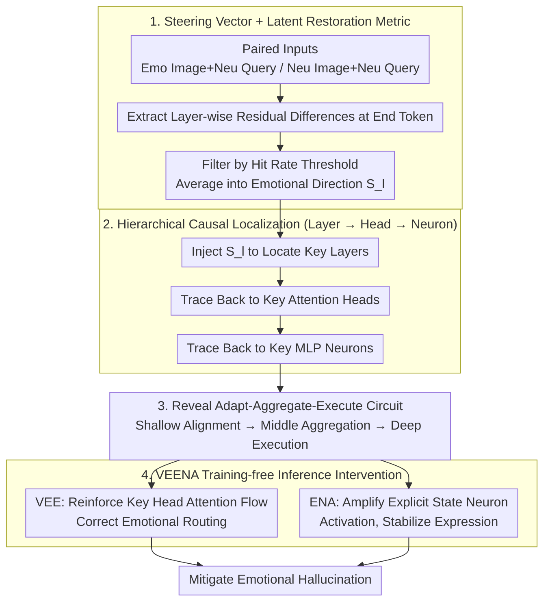

# VEENA: Interpreting and Enhancing Emotional Circuits in Large Vision-Language Models via Cross-Modal Information Flow

**Conference**: ICML 2026  
**arXiv**: [2605.21980](https://arxiv.org/abs/2605.21980)  
**Code**: TBD  
**Area**: Multimodal VLM / Mechanistic Interpretability / Emotional Understanding  
**Keywords**: Emotional Circuits, Steering Vector, Causal Intervention, Attention Head Localization, Training-free Inference Intervention

## TL;DR
VEENA utilizes a steering-vector causal attribution framework to locate emotional circuits in LVLMs. It uncovers a three-stage mechanism: "Adapt (shallow modal alignment) → Aggregate (middle-layer emotion-specific heads) → Execute (deep-layer emotion-general heads + neurons)." Based on this, it introduces training-free inference-time interventions—"Visual Emotion Enhancement" and "Emotional Neuron Augmentation"—to significantly mitigate emotional hallucinations.

## Background & Motivation

**Background**: LVLMs are evolving from static perception models to "empathetic agents," yet they suffer from severe emotional hallucinations (e.g., describing a crying face as happy). Unlike object hallucinations, emotional misalignment violates social norms and ethical boundaries. Existing methods rely on black-box data-driven approaches like visual instruction tuning and RLHF, which do not guarantee internal alignment.

**Limitations of Prior Work**: The emotional circuits of LVLMs remain entirely unexplored. While mechanistic interpretability in LLMs can locate emotional processing components (Tak 2025, Lee 2025), LLM methodologies cannot be directly applied: (1) **Lack of Counterfactuals**: LLMs use word substitution (happy ↔ sad), but how can LVLMs "change emotion without changing the narrative"? (2) **Failure of Discrete Metrics**: Emotion is diffusive (affecting the overall tone of long text), which Next-Token-Prediction (NTP) logits fail to capture.

**Key Challenge**: Causal analysis of LVLM emotion requires (a) controllable visual counterfactuals and (b) continuous latent space metrics, rather than LLM-style word substitution and logit differences.

**Goal**: (1) Establish a methodology for causal analysis of LVLM emotional circuits; (2) Locate key layers, heads, and neurons; (3) Develop training-free inference-time interventions to mitigate emotional hallucinations based on internal findings.

**Key Insight**: (1) Replace logit difference with steering vectors—extracting emotional directions $S_l$ from hidden states via paired emotional vs. neutral inputs to turn "emotion" into an intervenable continuous vector; (2) Use hit rate (the proportion of tokens matching a standardized emotion wheel) as a latent restoration metric instead of NTP accuracy; (3) Perform coarse-to-fine hierarchical localization—identifying key layers first, then tracing back to heads and neurons.

**Core Idea**: Steering vector probes + latent restoration metrics + hierarchical causal attribution → Reveal the "Adapt-Aggregate-Execute" mechanism → Design VEENA (VEE for reinforced attention flow + ENA for semantic activation amplification) for inference-time intervention.

## Method

### Overall Architecture

VEENA consists of two stages: parsing the emotional circuit and performing inference-time intervention. Stage I extracts emotional direction vectors $S_l$ from paired emotional/neutral inputs (filtering invalid samples by hit rate thresholds). Stage II uses $S_l$ as a probe for coarse-to-fine localization: first identifying key layers (injecting $S_l$ to observe hit rate changes), then tracing key attention heads (via backward activation patching), and finally pinpointing key MLP neurons to map the "Adapt→Aggregate→Execute" circuit. VEENA then applies two training-free surgical interventions: VEE reinforces the emotional attention flow of key heads, and ENA amplifies the semantic activation of Explicit State Neurons.

### Key Designs

**1. Steering Vector + Latent Restoration Metric: Enabling Causal Analysis in Continuous Latent Space**  
Mechanistic analysis in LLMs often relies on word-substitution counterfactuals and logit differences, which are unsuitable for LVLMs. LVLM emotions are diffusive, spreading across the narrative tone, making single-token NTP logits insufficient. Furthermore, visual counterfactuals that "only change emotion" are difficult to generate. VEENA uses steering vectors as probes: constructing paired inputs $X^+ = \text{Concat}(I_{emo}, T_{neu})$ and $X^- = \text{Concat}(I_{neu}, T_{neu})$, calculating the residual difference $s_{i,l} = h^+_{i,l,N} - h^-_{i,l,N}$ per layer, filtering valid samples where hit rate $\mathcal{H}(X_i^+, y_i) > \tau$, and averaging them into a global direction $S_l = \tfrac{1}{|\mathcal{U}|}\sum_{i \in \mathcal{U}} s_{i,l}$. This turns "emotion" into a continuous vector where injecting $+\alpha S_l$ allows for causal assessment via the robust hit rate metric.

**2. Hierarchical Causal Localization (Layer → Head → Neuron): Coarse-to-Fine Circuit Mapping**  
To avoid noise in thousands of heads or neurons, VEENA employs a three-tier search. First, it locates key layers by injecting $S_l$ into neutral samples $\tilde h^-_{j,l,t} = h^-_{j,l,t} + \alpha S_l$ and measuring the relative change $\mathcal{C}$ in hit rate. Second, it identifies key heads within those layers using emotional intention $\mathcal{I}(A_c) = \text{sim}(A_c, S_l)$ combined with backward activation patching for causal validation. Finally, it traces back to MLP neurons whose activations align with $S_l$.

**3. Adapt-Aggregate-Execute Mechanism + Functional Decoupling: Separating Recognition and Expression**  
Localization reveals a three-stage circuit: Shallow layers (**Adapt**) perform modal alignment; Middle layers (**Aggregate**) use Contextual Trigger Neurons to encode situational cues, and emotion-specific heads aggregate signals into the Query token; Deep layers (**Execute**) use the Query token to activate Explicit State Neurons (encoding the emotion itself) and drive emotion-general heads for narrative generation. A critical finding is **functional decoupling**: middle layers are emotion-specific (identifying "which emotion"), while deep layers are emotion-general (controlling "how to express").

**4. VEENA Inference-time Intervention: VEE Routing Correction + ENA Expression Stabilization**  
VEENA performs two training-free interventions. **VEE (Visual Emotion Enhancement)** amplifies attention in key heads: during prefill ($t=0$), it boosts $V\to Q$ attention in middle layers to aggregate cues; during decoding ($t>0$), it boosts $V\to L$ attention in deep layers to anchor tokens to visual details, multiplying attention scores by $\beta>1$. **ENA (Emotional Neuron Augmentation)** amplifies the activation of top-$K$ Explicit State Neurons by a factor $\gamma>1$ to strengthen the stored emotional semantic knowledge. Both are plug-and-play and do not update weights.

### Loss & Training
VEENA is a pure inference-time intervention. It requires no parameter updates or training data. During the forward pass, it simply scales attention scores and neuron activations using coefficients $\beta$ and $\gamma$.

## Key Experimental Results

### Main Results on MER-UniBench (Hit Rate $\mathcal{H}$)

| Method | LLaVA-1.5-7B | LLaVA-1.6-13B | Qwen2-VL-7B |
|------|------|------|------|
| Baseline | 38.2 | 42.7 | 45.6 |
| + Augmented Training Data | 41.5 | 44.8 | 47.2 |
| + RLHF | 43.7 | 46.1 | 48.5 |
| **+ VEENA (Training-free)** | **48.9** | **51.6** | **53.4** |

VEENA outperforms RLHF and other training-based methods by 4-5 points without any training, proving that mechanistic intervention is more precise than black-box optimization.

### Quantitative Evidence for the 3-Stage Mechanism

| Layer Range | Hit Rate Change $\mathcal{C}$ after $S_l$ Injection | Interpretation |
|------|--------------------|------|
| 1-8 (Shallow) | +3% | Modal adaptation, minimal impact |
| 9-20 (Middle) | **+24%** | Primary emotional aggregation |
| 21-32 (Deep) | **+19%** | Emotional execution, narrative generation |

### Emotion-specific vs. Emotion-general Heads

| Head Category | Avg. Specificity (Selective Activation) | Intervention Effect |
|--------|----------|--------|
| Middle layer emotion-specific | 0.78 | Regulates specific emotions (e.g., fear vs. joy) |
| Deep layer emotion-general | 0.21 | Regulates narrative intensity regardless of emotion |

### Key Findings
- **Decoupling of Middle Aggregation and Deep Execution**: Routing (who) and execution (how) use different mechanisms in different layers, a key distinction from LLMs.
- **Training-free SOTA**: VEENA achieves superior results without data or parameter updates, surpassing RLHF.
- **Causal Fidelity**: Interventions confirm that the identified circuit is the functional path for emotional processing.
- **Cross-Architecture Generalization**: Consistent results across LLaVA and Qwen2-VL indicate mechanism universality.

## Highlights & Insights
- **First Systematic Revelation of LVLM Emotional Circuits**: Fills the gap in mechanistic interpretability for LVLMs beyond object hallucinations.
- **Steering Vector + Hit Rate as a Template for Causal Reasoning**: Can be extended to analyze any diffusive LVLM behavior (style, stance, abstract reasoning).
- **Adapt-Aggregate-Execute Correlation with Cognitive Science**: Parallels Marr’s levels and Working Memory (encoding-storage-retrieval).
- **Engineering Value of Training-free Interventions**: As a "post-hoc surgical patch," VEENA is highly valuable for production LVLMs where weight updates are costly.

## Limitations & Future Work
- Counterfactual construction relies on paired emotional/neutral images, which is costly and may not cover the full emotional spectrum.
- Intervention coefficients $\alpha, \beta, \gamma$ are manually tuned; adaptive scaling based on confidence would be better.
- Evaluations are limited to MER-UniBench; generalization to mixed or nuanced emotions requires further testing.
- The efficacy of VEE + ENA on complex tasks like irony or empathetic dialogue remains unknown.

## Related Work & Insights
- **vs. LLM Emotional Mechanisms (Tak 2025, Lee 2025)**: Previous works using logit diff only work for short outputs; this work scales to diffusive LVLM narratives.
- **vs. LVLM Interpretability (Jiang 2025)**: Previous works focus on object hallucinations; this work focuses on emotional hallucinations.
- **Inspiration**: The "Recognition → Expression" decoupling could be applied to other LVLM capabilities like reasoning or persona.

## Rating
- Novelty: ⭐⭐⭐⭐⭐ First systematic analysis of LVLM emotional circuits.
- Experimental Thoroughness: ⭐⭐⭐⭐⭐ Multi-model evaluation + causal verification.
- Writing Quality: ⭐⭐⭐⭐⭐ Clear explanation of the 3-stage mechanism.
- Value: ⭐⭐⭐⭐ Significant engineering value for training-free deployment.

<!-- RELATED:START -->

## Related Papers

- [\[CVPR 2025\] Cross-modal Information Flow in Multimodal Large Language Models](../../CVPR2025/multimodal_vlm/cross-modal_information_flow_in_multimodal_large_language_models.md)
- [\[ICML 2026\] Focusing Where Vision Matters: Selective Training for Large Vision Language Models via Visual Information Gain](focusing_where_vision_matters_selective_training_for_large_vision_language_model.md)
- [\[ICML 2026\] CG-MLLM: Captioning and Generating 3D Content via Multi-modal Large Language Models](cg-mllm_captioning_and_generating_3d_content_via_multi-modal_large_language_mode.md)
- [\[ICML 2026\] Large Vision-Language Models Get Lost in Attention](large_vision-language_models_get_lost_in_attention.md)
- [\[CVPR 2026\] Aligning What Vision-Language Models See and Perceive with Adaptive Information Flow](../../CVPR2026/multimodal_vlm/aif_adaptive_information_flow_vlm.md)

<!-- RELATED:END -->
