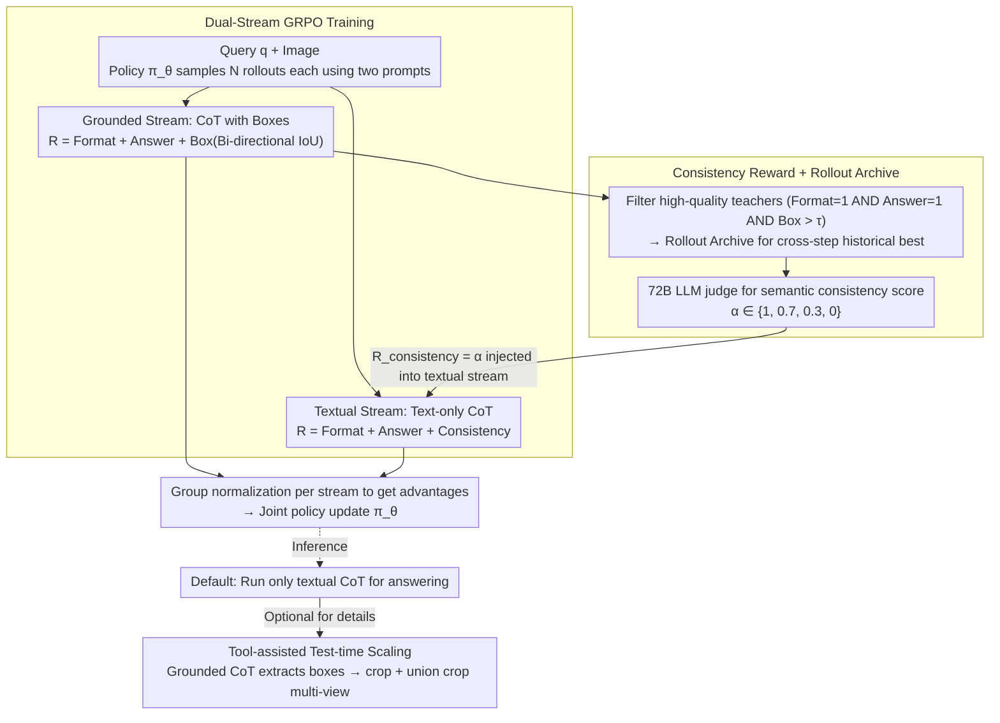

# iVGR: Internalizing Visually Grounded Reasoning for MLLMs with Reinforcement Learning

**Conference**: ICML 2026  
**arXiv**: [2605.31096](https://arxiv.org/abs/2605.31096)  
**Code**: https://visual-ai.github.io/ivgr/ (Project Page)  
**Area**: Multimodal VLM  
**Keywords**: Visual Reasoning, CoT, Reinforcement Learning, GRPO, Consistency Reward

## TL;DR
Addressing the counter-intuitive phenomenon where "explicit visual grounding hinders CoT reasoning," the authors propose iVGR—a dual-stream GRPO training framework. It allows textual CoT and grounded CoT (with boxes) to rollout simultaneously, using a consistency reward to "internalize" the visual localization capabilities of high-quality grounded trajectories into pure textual CoT. This enables the model to reap the benefits of grounded reasoning during inference without explicitly outputting coordinates.

## Background & Motivation

**Background**: In high-resolution fine-grained VQA, standard textual CoT often misses small objects. The community has diverged into two visually grounded CoT paths: **Tool-calling streams** like DeepEyes/PixelReasoner, which trigger crop tools during inference to view local regions; and **Explicit box streams** like TreeVGR/GRIT, which force the model to intersperse bounding box coordinates within the CoT. Both types are typically trained using RL methods like GRPO to enhance fine-grained perception.

**Limitations of Prior Work**: The authors conducted counter-intuitive experiments: using models like DeepEyes-7B and TreeVGR-7B (originally trained for grounded CoT), they modified only the inference prompt to run standard textual CoT. Results across eight benchmarks (V*, HR4K, HR8K, MME-RW-Lite, etc.) showed that textual CoT actually yielded higher average scores (DeepEyes 75.1 vs 74.1, TreeVGR 75.7 vs 74.7). Further analysis by IoU bins revealed that the cropping stream only outperformed textual CoT during high-quality localization ($\mathrm{IoU}>0.5$), while the box stream was outperformed by textual CoT across all IoU intervals.

**Key Challenge**: Explicit grounding during inference simultaneously handles two tasks—"accurate localization" and "final answering." These two compete for token budget and attention. When localization is suboptimal, incorrect coordinates or erroneous crops contaminate the final answer, leading to more harm than good.

**Goal**: Decouple "utilizing grounding supervision during training" from "forcing grounding output during inference." The aim is to extract visual priors from grounded CoT during training while allowing the model to perform pure textual CoT during inference, utilizing localization capabilities "silently."

**Key Insight**: Since textual CoT already performs better at inference, training should focus on "ensuring the textual CoT still knows where target objects are during generation," rather than forcing it to write coordinates explicitly. This is equivalent to providing an additional reward to the textual rollout in RL training based on whether it "looks at the same place" as a grounded teacher.

**Core Idea**: Roll out two parallel streams under the GRPO framework—a grounded stream (forced boxes) and a textual stream (text only). An LLM-scored **consistency reward** is used to align the textual stream with high-quality grounded trajectories, internalizing visual localization into pure textual CoT.

## Method

### Overall Architecture
iVGR performs GRPO post-training on Qwen2.5-VL / Qwen3-VL. For each query $q$, the policy $\pi_\theta$ samples $N$ rollouts using two different system prompts, resulting in a grounded set $\mathcal{O}^b$ and a textual set $\mathcal{O}^t$. Both sets calculate rewards and undergo group-wise normalization to obtain advantages $\mathcal{A}^b, \mathcal{A}^t$ for joint policy updates. The key coupling point: the textual stream includes an additional **consistency reward** $R_{\text{consistency}}$, where the "teacher" is a high-quality trajectory selected from the grounded stream (persisted via a cross-step Rollout Archive), thereby distilling localization capability into the textual stream. At inference, only the textual stream is run, with an optional tool-assisted test-time scaling workflow to fuse multi-view information.

### Key Designs

**1. Dual-stream GRPO Training: Learning two paradigms with one policy via a shared backbone**

Training only textual CoT lacks visual supervision, while training only grounded CoT makes localization a must-do, interfering with answering at inference. iVGR solves this by running two streams concurrently. The grounded stream outputs in the TreeVGR format `<think>...</think><answer>...</answer>`, with reward $R^b_i=R_{\text{format}}+R_{\text{acc}}+R_{\text{box}}$. The box term uses bi-directional IoU matching to balance recall and precision:

$$R_{\text{box}}=\tfrac{1}{2}\Big(\tfrac{1}{|\mathcal{B}_{\text{gt}}|}\sum_{b}\mathrm{MaxIoU}(b,\mathcal{B}_{\text{pred}})+\tfrac{1}{|\mathcal{B}_{\text{pred}}|}\sum_{\hat{b}}\mathrm{MaxIoU}(\hat{b},\mathcal{B}_{\text{gt}})\Big)$$

The textual stream removes box supervision, with reward $R^t_i=R_{\text{format}}+R_{\text{acc}}+R_{\text{consistency}}$. Both streams perform group normalization to get $\mathcal{A}^b,\mathcal{A}^t$. This allows the model to "train localization" and "train coordinate-free reasoning" simultaneously, embedding localization priors and textual reasoning into a single policy.

**2. Consistency Reward + Rollout Archive: Translating "where to look" into "what is described"**

The difficulty in cross-stream transfer is that the textual stream lacks coordinate output, making direct IoU supervision impossible. The consistency reward bypasses this: it filters "accurate" trajectories from the grounded stream as teachers (requiring $R_{\text{format}}=1$, $R_{\text{acc}}=1$, and $R_{\text{box}}>\tau$), then uses an external LLM (Qwen2.5-72B) judge to score the textual rollout's semantic alignment with the teacher’s visual focus: $\alpha=1.0$ (consistent), $0.7$ (minor deviation), $0.3$ (omissions/additions), or $0.0$ (contradiction), setting $R_{\text{consistency}}=\alpha$. Since teacher quality is non-stationary in RL, a per-query Rollout Archive is used: $\mathcal{Z}_{\text{archive}}^{(q)}\leftarrow\arg\max_{z\in\{\mathcal{Z}_{\text{archive}}^{(q)},o_{\text{best}}^{b}\}}R_{\text{box}}(z)$, ensuring stable supervision.

**3. Tool-assisted Test-time Scaling: Defaulting to Textual CoT with Boxes as Optional Routers**

Dual-stream training preserves the model's ability to output boxes when prompted. iVGR leverages this for optional test-time scaling: the model first generates a grounded CoT to extract boxes, then uses a crop tool to create local views and a **union crop** (minimal bounding rectangle covering all boxes) to maintain relative spatial relationships. Finally, the original image, local crops, and union crop are fed into a standard textual CoT. This elegantly absorbs tool-stream benefits without being bound by them.

### Loss & Training
Each stream independently performs group normalization and calculates the PPO surrogate loss under GRPO, which are then summed for backpropagation. $\tau$ controls the selection threshold for grounded teachers, and $N$ is the number of rollouts per query per stream. The archive persists across steps to stabilize the consistency reward.

## Key Experimental Results

### Main Results
Comparing iVGR-Qwen2.5-VL-7B against open-source MLLMs and various grounded reasoning methods across fine-grained VQA (V*, HR4K, HR8K, MME-RW-Lite) and general VQA tasks.

| Model | Tools | V* | HR4K | HR8K | MME-RW-Lite | POPE | RWQA | CV-2D | CV-3D |
|------|-------|----|------|------|-------------|------|------|-------|-------|
| Qwen2.5-VL-7B Baseline | ✗ | 78.5 | 69.0 | 65.1 | 44.5 | 86.3 | 68.1 | 75.7 | 73.6 |
| DeepEyes-7B | ✓ | 82.7 | 75.1 | 72.6 | 53.2 | 87.7 | 69.4 | 75.0 | 77.3 |
| TreeVGR-7B | ✗ | 83.8 | 77.1 | 73.1 | 54.9 | 87.3 | 67.3 | 76.6 | 77.2 |
| Thyme-7B | ✓ | 82.2 | 77.0 | 72.0 | 55.2 | 86.8 | 70.2 | 78.0 | 75.1 |
| **iVGR-Qwen2.5-VL-7B** | ✗ | **86.4** | **78.3** | **75.5** | **55.6** | **88.9** | 68.6 | **78.4** | — |

iVGR outperforms same-sized grounded models on most fine-grained tasks. Without any external tools, pure textual CoT improves V* scores from 78.5 to 86.4.

### Key Findings
- **Grounded CoT by IoU Bins**: DeepEyes only outperforms textual CoT when $\mathrm{IoU}>0.5$, while TreeVGR is consistently surpassed. This proves "explicit coordinates" aren't the primary benefit; **"visual priors learned during training" are.**
- iVGR-Qwen2.5-VL-7B matches or exceeds tool-using models like DeepEyesV2-7B or Thyme-7B without tools, offering efficiency gains (shorter inference tokens).
- Improvements in general VQA (POPE/CV-Bench) indicate that the "visual focus" learned via consistency rewards does not degrade general reasoning.

## Highlights & Insights
- The "counter-intuitive" scientific narrative is a major strength: it overturns the consensus (that grounded CoT is better for inference), explains why using IoU bins, and then proposes a solution.
- The consistency reward translates visual alignment into semantic alignment scored by an LLM, solving the "non-coordinate textual stream" problem. This template is applicable to any RL distillation scenario where the teacher has structured output but the student has only natural language.
- The Rollout Archive effectively handles non-stationary teachers in GRPO, avoiding the need for explicit warmups or two-stage training.

## Limitations & Future Work
- Dependency on external 72B LLM for consistency judging increases training costs and introduces judge bias.
- Dual-stream rollout doubles the training compute requirements; scalability to 32B+ models remains to be verified.
- Semantic alignment may lack direct visual attention supervision; judge models might give high scores to similar linguistic descriptions even if the model looks at the wrong ROI in highly similar medical images.
- The specific trigger policy for tool-assisted test-time scaling is not fully learned.

## Related Work & Insights
- **vs DeepEyes / PixelReasoner**: These are tool-calling streams; iVGR internalizes these capabilities, using tools only as an optional extension, reducing inference costs.
- **vs TreeVGR / GRIT**: These force box insertion; iVGR treats boxes as auxiliary training tasks, removing the cognitive burden during inference.
- **vs DeepSeek-R1 / GRPO Series**: iVGR is a dual-stream extension of GRPO, introducing "cross-stream consistency" and "cross-step archiving" as a template for multi-modal GRPO.

## Rating
- Novelty: ⭐⭐⭐⭐⭐ The "internalization over explicit output" perspective is unique and backed by strong empirical evidence.
- Experimental Thoroughness: ⭐⭐⭐⭐ Extensive benchmarks and IoU analysis; lacks ablation on the robustness of the judge model.
- Writing Quality: ⭐⭐⭐⭐⭐ Excellent flow from counter-intuitive observation to hypothesis to validation.
- Value: ⭐⭐⭐⭐⭐ The dual-stream GRPO + consistency reward is a highly transferable RL template.

<!-- RELATED:START -->

## Related Papers

- [\[ICML 2026\] Injecting Distributional Awareness into MLLMs via Reinforcement Learning for Deep Imbalanced Regression](injecting_distributional_awareness_into_mllms_via_reinforcement_learning_for_dee.md)
- [\[CVPR 2026\] Reading or Reasoning? Format Decoupled Reinforcement Learning for Document OCR](../../CVPR2026/multimodal_vlm/reading_or_reasoning_format_decoupled_reinforcement_learning_for_document_ocr.md)
- [\[CVPR 2026\] TempR1: Improving Temporal Understanding of MLLMs via Temporal-Aware Multi-Task Reinforcement Learning](../../CVPR2026/multimodal_vlm/tempr1_improving_temporal_understanding_of_mllms_via_temporal-aware_multi-task_r.md)
- [\[CVPR 2026\] DeepSketcher: Internalizing Visual Manipulation for Multimodal Reasoning](../../CVPR2026/multimodal_vlm/deepsketcher_internalizing_visual_manipulation_for_multimodal_reasoning.md)
- [\[CVPR 2026\] Visual Reasoning through Tool-supervised Reinforcement Learning](../../CVPR2026/multimodal_vlm/visual_reasoning_through_tool-supervised_reinforcement_learning.md)

<!-- RELATED:END -->
