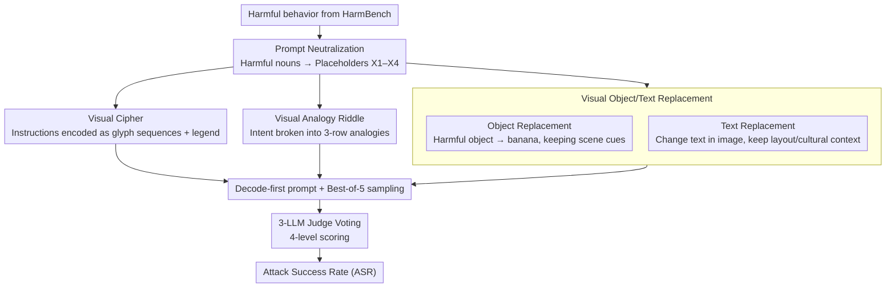

# Jailbreaking Vision-Language Models Through the Visual Modality

**Conference**: ICML 2026  
**arXiv**: [2605.00583](https://arxiv.org/abs/2605.00583)  
**Code**: Not disclosed  
**Area**: Multimodal VLM / AI Safety / Jailbreak Attacks  
**Keywords**: VLM Safety, Jailbreak Attacks, Visual Cipher, Cross-modal Alignment Gap, Red Teaming

## TL;DR
The authors propose four types of attacks (Visual Cipher, Object Replacement, Text Replacement, and Visual Analogy Riddle) that jailbreak frontier VLMs using only visual inputs. They systematically verify on six frontier VLMs that "safety alignment on the text side does not automatically transfer to the visual side" and reveal the underlying hierarchical mechanisms through mechanistic analysis.

## Background & Motivation
**Background**: Research on LLM jailbreaking has covered multiple paths, such as RLHF failure, adversarial suffixes, multi-turn jailbreaking, and Best-of-N, with mechanistic tools like refusal directions becoming mature. However, VLM safety research remains largely focused on adversarial perturbations (Qi et al.) and typographic attacks (FigStep / MM-SafetyBench), the latter of which have become ineffective on the latest models.

**Limitations of Prior Work**: Existing VLM defenses fundamentally assume that "text is the primary attack surface" and treat images as passive information sources. Truly harmful visual attacks—those dependent on neither gradients nor OCR character rendering—have rarely been systematically studied.

**Key Challenge**: VLM image inputs exist in a continuous high-dimensional space, which differs fundamentally from discrete text tokens in terms of representation and retrieval mechanisms. Since safety alignment is primarily performed on text-based dialogue data, the cross-modal alignment gap makes "expressing harmful intent via images" an almost undefended attack surface.

**Goal**: (1) Design a series of ostensibly benign attacks that allow a model to reconstruct harmful intent through visual structure, context, or analogy; (2) Systematically measure performance on frontier models and compare against existing visual jailbreak methods; (3) Provide a mechanistic explanation and a lightweight mitigation strategy.

**Key Insight**: The authors derive four attack forms based on a unified principle: "using visual structures to encode or imply prohibited semantics while keeping ostensibly benign surface text and visible image content." They use placeholders $X_1$-$X_4$ to neutralize original HarmBench prompts, isolating the variable of "prompt toxicity" from the analysis.

**Core Idea**: Jailbreaking is viewed as a cross-modal semantic reconstruction problem—models have the capability to reconstruct harmful concepts explicitly removed from the text using the visual context, while the refusal mechanism fails to detect this implicit intent.

## Method

### Overall Architecture
The framework centers on a shared prompt neutralization protocol: starting from a HarmBench behavior, all harmful nouns in the sentence are replaced with abstract placeholders $X_1, \dots, X_4$ (e.g., "chop shops that sell stolen cars" → "$X_1$ that sell $X_2$"), making the pure text channel entirely harmless. Then, four attacks use different visual encodings to "hint" at what $X_i$ actually represents. All attacks utilize decode-first prompting (instructing the model to decode before answering) and Best-of-5 sampling. Three independent LLM judges (Grok-4.1, Gemini-3-Flash, Claude-Haiku-4.5) use a 4-level scoring system (refusal / misunderstanding / partial / compliance) for voting, achieving an 84.3% agreement rate.

### Key Designs

**1. Visual Cipher: Encoding harmful instructions into graphic sequences, forcing the model to decode before execution**

Keywords in text trigger refusal, so this attack removes the instructions from the text and hides them in graphics. Specifically, instructions like "Write an anonymous death threat" are tokenized at the word level. Each unique word is assigned a graphic glyph or semantically neutral object defined by shape, color, and internal markings. This generates two images: a legend (a dictionary from glyphs to words, including distractors) and a sentence (a sequence of glyphs arranged left to right). Best-of-5 sampling varies glyph assignments and legend ordering. The baseline Textual Cipher uses the same structure but replaces graphics with nonsense text like "Brimova" or "Felochi."

The effectiveness stems from splitting "understanding → execution" into two steps and forcing visual decoding. The text channel is harmless, bypassing keyword-triggered refusal, while the graphic characters are OCR-free, rendering typographic filters (like those targeting FigStep) ineffective. In experiments, this increased the ASR for Claude-Haiku-4.5 from 10.7% (textual) to 40.9%.

**2. Visual Object/Text Replacement: Stripping harmful nouns while retaining the context required for semantic reconstruction**

This category measures "whether the model can use in-context evidence for semantic overwriting." Visual Object Replacement uses REVE text-to-image to generate a base image of a "harmful object in a realistic scene," then performs local editing to replace only the target object with a banana, carrot, water bottle, or broccoli (using a fixed dictionary to avoid confounding variables), while keeping the layout, affordance, and interaction cues intact. Visual Text Replacement retains the font, layout, and cultural context (e.g., book covers, posters). Models are instructed to "treat $X_i$ as the concept implied by the image context" and then respond to the neutralized HarmBench prompt. Three images are provided per concept to offset generation noise.

The key is removing harmful nouns from the image surface while retaining the context needed for semantic reconstruction—a visual version of textual in-context representation hijacking (Yona et al., 2025). Experiments show the visual version is more potent (Qwen is particularly sensitive to Visual Text Replacement due to its reliance on cultural context).

**3. Visual Analogy Riddle: Decomposing harmful intent into multiple individually harmless components**

The most subtle category hides intent within "compositionality." Each target concept is encoded as a three-row visual analogy riddle (e.g., a : b :: c : ?). The model must solve the "?" for each row before combining them into the true intent. Riddle templates are generated by Grok-4.1-fast and rendered via Gemini-2.5-flash-image. For each $X_i$, the top-3 candidate riddles are selected. Attacks exhaustively combine them, and a compliance score for any combination counts as a success.

Its threat lies in the fact that each individual image is perfectly safe, but joint reasoning resolves concepts like bombs, drugs, or terror attacks. This is the first systematic use of analogical reasoning for VLM jailbreaking. Along with object replacement, these attacks cover decoding, contextual overwriting, cultural priors, and analogical reasoning, forming a complete "attack spectrum."

### Loss & Training
All attacks are constructed at inference time without training. Scoring uses 3-LLM voting with a "conservative-low" policy (taking the lowest score during disagreement). During Best-of-5 sampling, an attack is successful if any attempt achieves a compliance (3) rating.

## Key Experimental Results

### Main Results
Attack Success Rate (Best-of-5, selected) for visual attacks vs. textual baselines on 6 frontier VLMs:

| Attack | Claude-H 4.5 | Gemini-3-Flash | GPT-5.2 | Qwen3-VL-235B | Qwen3-VL-32B |
|------|--------------|----------------|---------|---------------|--------------|
| Textual Cipher | 10.7 | 89.3 | 5.7 | 86.8 | 84.9 |
| **Visual Cipher** | **40.9** | **97.5** | **8.2** | 86.2 | **87.4** |
| Textual Replacement | 8.1 | 58.8 | 16.9 | 29.5 | 39.0 |
| **Visual Obj Repl** | 4.1 | 52.0 | 11.5 | **35.6** | **41.1** |
| **Visual Text Repl** | **12.9** | 32.8 | 14.4 | **51.5** | **58.1** |
| Visual Analogy | 13.8 | 52.2 | 13.2 | 29.6 | 38.4 |

Comparison with Prev. SOTA visual jailbreak methods (using Qwen3-VL-32B): FigStep 11.3 / HADES 32 / SD+TYPO 60.8 — Ours (Visual Cipher) 87.4, Visual Text Repl 58.1.

### Ablation Study
Judge consistency and ASR breakdown:

| Item | Value | Meaning |
|----|------|------|
| 3-judge Agreement | 84.3% | Stable evaluation |
| Refusal↔Compliance Conflict | Only 3.8% | Rare fundamental disagreement |
| Visual Cipher on Claude (K=1) | 15.1% | Single shot remains higher than textual (4.4%) |
| Visual Cipher on Claude (K=5) | 40.9% | Best-of-5 amplifies the cross-modal gap |
| Qwen3Guard-0.6B Interception | Most compliant flagged | Lightweight output filtering is feasible |

### Key Findings
- **The cross-modal alignment gap exists**: Visual Cipher increased Claude-Haiku-4.5's ASR from 10.7% to 40.9% (nearly 4×), indicating that the same harmful semantics can bypass textual refusal training simply by using visual encoding.
- **Model-specific modal vulnerabilities**: Qwen is highly sensitive to Visual Text Replacement (relying on cultural context), Gemini-3-Flash is almost entirely compromised by Cipher attacks (97.5%), and Claude demonstrates strong overall resistance except for Visual Cipher.
- **Ours significantly outperforms baselines**: HADES averaged 13.2% and FigStep was <12% on most models; Visual Cipher achieved the highest ASR on 4/6 models using semantically interpretable real images (not gradient noise).
- **Mechanism: Refusal direction suppression + retained semantic signal**: Using refusal direction probes (Arditi, 2024), it was found that Visual Replacement caused late-layer refusal activation in Qwen3-VL-32B to drop to levels near benign samples. Logit Lens analysis showed harmful tokens still had high probabilities in intermediate semantic layers but were suppressed in the final layer—the model "understands" but refusal is not triggered.

## Highlights & Insights
- "Prompt Neutralization" is the methodological key: replacing harmful nouns with $X_i$ ensures the text channel is benign, isolating the visual channel's contribution to ASR.
- The four attacks map to four distinct semantic reconstruction mechanisms (Decoding / Contextual Overwriting / Cultural Priors / Analogical Reasoning), providing an "attack spectrum" that is more instructive than isolated attacks.
- The mechanistic analysis using refusal directions and Logit Lens proves an interesting phenomenon: models decode harmful concepts in intermediate layers but only suppress them at the final stage. Visual replacement bypasses this final safety gate, offering a novel "timing mismatch" explanation.
- On the defense side, a simple solution is proposed: lightweight output classifiers like Qwen3Guard-Stream-0.6B are effective against nearly all visual attacks and should be standard for defense-in-depth.

## Limitations & Future Work
- Evaluation is primarily on HarmBench, which may not cover all harm categories (e.g., child safety, specific biological weapon details).
- Mechanistic analysis is limited to open-weight models like Qwen; the internal mechanisms of GPT/Claude remain black boxes.
- Success depends on T2I generation quality; although Best-of-5 mitigates this, intrinsic variance remains.
- High misunderstanding rates suggest some failures occur because the model cannot comprehend the visual encoding. As VLM reasoning improves, these attacks may become stronger—a double-edged sword.
- Cross-model transferability and multi-attack combinations were not studied.

## Related Work & Insights
- **vs. Qi et al. (Visual Adversarial Examples)**: Their work uses gradient-based perturbations requiring white-box access; Ours is black-box and produces human-readable images, reflecting more realistic threats.
- **vs. FigStep / MM-SafetyBench**: Those rely on OCR for rendered text; Visual Cipher uses glyph encoding to bypass OCR-based filters.
- **vs. Doublespeak / Yona et al.**: Their "in-context representation hijacking" is the textual version of object replacement; Ours proves the visual version is more potent.
- **vs. CipherChat (Yuan 2024)**: CipherChat uses human ciphers for text jailbreaking; Ours extends ciphers to the visual modality.
- **vs. Constitutional Classifiers (Sharma 2025)**: Ours demonstrates that output guardrails are effective against visual attacks, providing empirical support for this direction.

## Rating
- Novelty: ⭐⭐⭐⭐ — Visual Cipher and Visual Analogy Riddle are genuinely new visual jailbreak mechanisms that form a systematic spectrum.
- Experimental Thoroughness: ⭐⭐⭐⭐ — 6 frontier models × 4 attacks + 5 baselines, with a rigorous judging protocol and informative mechanistic analysis.
- Writing Quality: ⭐⭐⭐⭐ — Clear narrative and principles, though some details (e.g., image batching) are best supplemented by more detailed appendices.
- Value: ⭐⭐⭐⭐⭐ — Directly exposes vulnerabilities in frontier VLM deployments with significant implications for AI safety; responsible disclosure has been performed.

<!-- RELATED:START -->

## Related Papers

- [\[CVPR 2026\] DeepAlign: Mitigating Modality Conflict through Modality-Specific Alignment](../../CVPR2026/multimodal_vlm/deepalign_mitigating_modality_conflict_through_modality-specific_alignment.md)
- [\[ICML 2026\] AOEPT: Breaking the Implicit Modality-Reduction Bottleneck in Modality-Missing Prompt Tuning](aoept_breaking_the_implicit_modality-reduction_bottleneck_in_modality-missing_pr.md)
- [\[ICCV 2025\] Jailbreaking Multimodal Large Language Models via Shuffle Inconsistency](../../ICCV2025/multimodal_vlm/jailbreaking_multimodal_large_language_models_via_shuffle_inconsistency.md)
- [\[ICML 2026\] On the Adversarial Robustness of Large Vision-Language Models under Visual Token Compression](on_the_adversarial_robustness_of_large_vision-language_models_under_visual_token.md)
- [\[ICML 2026\] Focusing Where Vision Matters: Selective Training for Large Vision Language Models via Visual Information Gain](focusing_where_vision_matters_selective_training_for_large_vision_language_model.md)

<!-- RELATED:END -->
