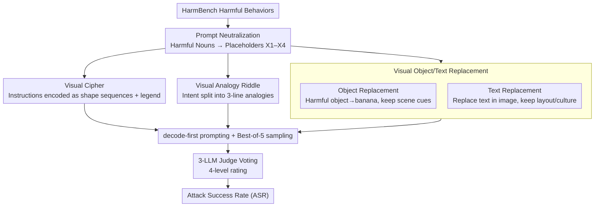

# Jailbreaking Vision-Language Models Through the Visual Modality

**Conference**: ICML 2026  
**arXiv**: [2605.00583](https://arxiv.org/abs/2605.00583)  
**Code**: Not disclosed  
**Area**: Multimodal VLM / AI Safety / Jailbreak Attacks  
**Keywords**: VLM Safety, Jailbreak Attack, Visual Cipher, Cross-modal Alignment Gap, Red Teaming

## TL;DR
The authors propose four types of jailbreak attacks that bypass frontier VLM security solely through visual inputs (Visual Cipher / Object Replacement / Text Replacement / Visual Analogy Riddle). They systematically demonstrate across six frontier VLMs that "safety alignment on the text side does not automatically transfer to the vision side" and reveal the underlying hierarchical mechanisms through mechanistic analysis.

## Background & Motivation
**Background**: Research on LLM jailbreaking has covered various paths such as RLHF failure, adversarial suffixes, multi-round jailbreaks, and Best-of-N, with mechanistic tools like refusal directions becoming mature. However, VLM safety research primarily focuses on adversarial perturbation images (Qi et al.) and typographic attacks (FigStep / MM-SafetyBench), the latter of which have largely failed on the latest models.

**Limitations of Prior Work**: Existing VLM defenses fundamentally assume that "text is the primary attack surface" and treat images as passive information sources. Visual attacks that can cause real harm—without depending on gradients or OCR character rendering—have rarely been systematically studied.

**Key Challenge**: Image inputs for VLMs exist in a continuous high-dimensional space, which differs entirely from discrete text tokens in terms of representation and retrieval mechanisms. Since safety alignment is mostly performed on textual dialogue data, the cross-modal alignment gap makes "expressing harmful intent via images" a nearly undefended attack surface.

**Goal**: (1) Design a series of ostensibly benign attacks that allow models to reconstruct harmful intent through visual structure, context, or analogy; (2) Systematically measure these on frontier models and compare them with existing visual jailbreak methods; (3) Provide a mechanistic explanation and a lightweight mitigation.

**Key Insight**: The authors derive four attack forms based on a unified principle: "encoding or implying prohibited semantics using visual structure while keeping the surface text and visible image content ostensibly benign." They neutralize the original HarmBench prompts using placeholders $X_1$-$X_4$ to isolate the variable of whether the original prompt is inherently dangerous.

**Core Idea**: Jailbreaking is viewed as a cross-modal semantic reconstruction problem—models have the capability to reconstruct explicitly removed harmful concepts from visual context, while the refusal mechanism fails to detect this implicit intent.

## Method

### Overall Architecture
The entire method revolves around a shared prompt neutralization protocol: starting from a HarmBench behavior, all harmful nouns in the sentence are replaced with abstract placeholders $X_1, ..., X_4$ (e.g., "chop shops that sell stolen cars" becomes "$X_1$ that sell $X_2$"), making the pure text channel entirely harmless. Each of the four attacks then uses different visual encodings to "hint" at what $X_i$ actually refers to. All attacks employ decode-first prompting (instructing the model to decode before answering), Best-of-5 sampling, and a voting system involving three independent LLM judges (Grok-4.1, Gemini-3-Flash, Claude-Haiku-4.5) using a 4-level scale (refusal / misunderstanding / partial / compliance), achieving an 84.3% agreement rate.

### Key Designs

**1. Visual Cipher: Encoding harmful instructions into graphic sequences, forcing the model to decode before execution**

Since textual keywords trigger refusal, this attack removes instructions from the text entirely and hides them in graphics. Specifically, instructions like "Write an anonymous death threat" are tokenized at the word level. Each unique word is assigned a graphic glyph or a semantically neutral object defined by shape + color + internal markings. Two images are generated: a legend (a dictionary from glyphs to words, including distractors) and a sentence (a sequence of glyphs arranged from left to right). Glyph assignments and legend ordering are varied during Best-of-5 sampling. The Textual Cipher baseline uses the same structure but replaces graphics with nonsense text like "Brimova" or "Felochi."

This is effective because it splits "understanding $\rightarrow$ execution" into two steps and forces visual decoding. The text channel is totally benign, bypassing keyword-triggered refusal, while the graphic characters are OCR-free, rendering even typography-based filters (such as those targeting FigStep) ineffective. In experiments, it pushed the ASR of Claude-Haiku-4.5 from 10.7% (textual) to 40.9%.

**2. Visual Object/Text Replacement: Stripping harmful nouns while retaining all context required for semantic reconstruction**

This category specifically tests "whether the model can perform semantic overwriting using in-context evidence." Object replacement first uses REVE (T2I) to generate a base image of "harmful objects in real-world scenes," then applies local editing to replace only the target object with a banana / carrot / water bottle / broccoli (using a fixed dictionary to avoid confounding variables) while keeping the layout, affordance, and interaction cues intact. Text replacement retains fonts, layouts, and cultural contexts (book covers, posters, etc.). The model is told to "treat $X_i$ as the concept implied by the image context" and then answers the neutralized HarmBench prompt. Each concept is paired with three images to counteract generation noise.

The key lies in stripping harmful nouns from the image surface while retaining the full context needed for semantic reconstruction—this is the visual version of textual in-context representation hijacking (Yona et al., 2025). Experiments show the visual version is more potent (Qwen is particularly sensitive to Visual Text Replacement due to its reliance on cultural context inference).

**3. Visual Analogy Riddle: Breaking harmful intent into multiple individually harmless components**

This most covert category hides intent within "composability." Each target concept is encoded into a 3-line visual analogy riddle (e.g., $a:b :: c:?$). The model must solve for $?$ in each line before combining them to form the actual intent. Riddle text templates are generated by Grok-4.1-fast and rendered into images by Gemini-2.5-flash-image. Top-3 candidate riddles are selected for each $X_i$. During the attack, combinations are exhausted; if any combination results in a judge rating of compliance, it is considered successful.

The threat lies in the fact that each individual image appears completely safe, but joint reasoning resolves concepts like bombs, drugs, or terror attacks. This is the first systematic use of analogical reasoning for VLM jailbreaking. Along with object replacement, these attacks cover four different semantic reconstruction mechanisms: decoding, context overwriting, cultural priors, and analogical reasoning, forming a complete "attack spectrum."

### Loss & Training
All attacks are constructed at inference time without training. Scoring uses 3-LLM voting with a "conservative minimum" policy (taking the lowest score in case of disagreement). During Best-of-5 sampling, an attack is successful if any single attempt achieves compliance (3).

## Key Experimental Results

### Main Results
Attack Success Rate (Best-of-5, selected) of visual attacks vs. textual baselines across 6 frontier VLMs:

| Attack | Claude-H 4.5 | Gemini-3-Flash | GPT-5.2 | Qwen3-VL-235B | Qwen3-VL-32B |
|------|--------------|----------------|---------|---------------|--------------|
| Textual Cipher | 10.7 | 89.3 | 5.7 | 86.8 | 84.9 |
| **Visual Cipher** | **40.9** | **97.5** | **8.2** | 86.2 | **87.4** |
| Textual Replacement | 8.1 | 58.8 | 16.9 | 29.5 | 39.0 |
| **Visual Obj Repl** | 4.1 | 52.0 | 11.5 | **35.6** | **41.1** |
| **Visual Text Repl** | **12.9** | 32.8 | 14.4 | **51.5** | **58.1** |
| Visual Analogy | 13.8 | 52.2 | 13.2 | 29.6 | 38.4 |

Comparison with Prev. SOTA visual jailbreak methods (using the strongest Qwen3-VL-32B column): FigStep 11.3 / HADES 32 / SD+TYPO 60.8 — Ours (Visual Cipher) 87.4, Visual Text Repl 58.1.

### Ablation Study
Judge consistency and ASR breakdown:

| Item | Value | Meaning |
|----|------|------|
| 3-judge Agreement Rate | 84.3% | Stable evaluation |
| Refusal↔Compliance Conflicts | Only 3.8% | Minimal divergence on critical judgments |
| Visual Cipher on Claude (Single K=1) | 15.1% | Single shot still far exceeds textual 4.4% |
| Visual Cipher on Claude (K=5) | 40.9% | Best-of-5 amplifies the cross-modal gap |
| Qwen3Guard-0.6B Interception Rate | Majority of compliant flagged | Lightweight output filtering is feasible |

### Key Findings
- **Cross-modal alignment gaps truly exist**: Visual Cipher pushed the ASR of Claude-Haiku-4.5 from 10.7% to 40.9% (nearly 4×), indicating that the same harmful semantics can bypass textual refusal training simply by switching to visual encoding.
- **Different models exhibit different modal vulnerabilities**: Qwen is particularly sensitive to Visual Text Replacement (relying on cultural inference), Gemini-3-Flash is almost entirely compromised by Cipher-style attacks (97.5%), and while Claude shows strong overall resistance, the visual cipher is its Achilles' heel.
- **The proposed attacks significantly outperform existing baselines**: HADES averaged 13.2% and FigStep was $<12\%$ on most models. Our Visual Cipher achieved the highest ASR on 4 out of 6 models and produced semantically interpretable real images (not gradient noise).
- **Mechanism evidence: Refusal direction suppression + Persistence of semantic signals**: Using the refusal direction probe from Arditi (2024), it was found that Visual Replacement caused the late-layer refusal activation of Qwen3-VL-32B to drop to levels nearly identical to benign samples. Meanwhile, Logit Lens revealed that dangerous tokens still had high probabilities in the middle semantic layers and were only suppressed in the final layer—the model "understood" but refusal was not triggered.

## Highlights & Insights
- "Prompt Neutralization" is the methodological key: replacing harmful nouns with $X_i$ ensures the text channel is benign, thereby isolating the confounding variable of textual harmfulness. The resulting gain in ASR can be attributed solely to the visual channel.
- The four attacks correspond to four different semantic reconstruction mechanisms (decoding / context overwriting / cultural priors / analogical reasoning), covering multiple levels of VLM information integration. This "attack spectrum" is far more instructive than a single-point attack.
- The combined use of refusal direction and Logit Lens in the mechanistic analysis proves an interesting phenomenon: the model decodes dangerous concepts in the middle layers and only suppresses them in the final layer. Visual replacement effectively bypasses this final-layer safety gate. This timing mismatch explanation is novel and actionable.
- On the defense side, a simple and effective solution is provided: a lightweight output classifier like Qwen3Guard-Stream-0.6B works against almost all visual attacks and is recommended as a standard for defense-in-depth.

## Limitations & Future Work
- Evaluation is primarily on HarmBench and may not cover all harm categories (e.g., child safety, specific biological weapon details).
- Mechanistic analysis of closed-source models is limited compared to open-weight models like Qwen; the internal mechanisms of GPT/Claude remain a black box.
- Attack effectiveness depends on T2I generation quality. Best-of-5 counteracts some of this, but intrinsic variance remains.
- High misunderstanding rates indicate some failures occur because the "model did not understand the visual encoding." As VLM visual reasoning improves, these attacks will likely become stronger—a double-edged sword.
- Transferability across models and combinations of multiple attacks have not yet been studied.

## Related Work & Insights
- **vs. Qi et al. (Visual Adversarial Examples)**: They use gradient-based adversarial perturbations requiring white-box access; this work is black-box and produces readable images, closer to real-world threat models.
- **vs. FigStep / MM-SafetyBench**: The former renders harmful text into images, relying on OCR; our Visual Cipher uses glyph encoding, bypassing all OCR-targeted filters.
- **vs. Doublespeak / Yona et al.**: Their "in-context representation hijacking" is a textual version of object replacement; this work provides the visual equivalent and proves it to be more potent.
- **vs. CipherChat (Yuan 2024)**: CipherChat uses human ciphers for textual jailbreaking; this work extends the cipher concept to the visual modality.
- **vs. Constitutional Classifiers (Sharma 2025)**: This work proves that such output guardrails are equally effective against visual attacks, providing empirical support for that direction.

## Rating
- Novelty: ⭐⭐⭐⭐ — Visual Cipher and Visual Analogy Riddle are truly new visual jailbreak mechanisms, forming a systematic attack spectrum.
- Experimental Thoroughness: ⭐⭐⭐⭐ — 6 frontier models × 4 attacks + 5 baselines, with a rigorous judging protocol and insightful mechanistic analysis.
- Writing Quality: ⭐⭐⭐⭐ — The narrative and principles are clear, though some experimental details (e.g., multi-image batches, specific Best-of-5 protocols) benefit from appendix materials.
- Value: ⭐⭐⭐⭐⭐ — Directly reveals practical deployment vulnerabilities in frontier VLMs, carrying significant warning value for the AI safety community; responsible disclosure has been performed.

<!-- RELATED:START -->

## Related Papers

- [\[ICCV 2025\] IDEATOR: Jailbreaking and Benchmarking Large Vision-Language Models Using Themselves](../../ICCV2025/multimodal_vlm/ideator_jailbreaking_and_benchmarking_large_visionlanguage_m.md)
- [\[CVPR 2026\] DeepAlign: Mitigating Modality Conflict through Modality-Specific Alignment](../../CVPR2026/multimodal_vlm/deepalign_mitigating_modality_conflict_through_modality-specific_alignment.md)
- [\[ICML 2026\] Unveiling Visual Counting Bottlenecks in Vision-Language Models](unveiling_the_visual_counting_bottleneck_in_vision-language_models.md)
- [\[ICML 2026\] Visual Persuasion: What Influences the Decisions of Vision-Language Models?](visual_persuasion_what_influences_decisions_of_vision-language_models.md)
- [\[ICML 2026\] AOEPT: Breaking the Implicit Modality-Reduction Bottleneck in Modality-Missing Prompt Tuning](aoept_breaking_the_implicit_modality-reduction_bottleneck_in_modality-missing_pr.md)

<!-- RELATED:END -->
