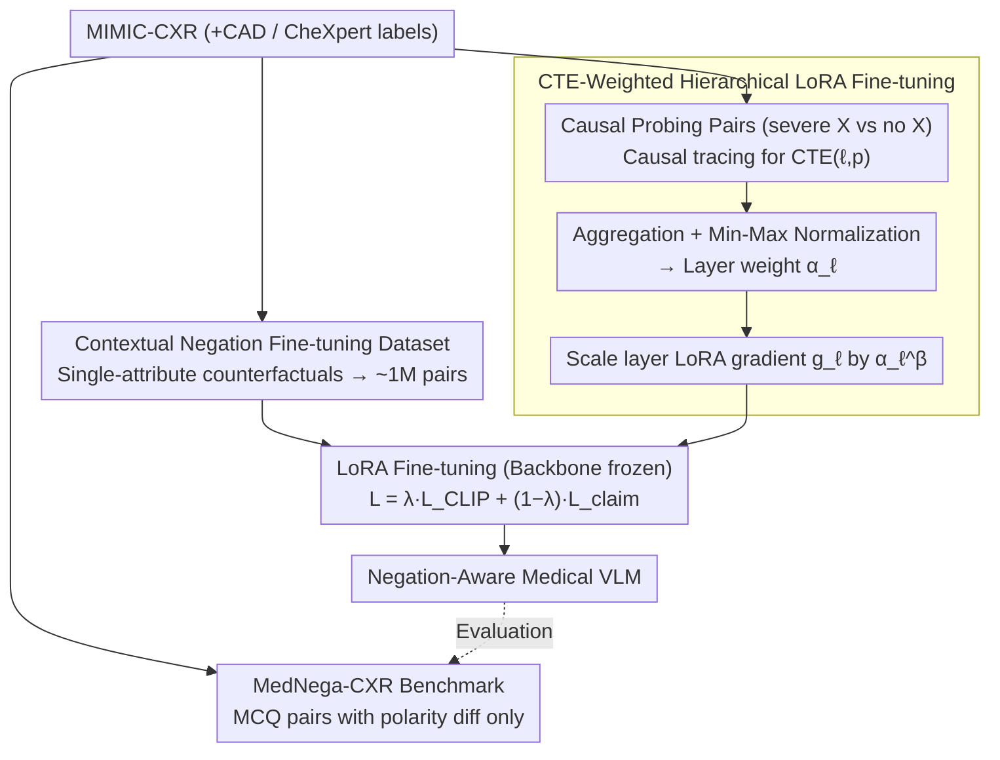

# Layer-Specific Fine-Tuning for Improved Negation Handling in Medical Vision-Language Models

**Conference**: ICML 2026  
**arXiv**: [2602.12498](https://arxiv.org/abs/2602.12498)  
**Code**: https://github.com/healthylaife/NAST  
**Area**: Multimodal VLM / Medical Imaging / Interpretability-Guided Training  
**Keywords**: Medical CLIP, Negation Understanding, Causal Tracing, Hierarchical Fine-Tuning, LoRA

## TL;DR
NAST utilizes causal tracing to calculate the Causal Trace Effect (CTE) of each layer in a CLIP text encoder for negation understanding. These CTE values are then used for hierarchical gradient-scaled LoRA fine-tuning. This significantly enhances the semantic sensitivity of medical VLMs in distinguishing "presence vs. absence of symptoms," reducing the affirmative-negation accuracy gap from 21.6% to 4.2%.

## Background & Motivation
**Background**: Medical VLMs such as MedCLIP, BioMedCLIP, and BioViL-T have shown significant effectiveness in image-report alignment and zero-shot diagnosis, and have been explored for automated report generation, retrieval, and decision support.

**Limitations of Prior Work**: Negation is ubiquitous in radiology reports—"no pneumothorax," "no pleural effusion seen," "no consolidation in the right lower lobe." Negation is not just about the "absence of an object"; it often operates on attributes ("no massive effusion," "no consolidation in the right lower lobe"). However, medical VLMs primarily encounter affirmative descriptions during contrastive pre-training, making negation a blind spot. By using controlled "affirmative vs. negative semantically equivalent sentences" (e.g., "normal heart size" vs. "no cardiomegaly"), this study found that all mainstream medical VLMs systematically favor affirmative sentences, with significantly poorer negation understanding.

**Key Challenge**: Simply adding negative samples for fine-tuning (following the route of NegCLIP, ConCLIP, or NegBench) only provides marginal relief because negation signals are not uniformly distributed across model layers. They likely concentrate in specific layers of the text encoder; tuning all layers uniformly is inefficient and may degrade other capabilities.

**Goal**: (i) Provide a **polarity-controlled** diagnostic benchmark to isolate "poor negation understanding" from "poor adjective understanding"; (ii) Provide a fine-tuning dataset to inject "negation knowledge" into medical VLMs at the **attribute level** (existence, location, severity); (iii) Use mechanistic interpretability tools to identify "which layers handle negation" and perform selective fine-tuning to improve negation handling while preserving non-negation capabilities.

**Key Insight**: Transfer mechanistic interpretability tools (causal tracing, Meng et al.) from LLMs to the CLIP text encoder. This converts "which layer and which token is sensitive to negation" into computable CTE scores, which are then directly utilized by the optimizer for hierarchical gradient scaling.

**Core Idea**: Calculate CTE via causal tracing → Normalize to layer weights $\alpha_\ell$ → Scale each layer's LoRA gradient by $\alpha_\ell^\beta$ during fine-tuning to concentrate training resources on the layers truly responsible for negation.

## Method

### Overall Architecture
NAST consists of three components: (i) MedNega-CXR diagnostic benchmark—affirmative-negative MCQ pairs generated via LLMs based on MIMIC-CXR and reviewed by two radiologists; (ii) Contextual negation fine-tuning dataset—based on CAD annotations, structured facts $(\text{condition}, \text{existence}, \text{location}, \text{severity})$ undergo "single-attribute" counterfactual perturbations, resulting in ~1M image-text pairs; (iii) CTE-weighted hierarchical LoRA fine-tuning—using causal tracing to calculate CTE for each layer and position, normalizing them into layer weights $\alpha_\ell$, and scaling LoRA gradients accordingly. The pipeline below illustrates the "data preparation → causal localization → hierarchical fine-tuning" workflow.

### Key Designs

**1. MedNega-CXR Diagnostic Benchmark: Isolating negation via "polarity-only" description pairs**

To diagnose "poor negation understanding," the first challenge is to avoid confounding it with "poor adjective understanding" or "poor visual perception." MedNega-CXR constructs contrastive pairs that are semantically equivalent but differ only in polarity—e.g., "no cardiomegaly" versus "normal heart size." Both sentences refer to the same clinical fact, with the only difference being the use of negation vs. affirmation. The benchmark leverages a unique convenience in the medical domain: clinical states like "no pneumonia" can be equivalently expressed as "lungs are well-aerated," whereas general domains (e.g., "no car") lack single affirmative equivalents. This ensures that only polarity varies in the contrastive pairs, making it a true test of negation understanding.

**2. Attribute-Level Negation Fine-Tuning Dataset: Extending negation beyond existence to location and severity**

Evaluation is not enough; fine-tuning supervision must also cover realistic negation forms. Existing negation datasets (CC-Neg, NegBench) focus on object existence. However, in radiology reports, negation often acts on attributes—"no massive effusion" negates severity, and "not consolidation in the right lower lobe" negates location. This work applies counterfactual perturbations to single attributes of structured facts $(\text{condition}, \text{existence}, \text{location}, \text{severity})$ (e.g., present↔absent, left↔right, small↔large) and converts them into natural language using radiology-style templates.

**3. CTE-Weighted Hierarchical LoRA Fine-Tuning: Identifying and prioritizing layers responsible for negation**

This is the core mechanism of NAST. Addressing the fact that negation signals are not uniform, the authors utilize causal tracing to quantify each layer's contribution. For a pair of (correct caption, foil caption) of equal length, the hidden states of the foil are recorded. During the forward pass of the correct caption, the hidden state of the $p$-th token at layer $\ell$ is replaced with the corresponding state from the foil. The causal contribution is defined as:

$$\mathrm{CTE}(\ell, p) = \frac{S^{\text{corr}} - S^{\ell,p}}{S^{\text{corr}} - S^{\text{foil}}}$$

This measures the proportion of the model's drop from a correct to a foil judgment after the intervention. Results indicate negation signals are concentrated in layers 1-4, peaking at layer 2. After normalizing aggregate token-level CTE into layer weights $\alpha_\ell \in [0,1]$, LoRA gradients are scaled as $\tilde{g}_\ell = \alpha_\ell^\beta \cdot g_\ell$. This concentrates update resources on layers truly responsible for negation, avoiding the dilution of negation learning and preserving general alignment in other layers.

### Loss & Training
$\mathcal{L}_{\text{CLIP}}$ is the standard symmetric contrastive loss (applied to batches containing single captions with explicit negation); $\mathcal{L}_{\text{claim}} = \frac{1}{M}\sum_i \log \frac{\exp(\ell_{i, c_i})}{\sum_j \exp(\ell_{i, j})}$ is the claim-ranking loss (ensuring correct claims have higher similarity than hard negatives). The optimizer is AdamW with a fixed learning rate on a single RTX 4070.

## Key Experimental Results

### Main Results
Contextual negation task (Table 1, units in %):

| Model | R@1↑ | R@5↑ | Claim Acc.↑ |
|------|------|------|-------------|
| CLIP | 23.5 | 34.7 | 24.6 |
| NegCLIP | 36.2 | 52.4 | 41.3 |
| ConCLIP | 39.7 | 55.8 | 44.9 |
| NegBench | 43.1 | 59.2 | 48.7 |
| **NAST (Ours)** | **49.5** | **65.7** | **55.6** |

NAST outperforms the strongest negation-focused baseline by 6.9 points in claim accuracy.

### Ablation Study
Affirmative-Negation Gap (Table 3, lower is better) + Update Distribution (Table 4):

| Model | Affirm – Negation Gap (Claim Acc., %) |
|------|--------------------------------------|
| CLIP | 21.6 |
| NegCLIP | 12.8 |
| ConCLIP | 10.7 |
| NegBench | 10.2 |
| **NAST** | **4.2** |

| Method | Top-3 Layer Update % | Top-5 Layer Update % |
|------|------|------|
| Uniform FT | 28.4% | 41.7% |
| **NAST (CTE-weighted)** | **52.6%** | **69.3%** |

CTE weighting successfully concentrates updates on the top negation-sensitive layers, corresponding to the gains in claim accuracy.

### Key Findings
- **Layer-wise localization of negation**: CTE is concentrated in layers 1-4, with a peak at layer 2. This aligns with LLM literature where early layers handle syntactic function words.
- **Selective improvement**: NAST's gains primarily come from improved negation accuracy rather than a decrease in affirmative accuracy; affirmative performance slightly improved, showing no degradation of general alignment.
- **Sparse fine-tuning**: The discovery that "a few layers handle specific functions" suggests that interpretability-guided sparse fine-tuning could be a more efficient paradigm for adaptation.

## Highlights & Insights
- The transition from "calculating scores via causal tracing" to "feeding scores to the optimizer as layer weights" is a prime example of moving mechanistic interpretability from **diagnosis** to **prescription**.
- MedNega-CXR exploits the specific "affirmative equivalence" of medical language, providing a unique experimental bed for interpretability research that is difficult to replicate in general domains.
- Enhancing only the LoRA weights without touching the backbone is sufficient to close the gap from 21.6 to 4.2, suggesting that negation handling in medical VLMs is localized to just a few key layers.

## Limitations & Future Work
- CTE is calculated on a synthetic contrast set ("severe edema vs no edema"); transferability to rare diseases or ambiguous clinical expressions remains unverified.
- The approach is limited to the text encoder; potential polarity-sensitive biases in the visual encoder or cross-modal projection are not addressed.
- Evaluation is restricted to MIMIC-CXR and CheXpert ontology; verification on other modalities (CT, MRI) and non-English clinical text is needed.

## Related Work & Insights
- **vs. NegCLIP / ConCLIP / NegBench**: While previous works focus on negative samples and contrastive losses, NAST adds layer-targeted optimization.
- **vs. Causal Tracing for LLM (Meng et al.)**: Transfers ROME-style causal tracing for knowledge localization to negation handling in CLIP, using the results as optimizer inputs.
- **vs. Layer-wise Adaptive LR (LARS, LAMB)**: Unlike methods that adjust LR based on gradient norms, this is a "semantic-aware" adjustment based on causal contribution.

## Rating
- Novelty: ⭐⭐⭐⭐ (First to convert causal tracing into hierarchical training rules)
- Experimental Thoroughness: ⭐⭐⭐⭐ (Comprehensive baselines and ablation on update distribution)
- Writing Quality: ⭐⭐⭐⭐ (Logical flow from diagnosis to solution)
- Value: ⭐⭐⭐⭐ (Addresses a critical pain point in medical AI safety)

<!-- RELATED:START -->

<!-- RELATED:END -->

## Related Papers

- [\[CVPR 2025\] Vision-Language Models Do Not Understand Negation](../../CVPR2025/multimodal_vlm/vision-language_models_do_not_understand_negation.md)
- [\[ACL 2025\] NegVQA: Can Vision Language Models Understand Negation?](../../ACL2025/multimodal_vlm/negvqa_can_vision_language_models_understand_negation.md)
- [\[AAAI 2026\] Difference Vector Equalization for Robust Fine-tuning of Vision-Language Models](../../AAAI2026/multimodal_vlm/difference_vector_equalization_for_robust_fine-tuning_of_vis.md)
- [\[CVPR 2026\] TRivia: Self-supervised Fine-tuning of Vision-Language Models for Table Recognition](../../CVPR2026/multimodal_vlm/trivia_self-supervised_fine-tuning_of_vision-language_models_for_table_recogniti.md)
- [\[ACL 2026\] Topology-Aware Layer Pruning for Large Vision-Language Models](../../ACL2026/multimodal_vlm/topology-aware_layer_pruning_for_large_vision-language_models.md)

<!-- RELATED:END -->
