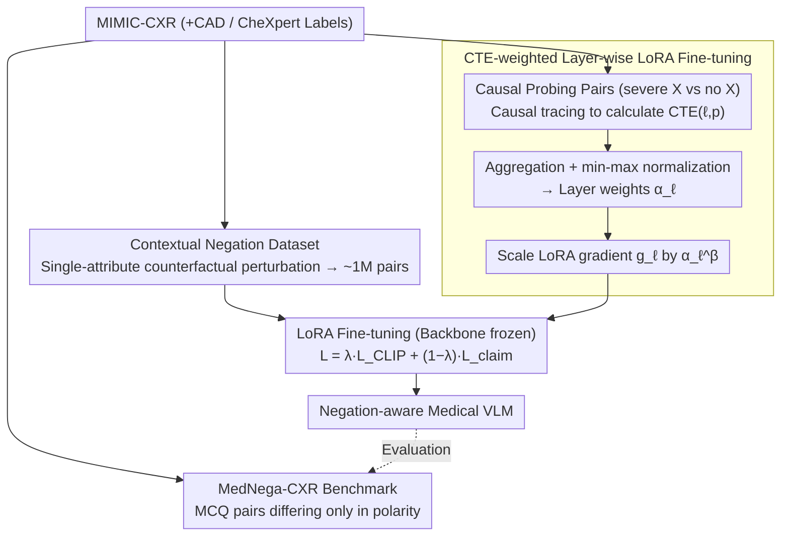

# Layer-Specific Fine-Tuning for Improved Negation Handling in Medical Vision-Language Models

**Conference**: ICML 2026  
**arXiv**: [2602.12498](https://arxiv.org/abs/2602.12498)  
**Code**: https://github.com/healthylaife/NAST  
**Area**: Multimodal VLM / Medical Imaging / Interpretability-guided Training  
**Keywords**: Medical CLIP, Negation Understanding, Causal Tracing, Layer-wise Fine-tuning, LoRA

## TL;DR
NAST utilizes causal tracing to calculate the Causal Trace Effect (CTE) of each layer in the CLIP text encoder for negation understanding. These CTEs are then used as layer-wise gradient scaling factors for LoRA fine-tuning, significantly enhancing the semantic sensitivity of medical VLMs in distinguishing between the presence and absence of symptoms, and narrowing the affirmative-negative accuracy gap from 21.6% to 4.2%.

## Background & Motivation
**Background**: Medical VLMs such as MedCLIP, BioMedCLIP, and BioViL-T have shown significant effectiveness in image-report alignment and zero-shot diagnosis. They have been applied to automated report generation, retrieval, and decision support.

**Limitations of Prior Work**: Negation is ubiquitous in radiology reports—"no pneumothorax," "no pleural effusion," "no consolidation in the right lower lobe." Negation is not just about the absence of an object; it often operates on attributes (e.g., "no large effusion," "no right lower lobe consolidation"). However, medical VLMs, which are primarily trained on affirmative descriptions during contrastive pre-training, treat negation as a blind spot. Using controlled "affirmative vs. negative semantic equivalent" pairs (e.g., "normal heart size" vs. "no cardiomegaly"), this study finds that all mainstream medical VLMs systematically prefer affirmative sentences and exhibit significantly worse negation understanding.

**Key Challenge**: Simply adding negative samples for fine-tuning (following the line of NegCLIP, ConCLIP, and NegBench) provides only marginal relief. This is because negation signals are not uniformly distributed across model layers—they are likely concentrated in specific layers of the text encoder. Uniformly tuning all layers is both inefficient and may "pollute" other capabilities.

**Goal**: (i) Provide a **polarity-controlled** diagnostic benchmark to decouple "poor negation understanding" from "poor adjective understanding"; (ii) Provide a fine-tuning dataset that injects "negation knowledge" into medical VLMs at the **attribute level** (existence, location, severity); (iii) Use mechanistic interpretability tools to identify "which layers process negation" and perform selective fine-tuning to improve negation handling while preserving non-negative capabilities.

**Key Insight**: Mechanistic interpretability tools (causal tracing, Meng et al.) are transferred from LLMs to the CLIP text encoder. The contribution of "which layer and which token is sensitive to negation" is converted into computable CTE scores, which are directly fed into the optimizer for layer-wise gradient scaling.

**Core Idea**: Calculate CTE via causal tracing → Normalize into layer weights $\alpha_\ell$ → Scale each layer's LoRA gradient by $\alpha_\ell^\beta$ during fine-tuning, concentrating training resources on the layers truly responsible for negation.

## Method

### Overall Architecture
NAST consists of three components: (i) MedNega-CXR diagnostic benchmark—LLM-generated affirmative-negative MCQ pairs based on MIMIC-CXR, reviewed by two radiologists; (ii) Contextual negation fine-tuning dataset—counterfactual perturbations of structured facts $(\text{condition}, \text{existence}, \text{location}, \text{severity})$ based on CAD labels, resulting in approximately one million image-text pairs; (iii) CTE-weighted layer-wise LoRA fine-tuning—using causal tracing to calculate CTE for each layer and position in the text encoder, normalizing them into layer weights $\alpha_\ell$, and scaling LoRA gradients by $\alpha_\ell^\beta$. The objective is the weighted sum of contrastive loss and claim-ranking loss. The following pipeline outlines the "data preparation → causal localization → layer-wise fine-tuning" process.

### Key Designs

**1. MedNega-CXR Benchmark: Isolating negation understanding using "polarity-only" description pairs**

To diagnose "poor negation understanding," the first challenge is to avoid confounding it with "poor adjective understanding" or "poor visual perception." MedNega-CXR constructs semantically equivalent pairs that differ only in polarity—for instance, "no cardiomegaly" vs. "normal heart size." Both sentences refer to the same clinical fact, with the only difference being that one uses negation and the other uses an affirmative. The process involves three steps: selecting studies with $\ge 2$ positive and $\ge 3$ negative findings from MIMIC-CXR/CheXpert, working with radiologists to find affirmative equivalent descriptions for each negative condition while excluding hard negatives, using an LLM to generate explicitly negative MCQs, and finally using another LLM to replace negative phrases with affirmative equivalents while maintaining sentence structure. This results in 6,965 MCQ pairs differing only in polarity. This benchmark is robust due to a unique convenience in the medical domain: "no pneumonia" can be equivalently expressed as "well-aerated lungs," whereas "no car" in the general domain lacks a single affirmative equivalent. Consequently, only polarity changes in the comparison, ensuring the evaluation truly targets negation understanding.

**2. Attribute-level Negation Fine-tuning Dataset: Extending negation from "existence" to location and severity**

Evaluation alone is insufficient; fine-tuning supervision must also cover realistic negation forms in clinical practice. Existing negation datasets (CC-Neg, NegBench) primarily focus on object existence. However, negation in radiology reports often acts on attributes—"no large effusion" negates the degree, and "no consolidation in the right lower lobe" negates the location. This study performs counterfactual perturbations on a single attribute for each structured fact $(\text{condition}, \text{existence}, \text{location}, \text{severity})$ (e.g., present↔absent, left↔right, small↔large), then converts them into natural language using radiology-style templates to create approximately one million image-text pairs. Supervision follows two formats: a claim-based contrast set, where one correct claim is paired with multiple hard negatives; and single negative captions used for auxiliary contrastive training. By using structured labels and controlled perturbations, the scale and specificity address the lack of attribute-level negation in existing datasets.

**3. CTE-weighted Layer-wise LoRA Fine-tuning: Identifying and prioritizing "negation layers" for updates**

This is the core mechanism of NAST, addressing the observation that negation signals are not uniformly distributed across text encoder layers. The authors adapt causal tracing from mechanistic interpretability to quantify layer contributions: for an equal-length pair of (correct caption, foil caption), a forward pass is run on the foil to record hidden states. Then, during the forward pass of the correct caption, the hidden state of the $p$-th token at the $\ell$-th layer is replaced with the corresponding value from the foil. After obtaining the intervened score $S^{\ell,p}$, the causal contribution is defined as:

$$\mathrm{CTE}(\ell, p) = \frac{S^{\text{corr}} - S^{\ell,p}}{S^{\text{corr}} - S^{\text{foil}}}$$

This represents the proportion of the model's shift from a correct judgment to a foil judgment after the intervention. Results indicate that negation signals are concentrated in layers 1-4, with a peak at layer 2. After aggregating token-level CTEs into $\mathrm{CTE}_\ell$ and performing min-max normalization to get $\alpha_\ell \in [0,1]$, LoRA gradients are scaled by $\tilde{g}_\ell = \alpha_\ell^\beta \cdot g_\ell$ during fine-tuning, where $\beta$ controls concentration. For engineering stability, CTE is used as a gradient multiplier rather than a direct learning rate for each layer, preserving a global learning rate. Concentrating update resources on the layers truly responsible for negation saves computation, avoids diluting negation signal learning, and minimizes interference with other layers to preserve existing alignment capabilities.

### Loss & Training
$\mathcal{L}_{\text{CLIP}}$ is the standard CLIP symmetric contrastive loss (applied to batches with explicit negation captions); $\mathcal{L}_{\text{claim}} = \frac{1}{M}\sum_i \log \frac{\exp(\ell_{i, c_i})}{\sum_j \exp(\ell_{i, j})}$ is the claim-ranking loss (ensuring the correct claim has higher similarity than hard negatives). The optimizer is AdamW with a fixed learning rate, trained on a single RTX 4070. $\lambda$ and $\beta$ are key hyperparameters.

## Key Experimental Results

### Main Results
Contextual negation task (Table 1, units in %):

| Model | R@1↑ | R@5↑ | Claim Acc.↑ |
|------|------|------|-------------|
| CLIP | 23.5 | 34.7 | 24.6 |
| NegCLIP | 36.2 | 52.4 | 41.3 |
| ConCLIP | 39.7 | 55.8 | 44.9 |
| NegBench | 43.1 | 59.2 | 48.7 |
| **NAST (Ours)** | **49.5** | **65.7** | **55.6** |

While negation-specialized baselines show progressive improvement, NAST outperforms the strongest baseline by 6.9 percentage points in claim accuracy.

### Ablation Study
Affirmative-Negation Gap (Table 3, lower is better) + Update Distribution (Table 4):

| Model | Affirm – Negation Gap (Claim Acc., %) |
|------|--------------------------------------|
| CLIP | 21.6 |
| NegCLIP | 12.8 |
| ConCLIP | 10.7 |
| NegBench | 10.2 |
| **NAST** | **4.2** |

| Method | Top-3 Layer Update % | Top-5 Layer Update % |
|------|------|------|
| Uniform FT | 28.4% | 41.7% |
| **NAST (CTE-weighted)** | **52.6%** | **69.3%** |

CTE weighting successfully concentrates updates on the top negation-sensitive layers, corresponding to the gains in claim accuracy.

### Key Findings
- **Layer-wise Localization of Negation**: CTE is concentrated in layers 1-4, peaking at layer 2; this aligns with LLM literature suggesting that early layers process syntactic function words while deeper layers handle semantics.
- **Improved Negation without Sacrificing Affirmation**: NAST's improvement stems primarily from increased negation accuracy rather than a decrease in affirmative accuracy—affirmative performance even saw a slight increase (Table 2), indicating that CTE guidance does not destroy general alignment capabilities.
- **Sparse Adaptation Potential**: The discovery that "few layers handle specific functions" suggests that general all-layer LoRA fine-tuning is wasteful. Interpretability-guided sparse fine-tuning could represent the next generation of parameter-efficient adaptation.

## Highlights & Insights
- "Calculating scores via causal tracing → feeding scores to the optimizer as layer weights" provides a template for advancing mechanistic interpretability from **diagnosis** to **prescription**—a paradigm applicable to both medical and general VLMs.
- MedNega-CXR fully exploits the unique availability of "affirmative equivalents" in medical contexts. While it is difficult to create clean polarity controls in the general domain, the medical domain offers a unique testbed for interpretability research.
- Keeping the backbone frozen and only weighting LoRA updates is sufficient to reduce the gap from 21.6 to 4.2. This suggests that the ability of medical VLMs to handle negation is nearly there (concentrated in a few key layers), requiring targeted adjustment rather than retraining from scratch.

## Limitations & Future Work
- CTE is calculated based on a synthetic "severe edema vs. no edema" contrast set; its transferability to other clinical scenarios (rare diseases, ambiguous expressions) remains unverified.
- Both causal tracing and LoRA are performed only on the text encoder side, leaving the vision encoder and cross-modal projections untouched. If the vision side also has polarity-sensitive biases, this solution will not address them.
- Evaluation is limited to MIMIC-CXR style reports and the CheXpert ontology; CTE calculation and verification are required for other modalities like CT, MRI, pathology images, and non-English clinical text.

## Related Work & Insights
- **vs. NegCLIP / ConCLIP / NegBench**: These methods rely on "adding negative samples + contrastive loss," whereas NAST adds "layer-targeted optimization" to further improve performance.
- **vs. Causal Tracing for LLM (Meng et al.)**: Transfers ROME-style causal tracing from knowledge localization in LLMs to negation processing in CLIP text encoders, and is the first to use tracing results as optimizer inputs.
- **vs. Layer-wise Adaptive LR (LARS, LAMB)**: While those methods automatically adjust layer-wise LR based on gradient norms, NAST adjusts based on causal contribution, providing a "semantic-aware" version.

## Rating
- Novelty: ⭐⭐⭐⭐ First to convert causal tracing into layer-wise training rules, with a clear methodological path.
- Experimental Thoroughness: ⭐⭐⭐⭐ Multiple baselines, multiple tasks, and ablation of update distributions.
- Writing Quality: ⭐⭐⭐⭐ Tight pacing from problem diagnosis to data, method, and evaluation.
- Value: ⭐⭐⭐⭐ Negation understanding in medical safety scenarios is a genuine pain point; CTE weighting is highly reusable.

<!-- RELATED:START -->

## Related Papers

- [\[CVPR 2026\] FairLLaVA: Fairness-Aware Parameter-Efficient Fine-Tuning for Large Vision-Language Models](../../CVPR2026/multimodal_vlm/fairllava_fairness-aware_parameter-efficient_fine-tuning_for_large_vision-langua.md)
- [\[CVPR 2025\] Vision-Language Models Do Not Understand Negation](../../CVPR2025/multimodal_vlm/vision-language_models_do_not_understand_negation.md)
- [\[ACL 2025\] NegVQA: Can Vision Language Models Understand Negation?](../../ACL2025/multimodal_vlm/negvqa_can_vision_language_models_understand_negation.md)
- [\[AAAI 2026\] Difference Vector Equalization for Robust Fine-tuning of Vision-Language Models](../../AAAI2026/multimodal_vlm/difference_vector_equalization_for_robust_fine-tuning_of_vis.md)
- [\[CVPR 2026\] TRivia: Self-supervised Fine-tuning of Vision-Language Models for Table Recognition](../../CVPR2026/multimodal_vlm/trivia_self-supervised_fine-tuning_of_vision-language_models_for_table_recogniti.md)

<!-- RELATED:END -->
