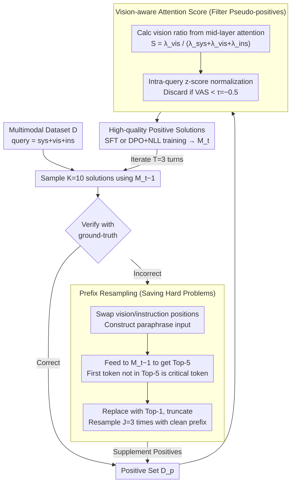

# Learn to Think: Improving Multimodal Reasoning through Vision-Aware Self-Improvement Training

**Conference**: ICML 2026  
**arXiv**: [2605.11931](https://arxiv.org/abs/2605.11931)  
**Code**: Not mentioned  
**Area**: Multimodal VLM / LLM Reasoning / Self-improvement  
**Keywords**: Multimodal reasoning, Self-improvement training, Visual attention, prefix resampling, DPO

## TL;DR
VISTA transforms the self-improvement training of multimodal large models into a two-stage pipeline: "supplementing samples for hard problems via prefix resampling, and filtering pseudo-positives via Vision-aware Attention Score (VAS)." It achieves an average improvement of +13.66% in multimodal reasoning for mathematics and medicine on Qwen2.5-VL-3B.

## Background & Motivation
**Background**: The current mainstream approach to enhancing multimodal reasoning is through post-training MLLMs with explicit CoT. Since labeling CoT is expensive, "self-improvement" paradigms like STaR / ReSTEM / R3V allow the model to sample answers, verify them using ground-truth, and then retrain itself.

**Limitations of Prior Work**: Empirical analysis using Qwen2.5-VL-3B on SLAKE / VQA-Rad / Geometry3K revealed two overlooked issues. First, **data imbalance**: simple problems easily yield a large number of correct solutions, whereas hard problems (e.g., Geometry3K) often have over 40% of queries with zero correct answers across 10 samples, despite hard problems being critical for training. Second, **language prior bias**: even if the final answer is correct, the intermediate reasoning may describe objects not present in the image. Attention distributions show that while visual tokens occupy the largest proportion of the context, their attention scores across all layers are below 20%.

**Key Challenge**: Existing self-improvement methods **only use "answer correctness" as a quality signal**. This signal is insufficient both in quantity (too few positive samples for hard problems) and quality (inability to distinguish true image-based reasoning from lucky guesses).

**Goal**: (1) How to supplement correct solutions for hard problems? (2) How to identify and filter pseudo-positives where the answer is correct but the reasoning is hallucinated?

**Key Insight**: The authors cite observations from Ji et al. 2025 that errors in failed solutions often occur in the later stages of reasoning, while the **prefixes are usually correct**. Simultaneously, the model's own attention distribution is utilized as an internal signal for visual focus, requiring no additional models or second forward passes (unlike He et al. 2025, which requires a vision-less re-run).

**Core Idea**: Use "prefix resampling" to revive good prefixes from failed solutions to supplement hard samples; use "Vision-aware Attention Score (VAS)" to calculate the attention ratio across vision, system, and instruction segments in a single forward pass, filtering out pseudo-positives with low visual attention.

## Method

### Overall Architecture
VISTA is embedded into a standard three-step iteration (sampling → verification → training), primarily modifying the sampling and verification steps. Given the model at iteration $t-1$ ($\mathcal{M}_{t-1}$) and a multimodal dataset $\mathcal{D}$, each query $x_i = \{x_i^{\text{sys}}, x_i^{\text{vis}}, x_i^{\text{ins}}\}$ is first sampled for $K=10$ solutions. Ground-truth is used to separate the positive set $\mathcal{D}_t^p$ and the negative set $\mathcal{D}_t^n$. Subsequently: (1) $\mathcal{D}_t^n$ is augmented by resampling $J=3$ times using prefix resampling to expand $\mathcal{D}_t^p$; (2) VAS is calculated for each solution in $\mathcal{D}_t^p$, and those below the threshold $\tau=-0.5$ are discarded; (3) the remaining high-quality positive solutions are used for SFT or DPO+NLL optimization to obtain $\mathcal{M}_t$, iterating for $T=3$ rounds. These two steps—**prefix resampling** addressing "too few positive solutions for hard problems" and **VAS filtering** addressing "pseudo-positives that ignore the image"—strengthen the quantity and quality of self-improvement data.

### Key Designs

**1. Prefix Resampling: Recycling "not-yet-wrong" prefixes from failed solutions to rescue hard problems**

The difficulty with hard problems is that over 40% of queries yield zero correct answers in 10 samples; discarding these failed solutions means abandoning the most critical samples for training. The authors observed that errors in failed solutions often occur late in the reasoning chain, and the prefixes are usually correct. Thus, they locate the "critical token" where errors begin, truncate it, and resample from there. This process does not rely on ground-truth or external models: for each failed solution $r_i^{k_n}$, a paraphrase input "$x_i^{\text{sys}} + x_i^{\text{ins}} + x_i^{\text{vis}} + r_i^{k_n}$" is constructed by swapping the vision and instruction positions. This is fed back into $\mathcal{M}_{t-1}$ to get Top-5 predictions for each position. The first token that is not in $\text{Top}_5(o_{n-1})$ is identified as the critical token—it is replaced with the new Top-1, the subsequent part is truncated, and the clean prefix is combined with the original query to resample $J=3$ times. This is equivalent to using the model's self-calibration to identify "uncertainties" and recycling good prefixes from negative samples, which is far more efficient than simply increasing the sampling count for hard problems.

**2. Vision-aware Attention Score (VAS): Uncovering pseudo-positives that are "correct but vision-less" using a single forward pass**

Another blind spot in self-improvement is relying solely on answer correctness. Even if the model answers correctly, the reasoning might describe objects not present in the image—harmful hallucinations born from language priors. VAS uses the model's own attention map as a hallucination detector: it extracts the attention output $\mathbf{A}_i^k$ from the mid-layers (found to be most responsible for vision processing) of $\mathcal{M}_{t-1}$. The attention sums from output tokens to the system, vision, and instruction segments are calculated as $\lambda^k_{\text{sys}}, \lambda^k_{\text{vis}}, \lambda^k_{\text{ins}}$. These are normalized into a vision ratio $S_i^k = \lambda^k_{\text{vis}} / (\lambda^k_{\text{sys}} + \lambda^k_{\text{vis}} + \lambda^k_{\text{ins}})$, followed by intra-query z-score normalization $\text{VAS}_i^k = (S_i^k - \text{mean}(S_i)) / \text{std}(S_i)$. Solutions with a score lower than the threshold $\tau=-0.5$ are judged as having insufficient visual focus and are filtered. Compared to schemes that require two forward passes (removing the image and comparing attention shifts), VAS requires only one forward pass with zero extra overhead. Using z-scores instead of absolute thresholds allows adaptation to varying attention levels across different samples.

> Note: VISTA itself only contributes the two strategies above (explicitly stated in the paper as "two simple-yet-effective approaches"); the high-quality positives they produce are seamlessly integrated into standard SFT or preference learning post-training. Training details follow.

### Loss & Training
The filtered high-quality positives can be used in two post-training paradigms for fair comparison with baselines: SFT optimizes NLL directly on $\mathcal{D}_t^p$ with $\mathcal{L}_{\text{SFT}} = -\mathbb{E}[\log \mathcal{M}_\theta(r,\hat y \mid x)/(|r|+|\hat y|)]$; preference learning pairs each positive sample with a randomly selected negative sample using an augmented loss $\mathcal{L}_{\text{DPO+NLL}} = \mathcal{L}_{\text{DPO}} + \alpha \cdot \mathcal{L}_{\text{NLL}}(r^{k_p}, \hat y^{k_p})$ ($\alpha=0.5, \beta=0.1$). The NLL term is kept to prevent DPO training collapse and maintain generation quality. The process iterates for $T=3$ rounds; each round uses $K=10$ initial samples, $J=3$ prefix resamples, a temperature of 1.0, and a maximum output of 2048. Each round restarts fine-tuning from the base model to prevent overfitting. Training is conducted for 3 epochs on 8×A800 80GB, with greedy decoding used for inference.

## Key Experimental Results

### Main Results

| Model / Method | SLAKE | VQA-Rad | Geo3K | Overall (Δ vs SFT-Seed) |
|---|---|---|---|---|
| Qwen2.5-VL-3B + SFT-Seed | 67.04 | 64.14 | 25.46 | 52.21 |
| Qwen2.5-VL-3B + ReSTEM (iter 3) | 81.69 | 73.71 | 32.28 | 62.56 (+10.35) |
| Qwen2.5-VL-3B + R3V (iter 3) | 81.41 | 69.32 | 32.78 | 61.17 (+8.96) |
| **Qwen2.5-VL-3B + VISTA-SFT (iter 3)** | **84.23** | **76.10** | **37.27** | **65.87 (+13.66)** |
| Qwen2.5-VL-7B + SFT-Seed | 79.15 | 70.52 | 36.94 | 62.20 |
| **Qwen2.5-VL-7B + VISTA-SFT (iter 3)** | **87.89** | **77.29** | **41.43** | **68.87 (+6.67)** |

Consistent improvement across MLLMs: VISTA consistently outperforms baselines like STaR / STaR+ in a single round of training on Qwen3-VL-2B and InternVL3-2B/8B, proving the method is not dependent on a specific backbone.

### Ablation Study

| Configuration | Overall on 3B | Description |
|---|---|---|
| Full VISTA-SFT (iter 1) | 62.41 | Both prefix resampling and VAS enabled |
| Prefix resampling only | Between Seed and Full | Addresses data imbalance |
| VAS filtering only | Between Seed and Full | Addresses hallucinated pseudo-positives |
| Shifting VAS threshold $\tau$ | Bell-shaped curve | Too high a threshold filters out too many samples |

### Key Findings
- Specifically looking at the hard set Geo3K: The 3B model improved from 25.46 to 37.27 (an absolute gain of +11.81), indicating that prefix resampling successfully rescued hard problems where positive solutions were previously unattainable.
- Layer selection for VAS (Appendix C.2) shows that filtering is most effective when using middle layers, consistent with the findings by Jiang et al. 2025 regarding middle layers being most responsible for vision processing.
- OOD Generalization: Performance also increased on unseen ScienceQA and ChartQA, suggesting VISTA learns more reliable visual reasoning habits rather than just dataset features.

## Highlights & Insights
- "Treating negative samples as resources rather than noise": Traditional self-improvement discards all incorrect solutions, but prefix resampling demonstrates that **prefixes of incorrect solutions are often correct and highly valuable**. This shift in perspective can be transferred to almost any sample-then-filter training paradigm.
- Using the z-score of internal attention from a single forward pass as a hallucination detector is a minimalist yet effective "model introspection" method; it requires no extra discriminators or token-level alignment data.
- The observation that "answer correctness $\neq$ reasoning correctness" is quantified via attention scores into an actionable filtering signal, potentially inspiring "process-level" extensions for reward models.

## Limitations & Future Work
- The effectiveness of VAS relies on the assumption that the model's own attention distribution is a reliable indicator of visual focus, which might not hold for models with heavily instruction-tuned (collapsed) attention distributions.
- Middle layer selection is empirical (taking one layer from the middle of the backbone); it requires recalibration for different backbones and lacks an automatic selection mechanism.
- The threshold $\tau$ is globally fixed; different difficulties and tasks might benefit from adaptive thresholds.
- Experiments were primarily focused on medical and mathematical geometry; generalization to more complex visual modalities like common-sense images, video, or documents remains to be verified.

## Related Work & Insights
- **vs STaR / ReSTEM**: They discard all failed solutions; VISTA recycles prefixes. They only look at answer correctness; VISTA also computes visual attention.
- **vs Ding et al. 2025 (Ground-truth guided reasoning)**: That method uses answer leakage to guide reasoning, essentially making it hint-augmented; VISTA relies entirely on the model's own internal consistency.
- **vs He et al. 2025 (Quantifying language prior by removing images)**: That method requires two forward passes; VAS obtains an equivalent signal in a single pass, making it more computationally efficient.
- **vs R3V**: R3V also improves through multiple iterations, but with nearly double the sample size of VISTA, it performs worse, suggesting "sample quality > sample quantity."

## Rating
- Novelty: ⭐⭐⭐⭐ Neither technical point is revolutionary, but their combination to target specific symptoms is well-executed.
- Experimental Thoroughness: ⭐⭐⭐⭐ Covering 5 MLLMs, 5 benchmarks, and both SFT + DPO paradigms, with detailed ablation and layer analysis.
- Writing Quality: ⭐⭐⭐⭐ Motivation analysis (§2.1) is supported by data and figures; methodological descriptions are clear with consistent notation.
- Value: ⭐⭐⭐⭐ The self-improvement paradigm is currently popular; both the "attention-based hallucination filtering" and "prefix recycling" tricks are highly reusable.

<!-- RELATED:START -->

## Related Papers

- [\[ICLR 2026\] Through the Lens of Contrast: Self-Improving Visual Reasoning in VLMs](../../ICLR2026/multimodal_vlm/through_the_lens_of_contrast_self-improving_visual_reasoning_in_vlms.md)
- [\[ICLR 2026\] Vision-Zero: Scalable VLM Self-Improvement via Strategic Gamified Self-Play](../../ICLR2026/multimodal_vlm/vision-zero_scalable_vlm_self-improvement_via_strategic_gamified_self-play.md)
- [\[ICLR 2026\] VTool-R1: VLMs Learn to Think with Images via Reinforcement Learning on Multimodal Tool Use](../../ICLR2026/multimodal_vlm/vtool-r1_vlms_learn_to_think_with_images_via_reinforcement_learning_on_multimoda.md)
- [\[ACL 2026\] iReasoner: Trajectory-Aware Intrinsic Reasoning Supervision for Self-Evolving Large Multimodal Models](../../ACL2026/multimodal_vlm/ireasoner_trajectory-aware_intrinsic_reasoning_supervision_for_self-evolving_lar.md)
- [\[ICML 2026\] From Seeing to Thinking: Decoupling Perception and Reasoning Improves Post-Training of Vision-Language Models](from_seeing_to_thinking_decoupling_perception_and_reasoning_improves_post-traini.md)

<!-- RELATED:END -->
